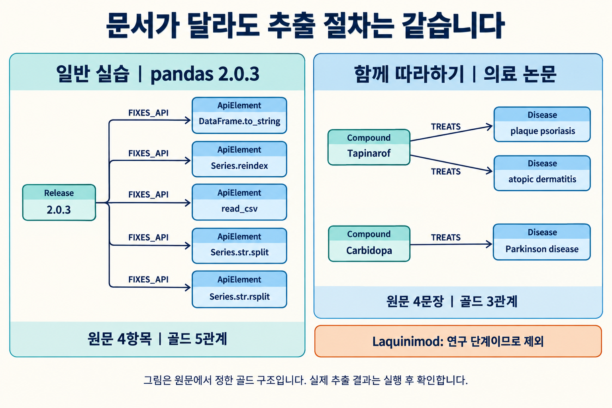
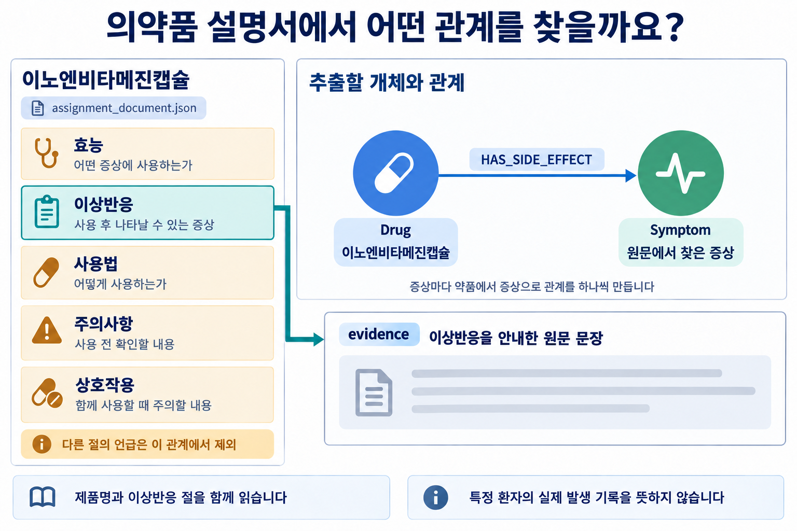
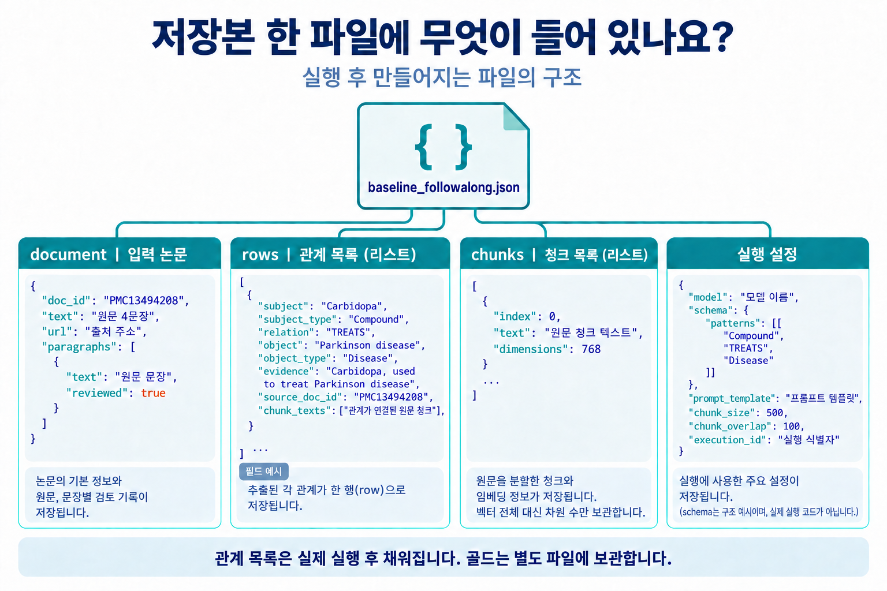

# 교안과 과제의 데이터 및 평가 기준

## 데이터와 파일을 한눈에 보기

| 자료 이름 | 사용처 | 실제 입력 |
|---|---|---|
| `demo` | 교안의 일반 실습 | pandas 2.0.3 수정 항목 4개 |
| `followalong` | 함께 따라하기와 핵심 코드 | 의료 논문 발췌 4문장 |
| `assignment` | 과제 LV1과 LV2 | 이노엔비타메진캡슐 원문 5개 절 |

- `*_document.json`: 추출에 사용할 `text`, 출처와 항목별 검토 기록입니다. LLM에는 `text`만 보냅니다.
- `*_gold.json`: 원문에서 확인한 정답 관계 목록입니다. 모델 입력에 넣지 않습니다.
- `baseline_*.json`, `large_*.json`: 실행별 원문, 설정, 저장 관계와 청크입니다. `output` 폴더에 저장합니다.
- `sources/`: 원문 전체와 출처 정보를 보관합니다. `assignment_candidates.json`은 과제 자료의 선정 기록이며 추출 입력은 아닙니다.

## pandas 교안의 출처와 선정

그림은 원문에서 확인한 정답 관계를 보여 줍니다. 자동 추출의 관계 수는 실행마다 달라질 수 있습니다.

단위 프로젝트 2의 `version_e_pylibs/dataset/snapshot/docs_snapshot.csv`에 수집된 pandas 공식 문서 내용을 사용합니다.
배포일이 아니라 문서 버전으로 고정한 학습 자료입니다. 최신 pandas의 동작 설명으로 사용하지 않습니다.

- 일반 실습: `pandas_doc_source_whatsnew_v2_0_3`에서 수정 항목 4개.

각 document JSON에 URL, 기존 수집 시각, 전체 저장 원문의 SHA-256을 기록했습니다.
`sources`의 TXT는 기존 저장본의 text 전체, JSON은 기존 출처 메타데이터입니다.
저장본의 GitHub URL은 main 브랜치를 가리키므로 현재 웹페이지와 내용이 달라질 수 있습니다. 평가에는 배포한 저장본을 사용합니다.

선택한 문장은 영어 표기와 문장부호를 유지했습니다. 파일의 `text`는 제목과 선택 항목을 모은 발췌문입니다.
선택 항목마다 원래 절 이름을 함께 붙였고 일부 항목의 배치 순서는 학습용으로 정했습니다.
`source_start`, `source_end`는 `sources`의 전체 원문에서 해당 항목을 찾는 문자 범위입니다.

[2.0.3 공식 문서](https://pandas.pydata.org/pandas-docs/version/2.0.3/whatsnew/v2.0.3.html)

## pandas 교안 골드의 포함 기준

한 문서 안의 고유 `(버전, FIXES_API, API 이름)`을 관계 한 건으로 셉니다.

1. 그 버전에서 수정했다고 명시한 API를 포함합니다. 버그와 회귀 오류의 수정 모두 포함합니다.
2. 한 항목이 API 여러 개의 수정을 명시하면 각각 적습니다.
3. 설치 옵션, 자료형, 엔진, 매개변수의 단순 언급은 제외합니다.
4. API 표기는 저장 원문 그대로 유지합니다. 관계 전체가 같으면 여러 청크에서 추출해도 한 번 셉니다.

`paragraphs`는 모든 선택 항목의 검토 기록입니다. `gold`는 그 항목에서 확인한 실제 정답 관계입니다.
검토 개수만으로 정답을 자동 복원한 것이 아닙니다. 골드는 선택 원문을 읽어 작성했고 모델 입력에 포함하지 않습니다.

- 2.0.3: 항목 4개, 정답 5관계. `Series.str.split`과 `Series.str.rsplit`은 각각 한 관계입니다.

## 의료 논문 함께 따라하기의 출처와 포함 기준

교안 01과 02는 day38의 `kg_corpus.jsonl`에 저장된 AHR 약리학 논문(`PMC13494208`)에서 4문장을 골랐습니다.
영어 원문과 문장부호를 그대로 유지했습니다. `sources/PMC13494208.json`과 TXT는 day38의 발췌 저장본이며 논문 전문은 아닙니다.

- `followalong_document.json`: 원문 4문장, 출처와 검토 기록입니다. `text`만 추출 입력으로 보냅니다.
- `followalong_gold.json`: 같은 범위에서 직접 작성한 고정 정답 3관계입니다. day38 전체 골드를 필터링한 파일이 아닙니다.
- `paragraph_id`: 선택한 네 문장의 순서입니다. `sentence_id`는 day38 저장본의 원래 문장 번호(7, 10, 11, 17)입니다.
- `source_start`, `source_end`와 SHA-256: `sources`에 보존한 day38 발췌문 안의 위치와 해시입니다.

| 원문 서술 | TREATS 정답 |
|---|---|
| Tapinarof의 plaque psoriasis, atopic dermatitis 치료 승인 | 질환별 1건, 총 2건 |
| Laquinimod를 치료제로 연구함 / 치료 연구에 관심이 있음 | 0건. 실제 치료 사용을 명시하지 않음 |
| Carbidopa를 Parkinson disease 치료에 사용함 | 1건 |

`Compound -> TREATS -> Disease`는 논문이 명시한 치료 승인 또는 사용을 기록합니다.
연구 가능성, 수용체 활성화와 부정한 사용은 제외합니다. 처방이나 단독 치료 효과를 권고하는 그래프가 아닙니다.
이름은 원문 표기를 유지하며 골드는 청크 크기를 바꿔도 동일하게 사용합니다.

[원 논문](https://www.sciencedirect.com/science/article/pii/S0031699726000347), [PMC 출처](https://pmc.ncbi.nlm.nih.gov/articles/PMC13494208/)
출처와 CC BY 표기는 day38 저장본의 메타데이터를 보존했습니다. 원 논문의 치료 사용·연구 단계 서술을 발행사 페이지에서도 대조했습니다.

## 라이선스

pandas의 BSD 3-Clause 저작권 고지와 배포 조건을 `PANDAS_LICENSE.txt`에 보존했습니다.
기존 문서 저장본에서 발췌했으며, 원문 자체를 새로 작성한 자료로 표시하지 않습니다.

## 의약품 과제의 출처와 포함 기준

LV1과 LV2는 논문과 다른 자료인 **의약품 설명서**를 사용합니다.
단위 프로젝트 2의 `version_c_drugs/dataset/snapshot/drugs_snapshot.csv`에서
이노엔비타메진캡슐(`drug_198500050`) 한 행을 선정했습니다. 수집 시각은 문서의 `collected_at`에 있습니다.

출처는 [식약처 의약품개요정보(e약은요)](https://www.data.go.kr/data/15075057/openapi.do)입니다.
공식 데이터셋의 이용허락범위는 제한 없음으로 확인했습니다(2026-09-10).
평가에는 배포한 수집 시점의 원문을 사용합니다.

- `sources/drug_198500050.json`: 기존 CSV의 해당 행 전체. 필드 내용을 보존했습니다.
- `sources/drug_198500050.txt`: 제품명과 절 이름을 붙여 조립한 문서. 각 필드의 원문은 수정하지 않았습니다.
- `assignment_document.json`: 위 문서와 출처, 절별 검토 기록입니다. `text`만 LLM에 전달합니다.
- `assignment_gold.json`: 선정한 원문을 읽고 작성한 이상반응 5관계입니다.

효능과 이상반응을 먼저 비교하도록 **효능 -> 이상반응 -> 사용법 -> 주의사항 -> 상호작용** 순서로 배치했습니다.
`source_field`는 CSV의 필드, `source_start`와 `source_end`는 조립한 TXT 안의 문자 범위입니다.
SHA-256도 이 TXT를 검사합니다. 웹페이지의 원래 배치 순서나 원본 HTML 해시를 뜻하지 않습니다.

| 내용 | 포함 여부와 이유 |
|---|---|
| 이상반응 절의 구역, 구토, 묽은 변, 식욕부진, 복부팽만감 | 각각 `약품 -> HAS_SIDE_EFFECT -> 증상`으로 기록 |
| 효능의 신경통, 근육통 등 | 치료 또는 완화 목적이며 이상반응이 아니므로 제외 |
| 주의사항의 기존 질환, 사용법, 병용 주의 약물 | 이번 관계의 대상이 아니므로 제외 |

주어는 제품명 전체, 목적어는 증상의 원문 표기를 사용합니다. 빈도와 복용 중지 지시는 증상 이름에 넣지 않습니다.
각 근거에는 이상반응을 안내한 원문 문장 전체를 남깁니다. ‘등’에 포함될 다른 증상을 추측하지 않습니다.
`HAS_SIDE_EFFECT`는 발생할 수 있는 이상반응 안내이며 특정 환자의 실제 발생 기록이나 발생 확률이 아닙니다.

청크는 300자와 1000자로 비교하고 겹침 목표 80은 유지합니다. 제품명과 이상반응이 같은 청크에 있을 때만 추출합니다.
두 크기 모두 필요한 문맥을 보존했다면 점수가 같을 수 있습니다. 개선 여부 자체를 정답으로 정하지 않습니다.

## 과제의 연결

LV1은 `assignment_document.json`으로 그래프를 생성해 `baseline_assignment.json`을 저장합니다.
LV2는 그 저장본을 `assignment_gold.json`과 비교하고, 같은 원문을 더 큰 청크로 다시 실행합니다.
`assignment_candidates.json`에는 선택한 의약품과 선정 이유를 기록했습니다.

## 저장본의 구조

그림은 의료 논문 저장본의 필드 구조와 값의 예시입니다. 실제 rows는 실행 후 채워집니다. 2.0.3과 의약품 결과도 같은 파일 구조를 사용하며, 관계의 타입과 이름은 자료에 따라 달라집니다.

- `document.paragraphs`의 `paragraph_id`: 검토한 원문 항목의 번호입니다.
- `rows`의 `relationship_id`: DB의 관계 행을 구분합니다. 골드와 비교할 때는 주어, 관계, 목적어를 사용합니다.
- `rows`의 `chunk_texts`: 해당 관계의 양 끝 개체가 연결된 원문 청크입니다. 같은 청크에 있다고 관계가 참인 것은 아닙니다.
- `chunks`의 `dimensions`: 벡터의 차원 수입니다. 이 저장본에는 벡터 전체를 복사하지 않습니다.
