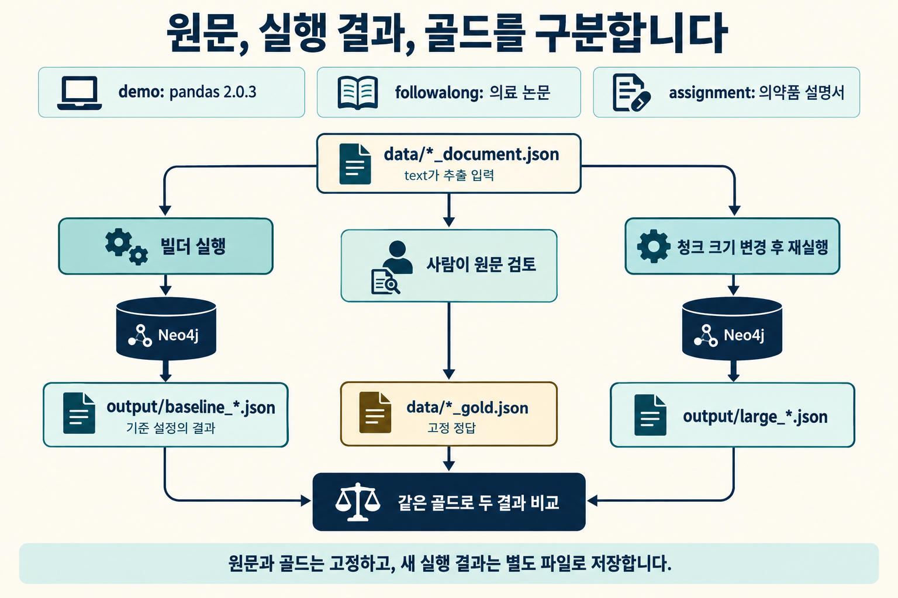

# KG 자동화 파이프라인 실습

pandas 문서로 버전과 API의 수정 관계를, 의료 논문으로 약물과 질환의 치료 사용 관계를 그래프로 만듭니다.

1. **교안 01:** 원문과 스키마 준비 -> 청크와 임베딩 확인 -> `SimpleKGPipeline` 실행 -> 평가용 결과 저장 -> 현재 실행의 노드 통합.
2. **교안 02:** 1~3절은 pandas 예시로 품질 검사를 복습합니다. 4절에서는 pandas의 재실행 방법을 익힌 뒤, 의료 논문 함께 따라하기로 청크 크기와 겹침을 늘려 비교합니다.

일반 실습은 pandas 2.0.3, 함께 따라하기는 AHR 약리학 논문의 원문 4문장을 사용합니다.
정답과 해설은 수업이 끝난 뒤 강사가 공유합니다. 함께 따라하기는 강사와 코드를 작성하며, 마지막 **핵심 코드 이어서 보기**는 학생용에도 완성되어 있습니다. 교안 02의 핵심 코드는 본문의 pandas 복습부터 두 자료의 설정 전후 비교까지 같은 순서로 실행합니다.
과제 LV1은 교안 01, LV2는 교안 02를 적용합니다. 두 과제는 식약처 의약품 설명서로 약품과 이상반응을 추출하고 평가합니다.

## 실행 준비

필요한 패키지는 저장소 최상위의 `pyproject.toml`·`uv.lock`에 함께 들어 있습니다. 저장소 최상위 폴더에서 한 번 실행하세요.

```bash
uv sync
```

노트북 커널은 **Python 3 (ipykernel)**(저장소 최상위의 `.venv`)를 고릅니다.

Neo4j 5.26 이상과 서버 버전에 맞는 APOC Core 플러그인이 필요합니다.
빌더의 관계 저장 코드에서 APOC를 사용합니다. Neo4j Desktop 또는 기존 실습 DB를 시작하세요.

`.env.example`을 `.env`로 복사하고 실제 접속 정보와 API 키를 넣으세요.
교안 폴더 또는 그 상위 폴더에 둘 수 있습니다. 가장 가까운 `.env` 한 파일을 읽습니다.

```dotenv
NEO4J_URI=bolt://localhost:7687
NEO4J_USER=neo4j
NEO4J_PASSWORD=실제_비밀번호
OPENAI_API_KEY=실제_API_키
```

모델은 코드에 `gpt-5.6-luna`, 임베딩은 `text-embedding-3-large` 768차원으로 명시했습니다.
해당 채팅 모델을 사용할 수 있는 API 계정과 연결이 필요합니다. 모델 접근 오류를 DB 비밀번호 문제로 처리하지 마세요.

- `ServiceUnavailable`: DB 실행 여부와 URI의 호스트 및 포트를 확인합니다.
- `AuthError`: DB 계정과 비밀번호를 확인합니다.
- API 연결 오류: 네트워크와 API 연결 주소를 확인합니다.
- 모델 접근 오류: 계정에서 코드에 지정한 모델을 사용할 수 있는지 확인합니다.

교안의 `await`는 Jupyter 셀에서 그대로 실행합니다. `asyncio.run`으로 감싸지 않습니다.
`SimpleKGPipeline`은 아직 기능과 사용법이 바뀔 수 있는 실험적 API입니다. 저장소 최상위 `uv.lock`에 잠긴 버전으로 실습합니다. 버전을 올리면 인자가 달라질 수 있습니다.
[공식 빌더 문서](https://neo4j.com/docs/neo4j-graphrag-python/current/user_guide_kg_builder.html)

분할은 `RecursiveCharacterTextSplitter`로 문단과 줄바꿈을 우선해 나눕니다.
`LangChainTextSplitterAdapter`는 그 결과를 Neo4j 빌더가 받는 청크 형식으로 바꿔 주는 도구입니다.
교안은 청크 500자와 겹침 100자를 2,000자와 400자로 늘려 겹침 비율 20%를 유지합니다. 실제 겹침은 분할 경계에 따라 달라집니다.

교안 01에서는 직접 지정, 자유(`FREE`), 자동(`EXTRACTED` 또는 생략) 스키마의 선택 기준을 비교합니다.
일반 실습은 FIXES_API, 함께 따라하기는 TREATS 관계로 사람이 정한 스키마를 사용합니다.

## 파일 흐름



**원문은 추출 입력, 저장본은 실행 결과, 골드는 채점 기준입니다.** `demo`, `followalong`, `assignment`는 각각 일반 실습, 함께 따라하기, 과제 자료를 구분합니다.

| 파일 | 역할 |
|---|---|
| `data/demo_document.json` | 2.0.3의 수정 항목 4개와 출처 |
| `data/followalong_document.json` | 의료 논문 원문 4문장과 출처 |
| `data/demo_gold.json`, `data/followalong_gold.json` | 각각 5관계, 3관계의 고정 골드 |
| `output/baseline_demo.json`, `output/baseline_followalong.json` | 교안 01 실행 후 생기는 기준 결과 |
| `output/large_demo.json`, `output/large_followalong.json` | 교안 02 실행 후 생기는 2000자 청크 결과 |
| `data/assignment_document.json`, `data/assignment_gold.json` | 의약품 원문 5개 절과 이상반응 정답 5관계 |
| `output/baseline_assignment.json` | LV1에서 저장하고 LV2에서 읽는 300자 청크 결과 |
| `output/large_assignment.json` | LV2에서 같은 의약품 문서를 1000자 청크로 재실행한 결과 |

`output`의 결과 파일은 실제 호출 후 생성됩니다. 실행하지 않은 모델 결과나 점수를 미리 채워 넣지 않습니다.
각 결과에는 입력 원문, 모델, 스키마, 프롬프트, 청크 설정과 실행 ID가 함께 들어 있습니다.

## 결과를 읽는 기준

- **평가 대상은 허용 규칙에 맞춰 정리한 뒤, 노드를 합치기 전에 저장한 관계입니다.** 허용하지 않은 관계는 이미 빠져 있으므로 LLM의 첫 출력 전체와는 다릅니다.
- 스키마 준수율과 근거 원문 일치율은 같은 저장 관계 전체를 분모로 각각 계산합니다.
- 정밀도와 재현율은 저장 관계의 고유 `(주어, 관계, 목적어)`를 같은 골드와 비교합니다.
- 원문 문자열이 일치해도 해당 관계가 맞는지는 원문 의미를 읽어 확인합니다.
- 큰 청크가 항상 더 좋은 것은 아닙니다. 실제 점수, FP, FN과 전달된 원문을 확인합니다.

재실행하면 새 `execution_id`로 별도 결과를 저장합니다. 이 값은 출처별 실행을 구분하는 값이며 개체 표준 ID가 아닙니다.
`SinglePropertyExactMatchResolver`로 현재 실행의 노드 중 라벨과 이름이 같은 것만 통합합니다. 다른 실행의 노드는 통합 대상에서 제외합니다.
중복 관계가 합쳐지면 개별 근거가 사라질 수 있으므로 평가용 관계와 근거를 통합 전에 JSON으로 보관합니다.

## 과제 실행 순서

1. **LV1:** 원문과 스키마 -> 청크와 벡터 -> 빌더 실행 -> 평가 자료 저장 -> 현재 실행의 노드 통합.
2. **LV2:** LV1 저장본 읽기 -> 두 검사 -> 고정 골드 평가 -> 청크 크기만 변경 -> 전체 지표 비교.

검사는 문서 범위, 원문 보존과 분모가 맞는지 확인합니다. LLM이 특정 관계 수나 점수를 만들어야 통과하는 방식이 아닙니다.
LV2는 별도 샘플 정밀도나 새 스키마를 추가하지 않고 교안 02의 방법을 그대로 적용합니다.

## 원문 출처

데이터별 관계 그림과 주요 필드는 [데이터 설명](data/README.md)에 모았습니다.

일반 실습은 단위 프로젝트 2의 pandas 저장본, 함께 따라하기는 day38의 의료 논문 저장본에서 선정했습니다.
선정과 표기 보존 방식은 [데이터 설명](data/README.md)에 기록했습니다.

과제는 단위 프로젝트 2의 식약처 e약은요 저장본에서 이노엔비타메진캡슐의 5개 절을 가져왔습니다.
효능과 이상반응을 구분해 `Drug -> HAS_SIDE_EFFECT -> Symptom` 관계를 추출합니다.
짧은 한글 원문에 맞춰 청크를 300자와 1000자로 비교합니다. 겹침 목표는 둘 다 80자입니다.
이전 pandas 과제를 실행했다면 의료 데이터로 LV1부터 다시 실행해 기준 파일을 갱신하세요.

## 의료 논문으로 전환한 뒤 실행하기

교안 01을 먼저 실행해 `baseline_demo.json`과 `baseline_followalong.json`을 만드세요. 교안의 분할 설정은 500/100, 비교 설정은 2000/400입니다. 과제의 300/80, 1000/80 설정은 유지합니다.
이전 pandas 함께 따라하기 결과와 겹침 80자 교안 실행은 `archive/before_medical_paper_followalong`에 보관했습니다. 논문 결과로 사용하지 않습니다.


## 부록: 외부 KB로 개체 연결하기

[부록 노트북](부록_외부_KB의_표준_ID에_개체_연결하기.ipynb)

- 개념도 3장으로 같은 노드의 속성 추가 전후, Jordan 후보 3개, 문서 A/B의 선택·보류를 확인합니다.
- LangChain을 실제 Wikidata에서 검색하고 타입·설명·공식 사이트를 대조합니다.
- 실습 A: 영어 문서 A의 미국 농구 선수라는 단서로 Jordan의 항목을 선택하고 일치한 직업을 이유로 씁니다.
- 실습 B: 이름만 있는 문서 B는 A의 직업을 가져오지 않고, 종류·직업 중 더 필요한 정보를 기록합니다.
- 실습 C: 두 판단을 입력 순서대로 저장하고, 같은 셀을 두 번 실행한 뒤 내부 ID·상태·이유·중복 여부를 재조회합니다.

1~3절은 DB 없이 진행하며, 4절에서 실습용 Neo4j에 연결합니다.
공개 Wikidata 조회에는 인터넷과 `requests`가 필요하며 API 키·LLM은 사용하지 않습니다.
`kb_lookup.py`는 검색·속성 조회를 담당하는 제공 파일입니다. 요청 실패는 후보 없음과 구분해 에러로 알립니다.
`429`가 나오면 잠시 뒤 검색 셀부터 다시 실행하세요.
`data/kb_jordan_candidates.json`은 실제 항목 3개를 고른 비교 자료입니다. 출처·조회 날짜·원래 설명을 포함하며 검색 순위를 뜻하지 않습니다.

정답은 수업이 끝난 뒤 강사가 공유합니다.
노드를 재사용할 때는 타입과 내부 `standard_id`를 기준으로 찾습니다.
확정은 외부 ID·출처·선택 근거를, 보류는 미확정 상태·사유를 남깁니다.
