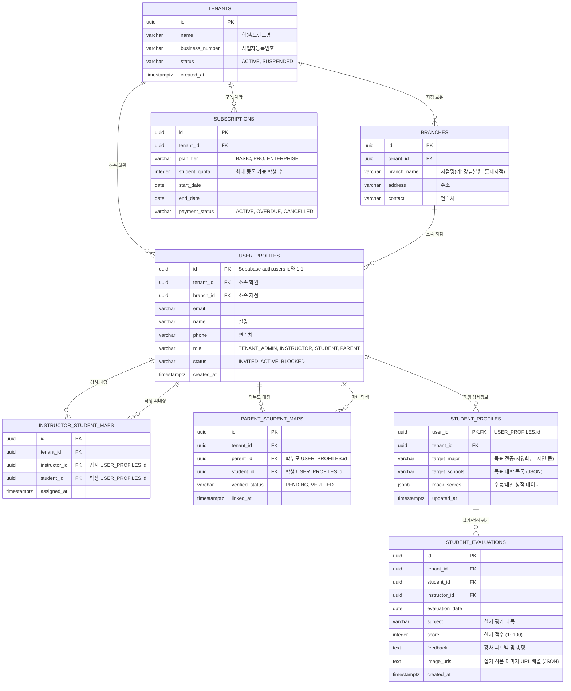

# 🏫 ART:READY 프랜차이즈 B2B 플랫폼 — 1단계 아키텍처 및 시스템 설계안 (v1.0)

> **문서 버전**: v1.0  
> **작성일자**: 2026-09-19  
> **작성자**: Antigravity (프랜차이즈/RDB 플랫폼 설계 및 개발 전담)  
> **수신**: 엔코아 프로젝트 팀 (ART:READY)  
> **기반 인프라**: Supabase (PostgreSQL + Auth) + AWS (API Backend) + Vercel (Front-Office)  
> **상태**: **[1단계 설계안 제출 — 사용자 검토 및 승인 대기]** (실제 소스코드 및 DB 생성 작업 미착수)

---

## 📋 Revision History

| 버전 | 일자 | 작성자 | 변경 및 추가 내용 | 상태 |
|:---:|:---:|:---:|---|:---:|
| **v1.0** | 2026-09-19 | Antigravity | 작업지시서 기반 1단계 설계안 초안 작성 (ERD, RBAC, API 명세, 화면 흐름도) | 승인 대기 |

---

## 0. 설계 원칙 및 환경 격리 선언

1. **지식그래프(Neo4j) 및 기존 수험생 서비스 완전 격리**:
   - 기존 `services/`, `0X_Art_Admission_*.py`, `api_art_admission.py`, `내작업폴더/fo/` 등 기존 공개 무료 서비스 자산은 일체 수정하거나 의존하지 않습니다.
   - 본 플랫폼은 **독립된 RDB(Supabase PostgreSQL)**와 **별도의 AWS API 백엔드**, **Vercel 프론트엔드** 환경에서 운영됩니다.
2. **실측 및 무결성 원칙**:
   - 본 문서는 기획/설계 명세이며, 실제 구현 및 벤치마크는 사용자 승인 후 실제 배포 환경에서 실측된 수치만을 보고서에 반영합니다.

---

## 1. 시스템 아키텍처 개요 (System Architecture)

```mermaid
flowchart TB
    subgraph ClientLayer ["프론트엔드 레이어 (Vercel)"]
        FO["ART:READY B2B 프랜차이즈 FO (Next.js / React)"]
    end

    subgraph AuthLayer ["인증 및 세션 레이어 (Supabase Auth)"]
        S_AUTH["Supabase Auth (JWT / OAuth / Email)"]
    end

    subgraph BackendLayer ["백엔드 API 레이어 (AWS)"]
        API["FastAPI / AWS Lambda (B2B 비즈니스 로직)"]
    end

    subgraph DatabaseLayer ["데이터베이스 레이어 (Supabase)"]
        PG["PostgreSQL (RLS 멀티테넌시 격리)"]
    end

    subgraph ExternalRef ["기존 레거시 (격리)"]
        NEO4J["기존 ART:READY 지식그래프 (Neo4j Aura)"]
    end

    FO -->|1. 로그인/토큰 발급| S_AUTH
    FO -->|2. Authorization: Bearer JWT| API
    API -->|3. 테넌트 검증 및 데이터 I/O| PG
    FO -.->|4. 향후 성적추천 연동 시 읽기 전용 참조 (확인 필요)| NEO4J
```

---

## 2. ERD 및 멀티테넌시 데이터 모델링 (ERD & Multitenancy)

### 2.1 멀티테넌시 격리 전략
* **접근 방식**: **단일 데이터베이스 + Shared Schema + Row-Level Security (RLS)**
* **설계 근거**: 학원별로 별도 DB/스키마를 파는 방식 대비 인프라 비용과 마이그레이션 복잡도가 대폭 낮으며, PostgreSQL/Supabase의 RLS를 적용하여 `tenant_id` 기반의 완벽한 논리적 격리를 보장합니다.
* **RLS 기본 정책**:
  ```sql
  -- 학원(Tenant) 격리 기본 RLS 원칙 (모든 비즈니스 테이블 공통)
  CREATE POLICY tenant_isolation_policy ON <table_name>
      FOR ALL
      USING (tenant_id = (SELECT tenant_id FROM user_profiles WHERE id = auth.uid()));
  ```

### 2.2 핵심 엔티티 및 테이블 정의



---

## 3. 인증 및 역할 기반 접근 제어 설계 (Auth & RBAC)

### 3.1 인증 스택 비교 및 선정
* **선정 방식**: **Supabase Auth (JWT 기반) 채택**
  * **선정 사유**: Supabase RDB와 네이티브 통합되어 JWT Claim(`app_metadata` / `user_metadata`) 및 Postgres RLS 정책과 유기적으로 결합 가능. 자체 JWT 구현 대비 유지보수 및 보안 취약점 리스크 최소화.

### 3.2 역할(Role) 4종 정의 및 권한 매트릭스

| 역할(Role) | 정의 | 접근 권한 범위 | 가입/등록 방식 |
|---|---|---|---|
| **학원장 (TENANT_ADMIN)** | 프랜차이즈 학원/지점 총괄 관리자 | 학원 내 모든 지점, 강사, 학생, 학부모 데이터 조회/수정, 초대 링크 발급, 구독 관리 | 플랫폼 슈퍼관리자 승인 또는 B2B 결제 계약 후 생성 |
| **강사 (INSTRUCTOR)** | 학원 소속 실기 지도 강사 | 본인에게 배정된 학생의 프로필/성적/실기평가 작성 및 조회 | 학원장의 이메일/초대 링크를 통한 회원가입 |
| **학생 (STUDENT)** | 입시 준비 수험생 | 본인 프로필, 성적/실기평가 결과 및 피드백 조회, 본인 정보 수정 | 학원 초대 코드 입력을 통한 회원가입 |
| **학부모 (PARENT)** | 학생의 법정대리인/보호자 | 연결된 자녀 학생의 학습 현황/실기평가 결과 열람 (Read-Only) | 자녀 연동 인증코드 입력을 통한 가입 |

### 3.3 가입 및 초대 워크플로우
1. **학원장 가입**: B2B 계약 체결 시 `TENANTS` 레코드 생성 및 원장 계정 활성화.
2. **강사/학생 초대**:
   - 원장이 관리자 화면에서 초대 링크(`https://fo-url/invite?code=TOKEN`) 발급.
   - 가입자는 해당 토큰을 가지고 Supabase Auth 가입 진행 → DB 트리거 또는 AWS API를 통해 `USER_PROFILES`에 해당 `tenant_id`, `branch_id`, `role` 자동 바인딩.
3. **학부모-학생 매칭**:
   - 학생 계정에서 "학부모 연결 코드" 생성.
   - 학부모 가입 시 해당 코드를 입력하여 검증 후 `PARENT_STUDENT_MAPS` 자동 연결.

---

## 4. API 초안 명세 (API Specification Draft)

모든 API는 `Authorization: Bearer <Supabase_JWT>` 인증 헤더를 필수로 요구합니다.

### 4.1 인증 및 테넌트 온보딩
* `POST /api/v1/auth/register-invited`
  * **설명**: 초대 코드를 통한 회원가입 완료 및 프로필 등록
  * **요청**: `{ "invite_code": "str", "password": "str", "name": "str", "phone": "str" }`
  * **응답**: `{ "success": true, "user_id": "uuid", "role": "STUDENT" }`
* `POST /api/v1/tenants/invite`
  * **권한**: `TENANT_ADMIN`
  * **설명**: 강사/학생 초대 코드 생성
  * **요청**: `{ "role": "INSTRUCTOR|STUDENT", "branch_id": "uuid", "target_email": "str" }`
  * **응답**: `{ "invite_code": "str", "expires_at": "datetime" }`

### 4.2 대시보드 API (역할별 분기)
* `GET /api/v1/dashboard/admin`
  * **권한**: `TENANT_ADMIN`
  * **응답**: 학원 전체 학생 수, 강사 수, 지점별 등록 현황, 구독 잔여 기간 등 통계 요약.
* `GET /api/v1/dashboard/instructor`
  * **권한**: `INSTRUCTOR`
  * **응답**: 담당 배정 학생 목록, 최근 미평가 실기 목록, 학생별 피드백 현황.
* `GET /api/v1/dashboard/student`
  * **권한**: `STUDENT`
  * **응답**: 본인 목표 대학 리스트, 최근 실기 평가 점수 및 담당 강사 피드백 내역.
* `GET /api/v1/dashboard/parent`
  * **권한**: `PARENT`
  * **응답**: 연결된 자녀의 종합 출결/실기평가/성적 리포트.

### 4.3 실기 및 성적 관리 API
* `POST /api/v1/evaluations`
  * **권한**: `INSTRUCTOR`, `TENANT_ADMIN`
  * **설명**: 학생 실기 평가 및 피드백 등록
  * **요청**: `{ "student_id": "uuid", "subject": "기초디자인", "score": 85, "feedback": "구도 개선 필요", "images": [...] }`
* `GET /api/v1/students/{student_id}/evaluations`
  * **권한**: `TENANT_ADMIN`, 배정된 `INSTRUCTOR`, 해당 `STUDENT`, 연결된 `PARENT`
  * **응답**: 학생의 누적 실기 평가 이력 목록.

---

## 5. 역할별 화면 흐름도 (Screen Flow)

### 5.1 학원장 (Admin Flow)
```
[로그인] 
   └── [원장 대시보드] (학원 운영 요약, 통계 지표)
          ├── [지점/강사 관리] ──> [강사 초대/배정 모달]
          ├── [학생 명부 관리] ──> [초대 링크 발급 및 반별 배정]
          ├── [학원 성적/실기 리포트] (지점/반별 실기 통계)
          └── [구독/라이선스 관리] (구독 상태 및 플랜 확인)
```

### 5.2 강사 (Instructor Flow)
```
[로그인]
   └── [강사 대시보드] (담당 배정 학생 목록)
          ├── [학생 상세 프로필] (목표 대학, 모의고사 성적)
          ├── [실기 평가 작성] ──> [작품 사진 업로드 + 채점/피드백 저장]
          └── [학생 평가 이력 조회]
```

### 5.3 학생 (Student Flow)
```
[초대 링크 접속] ──> [간편 가입] 
   └── [학생 대시보드]
          ├── [내 프로필/성적 입력] (수능·내신·목표 대학 등록)
          ├── [내 실기 평가 확인] (강사가 등록한 점수 및 코멘트 열람)
          └── [학부모 연결 코드 생성] (학부모 연동용 PIN 발급)
```

### 5.4 학부모 (Parent Flow)
```
[가입/로그인] ──> [자녀 연결 코드 입력]
   └── [학부모 뷰 (Read-Only)]
          ├── [자녀 입시 준비 현황]
          └── [월간/주간 실기 리포트 열람]
```

---

## 6. 미결정 사항 및 확인 필요 목록 (Open Questions / TODO)

작업지시서 제3.3조에 따라 다음 항목은 임의로 확정하지 않고 사용자 확인 대기로 지정합니다:

1. **[확인 필요] 기존 지식그래프 서비스와의 연동 방식**:
   - 학생/강사 화면에서 기존 `artready.kr`의 지식그래프 기반 대학추천 및 성적 분석 결과를 직접 호출할 수 있게 할 것인지 여부.
   - 연동 시: AWS API에서 기존 REST API를 프록시 호출할지, 프론트엔드에서 직접 참조할지 정책 결정 필요.
2. **[확인 필요] 결제/구독(PG 연동) 모델 적용 범위**:
   - 1차 MVP에서 실제 결제 모듈(토스페이먼츠/Stripe) 연동까지 포함할 것인지, 초기에는 수동 승인(어드민 수동 계정 활성화) 방식으로 진행할 것인지 여부.
3. **[확인 필요] 학원별 커스텀 브랜딩(White-label) 요구 수준**:
   - 지점별 로고/컬러 테마 적용 수준인지, 독립 도메인(CNAME) 연결까지 지원해야 하는지 여부.
4. **[확인 필요] 기획 초안(PPT/PDF) 공유 일정**:
   - 상세 UI/UX 와이어프레임 전달 시 반영하여 화면 흐름도 및 필드 정의 갱신 예정.

---

## 7. 향후 추진 절차
1. 본 설계안(v1.0)에 대한 사용자 검토 및 피드백 수렴.
2. 승인 완료 시, `franchise/` 전용 디렉토리 내에서만 실제 백엔드 API 및 프론트엔드 코드 단계별 착수.
3. 모든 단계별 산출물은 실제 실행 로그 및 응답 증적을 첨부하여 실측 보고 진행.
