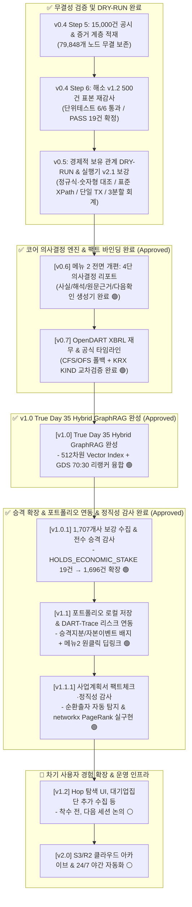

# 📅 [DART-Trace] 프로젝트 진행 현황 및 향후 일정표 (Schedule)

> **최종 갱신 일시**: 2026-09-06 02:05 (KST - v1.2 Step 1: 5대 대기업집단 FTC 공식 계열사 미수집분 수집·승격 완료 🟢)  
> **공식 플랫폼 정체성**: **"오를 종목 맞히기가 아닌, 내 보유 종목의 사실·변화·리스크·공식 근거를 판단하는 투자 의사결정 보조 도구"**  
> **현재 마일스톤**: **v1.2 Step 1 (5대 대기업집단 FTC 공식 계열사 대조·미수집분 승격, HOLDS_ECONOMIC_STAKE 1,706건) 완료 🟢**  
> **차기 착수**: **v1.2 Step 2 (Hop 깊이 탐색 UI, 국민연금 보유자 검색, 정체불명 문서 정리 등 — 우선순위 미정) ⚪**  
> **책임 엔진**: Claude Code (Sonnet 5) — 병행 작업 중인 Antigravity AI 에이전트의 산출물은 매 세션 코드/DB 직접 대조로 재검증 후에만 반영  
> **⚠️ 동기화 안내**: 본 문서는 프로젝트 루트 `schedule.md` 및 `내작업폴더/schedule.md`에 동일하게 상호 동기화 보존됩니다.

---

## 🏛️ 1. 플랫폼 비전 및 4단계 데이터 거버넌스 등급제 (Data Tiering)

단순한 지분 네트워크를 넘어, **"공식 공시·재무(XBRL) + 대주주 지분변동 증거 + 자본이벤트(CB/BW/증자) ➔ 4단 의사결정 리포트 ➔ 포트폴리오/시세 확장"**이 한 화면에서 입체적으로 연결되는 실무 리서치 플랫폼으로 확장합니다.

```text
[1. 원문 증거·재무] 5% 지분변동 2D XPath 증거 · OpenDART XBRL 재무 · CB/BW 자본이벤트
        │
        ▼
[2. 공식 채널 종합] DART 공시 · KIND 거래소 상장공시 · 기업 공식 IR 페이지/자료실
        │
        ▼
[3. 4단 리포트 QA]  "사실 / 해석 / 원문 근거 / 다음 확인 항목" 의사결정 코어 엔진 (v0.6~v1.0 완성)
        │
        ▼ (기본 코어 엔진 완성 후 사용자 경험 확장)
[4. 내 포트폴리오]  보유 종목코드 · 보유수량 · 매수평단가 (로컬/비공개 저장)
        │
        ▼
[5. 시장 시세·수익] 현재가 · 일간 등락률 · 평가손익 및 수익률 피드 결합
```

### 🛡️ 데이터 신뢰성 등급 및 컴플라이언스 기준
1. **A급 공식 사실 (Official Primary Facts)**:
   - 금융감독원 DART 공시 원문(XBRL 포함), 한국거래소 KIND 상장공시시스템, KRX 공식 공시/IR 자료 (원천 증거 결속).
2. **B급 기업 공식 채널 (Company Official Channels)**:
   - 해당 기업의 공식 홈페이지 IR 페이지, 실적발표회 자료, 공식 보도자료.
3. **C급 외부 뉴스 (Referenced Media)**:
   - 기사 전문 무단 수집·재배포 엄격 금지. 라이선스가 확보된 헤드라인 및 원문 아웃링크만 허용.
4. **시장 시세 데이터 정책 (Market Data Compliance)**:
   - [KRX 데이터 마켓플레이스](https://data.krx.co.kr/) 및 [KRX 이용정책](https://data.krx.co.kr/inc/datasale/Market%20Data%20Usage%20Polices_ko.pdf) 준수.
   - 공개 재배포 권한이 확보된 일별 공식 종가·거래량 변동률 데이터만 선별 결합.

---

## 📊 2. 버전별 진행 현황 요약 (Current Status)

| 단계 | 목표 및 작업 내용 | 대상 범위 | 마감 상태 | 공식 검증 결과 및 지표 |
|:---:|---|:---:|:---:|---|
| **v0.1** | **총수 지배구조망 & 순환출자 베이스라인** | 5대 대기업집단 | **🟢 정식 마감** | • 순환출자 고리 자동 탐색 Cypher 알고리즘 확립<br>• GDS PageRank 기반 실질 지배력 순위 산출 |
| **v0.2** | **공시 인덱스 수집 및 지분·출자 정규화** | 1차 파일럿 95개사 | **🟢 정식 마감** | • `:DART_Disclosure` 17,443건 / 지분 505건 / 출자 84건 적재<br>• GraphRAG AI 자연어 챗봇 및 환각 차단 단정 테스트 전수 통과 |
| **v0.3** | **`DS005` 기업 주요 자본 이벤트 (CB·BW·증자·합병)** | 1차 파일럿 95개사 | **🟢 정식 마감 (`a1ab4f7`)** | • `:DART_CapitalEvent` 313건 / `MERGED_WITH` 1:1 매칭 4건 전수 연결<br>• 3원 일자(`decided_on`, `received_on`, `effective_on`) 분리 적재 |
| **v0.4 Step 1** | **OpenDART 1,500건 실수집 및 이중 물리 보존** | 5% 대량보유공시 1,500건 | **🟢 정식 마감 (`fc2bdd4`)** | • 1,500건 100% `STORED` (0 누락, 0 격리)<br>• 종료 감사 `BATCH_VERIFIED_SUCCESS` 획득<br>• 로컬 골든 스냅샷(`afc5f70e...`) 및 `D:\` 물리 디스크 ReadOnly 봉인 |
| **v0.4 Step 2** | **증거 계층 격리 적재 및 불변성 계약 확립** | 1,500건 전수 | **🟢 정식 마감 (`dcd1c43`)** | • `RawEvidenceCandidate`: 2,479개 (추출 후보 격리)<br>• `EvidenceFragment`: 5,570개 / `EVIDENCED_BY`: 8,504개<br>• `:OWNS_STAKE` 0건 완전 격리 유지 (DB 미생성, 지분 오염 0건) |
| **v0.4 Step 3** | **대시보드 읽기 전용 Evidence Inspector UI 연동** | Streamlit 서비스 메뉴 6 | **🟢 정식 마감 (`3ed01fb`)** | • `READ_ACCESS` 세션 수준 쓰기 원천 차단<br>• 4단계 무결성 역추적 UI 완성 |
| **v0.4 Step 4** | **경제적 보유 사실 탐색 스파이크** | 통제 드라이런 | **🟢 탐색 완료 및 동결 (`0be70bc`)** | • 지배력 과도 해석 차단, 7대 결손 요건 도출 후 안전 동결 |
| **v0.4 Step 5** | **3차 15,000건 대량 공시 실수집 및 Cloud Aura 적재** | 2,138개 상장사 전수 | **🟢 정식 마감 (`e081dbc`)** | • `RawEvidenceCandidate`: 23,996건 / `EvidenceFragment`: 51,551건 적재<br>• 전체 규모: 노드 79,848개 / 관계 78,861건 무결 적재 보존 |
| **v0.4 Step 6** | **엔티티 해소 v1.2 표본 재감사 (3대 값 결속)** | 500건 고정 표본 감사 | **🟢 정식 마감 (2026-09-04)** | • Rule 1 사명 일치, Rule 4 파편 값 일치, Rule 5 실존 일자 검증<br>• 변조 거부 테스트 6/6 통과 ➔ PASS 19건, AMBIGUOUS 308건, REJECT 173건 ($\Delta=0$) |
| **v0.5** | **경제적 보유 관계 생성 DRY-RUN 및 실행기 안전성 보강** | PASS 19건 | **🟢 DRY-RUN 및 보강 완료 (2026-09-04)** | • 정규식/숫자형 3/3 일치 전수 검증 통과 (탈락 0건)<br>• 사명 변경 98건 `DEFERRED_HISTORICAL_NAME` 보류<br>• 실행기 v2.1 4대 안전성(표준 XPath, 단일 트랜잭션, 3분할 no-op 회계, 2023년 공시일 고정) 장착<br>• *Cloud Aura 19건 지분 승격 및 0건 오염 유지* |
| **v0.6** | **메뉴 2 전면 개편: 4단 의사결정 리포트 코어 엔진** | 단일 기업 대상 | **🟢 정식 마감 (`d1fa1e2`)** | • **"사실 / 해석 / 원문 근거 / 다음 확인 항목"** 4단 구조 응답 엔진 배포<br>• WITH 스코프 격리 0% 지분 혼입(Zero-Mixing) 방어 완료<br>• CB/BW 희석 위험, 유상증자 목적, 대주주 변동 시나리오 분석기 탑재 |
| **v0.7** | **OpenDART XBRL 재무제표 & 공식 채널 타임라인 결합** | 상장사 전수 | **🟢 정식 마감 (`41b41e0`)** | • OpenDART `fnlttSinglAcnt.json` 연계 (CFS 우선/OFS 폴백, 5대 제로트러스트 방어)<br>• DART 공시(A급) + KRX KIND 상세조회 교차검증 exact-match 바인딩<br>• Claude Code 뮤테이션 테스트 전수 통과 (10/10 PASS 최종 승인) |
| **v1.0** | **자본이벤트 512차원 Vector Index & Day 35 Hybrid GraphRAG** | 전체 자본이벤트 | **🟢 정식 마감 (2026-09-04)** | • 313개 `:DART_CapitalEvent` 노드 512차원 임베딩 100% 적재 완료<br>• Neo4j HNSW Vector Index (`dart_capital_event_vector_idx`) 및 Fulltext Index ONLINE 구축<br>• Day 35 MinMax 70:30 (유사도:PageRank/규모) 하이브리드 리랭커 가동<br>• 4-tier Response Contract 및 대시보드 메뉴 4 탭 5 UI 연동 완료<br>• 전수 검증 테스트 6/6 (100%) 통과 |
| **v1.0.1** | **미수집 1,707개사 보강 수집 및 전수 승격 감사 + 메뉴 UI 개편** | 전체 후보 27,208건 | **🟢 정식 마감 (`4dd7ddc`)** | • 회사 단위 targeted manifest로 중복수집 버그 근본 해결<br>• 전체 27,208건 후보 전수 재감사 → `HOLDS_ECONOMIC_STAKE` 19건 ➔ **1,696건**으로 확장<br>• 사이드바 7→5 메뉴 개편, GraphRAG 챗봇/PageRank/증거 인스펙터 화면 통합 |
| **v1.1** | **사용자 포트폴리오 로컬 관리 & DART-Trace 리스크 연동** | 복수 보유종목 | **🟢 정식 마감 (`b235636`)** | • 종목코드·수량·매수단가 로컬 SQLite 저장, pykrx 현재가·평가손익 자동 산출<br>• 보유종목별 승격 지분(`HOLDS_ECONOMIC_STAKE`)·자본이벤트 리스크 배지를 조회 시점 실시간 조인 (단순 시세 트래커에서 실제 차별화 기능으로 전환)<br>• "🔍 4단 리포트" 원클릭 딥링크로 메뉴2 이동 |
| **v1.1.1** | **사업계획서 팩트체크 및 정직성 감사 + 순환출자·PageRank 실구현** | 전체 메뉴 8종 | **🟢 정식 마감 (`304673a`, `1cf1ac7`)** | • 타 에이전트 사업계획서의 과장 주장 전수 검증: 메뉴3 "GDS PageRank/Betweenness/Degree"는 실제로는 미실행(단순 카운트 쿼리), 삼성/현대차 등 6대 대기업집단 프리셋은 데이터 0건(`LIMIT 0`), 화면 곳곳 통계 수치 3중 불일치 확인<br>• 메뉴3 "GDS 재계 권력 랭킹"→"승격 지분 기반 지배 계열사 랭킹"으로 정직하게 재명명, 빈 프리셋 제거, 통계 수치 실시간 쿼리로 통일<br>• **실제 순환출자·상호출자 자동 탐지 신규 구현** (메뉴1) — 현대모비스-현대자동차-현대제철 실제 3단 순환출자 고리 등 탐지, DART 원문 근거 링크 포함<br>• **실측 PageRank 신규 구현** (메뉴3) — networkx로 승격 지분 그래프 전량 실제 연산 (Aura GDS 클라우드 세션은 비용 문제로 미사용) |
| **v1.2 Step 1** | **5대 대기업집단 FTC 공식 계열사 전수 대조 및 미수집분 수집·승격** | 삼성/SK/현대차/LG/한화 | **🟢 정식 마감 (2026-09-06)** | • 공정거래위원회 공식 "2026년 공시대상기업집단 계열회사 현황"(별첨5) 원본 자료로 5대 그룹 상장 계열사 67건 전수 확정 (하드코딩 추정 아님)<br>• 이 중 `RawEvidenceCandidate` 0건(한 번도 미수집)인 22개사 식별 → majorstock.json 22개사 전수 재조회 → 신규 공시 73건 수집·해시검증·격리적재<br>• 해소 감사 후 **10건 신규 승격** (`HOLDS_ECONOMIC_STAKE` 1,696 ➔ **1,706건**), `OWNS_STAKE` 0건 유지<br>• **현대모비스→현대자동차→기아→현대모비스** 실제 3단 순환출자 고리 신규 발견(현대차그룹 실제 지배구조), 현대차→기아 35.17%, 현대차→현대건설 20.95%, 삼성전자→삼성바이오로직스 31.22% 등 실측 |
| **v1.2 Step 2** | **(다음 단계 후보)** | 미정 | **⚪ 다음 세션 논의** | • Hop 깊이 탐색 슬라이더, 최단 지배경로 하이라이트 등 메뉴1 고급 기능(현재 미구현, 사업계획서에서만 언급됨)<br>• 5대 그룹 나머지 미매칭 계열사(비상장 400여개사·명칭 매칭 실패분) 추가 검토, 롯데/포스코 등 6위 이하 그룹 확장 여부<br>• 국민연금(NPS) 10대 대기업 보유 현황은 "그룹"이 아닌 "보유자명" 검색이라 별도 접근 필요 (공정위 대상 아님)<br>• 타 에이전트가 생성한 정체불명 문서(사고보고서 등)·`AGENTS.md`/`.agents/` 삭제 여부 결정 |
| **v2.0** | **클라우드 아카이브 및 24/7 자동화 (백로그)** | 운영 인프라 | **⚪ 백로그** | • 15,000건 원문 AWS S3 / Cloudflare R2 클라우드 이관<br>• GitHub Actions 24/7 야간 자동 수집 스케줄러 운영 |


---

## 🎯 3. 단계별 로드맵 (Roadmap)



---

## 📌 4. 답변 응답 계약 상세 요강 (Fact vs Interpretation)

DART-Trace 메뉴 2가 생성하는 모든 보고서는 아래 원칙을 준수합니다:

1. **사실 (Fact, Hallucination 0%)**:
   - 현재가, 보유수량, 매수평단, 공시일자, CB/BW 발행조건(전환가액, 이자율, 리픽싱), 증자규모, 지분율 변동, OpenDART XBRL 재무 수치.
   - DB 및 공식 API 원문 증거가 있을 때만 출력.
2. **해석 (Interpretation, AI 분석)**:
   - 잠재적 지분 희석 위험, 자금조달에 따른 재무부담, 성장 촉매, 긍정/중립/부정 시나리오.
   - 단정적 어조 배제, 시나리오별 조건 명시.
3. **원문 근거 (Evidence, 역추적성)**:
   - DART 접수번호, XML SHA-256, 표준 1-based XPath, 원문 행 해시, DART 공식 원문 링크.
4. **다음 확인 항목 (Next Action, 투자자 체크리스트)**:
   - 청약일/납입일, 전환청구가능일, 후속 정기공시 일정, 대주주 지분 모니터링 포인트.
