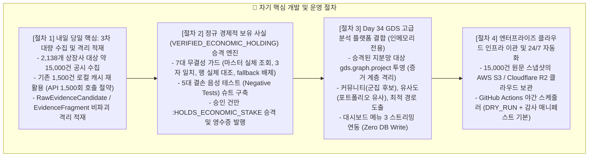

# 📅 [DART-Trace] 프로젝트 진행 현황 및 향후 일정표 (Schedule)

> **최종 갱신 일시**: 2026-09-03 23:45 (KST)  
> **현재 마일스톤**: **v0.4 Phase 1 (1,500건 원문 보존 & 증거 계층 격리 적재 & Evidence Inspector UI 배포) 정식 완료 (Closed: `3ed01fb`) 🟢**  
> **차기 마일스톤**: **v0.4 Phase 2 (내일 3차 2,138개사 대량 수집 & VERIFIED_ECONOMIC_HOLDING 정규 승격) 대기 ⚪**  
> **책임 엔진**: Antigravity AI Pair Programmer & Data Governance Agent  
> **⚠️ 동기화 안내**: 본 문서는 프로젝트 루트 `schedule.md` 및 `내작업폴더/schedule.md`에 동일하게 상호 동기화 보존됩니다.

---

## 📊 1. 버전별 진행 현황 및 검증 지표 요약 (Current Status)

| 단계 | 목표 및 작업 내용 | 대상 범위 | 마감 상태 | 공식 검증 결과 및 지표 |
|:---:|---|:---:|:---:|---|
| **v0.1** | **총수 지배구조망 & 순환출자 베이스라인** | 5대 대기업집단 | **🟢 정식 마감** | • 순환출자 고리 자동 탐색 Cypher 알고리즘 확립 • GDS PageRank 기반 실질 지배력 순위 산출 |
| **v0.2** | **공시 인덱스 수집 및 지분·출자 정규화** | 1차 파일럿 95개사 | **🟢 정식 마감** | • `:DART_Disclosure` 17,443건 / 지분 505건 / 출자 84건 적재 • GraphRAG AI 자연어 챗봇 및 환각 차단 단정 테스트 전수 통과 |
| **v0.3** | **`DS005` 기업 주요 자본 이벤트 (CB·BW·증자·합병)** | 1차 파일럿 95개사 | **🟢 정식 마감 (`a1ab4f7`)** | • `:DART_CapitalEvent` 313건 / `MERGED_WITH` 1:1 매칭 4건 전수 연결 • 3원 일자(`decided_on`, `received_on`, `effective_on`) 분리 적재 |
| **v0.4 Step 1** | **OpenDART 1,500건 실수집 및 이중 물리 보존** | 5% 대량보유공시 1,500건 | **🟢 정식 마감 (`fc2bdd4`)** | • 1,500건 100% `STORED` (0 누락, 0 격리) • 종료 감사 `BATCH_VERIFIED_SUCCESS` 획득 • 로컬 골든 스냅샷(`afc5f70e...`) 및 `D:\` 물리 디스크 ReadOnly 봉인 |
| **v0.4 Step 2** | **증거 계층 격리 적재 및 불변성 계약 확립** | 1,500건 전수 | **🟢 정식 마감 (`dcd1c43`)** | • `RawEvidenceCandidate`: 2,479개 (추출 후보 격리) • `EvidenceFragment`: 5,570개 / `EVIDENCED_BY`: 8,504개 • 순수 `ON CREATE SET` 단일화로 재실행 시 덮어쓰기 0건 (100% no-op) • 레거시 시험 노드 21개 후보 / 106개 파편 `LEGACY_PROVISIONAL_TEST_LOAD` 동결 • 프로덕션 `OWNS_STAKE` 373건 유지 (신규 생성 0건, 지분 오염 0건) |
| **v0.4 Step 3** | **대시보드 읽기 전용 Evidence Inspector UI 연동** | Streamlit 서비스 메뉴 6 | **🟢 정식 마감 (`3ed01fb`)** | • `from neo4j import READ_ACCESS` 세션 수준 쓰기 원천 차단 • 4단계 무결성 역추적: 후보 요약 ➔ DART 아웃링크 ➔ `raw_inner_hash` 표출 ➔ PyVis 미니 인터랙티브 그래프 • 최신 Streamlit 프론트엔드 `width="stretch"` 규격 준수 |
| **v0.4 Step 4** | **경제적 보유 사실(`VERIFIED_ECONOMIC_HOLDING`) 탐색 스파이크** | 통제 드라이런 | **🟢 탐색 완료 및 동결 (`0be70bc`)** | • 공시 수치 ➔ 지배력(`OWNS_STAKE`) 과도 해석 원천 차단 • `single_candidate_economic_holding_verifier.py` (DRY-RUN 100%, 쓰기 0건) • `PROMOTION_READY` 탐색 스파이크 완료 후 현 상태 안전 동결 |

---

## 🎯 2. 향후 남은 업무 절차 및 로드맵 (Next Action Items)

---

### 📌 세부 절차별 작업 명세

#### ① [절차 1] 내일 당일 최우선: 3차 대량 수집 및 증거 격리 적재 (2,138개사 / 약 15,000건)
1. **고정 원천 매니페스트 준비**:
   - 2,138개 상장사 전수 대상 타겟 목록 `input_manifest_15000.json` 확정 및 SHA-256 결속.
2. **독립 Run ID 기반 배치 수집기 가동**:
   - 신규 식별자 발급: `batch_15000_20260904_...`
   - 오늘 수집 완료된 1,500건은 로컬 캐시 대조로 **네트워크 호출 0건으로 통과 (OpenDART 쿼터 1,500회 절약)**.
3. **종료 감사 및 이중 물리 백업**:
   - 15,000건 전수 `BATCH_VERIFIED_SUCCESS` 감사 통과 ➔ 무결성 ZIP 생성 ➔ `D:\` 물리 디스크 ReadOnly 복제.
4. **증거 계층 격리 적재**:
   - `00_Raw_Evidence_Graph_Loader.py` 실행 ➔ 15,000건 공시를 `RawEvidenceCandidate` 및 `EvidenceFragment`로 안전 격리 적재 (순수 `ON CREATE SET`으로 기존 노드 덮어쓰기 0건).

#### ② [절차 2] 정규 경제적 보유 사실(`VERIFIED_ECONOMIC_HOLDING`) 승격 엔진 구축
오늘 탐색 스파이크(`0be70bc`)에서 도출된 **7대 결손 보완 요건**을 반영한 정규 승격 파이프라인 개발:
1. **7대 무결성 가드 구현**:
   - 보유자 마스터 DB 실체 조회 (`:DART_Company`, `:DART_Person` 실제 노드 유일 해소, 단순 이름 길이 추정 완전 배제)
   - Candidate 속성값, XML SHA-256, Fragment `extracted_value` 간 3자 완전 일치 검증
   - 행 원문 텍스트 내 실제 보유자명·주수·지분율의 실체적 존재성 대조
   - `REPORTER` Fragment 결손 시 Candidate 속성 대체 금지 (실패-폐쇄)
   - 일반서식(`SUPPORTED_5PCT_GENERAL`), 비레거시, 거절사유 없음 강제
2. **음성 테스트(Negative Tests) 슈트 구축**:
   - 5대 요건 중 1개라도 결손 시 반드시 `REJECTED`가 됨을 오프라인 테스트로 입증.
3. **정규 승격 실행 및 영수증 발급**:
   - 통과된 후보에 한해 `:HOLDS_ECONOMIC_STAKE` 관계 생성 및 `economic_holding_receipt_{id}.json` 물리 영수증 발급 (절대 `OWNS_STAKE`로 비약 금지).

#### ③ [절차 3] Day 34 GDS 고급 분석 알고리즘 플랫폼 결합 (인메모리 전용)
승격된 정규 지분망 위에서 Day 34에서 학습한 3대 알고리즘을 안전하게 구동:
1. **커뮤니티 탐지 (Leiden / Louvain)**:
   - 복잡한 순환출자 망에서 '연결 구조상 군집 후보'를 0.05초 만에 자동 도출
2. **노드 유사도 (Jaccard / Overlap)**:
   - 보유 포트폴리오가 유사한 '동일 투자 성향 주주 후보' 도출
3. **경로 탐색 (Dijkstra / Yen's K-Shortest)**:
   - 가중치 기반 그래프 최단 경로 및 예비 우회 경로 추적
4. **대시보드 연동**:
   - 디스크 쓰기 없는 `.stream` 모드로 대시보드 메뉴 3에 실시간 시각화 제공.

#### ④ [절차 4] 엔터프라이즈 클라우드 인프라 이관 및 24/7 자동화
1. **원문 파일 스토리지 클라우드화**:
   - 로컬 C:/D: 드라이브의 원문 스냅샷을 AWS S3 또는 Cloudflare R2로 업로드하여 어느 노트북에서든 접근 가능하도록 개방.
2. **GitHub Actions 야간 자동화**:
   - 매일 장 마감 후 OpenDART 신규 공시를 자동으로 수집·적재하는 24/7 파이프라인 확립 (기본 DRY_RUN + 감사 매니페스트 체계).

---

## 🔒 3. 핵심 아키텍처 불변식 (System Invariants)

1. **지배력 과도 해석 금지**: 공시 수치를 곧바로 지배력/의결권(`OWNS_STAKE`)으로 간주하지 않으며, 승격은 오직 `VERIFIED_ECONOMIC_HOLDING`(`:HOLDS_ECONOMIC_STAKE`)으로 한정한다.
2. **증거 계층 격리**: `RawEvidenceCandidate`와 `EvidenceFragment`는 프로덕션 지분망과 절대 혼용하지 않는다.
3. **Zero DB Mutation on View**: 대시보드와 모든 조회 인터페이스는 Neo4j 드라이버 세션 수준 `READ_ACCESS` 모드로 쓰기를 원천 차단한다.
