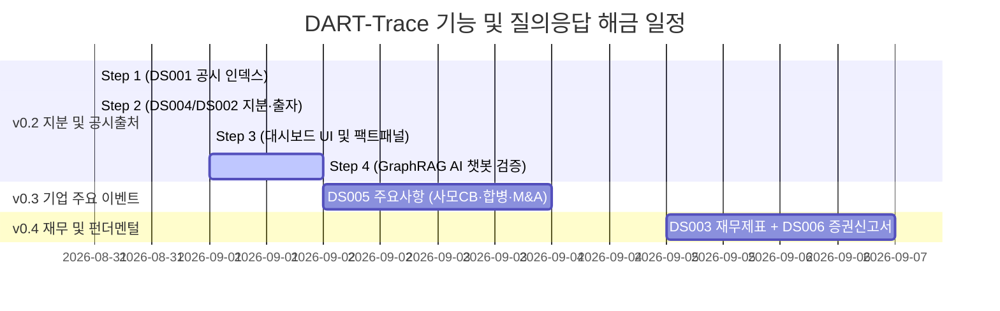

# 📅 [DART-Trace] 프로젝트 진행 현황 및 향후 일정표 (Schedule)

> **기준 일시**: 2026-09-01 15:50 (KST)  
> **현재 마일스톤**: **v0.2 Step 1/Step 2/Step 3 마감 완료 (v0.2 완료) / Step 4 (GraphRAG AI) 진입 대기**  
> **책임 엔진**: Antigravity AI Pair Programmer & Data Governance Agent  
> **⚠️ 기준 문서 안내**: 본 프로젝트의 최신 작업 일정 및 거버넌스 기준 문서는 항상 **`내작업폴더/schedule.md`** 및 루트 **`schedule.md`**로 상호 동기화됩니다.  
> **🔒 DB 격리 정책**: 검수 완료된 DART 데이터 상태를 보존하기 위해, 향후 교육/실습용 Cypher 작업과 DART 프로젝트 DB의 물리적 분리(DBMS 분리 또는 포트 분리)를 적용할 예정입니다.

---

## 📊 1. 현재 단계별 진행 현황 및 지표 요약 (Current Status)

| 단계 | 목표 및 작업 내용 | 대상 범위 | 검수 상태 | [스냅샷] 검수 기준 지표 vs 현재 파일럿 재적재 지표 |
|:---:|---|:---:|:---:|---|
| **v0.2 Step 1** | **`DS001` 공시 인덱스 수집 및 DB 승격** | 1차 파일럿 100개사 | **🟢 합격** | • **[검수 스냅샷]** 100개사 파일럿 대상의 전 페이지 공시 `21,538건` 적재 (`[:FILED]` 21,538건) • **[현재 파일럿 DB]** `:DART_Disclosure` `17,443건` / `[:FILED]` `17,443건` • `01_DART_Disclosure_공시인덱스_수집기.py` |
| **v0.2 Step 2** | **`DS004` (지분) + `DS002` (최대주주·타법인출자) 정형 수집·정규화** | 1차 파일럿 100개사 | **🟢 합격** | • **[검수 스냅샷]** 지분 `723건` / 출자 `116건` / 후보큐 `3,893건` • **[현재 파일럿 DB]** 지분 `505건` / 출자 `84건` / 후보큐 `3,139건` • `02_DART_P1_지분공시_및_타법인출자_통합파이프라인.py` • `00_DART_Rebuild_파일럿_재적재.py` (재적재 파이프라인) |
| **v0.2 Step 3** | **Streamlit 대시보드 UI 연동 및 팩트 상세 패널 구축** | 프론트엔드 연동 | **🟢 합격 (정식 마감)** | • `app_dart_trace_dashboard.py` (3D 지분망 분리, 테이블 전체 이력 보존, 최신순 정렬, randomSeed 고정, DART 원문 역추적 및 무결성 팩트 패널 검증 통과) |
| **v0.2 Step 4** | **GraphRAG AI 자연어 챗봇 & 환각 차단 검증** | 챗봇 벤치마크 | **⚪ 대기 (Next)** | • 3대 벤치마크 시나리오 검증 및 출처 증빙 강제, Fall-back 안전 응답 체계 |
| **v0.3** | **`DS005` 기업 주요 이벤트 (CB·BW발행, 합병, 증자, 주식양수도, 소송)** | 100개사 확장 | **🟡 온톨로지 설계 완료 (실개발 대기)** | • `00_DART_Trace_지식그래프_온톨로지_및_데이터구조_명세서_v0.3.md` • 5대 핵심 자본 이벤트(`cvbdIsDecsn`, `bdwtIsDecsn`, `piicDecsn`, `otrCprAcqDecsn`, `cmpMgDecsn`) 파이프라인 준비 |
| **v0.4** | **`DS003` 재무 스냅샷 + `DS006` 증권신고서 상세 결합** | 100개사 확장 | **⚪ 예정** | • 펀더멘털 건전성 진단 및 한도/조건 상세 그래프 |

---

## 🛠️ 2. Step 3 대시보드 UI 연동 완료 핵심 기능 명세

1. **3D 상장사 지배구조 네트워크 탐색기**:
   - `FILED` 공시 문서 제출선 완전 분리 및 순수 지분/출자망 렌더링
   - `is_current=True` 및 베이스라인 기본 필터링 + `과거 이력 관계 포함` 토글
   - `randomSeed: 42` 및 `stabilization` 적용으로 노드 흔들림 없는 고정 렌더링
2. **지분 / 타법인 출자 테이블 전체 이력 보존 및 최신순 정렬**:
   - `is_current DESC ➔ reported_on DESC ➔ as_of_date DESC` 자동 정렬
3. **🏛️ 팩트 상세 패널 (Fact Detail Panel)**:
   - DART 원문 뷰어 링크 연동 (`viewer_url` 및 14자리 `rcept_no`)
   - 이중 상태 배지: `doc_status` (공시상태) / `verification_status` (검증상태) / `is_current` (최신성)
   - 근거 공시 미연결 건에 대한 안전 경고 노출

---

## 📈 3. 버전별 해금 질문(Q/A) 로드맵

