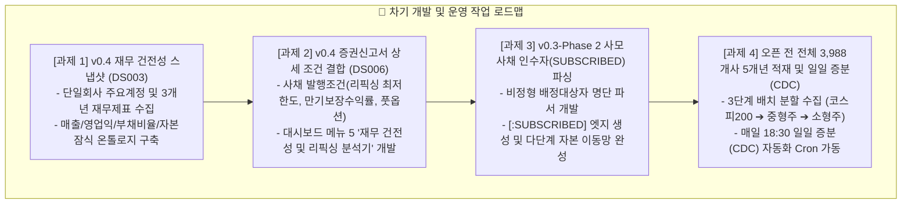
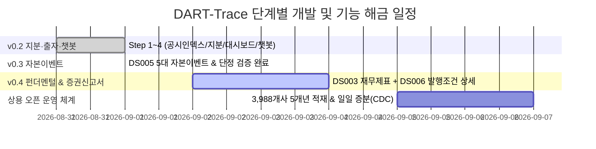

# 📅 [DART-Trace] 프로젝트 진행 현황 및 향후 일정표 (Schedule)

> **최종 갱신 일시**: 2026-09-01 17:40 (KST)  
> **현재 마일스톤**: **v0.3 (DS005 5대 자본 이벤트 지식그래프 & 챗봇 연동) 정식 완료 (Closed: `a1ab4f7`) 🟢 / v0.4 및 오픈전 작업 대기 ⚪**  
> **책임 엔진**: Antigravity AI Pair Programmer & Data Governance Agent  
> **⚠️ 기준 문서 안내**: 본 프로젝트의 최신 작업 일정 및 거버넌스 기준 문서는 항상 **`내작업폴더/schedule.md`** 및 루트 **`schedule.md`**로 상호 동기화됩니다.  
> **🔒 DB 격리 정책**: 검수 완료된 DART 데이터 상태를 보존하기 위해, 향후 교육/실습용 Cypher 작업과 DART 프로젝트 DB의 물리적 분리(DBMS 분리 또는 포트 분리)를 적용할 예정입니다.

---

## 📊 1. 버전별 진행 현황 및 검증 지표 요약 (Current Status)

| 단계 | 목표 및 작업 내용 | 대상 범위 | 마감 상태 | 공식 검증 결과 및 지표 |
|:---:|---|:---:|:---:|---|
| **v0.1** | **총수 지배구조망 & 순환출자 베이스라인** | 5대 대기업집단 | **🟢 정식 마감** | • 순환출자 고리 자동 탐색 Cypher 알고리즘 확립 • GDS PageRank 기반 실질 지배력 순위 산출 |
| **v0.2 Step 1** | **`DS001` 공시 인덱스 수집 및 DB 승격** | 1차 파일럿 95개사 | **🟢 정식 마감** | • `:DART_Disclosure` `17,443건` / `[:FILED]` `17,443건` 전수 적재 (`01_DART_Disclosure_공시인덱스_수집기.py`) |
| **v0.2 Step 2** | **`DS004` (지분) + `DS002` (최대주주·타법인출자) 정규화** | 1차 파일럿 95개사 | **🟢 정식 마감** | • 지분 `505건` / 출자 `84건` / 후보큐(`candidate_queue.jsonl`) `3,139건` 격리 • `02_DART_P1_지분공시_및_타법인출자_통합파이프라인.py` |
| **v0.2 Step 3** | **Streamlit 대시보드 UI 연동 및 팩트 패널** | 프론트엔드 연동 | **🟢 정식 마감** | • `app_dart_trace_dashboard.py` (3D 지분망 분리, 테이블 전체 이력 보존, 최신순 정렬, randomSeed 고정, DART 원문 역추적 팩트 패널) |
| **v0.2 Step 4** | **GraphRAG AI 자연어 챗봇 & 환각 차단 검증** | 챗봇 벤치마크 | **🟢 정식 마감** | • `generate_graphrag_response()` 공용 함수 모듈화 • 두 엔터티 간 관계 이력 정밀 반환 & 무관 기업 혼입 0% • DART 원문 클릭 URL (`rcpNo=...`) 강제 증빙 및 단정 테스트 전수 통과 • 미등록/미적재 질문 시 '현재 적재된 공시 데이터에서 확인 불가' 안전 응답 100% |
| **v0.3** | **`DS005` 기업 주요 이벤트 (CB·BW발행, 합병, 증자, 주식양수도)** | 1차 파일럿 95개사 | **🟢 정식 마감 (`a1ab4f7`)** | • `03_DART_P2_주요사항_자본이벤트_통합파이프라인.py` • **총 `:DART_CapitalEvent` 313건** (CB 118, 증자 110, 합병 47, 양수 23, BW 15) • **`[:ANNOUNCED]` 313건 / `[:EVIDENCED_BY]` 313건 100% 전수 연결** • **정확 1:1 매칭 프로젝션 `MERGED_WITH` 4건 (`fact_id` 누락 0건 assert PASS)** • 3원 일자(`decided_on`, `received_on`, `effective_on`) 분리 적재 완료 • 대시보드 내 모든 레거시 5-Hop 및 주관적 문구 완전 삭제 (0건 스캔 검증) • `test_v03_chatbot.py` (3S·APS 금액/전환가/접수번호/DART 링크) 100% assert PASS • 공식 검증 스크립트(`verify_v03`, `test_v03`) Git 추적 커밋 완료 |
| **v0.4** | **`DS003` 재무 스냅샷 + `DS006` 증권신고서 상세 결합** | 95개사 ➔ 3,988개사 | **⚪ 차기 개발 예정** | • 펀더멘털 건전성 진단 및 한도/조건 상세 그래프 (백로그 초안 완료) |

---

## 🎯 2. 다음 할 일 (Next Action Items)

### ① [우선순위 1] v0.4 재무제표(DS003) 및 증권신고서(DS006) 펀더멘털 결합
1. **재무제표 수집기 개발 (`04_DART_Financial_Snapshot_수집기.py`)**:
   - OpenDART `fnlttSinglAcnt.json` 엔드포인트를 활용하여 최근 3개년(2022~2024) 요약 재무제표 수집
   - 노드 `:DART_FinancialSnapshot` 생성 (`corp_code`, `year`, `revenue`, `operating_profit`, `net_income`, `total_assets`, `total_debt`, `capital_impairment_ratio`)
2. **사채 조건 정밀 온톨로지 확장**:
   - `DS006` 증권신고서의 리픽싱(전환가액 조정) 하한선 및 조기상환청구권(Put Option) 정보 결합
3. **대시보드 메뉴 확장**:
   - 대시보드에 `📊 5. 재무 펀더멘털 및 자본잠식 진단기` 메뉴 추가

### ② [우선순위 2] v0.3-Phase 2 비정형 배정대상자(`[:SUBSCRIBED]`) 파서 구축
1. 주요사항보고서 본문 내 "제3자배정 대상자별 배정내역" 비정형 HTML/XML 표 파싱
2. `(:DART_Person|DART_Group)-[:SUBSCRIBED {fact_id, allocated_amount, allocated_shares}]->(:DART_CapitalEvent)` 정밀 생성

### ③ [우선순위 3] 상용 오픈 전 전체 3,988개사 5개년 적재 및 일일 증분(CDC) 가동
1. `[오프전체크]_00_DART-Trace_전체상장사_5개년적재_및_일일증분_운영파이프라인_오픈전작업가이드.md` 기준 3단계 배치 실행
2. 매일 18:30 장 마감 후 자동 실행되는 일일 증분 동기화 배치(`04_DART_Daily_Incremental_CDC_동기화기.py`) Cron 등록

---

## 📈 3. 버전별 해금 질문(Q/A) 및 기능 로드맵

