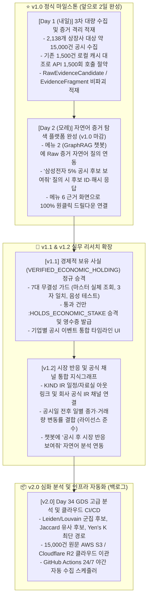

# 📅 [DART-Trace] 프로젝트 진행 현황 및 향후 일정표 (Schedule)

> **최종 갱신 일시**: 2026-09-03 24:00 (KST)  
> **공식 플랫폼 정체성**: **"공시 원문, 공식 기업 채널, 시장 반응을 근거 중심으로 연결하는 한국 상장사 이벤트 지식그래프"**  
> **현재 마일스톤**: **v0.4 Phase 1 (1,500건 원문 보존 & 증거 계층 격리 적재 & Evidence Inspector UI 배포) 정식 완료 (Closed: `3ed01fb`) 🟢**  
> **차기 마일스톤**: **v1.0 (내일 3차 2,138개사 대량 수집 & 모레 챗봇 자연어 증거 탐색 연동) ⚪**  
> **책임 엔진**: Antigravity AI Pair Programmer & Data Governance Agent  
> **⚠️ 동기화 안내**: 본 문서는 프로젝트 루트 `schedule.md` 및 `내작업폴더/schedule.md`에 동일하게 상호 동기화 보존됩니다.

---

## 🏛️ 1. 플랫폼 비전 및 4단계 데이터 거버넌스 등급제 (Data Tiering)

단순한 지분 네트워크를 넘어, **"공시 이벤트 ➔ 원문 증거 ➔ 시장 반응 ➔ 공식 채널"**이 한 화면에서 입체적으로 연결되는 실무 리서치 플랫폼으로 확장합니다.

```text
[1. 공시 이벤트]  5% 대량보유 · 최대주주 변동 · CB/BW · 유상증자
       │
       ▼
[2. 원문 증거]    공시 접수번호 · XML SHA-256 · 2D XPath · 원문 행 해시 (Zero Hallucination)
       │
       ▼
[3. 시장 반응]    공시일 전후 일별 종가 · 거래량 · 변동률 (권한/라이선스 준수 데이터)
       │
       ▼
[4. 공식 채널]    DART 원문 아웃링크 · KIND IR 일정/자료실 · 기업 공식 IR 페이지
```

### 🛡️ 데이터 신뢰성 등급 및 컴플라이언스 기준
1. **A급 공식 사실 (Official Primary Facts)**:
   - 금융감독원 DART 공시 원문, 한국거래소 KIND 상장공시시스템, KRX 공식 공시/IR 자료 (원천 증거 결속).
2. **B급 기업 공식 채널 (Company Official Channels)**:
   - 해당 기업의 공식 홈페이지 IR 페이지, 실적발표회 자료, 공식 보도자료.
3. **C급 외부 뉴스 (Referenced Media)**:
   - 기사 전문 무단 수집·재배포 엄격 금지. 라이선스가 확보된 헤드라인 및 원문 아웃링크만 허용.
4. **시장 시세 데이터 정책 (Market Data Compliance)**:
   - [KRX 데이터 마켓플레이스](https://data.krx.co.kr/) 및 [KRX 이용정책](https://data.krx.co.kr/inc/datasale/Market%20Data%20Usage%20Polices_ko.pdf) 준수.
   - 공개 재배포 권한이 확보된 일별 공식 종가·거래량 변동률 데이터만 선별 결합.

---

## 📊 2. 버전별 진행 현황 요약 (Current Status)

| 단계 | 목표 및 작업 내용 | 대상 범위 | 마감 상태 | 공식 검증 결과 및 지표 |
|:---:|---|:---:|:---:|---|
| **v0.1** | **총수 지배구조망 & 순환출자 베이스라인** | 5대 대기업집단 | **🟢 정식 마감** | • 순환출자 고리 자동 탐색 Cypher 알고리즘 확립<br>• GDS PageRank 기반 실질 지배력 순위 산출 |
| **v0.2** | **공시 인덱스 수집 및 지분·출자 정규화** | 1차 파일럿 95개사 | **🟢 정식 마감** | • `:DART_Disclosure` 17,443건 / 지분 505건 / 출자 84건 적재<br>• GraphRAG AI 자연어 챗봇 및 환각 차단 단정 테스트 전수 통과 |
| **v0.3** | **`DS005` 기업 주요 자본 이벤트 (CB·BW·증자·합병)** | 1차 파일럿 95개사 | **🟢 정식 마감 (`a1ab4f7`)** | • `:DART_CapitalEvent` 313건 / `MERGED_WITH` 1:1 매칭 4건 전수 연결<br>• 3원 일자(`decided_on`, `received_on`, `effective_on`) 분리 적재 |
| **v0.4 Step 1** | **OpenDART 1,500건 실수집 및 이중 물리 보존** | 5% 대량보유공시 1,500건 | **🟢 정식 마감 (`fc2bdd4`)** | • 1,500건 100% `STORED` (0 누락, 0 격리)<br>• 종료 감사 `BATCH_VERIFIED_SUCCESS` 획득<br>• 로컬 골든 스냅샷(`afc5f70e...`) 및 `D:\` 물리 디스크 ReadOnly 봉인 |
| **v0.4 Step 2** | **증거 계층 격리 적재 및 불변성 계약 확립** | 1,500건 전수 | **🟢 정식 마감 (`dcd1c43`)** | • `RawEvidenceCandidate`: 2,479개 (추출 후보 격리)<br>• `EvidenceFragment`: 5,570개 / `EVIDENCED_BY`: 8,504개<br>• 순수 `ON CREATE SET` 단일화로 재실행 시 덮어쓰기 0건 (100% no-op)<br>• 레거시 시험 노드 21개 후보 / 106개 파편 `LEGACY_PROVISIONAL_TEST_LOAD` 동결<br>• 프로덕션 `OWNS_STAKE` 373건 유지 (신규 생성 0건, 지분 오염 0건) |
| **v0.4 Step 3** | **대시보드 읽기 전용 Evidence Inspector UI 연동** | Streamlit 서비스 메뉴 6 | **🟢 정식 마감 (`3ed01fb`)** | • `from neo4j import READ_ACCESS` 세션 수준 쓰기 원천 차단<br>• 4단계 무결성 역추적: 후보 요약 ➔ DART 아웃링크 ➔ `raw_inner_hash` 표출 ➔ PyVis 미니 인터랙티브 그래프<br>• 최신 Streamlit 프론트엔드 `width="stretch"` 규격 준수 |
| **v0.4 Step 4** | **경제적 보유 사실(`VERIFIED_ECONOMIC_HOLDING`) 탐색 스파이크** | 통제 드라이런 | **🟢 탐색 완료 및 동결 (`0be70bc`)** | • 공시 수치 ➔ 지배력(`OWNS_STAKE`) 과도 해석 원천 차단<br>• `single_candidate_economic_holding_verifier.py` (DRY-RUN 100%, 쓰기 0건)<br>• 7대 결손 요건 도출 후 현 상태 안전 동결 (정식 승격 보류) |

---

## 🎯 3. 단계별 로드맵 (Roadmap)



---

### 📌 세부 단계별 작업 요강

#### 1️⃣ [v1.0 (내일~모레 완성)] DART 공시 원문 증거 탐색 플랫폼
* **Day 1 (내일 최우선)**:  
  2,138개사 대상 약 15,000건 3차 대량 수집 ➔ 종료 감사(`BATCH_VERIFIED_SUCCESS`) ➔ 로컬 ZIP + `D:\` 물리 ReadOnly 백업 ➔ 증거 계층 격리 적재.
* **Day 2 (모레 완성)**:  
  메뉴 2(GraphRAG 챗봇)에 Raw 증거 자연어 탐색 연결 ➔ 질의 시 후보 ID, 공시번호, 원문 해시를 반환하고 메뉴 6 근거 화면으로 100% 원클릭 드릴다운 안내 ➔ **v1.0 정식 완료**.

#### 2️⃣ [v1.1] 경제적 보유 사실 정규 승격 및 이벤트 타임라인
* 7대 엄격 가드(마스터 실체 조회, 3자 일치, 행 실체 대조, fallback 배제) 반영 승격 엔진 구축.
* 승인 건만 `:HOLDS_ECONOMIC_STAKE` 승격 (영수증 발행).
* 기업별 공시 이벤트 통합 타임라인 UI 구현.

#### 3️⃣ [v1.2] 시장 반응 및 공식 채널 결합 (상장사 이벤트 지식그래프 완성)
* **공식 채널**: KIND 상장법인 상세정보(IR 일정, IR 자료실) 및 기업 공식 IR 홈페이지 아웃링크 결속.
* **시장 반응**: KRX 마켓플레이스 이용정책을 준수한 공시일 전후 일별 종가, 거래량, 변동률 결합.
* **자연어 연동**: 메뉴 2 챗봇에서 "파인메딕스 5% 공시 후 주가와 거래량 반응 보여줘" 질문 지원.

#### 4️⃣ [v2.0 백로그] GDS 분석 및 인프라 24/7 자동화
* Day 34 GDS 인메모리 3대 알고리즘(군집 후보, 유사 후보, 최단 경로) 스트리밍 연동.
* 원문 스냅샷 S3/R2 클라우드 보관 및 GitHub Actions 야간 스케줄러 운영.
