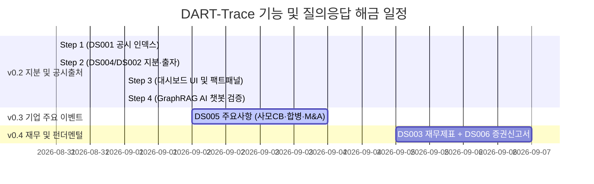

# 📅 [DART-Trace] 프로젝트 진행 현황 및 향후 일정표 (Schedule)

> **기준 일시**: 2026-09-01 16:45 (KST)  
> **현재 마일스톤**: **v0.3 (DS005 5대 자본 이벤트 수집 & 그래프 적재 & 대시보드·챗봇 연동) 완료 (v0.3 정식 마감) / v0.4 (재무 스냅샷 & 증권신고서) 대기**  
> **책임 엔진**: Antigravity AI Pair Programmer & Data Governance Agent  
> **⚠️ 기준 문서 안내**: 본 프로젝트의 최신 작업 일정 및 거버넌스 기준 문서는 항상 **`내작업폴더/schedule.md`** 및 루트 **`schedule.md`**로 상호 동기화됩니다.  
> **🔒 DB 격리 정책**: 검수 완료된 DART 데이터 상태를 보존하기 위해, 향후 교육/실습용 Cypher 작업과 DART 프로젝트 DB의 물리적 분리(DBMS 분리 또는 포트 분리)를 적용할 예정입니다.

---

## 📊 1. 현재 단계별 진행 현황 및 지표 요약 (Current Status)

| 단계 | 목표 및 작업 내용 | 대상 범위 | 검수 상태 | [스냅샷] 검수 기준 지표 vs 현재 파일럿 재적재 지표 |
|:---:|---|:---:|:---:|---|
| **v0.2 Step 1** | **`DS001` 공시 인덱스 수집 및 DB 승격** | 1차 파일럿 100개사 | **🟢 합격** | • **[검수 스냅샷]** 100개사 파일럿 대상의 전 페이지 공시 `21,538건` 적재 (`[:FILED]` 21,538건) • **[현재 파일럿 DB]** `:DART_Disclosure` `17,443건` / `[:FILED]` `17,443건` • `01_DART_Disclosure_공시인덱스_수집기.py` |
| **v0.2 Step 2** | **`DS004` (지분) + `DS002` (최대주주·타법인출자) 정형 수집·정규화** | 1차 파일럿 100개사 | **🟢 합격** | • **[검수 스냅샷]** 지분 `723건` / 출자 `116건` / 후보큐 `3,893건` • **[현재 파일럿 DB]** 지분 `505건` / 출자 `84건` / 후보큐 `3,139건` • `02_DART_P1_지분공시_및_타법인출자_통합파이프라인.py` • `00_DART_Rebuild_파일럿_재적재.py` (재적재 파이프라인) |
| **v0.2 Step 3** | **Streamlit 대시보드 UI 연동 및 팩트 상세 패널 구축** | 프론트엔드 연동 | **🟢 합격 (정식 마감)** | • `app_dart_trace_dashboard.py` (3D 지분망 분리, 테이블 전체 이력 보존, 최신순 정렬, randomSeed 고정, DART 원문 역추적 및 무결성 팩트 패널 검증 통과) |
| **v0.2 Step 4** | **GraphRAG AI 자연어 챗봇 & 환각 차단 검증** | 챗봇 벤치마크 | **🟢 합격 (정식 마감)** | • `generate_graphrag_response()` 공용 함수 모듈화 및 대시보드 100% 연동 • 두 엔터티 간 관계 이력 정밀 반환 & 무관 기업 혼입 0% • DART 원문 클릭 URL (`rcpNo=...`) 강제 증빙 및 단정 테스트 전수 통과 • 미등록/CB 공시 부재 시 '현재 적재된 공시 데이터에서 확인 불가' 안전 응답 100% |
| **v0.3** | **`DS005` 기업 주요 이벤트 (CB·BW발행, 합병, 증자, 주식양수도)** | 1차 파일럿 95개사 | **🟢 합격 (정식 마감)** | • `03_DART_P2_주요사항_자본이벤트_통합파이프라인.py` • **총 `:DART_CapitalEvent` 313건** (CB 118건, 증자 110건, 합병 47건, 양수 23건, BW 15건) • **`[:EVIDENCED_BY]` 공시 원문 313건 100% 전수 연결** • **정확 1:1 매칭 기준 프로젝션 엣지 4건 (`MERGED_WITH`)** • 3원 일자(`decided_on`, `received_on`, `effective_on`) 분리 적재 완료 • `SUBSCRIBED`(배정자 세부 연결)는 Phase 2 백로그로 이관 • 대시보드 메뉴 4 탐색기 및 GraphRAG 챗봇 팩트 단정(발행액/전환가/접수번호/URL) 100% 통과 |
| **v0.4** | **`DS003` 재무 스냅샷 + `DS006` 증권신고서 상세 결합** | 100개사 확장 | **⚪ 예정** | • 펀더멘털 건전성 진단 및 한도/조건 상세 그래프 (백로그 초안 완료) |

---

## 🛠️ 2. Step 4 GraphRAG AI 챗봇 완료 핵심 기능 명세

1. **지능형 질의 라우팅 & 엔티티 링킹**:
   - 질문 의도(순환출자, 양자비교, 단일엔티티, 통계요약, 이상징후) 자동 분류
   - 표준 엔티티 정규화 (예: 국민연금 ➔ 국민연금공단, 현대중공업 ➔ HD현대중공업)
2. **두 엔터티 간 관계 이력 정밀 격리 탐색**:
   - `((a.name = $ent1 AND b.name = $ent2) OR (a.name = $ent2 AND b.name = $ent1))` Cypher 엄격 격리로 타사 혼입 0%
   - `is_current DESC ➔ reported_on DESC ➔ as_of_date DESC` 정렬로 최신 유효 사실 상단 배치
3. **DART 원문 링크 및 팩트 증빙 강제 결합**:
   - 모든 반환 사실에 클릭 가능한 DART 공시 원문 링크(`https://dart.fss.or.kr/dsaf001/main.do?rcpNo=...`) 자동 삽입
   - LLM 응답 하단에 Neo4j 원천 팩트 증빙 블록 강제 유지
4. **미등록 데이터 및 미적재 공시 안전 응답 (최종 답변 문장 생성은 Neo4j 실측 팩트로 제한)**:
   - 미등록 엔티티(NAVER 등) 및 v0.3 이전 미적재 CB/이상징후 질의 시 `⚠️ 현재 적재된 공시 데이터에서 확인 불가` 반환

---

## 📈 3. 버전별 해금 질문(Q/A) 로드맵

