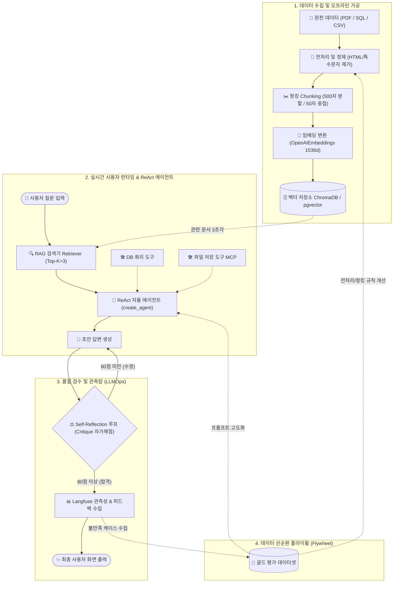

# 🏛️ End-to-End 엔터프라이즈 AI 에이전트 마스터 아키텍처 보고서

> **문서 목적**: 원천 데이터 수집·전처리부터 벡터 검색(RAG), 자율 에이전트(ReAct), 품질 통제(Self-Reflection), 관측성(Langfuse) 및 피드백 선순환(Flywheel)까지 **전체 AI 에이전트 생태계를 하나의 표준 아키텍처로 조망하고 즉시 코드로 구현할 수 있는 실무 마스터 가이드**입니다.

---

## 🗺️ 1. 전체 생태계 거대 조감도 (Master Ecosystem Map)



#### 📐 텍스트 조감도 (확장 프로그램 없이 즉시 확인 가능)

```text
┌────────────────────────────────────────────────────────────────────────────────────────┐
│ 1. 데이터 수집 & 오프라인 가공                                                          │
│  [📂 원천 데이터] ──> [🧹 전처리/정제] ──> [✂️ 청킹 (500자/50자)] ──> [🧠 임베딩] ──> [🗄️ VectorDB] │
└──────────────────────────────────────────────────────────────────────────────────┬─────┘
                                                                                   │ (Top-3)
┌──────────────────────────────────────────────────────────────────────────────┐   │
│ 2. 실시간 사용자 런타임 & ReAct 에이전트                                     │   │
│  [👤 사용자 질문] ──────────────────> [🔍 RAG 검색기 (Retriever)] <────────────┘
│                                               │
│  [🛠️ DB 조회 도구]  ──┐                      ▼
│  [🛠️ 파일 저장 MCP] ──┼─────────────> [🤖 ReAct 자율 에이전트] ───> [📝 초안 답변]
└───────────────────────────────────────────────────────────────────────┬──────┘
                                                                        │
┌───────────────────────────────────────────────────────────────────────▼──────┐
│ 3. 품질 검수 및 관측탑 (LLMOps)                                              │
│                                ┌── [80점 미만: 수정 피드백] ──┐              │
│                                ▼                              │              │
│                        [⚖️ Self-Reflection 루프] ─────────────┘              │
│                                │                                             │
│                                └── [80점 이상: 합격] ──> [📊 Langfuse 관측성] │
│                                                                │             │
│                                                                ▼             │
│                                                     [✨ 최종 사용자 화면 출력]  │
└────────────────────────────────────────────────────────────────┬─────────────┘
                                                                 │
┌────────────────────────────────────────────────────────────────▼─────────────┐
│ 4. 데이터 선순환 플라이휠 (Flywheel)                                         │
│  [📊 Langfuse 불만족 데이터] ──> [🎯 골드 평가셋] ──┬─> [전처리/청킹 규칙 개선]  │
│                                                    └─> [에이전트 프롬프트 고도화] │
└──────────────────────────────────────────────────────────────────────────────┘
```

---

## 📊 2. 8단계 파이프라인 상세 분석 및 복붙용 표준 코드

```text
[데이터 파이프라인 8단계 요약]
1. 데이터 수집 & 전처리 ➔ 2. 청킹(Chunking) ➔ 3. 임베딩 & VectorDB ➔ 4. RAG 검색기(Retriever)
5. ReAct 멀티툴 에이전트 ➔ 6. Self-Reflection 자가 퇴고 ➔ 7. Langfuse 관측성 ➔ 8. 피드백 선순환
```

---

### 1단계. 데이터 수집 & 전처리 (Data Ingestion & Cleaning)
* **목적 (WHY)**: 쓰레기 데이터(Garbage In)가 들어가면 아무리 좋은 LLM도 헛소리(Garbage Out)를 합니다. 불필요한 태그, 특수문자, 개인정보를 정제합니다.
* **핵심 코드 (HOW)**:
```python
import re
from langchain_community.document_loaders import TextLoader, PyPDFLoader

# 1. 문서 로드
loader = TextLoader("사내_취업규칙_2026.txt", encoding="utf-8")
raw_docs = loader.load()

# 2. 전처리 정제 (특수문자 제거, 공백 정규화)
def clean_text(text: str) -> str:
    text = re.sub(r'<[^>]+>', '', text)          # HTML 태그 제거
    text = re.sub(r'\s+', ' ', text).strip()      # 다중 공백 제거
    return text

for doc in raw_docs:
    doc.page_content = clean_text(doc.page_content)
```

---

### 2단계. 청킹 (Chunking - 의미 단위 분할)
* **목적 (WHY)**: 100페이지 문서를 통째로 넣으면 토큰 비용 폭발 및 집중도 저하가 발생하므로, 500자 단위로 자르고 문맥 단절 방지를 위해 50자씩 겹치게(Overlap) 합니다.
* **핵심 코드 (HOW)**:
```python
from langchain_text_splitters import RecursiveCharacterTextSplitter

text_splitter = RecursiveCharacterTextSplitter(
    chunk_size=500,        # 한 조각당 500자
    chunk_overlap=50,      # 앞뒤 문맥 유지를 위해 50자 중첩
    separators=["\n\n", "\n", " ", ""]
)
splits = text_splitter.split_documents(raw_docs)
print(f"총 {len(splits)}개의 문서 조각으로 분할 완료")
```

---

### 3단계. 임베딩 & 벡터 저장소 적재 (Embedding & Vector Storage)
* **목적 (WHY)**: 컴퓨터가 텍스트의 "의미"를 이해하고 검색할 수 있도록 글자를 1536차원의 고유한 숫자 좌표(벡터)로 변환해 저장합니다.
* **핵심 코드 (HOW)**:
```python
from langchain_openai import OpenAIEmbeddings
from langchain_community.vectorstores import Chroma

embeddings = OpenAIEmbeddings(model="text-embedding-3-small")

# Chroma 벡터 DB에 영구 적재
vectorstore = Chroma.from_documents(
    documents=splits,
    embedding=embeddings,
    persist_directory="output/chroma_db"
)
```

---

### 4단계. RAG 유사도 검색기 생성 (Retriever)
* **목적 (WHY)**: 사용자의 질문이 들어왔을 때, 벡터 DB에서 코사인 유사도가 가장 높은 상위 3개(`k=3`) 문서 조각을 0.1초 만에 낚아채옵니다.
* **핵심 코드 (HOW)**:
```python
retriever = vectorstore.as_retriever(search_kwargs={"k": 3})
```

---

### 5단계. ReAct 멀티툴 에이전트 구성 (Agent & Tools)
* **목적 (WHY)**: RAG 검색 도구와 SQL 도구, 파일 저장 도구를 쥐어주고, AI가 질문에 따라 스스로 생각(Thought)하고 도구를 골라 쓰게(Action) 만듭니다.
* **핵심 코드 (HOW)**:
```python
from langchain_openai import ChatOpenAI
from langchain_core.tools import tool
from langchain.agents import create_agent

model = ChatOpenAI(model="gpt-4o-mini", temperature=0)

# 1) RAG 검색 도구
@tool
def search_policy_doc(query: str) -> str:
    """사내 취업규칙 및 연차/복지 규정을 검색한다."""
    docs = retriever.invoke(query)
    return "\n\n".join(d.page_content for d in docs)

# 2) DB 쿼리 도구 (정형 데이터)
@tool
def query_user_info(emp_id: str) -> str:
    """직원 DB에서 잔여 연차와 부서 정보를 조회한다."""
    return f"사번 {emp_id}: 홍길동 대리, 잔여 연차 12일"

tools = [search_policy_doc, query_user_info]

# 3) ReAct 에이전트 생성
agent = create_agent(
    model=model,
    tools=tools,
    system_prompt="너는 인사팀 수석 비서다. 도구를 적극 활용하여 정확한 팩트 기반으로 답변하라."
)
```

---

### 6단계. 품질 통제: Self-Reflection 루프 (Quality Guardrail)
* **목적 (WHY)**: AI가 쓴 초안을 `Critique` 스키마로 자가 비평하고, 80점 이상이 될 때까지 스스로 고쳐 쓰게 만들어 **불량 답변의 사용자 유출을 완벽히 차단**합니다.
* **핵심 코드 (HOW)**:
```python
from pydantic import BaseModel, Field

# 1. 비평 스키마
class Critique(BaseModel):
    score: int = Field(description="1~100점 사이 품질 점수")
    issues: list[str] = Field(description="부족한 점 및 개선 사항")

critic_model = model.with_structured_output(Critique)

# 2. 자가 퇴고 루프 함수
def reflect_and_revise(draft: str, target_score: int = 80, max_iter: int = 3) -> str:
    current_draft = draft
    for i in range(max_iter):
        critique = critic_model.invoke(f"다음 답변을 엄격히 채점하라:\n\n{current_draft}")
        if critique.score >= target_score:
            break
        # 수정
        current_draft = model.invoke(
            f"초안:\n{current_draft}\n지적사항:\n{critique.issues}\n지적사항을 반영해 완벽히 고쳐 써라."
        ).content
    return current_draft
```

---

### 7단계. 실시간 관측 및 피드백 수집 (Langfuse Observability)
* **목적 (WHY)**: 토큰 비용($), 응답 지연시간(s), 사용된 프롬프트 버전을 실시간 대시보드에 기록하고, 사용자의 만족도 피드백(👍/👎)을 수집합니다.
* **핵심 코드 (HOW)**:
```python
import os
from langfuse.callback import CallbackHandler

langfuse_handler = CallbackHandler(
    public_key=os.getenv("LANGFUSE_PUBLIC_KEY"),
    secret_key=os.getenv("LANGFUSE_SECRET_KEY"),
    host=os.getenv("LANGFUSE_BASE_URL", "https://cloud.langfuse.com")
)

# 🔥 config에 콜백 1줄만 실어서 호출하면 대시보드 자동 적재 완료!
response = agent.invoke(
    {"messages": "내 잔여 연차 확인하고 연차 규정에 맞게 신청서 초안 써줘."},
    config={"callbacks": [langfuse_handler]}
)
```

---

### 8단계. 데이터 선순환 플라이휠 (Flywheel & Evaluation)
* **목적 (WHY)**: Langfuse에 모인 유저의 불만족(👎) 케이스를 골라내어 **골드 평가 데이터셋(Dataset)**을 만들고, 이를 근거로 1단계 전처리 규칙이나 청킹 사이즈, 프롬프트를 지속적으로 업그레이드합니다.

---

## 📈 3. 한눈에 보는 컴포넌트 매핑 치트시트

| 단계 | 핵심 기술 / 라이브러리 | 한 줄 역할 | 실무 복붙 대상 |
| :--- | :--- | :--- | :--- |
| **1. 수집/정제** | `PyPDFLoader`, `Regex` | 불필요한 특수문자/HTML 제거 | `loader.load()` ➔ `clean_text()` |
| **2. 청킹** | `RecursiveCharacterTextSplitter` | 500자 단위 분할 (Overlap 50) | `text_splitter.split_documents()` |
| **3. 임베딩/DB** | `OpenAIEmbeddings`, `Chroma` | 1536차원 벡터화 및 DB 영구 적재 | `Chroma.from_documents(...)` |
| **4. RAG 검색** | `vectorstore.as_retriever` | 유사도 Top-3 문서 조각 검색 | `as_retriever(search_kwargs={"k": 3})` |
| **5. ReAct** | `create_agent`, `@tool` | 생각하고 행동하는 자율 멀티툴 | `create_agent(model, tools)` |
| **6. 품질통제** | `Pydantic Critique`, `while/for` | 80점 넘을 때까지 자가 퇴고 | `model.with_structured_output(Critique)` |
| **7. 관측성** | `Langfuse CallbackHandler` | 토큰 비용/지연/피드백 실시간 집계 | `config={"callbacks": [langfuse_handler]}` |
| **8. 선순환** | `Langfuse Datasets` | 실패 데이터 기반 전처리/프롬프트 진화 | Evaluation & Data Refinement |
