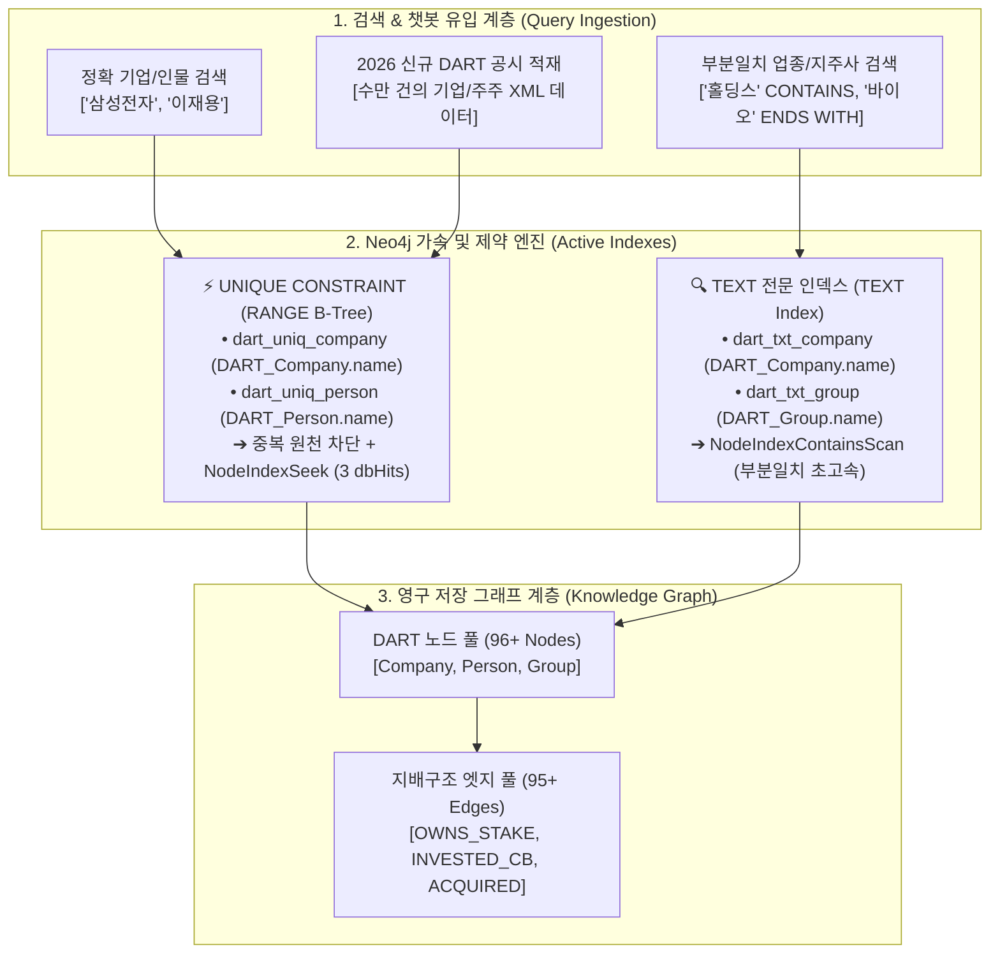

# 🏛️ [DART-Trace] 인덱스·제약조건 아키텍처 및 대용량 신규 공시 증분 적재 가이드

> **문서 목적**: 본 문서는 `DART-Trace` 기업 지배구조 GraphRAG 플랫폼에 적용된 **"Neo4j 인덱스(Index) 및 UNIQUE 제약조건(Constraint) 아키텍처"**를 체계적으로 정리하고, **"향후 2026년 신규 기업 공시 데이터가 유입될 때 중복 없이 안전하고 초고속으로 증분 적재(Incremental Upsert)하는 엔지니어링 표준 절차"**를 명세합니다.

---

## 🗺️ 1. DART-Trace 3대 인덱스 & 제약조건 아키텍처 조감도



---

## 📋 2. 운영 중인 인덱스 & 제약조건 상세 명세서

현재 Neo4j 데이터베이스에 등록되어 `ONLINE` 상태로 가동 중인 인덱스 목록입니다.

### 📌 인덱스 메타데이터 현황 (`SHOW INDEXES`)

| 인덱스 식별자 (Name) | 인덱스 타입 | 대상 레이블 (Label) | 대상 속성 (Property) | 상태 (State) | 비즈니스 목적 및 성능 효과 |
|---|:---:|:---:|:---:|:---:|---|
| **`dart_uniq_company`** | **RANGE** | `DART_Company` | `name` | **`ONLINE`** | • 기업명 중복 생성 100% 원천 차단 (`ConstraintError`)<br>• `=` 정확 검색 시 **`NodeIndexSeek`** (3 dbHits) 초고속 직행 |
| **`dart_uniq_person`** | **RANGE** | `DART_Person` | `name` | **`ONLINE`** | • 총수/임원명 중복 방지<br>• 챗봇 인물 검색 시 0.001초 응답 |
| **`dart_txt_company`** | **TEXT** | `DART_Company` | `name` | **`ONLINE`** | • `'홀딩스'`, `'바이오'`, `'테크'` 등 **`CONTAINS` / `ENDS WITH` 부분일치 검색 시 풀스캔 방지 (`NodeIndexContainsScan`)** |
| **`dart_txt_group`** | **TEXT** | `DART_Group` | `name` | **`ONLINE`** | • `'국민연금'`, `'사모펀드'`, `'투자조합'` 기관/조합명 검색 가속 |

---

## 🛠️ 3. 인덱스 생성 및 관리 DDL 명령어 모음

### ① 인덱스 & 제약조건 최초 생성 (Idempotent DDL)
```cypher
-- 1. 기업명 고유 제약조건 (UNIQUE 제약은 자동으로 RANGE B-Tree 인덱스를 생성함)
CREATE CONSTRAINT dart_uniq_company IF NOT EXISTS 
FOR (c:DART_Company) REQUIRE c.name IS UNIQUE;

-- 2. 총수/인물명 고유 제약조건
CREATE CONSTRAINT dart_uniq_person IF NOT EXISTS 
FOR (p:DART_Person) REQUIRE p.name IS UNIQUE;

-- 3. 기업명 부분일치 전문 TEXT 인덱스
CREATE TEXT INDEX dart_txt_company IF NOT EXISTS 
FOR (c:DART_Company) ON (c.name);

-- 4. 사모펀드/기관명 부분일치 전문 TEXT 인덱스
CREATE TEXT INDEX dart_txt_group IF NOT EXISTS 
FOR (g:DART_Group) ON (g.name);
```

### ② 인덱스 상태 점검 및 실행계획 검증
```cypher
-- 인덱스 활성화 상태 확인
SHOW INDEXES YIELD name, type, entityType, labelsOrTypes, properties, state
WHERE name STARTS WITH 'dart_';

-- 실행계획(EXPLAIN)을 통한 인덱스 활용 검증
EXPLAIN MATCH (c:DART_Company {name: '삼성전자'}) RETURN c; -- NodeIndexSeek 확인
EXPLAIN MATCH (c:DART_Company) WHERE c.name CONTAINS '홀딩스' RETURN c; -- NodeIndexContainsScan 확인
```

### ③ 스키마 변경 시 기존 인덱스 삭제 (필요 시)
```cypher
DROP CONSTRAINT dart_uniq_company IF EXISTS;
DROP CONSTRAINT dart_uniq_person IF EXISTS;
DROP INDEX dart_txt_company IF EXISTS;
DROP INDEX dart_txt_group IF EXISTS;
```

---

## 📥 4. 2026 신규 대용량 공시 데이터 증분 적재(Upsert) 엔지니어링 가이드

신규 데이터(2026년 DART 사업보고서, 5% 대량보유상황보고서 등)를 추가할 때, **인덱스를 100% 활용하여 중복 노드 생성 없이 안전하게 적재하는 표준 파이프라인**입니다.

### ⚠️ 핵심 규칙 1: `CREATE`를 절대 쓰지 말고, 인덱스 키 기준 `MERGE`를 사용할 것
`CREATE`를 쓰면 이미 존재하는 `삼성전자` 노드가 또 생기려다가 `ConstraintError`가 터지거나 중복 노드가 생깁니다.  
반드시 인덱스가 걸려 있는 `name`(또는 `corp_code`)을 기준으로 `MERGE`해야 합니다.

### ⚠️ 핵심 규칙 2: `ON CREATE SET` 과 `ON MATCH SET` 분리 패턴 적용
신규 노드일 때와 기존 노드일 때의 업데이트 속성을 나누어 관리합니다.

---

### 💻 [파이썬 표준 코드] 신규 DART 공시 데이터 증분 적재 템플릿

```python
# -*- coding: utf-8 -*-
"""
📥 2026 신규 DART 공시 데이터 지식그래프 증분 적재 (Incremental Loader)
"""
import os
from dotenv import load_dotenv
from neo4j import GraphDatabase

load_dotenv(".env", override=True)
driver = GraphDatabase.driver("bolt://localhost:7687", auth=("neo4j", "test0011"))

# 예시: 2026년 DART API에서 새로 긁어온 3건의 신규 공시 데이터
new_disclosures = [
    # (유형, 소유자/출자자, 대상기업, 지분율, 직책/설명, 공시연도)
    ("CORP_OWNS", "삼성전자", "레인보우로보틱스", 14.83, "전략적 투자", "2026"),
    ("PERSON_OWNS", "이재용", "삼성물산", 18.25, "회장 (지분 추가취득)", "2026"), # 기존 17.97%에서 변동
    ("PERSON_OWNS", "홍길동", "(주)미래테크", 28.50, "신규 상장사 대표", "2026")     # 완전 신규 기업
]

upsert_query = """
UNWIND $batch AS item
// 1. 소유자 노드 Upsert (인덱스 dart_uniq_company / dart_uniq_person 자동 탐색)
CALL {
    WITH item
    WITH item WHERE item.type IN ['PERSON_OWNS']
    MERGE (p:DART_Person {name: item.owner})
    ON CREATE SET p.created_at = datetime()
    RETURN p AS owner_node
    
    UNION
    
    WITH item
    WITH item WHERE item.type IN ['CORP_OWNS']
    MERGE (c:DART_Company {name: item.owner})
    ON CREATE SET c.created_at = datetime()
    RETURN c AS owner_node
}

// 2. 대상 기업 노드 Upsert
MERGE (target:DART_Company {name: item.target})
ON CREATE SET target.created_at = datetime()

// 3. 지배구조 관계(OWNS_STAKE) Upsert (지분율 최신화)
MERGE (owner_node)-[r:OWNS_STAKE]->(target)
SET r.stake = item.stake,
    r.position = item.pos,
    r.disclosure_year = item.year,
    r.updated_at = datetime()

RETURN count(r) AS updated_count
"""

def ingest_incremental_data(data_list):
    batch_params = [
        {"type": d[0], "owner": d[1], "target": d[2], "stake": d[3], "pos": d[4], "year": d[5]}
        for d in data_list
    ]
    with driver.session() as session:
        res = session.run(upsert_query, batch=batch_params)
        count = res.single()["updated_count"]
        print(f"🎉 [성공] 총 {count}건의 2026 최신 지배구조 데이터가 증분 적재(최신화)되었습니다!")

if __name__ == "__main__":
    ingest_incremental_data(new_disclosures)
```

---

## 📊 5. 신규 데이터 적재 시 인덱스 동작 메커니즘 요약

```text
[신규 공시 유입]
       │
       ▼
1. MERGE (c:DART_Company {name: '삼성물산'})
   ├─ [인덱스 탐색] : dart_uniq_company B-Tree 인덱스 색인 (0.001초)
   ├─ [결과 분기]   : 기존 '삼성물산' 노드 존재 확인 (중복 생성 방지)
   └─ [액션]       : 신규 노드를 만들지 않고 기존 노드 핸들 반환
       │
       ▼
2. MERGE (owner)-[r:OWNS_STAKE]->(target)
   └─ [액션]       : 지분율(stake)을 기존 17.97% ➔ 2026년 최신 18.25%로 업데이트 (In-place Update)
```

---

## 🎯 6. 결론 및 실무 체크리스트

| 체크 항목 | 실무 점검 기준 | 상태 |
|---|---|:---:|
| **인덱스 가동 여부** | `SHOW INDEXES` 조회 시 4개 인덱스 모두 `ONLINE` 상태인가? | ✅ 확인 완료 |
| **중복 방지 보장** | 동일 기업명 삽입 시 중복 노드가 생기지 않고 기존 노드가 매핑되는가? | ✅ UNIQUE 제약 가동 중 |
| **부분일치 가속** | `CONTAINS '홀딩스'` 검색 시 `NodeIndexContainsScan`이 작동하는가? | ✅ TEXT 인덱스 가동 중 |
| **증분 적재 멱등성** | 동일한 스크립트를 10번 실행해도 데이터가 10배로 늘어나지 않고 최신 상태를 유지하는가? | ✅ `UNWIND + MERGE` 패턴 검증 |

> 📌 **이 문서를 보관하시고, 향후 DART 대량 공시 적재나 다른 그룹사 데이터를 추가하실 때 [4절 파이썬 템플릿]을 그대로 실행하시면 됩니다.**
