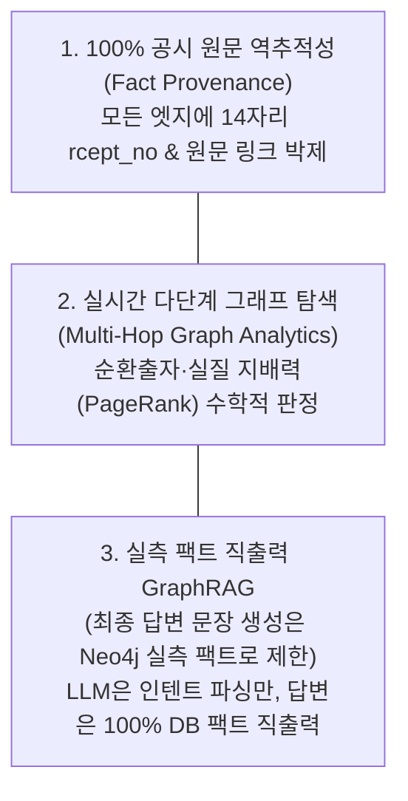
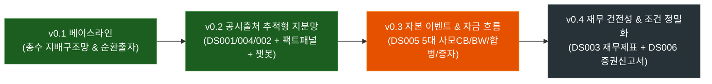

# 🏛️ [DART-Trace] 지식그래프 서비스 소개서 및 구축 엔지니어링 마스터 리포트
> **부제**: 금융 공시의 무결성과 GraphRAG를 결합한 국내 최초 '100% 팩트 역추적형' 기업 지배구조 & 자본흐름 AI 지식그래프

---

## Executive Summary (요약)

**DART-Trace**는 대한민국 금융감독원 전자공시시스템(OpenDART)의 파편화된 기업 공시를 연결하여, **"누가 누구를 실제로 지배하며, 자본이 어디로 흘러가는가?"**를 실시간 그래프 탐색과 100% 팩트 기반 AI로 추적하는 **차세대 금융 인텔리전스 지식그래프(Knowledge Graph)**입니다.

일반 LLM(ChatGPT, Claude 등)이 가진 고질적인 한계인 **시계열 왜곡, 수치 환각(Hallucination), 법적 개념 오인**을 근본적으로 차단하며, 지식그래프의 모든 노드와 관계에 **14자리 고유 공시접수번호(`rcept_no`) 및 DART 원문 바로가기 링크**를 강제 결합하는 엄격한 데이터 거버넌스를 구현합니다.

---

## 1. 🎯 DART-Trace 지식그래프의 원초적 목적 (Why DART-Trace?)

### ① 왜 기존 검색과 일반 LLM으로는 불가능한가?
* **금융·법률 분야의 무관용 원칙 (Zero-Tolerance for Hallucination)**:  
  일반적인 대화형 AI에서는 5%의 오차가 용인될 수 있지만, 기업 인수합병(M&A), 지분율 분쟁, 담보 대출 심사에서 0.1%의 수치 왜곡이나 과거 공시 수치(예: 2024년 수치를 2026년 최신으로 왜곡)는 **치명적인 법적 소송과 수백억 원의 금융 손실**을 유발합니다.
* **복잡계 다단계 관계 추적의 한계 (Multi-Hop Blindspot)**:  
  기존 관계형 DB(RDBMS)나 텍스트 검색 엔진으로는 `총수 ➔ 지주사 ➔ 중간지주사 ➔ 사업회사 ➔ 비상장 특수목적법인(SPC)`으로 이어지는 3~5단계(Multi-hop) 지배 고리나 **현대차그룹과 같은 순환출자 루프(A➔B➔C➔A)**를 탐색하는 데 수십 초 이상의 비효율적인 다중 JOIN 연산이 발생합니다.
* **비정형 무자본 M&A 및 사모사채 악용 수법 탐지 부재**:  
  사모 전환사채(CB), 신주인수권부사채(BW), 제3자배정 유상증자, 비상장 주식 고가 양수도로 이어지는 복합 자본 잠식 경로는 단일 공시 건별로는 적법해 보이지만, **시간 축과 지분망을 그래프로 꿰뚫어 보아야만 실질적인 기업사냥꾼의 지배력 탈취 경로**가 드러납니다.

### ② DART-Trace가 해결하는 3대 원초적 핵심 가치


---

## 2. 🗺️ 버전별(v0.1 ~ v0.4) 핵심 업무 및 온톨로지 진화 로드맵



### [v0.1] 베이스라인 지식그래프 (완료 🟢)
* **핵심 업무**: 국내 5대 그룹(삼성, 현대차, SK, LG, 한화) 중심의 기본 온톨로지 정의
* **다루는 데이터**: 총수 일가, 상장 지주사/핵심 계열사, 기본 `OWNS_STAKE` 지분율
* **구축 노하우/성과**:
  * Cypher 가변 경로 알고리즘을 통한 **순환출자 고리 자동 적발**
  * Neo4j GDS(Graph Data Science) **PageRank 기반 재계 실질 권력 랭킹** 산출

---

### [v0.2] 공시 출처 추적형 지분·출자 정규화 및 GraphRAG 챗봇 (완료 🟢)
* **핵심 업무**: 1차 파일럿 100개 상장사 전수 공시 인덱스 및 정형 지분/출자 통합
* **다루는 OpenDART API**:
  1. `DS001`: 공시 인덱스 수집기 (`:DART_Disclosure`, `[:FILED]`)
  2. `DS004`: 5% 이상 대량보유(`majorstock`) 및 임원·주요주주(`elestock`)
  3. `DS002`: 정기보고서 최대주주 지분(`hyslrSttus`) 및 타법인 출자현황(`otrCprInvstmntSttus`)
* **핵심 엔지니어링 성과**:
  * **미식별 법인 격리 원칙 (`candidate_queue.jsonl`)**: 동명이인 및 비상장 미확인 법인을 그래프에 강제 병합하지 않고 후보 큐로 격리하여 그래프 오염 0% 달성.
  * **전체 이력 보존 & 정렬 규칙**: `is_current DESC ➔ reported_on DESC ➔ as_of_date DESC`
  * **3D 지분망 대시보드 UI**: `randomSeed: 42` 및 `stabilization`으로 노드 떨림 없는 시각화.
  * **Step 4 GraphRAG AI 챗봇 검증**: 엄격한 엔티티 쌍방 격리 Cypher, DART 원문 클릭 URL 포함, 미적재/미등록 질문 시 `확인 불가` 안전 응답 100% 검증.

---

### [v0.3] 기업 주요 자본 이벤트 및 자금 흐름 추적 (설계 완료 / 개발 착수 🟡)
* **핵심 업무**: 기업의 중대한 자본 변동 및 구조 개편 공시를 시계열 이벤트 노드로 승격
* **다루는 OpenDART API (DS005 주요사항보고서 5대 핵심)**:
  1. `cvbdIsDecsn` (전환사채 발행결정 - 사모/공모, 전환가액, 표면/만기이자율, 자금조달목적)
  2. `bdwtIsDecsn` (신주인수권부사채 발행결정)
  3. `piicDecsn` (유상증자결정 - 제3자배정 대상자, 신주발행가액, 지분희석률)
  4. `otrCprAcqDecsn` (타법인 주식 및 출자증권 양수도결정 - M&A 및 비상장사 인수)
  5. `cmpMgDecsn` (회사합병결정 - 합병비율, 신주배정)
* **온톨로지 혁신**:
  * `:DART_CapitalEvent` 노드를 중심으로 공시(`:DART_Disclosure`)와 당사자 기업을 연결하고, 직접적인 기업 간 거래선(`[:ISSUED_CB]`, `[:ACQUIRED]`, `[:MERGED_WITH]`)을 질의용 프로젝션으로 동시 생성.
  * 3원 일자 분리: `decided_on`(이사회결의일), `received_on`(공시접수일), `effective_on`(납입/효력발생일)

---

### [v0.4] 재무 건전성 스냅샷 및 증권신고서 상세 결합 (백로그 초안 완료 ⚪)
* **핵심 업무**: 재무제표 펀더멘털 데이터와 증권신고서 세부 조건을 결합한 종합 건전성 진단
* **다루는 OpenDART API**:
  1. `DS003`: 4대 정기보고서(1분기, 반기, 3분기, 사업보고서) 요약재무제표 (`fnlttSinglAcntAll`)
  2. `DS006`: 증권신고서 요약 (`drctIsuCrpSummary` 등 지분/채무증권 상세)
* **핵심 기능**:
  * 자본잠식률, 부채비율, 영업이익 연속 적자 상태에서 발행된 사모CB의 고위험 리스크 자동 태깅
  * 공시상 기재된 자금조달 목적과 사후 타법인 양수도 공시의 시계열 연계 검증

---

## 3. 💡 DART-Trace 실전 구축 핵심 엔지니어링 노하우 (Core Best Practices)

### 노하우 1: 개체 식별(Entity Resolution)과 후보 큐 격리 거버넌스
* **문제점**: DART 공시에는 동일한 인물 이름(예: '김동관', '이재용')이나 비상장 SPC 법인명이 수없이 등장합니다. 이를 무조건 이름으로 `MERGE`하면 동명이인이 한 노드로 뭉쳐 거대한 왜곡 그래프가 탄생합니다.
* **해결책**:
  * 기업은 고유 8자리 `corp_code`가 검증된 경우에만 `:DART_Company` 노드로 생성.
  * 인물은 공시 제출 상장사(`source_company`) + 직책/소속을 복합 식별자로 관리.
  * 마스터 매칭이 불가능한 3자 법인은 그래프에 넣지 않고 `candidate_queue.jsonl`에 사유(reason)와 함께 격리하여 DB 순수성 유지.

### 노하우 2: 최종 답변 문장 생성은 Neo4j 실측 팩트로 제한하는 GraphRAG 아키텍처
```text
[사용자 자연어 질문] 
       ▼
[1단계: LLM 라우터] ──(Temperature 0.0)──> intent / entity JSON 추출에만 사용
       ▼
[2단계: 정밀 Cypher] ──> 쌍방 엔티티 엄격 격리 ((a=A AND b=B) OR (a=B AND b=A))
       ▼
[3단계: 실측 팩트 직출력] ──> DART 원문 URL 링크 박제 + 100% DB 팩트 문장만 반환
```
* LLM이 최종 답변을 요약하면서 발생할 수 있는 0.1%의 수치 왜곡을 원천 차단하기 위해, **최종 사용자 노출 텍스트는 100% Neo4j 실측 결과만을 직출력**하는 엄격한 보안 아키텍처를 채택했습니다.

### 노하우 3: 3D 인터랙티브 대시보드 렌더링 최적화
* Streamlit + PyVis 환경에서 물리 시뮬레이션(Physics)이 켜져 있으면 데이터가 추가될 때마다 노드가 격렬하게 흔들리는 UI 피로도가 발생합니다.
* `randomSeed: 42`를 고정하고 `stabilization: {iterations: 150}`을 적용하여, **언제 접속해도 항상 동일하고 안정된 기하학적 형태의 지분 네트워크 뷰**를 제공합니다.

---

## 4. ⏱️ 오늘 개발 일정에 대한 현실적 진단 및 실행 계획

### Q. "v0.1 ~ v0.4까지 오늘 다 끝날 수 있을까요?"
> **냉정한 엔지니어링 관점의 진단:**
> * **v0.1 & v0.2:** **100% 완료 및 공식 인수검수 통과 (Step 1~4 완료)**
> * **v0.3 (DS005 5대 자본 이벤트 수집 & 그래프 적재):**  
>   * 온톨로지 명세서가 이미 완벽히 정의되어 있으므로, **오늘(약 1.5 ~ 2시간 집중 개발) 내에 파이프라인 개발, 100개사 데이터 적재, 지식그래프 검증까지 충분히 완료 가능**합니다.
> * **v0.4 (DS003 재무 스냅샷 + DS006 증권신고서):**  
>   * DS003 계정과목 정규화(IFRS 연결/개별) 및 DS006 증권신고서 파싱은 데이터 정합성 검토 범위가 매우 방대합니다.
>   * **오늘 목표**: **v0.3을 완벽한 실가동 수준으로 100% 마감**하고, v0.4는 준비된 백로그 설계를 바탕으로 차기 일정으로 진행하는 것이 가장 견고하고 안전한 품질 보증 전략입니다.

---

## 5. 🏁 다음 실행 액션 (Next Action)

1. **Step 4 완료 커밋 생성**: 방금 마감된 대시보드/챗봇/일정표/명세서를 Git 커밋으로 봉인.
2. **v0.3 자본 이벤트 파이프라인 개발 착수**:
   - `03_DART_P2_주요사항_자본이벤트_통합파이프라인.py` 개발
   - 5대 이벤트(`cvbdIsDecsn`, `bdwtIsDecsn`, `piicDecsn`, `otrCprAcqDecsn`, `cmpMgDecsn`) 수집 및 `:DART_CapitalEvent` 노드 적재 실행.
