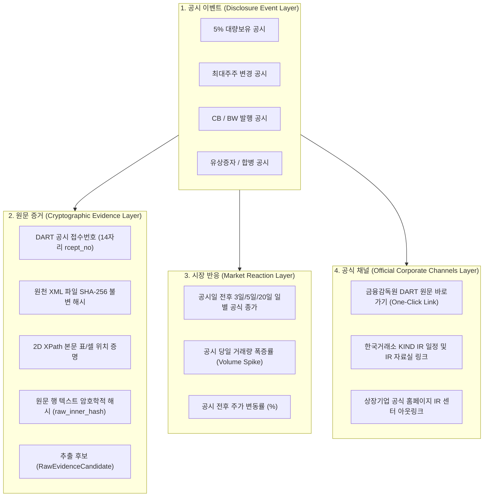

# 🏛️ [DART-Trace] 한국 상장사 이벤트 지식그래프 아키텍처 및 데이터 거버넌스 명세서

> **문서 버전**: v1.0  
> **최초 제정 일시**: 2026-09-03 24:05 (KST)  
> **공식 서비스 명칭**: **DART-Trace (한국 상장사 이벤트 지식그래프)**  
> **플랫폼 슬로건**: *"공시 원문, 공식 기업 채널, 시장 반응을 근거 중심으로 연결하는 이벤트 리서치 지식그래프"*  
> **표준 거버넌스 규격**: Strict Cryptographic Provenance & 4-Tier Data Compliance

---

## 1. 플랫폼 정의 및 수립 배경 (Vision & Motivation)

### 1.1 기존 금융 데이터 및 시각화의 근본적 한계
1. **단순 지분율 시각화의 한계**:  
   많은 지식그래프 프로젝트가 "A사가 B사 지분을 X% 가지고 있다"는 단편적인 정적 사실만을 표현합니다. 하지만 투자자와 분석가가 실제 궁금해하는 것은 **"공시가 나온 날 전후로 어떤 이벤트가 벌어졌고, 시장은 어떻게 반응했는가?"**입니다.
2. **AI의 치명적인 금융 환각(Hallucination)**:  
   일반 생성형 AI(ChatGPT 등)는 금융 공시 수치를 물었을 때 그럴듯한 거짓 숫자나 오래된 뉴스를 조합해 허위 정보를 생성합니다.
3. **고가 엔터프라이즈 터미널의 높은 장벽**:  
   에프앤가이드(FnGuide) 등 전문 금융 벤더는 연간 수천만 원대의 B2B 유료 터미널을 통해서만 데이터를 제공하여 일반 개인 투자자, 소액주주 연대, 스타트업 리서처는 접근할 수 없습니다.

### 1.2 DART-Trace의 핵심 가치 제안 (Value Proposition)
> **"수천만 원짜리 B2B 터미널 없이도, 웹 브라우저에서 상장사 공시 이벤트의 원문 증거(SHA-256/XPath), 시장 반응, 공식 기업 채널을 3초 만에 원클릭으로 입체 역추적하는 무료 공개 리서치 플랫폼"**

---

## 2. 4대 핵심 정보 레이어 아키텍처 (Layered Architecture)

DART-Trace는 개별 공시를 분리된 문서로 보지 않고, 4개의 입체적 레이어로 연결하여 완결된 맥락을 제공합니다.



---

## 3. 4단계 데이터 신뢰성 등급제 및 컴플라이언스 규정 (Data Governance)

데이터의 법적 성격과 신뢰도 수준을 명확히 구분하여, 저작권 침해나 법적 과도 해석을 원천 방지합니다.

| 등급 | 구분 명칭 | 대상 데이터 및 소스 | 취급 및 보존 정책 | 법적·컴플라이언스 경계 |
|:---:|:--- |:--- |:--- |:--- |
| **A급** | **공식 사실<br>(Primary Facts)** | • 금융감독원 OpenDART 공시 원문<br>• 한국거래소 KIND 상장공시시스템<br>• KRX 공식 공시/IR 원천 데이터 | • 원문 XML 무결성 SHA-256 보존<br>• 2D XPath 및 행 해시 결속<br>• 증거 계층 격리 적재 | • 100% 공공 사실 데이터<br>• 환각 제로(Zero Hallucination) 증빙 |
| **B급** | **기업 공식 채널<br>(Company Channels)** | • 상장사 공식 IR 홈페이지 링크<br>• 기업 공식 실적발표회 자료<br>• 기업 공식 배포 보도자료 | • 원천 URL 및 메타데이터 보존<br>• 최신 공식 IR 채널 1:1 매핑 | • 기업의 공식 대외 입장으로 한정<br>• 주관적 해석 배제 |
| **C급** | **참조 미디어<br>(Referenced Media)** | • 언론사 뉴스 기사 헤드라인<br>• 언론사 기사 원문 아웃링크 | • **기사 본문 전문 무단 수집·재배포 엄격 금지**<br>• 저작권 준수 헤드라인 및 URL만 제공 | • 저작권법 준수<br>• 단순 참조용 링크로만 작동 |
| **시세** | **시장 반응<br>(Market Data)** | • 공시일 전후 일별 종가·거래량 변동률 | • [KRX 데이터 마켓플레이스](https://data.krx.co.kr/) 정책 준수<br>• [KRX 이용정책](https://data.krx.co.kr/inc/datasale/Market%20Data%20Usage%20Polices_ko.pdf) 범위 내 공식 일별 종가만 사용 | • 실시간 호가/체결 데이터 재배포 금지<br>• 이벤트 분석용 일별 집계 통계로 제한 |

---

## 4. 실무 리서치 사용자 시나리오 (End-to-End User Journey)

사용자는 DART-Trace의 단일 화면에서 아래와 같은 입체적 분석을 3초 만에 완료할 수 있습니다:

```text
[사용자 질문 시나리오]
"파인메딕스에서 5% 공시가 나온 날, 누가 보유자로 기재됐고,
 원문 근거는 무엇이며, KIND IR 일정과 공시 전후 주가·거래량은 어떻게 움직였나?"
```

1. **[1단계: 공시 및 원문 증거 확인]**:
   - 공시 접수번호: `20241231000388` (클릭 시 DART 전자공시 본문 즉시 새 창 열림)
   - 보고자: `전성우` / 보유자: `오희숙` (보고자와 보유자의 주체 분리 보존 확인)
   - 보유 내역: 94,100주 (1.67%)
   - 원문 증거: 행 해시 `abcb57e7...` 및 XPath `/DOCUMENT/BODY/TABLE[3]/TR[2]`로 100% 증빙
2. **[2단계: 시장 반응 대조]**:
   - 보고의무발생일(`2024-12-26`) ➔ 공시접수일(`2024-12-31`)
   - 공시 당일 전후 거래량 폭증률 및 일별 종가 변동 추이 차트 확인
3. **[3단계: 공식 기업 채널 확장]**:
   - 한국거래소 KIND 파인메딕스 상장법인 상세정보(IR 일정 및 IR 자료실) 확인
   - 파인메딕스 공식 홈페이지 IR 센터 바로가기

---

## 5. 단계별 정합 로드맵 (Execution Roadmap)

과도한 기술적 비약 없이, 2일 안에 실질적인 MVP(v1.0)를 완성하고 순차적으로 확장합니다.

```text
  [v1.0: DART 공시 원문 증거 탐색 플랫폼 (모레 완성)]
   • Day 1 (내일 최우선): 2,138개사 대상 약 15,000건 3차 대량 수집 ➔ 종료 감사 ➔ 백업 ➔ Raw 증거 적재
   • Day 2 (모레 완성): 메뉴 2(GraphRAG 챗봇)에 Raw 증거 자연어 탐색 연동 ➔ 메뉴 6 근거 화면 드릴다운 연동
                       👉 공시 원문 증거 탐색기 v1.0 정식 릴리즈

  [v1.1: 경제적 보유 사실 정규 승격]
   • 7대 엄격 가드 (마스터 실체 조회, 3자 일치, 행 실체 대조, fallback 배제) 승격 엔진 구축
   • 검증 통과 건만 :HOLDS_ECONOMIC_STAKE 승격 및 영수증 매니페스트 발행
   • 기업별 공시 이벤트 통합 타임라인 UI

  [v1.2: 시장 반응 및 공식 채널 결합]
   • 한국거래소 KIND IR 일정/자료실 아웃링크 및 기업 공식 IR 홈페이지 매핑
   • 공시일 전후 일별 종가·거래량 변동률 결합 (KRX 마켓플레이스 라이선스 준수)
   • 챗봇에서 "공시 후 주가와 거래량 반응 보여줘" 자연어 질의 지원

  [v2.0: 심화 분석 및 인프라 자동화 (백로그)]
   • Day 34 GDS 인메모리 군집 후보, 유사 후보, 최단 경로 스트리밍 연동
   • 15,000건 원문 AWS S3 / Cloudflare R2 클라우드 보관 및 GitHub Actions 24/7 자동화
```

---

## 6. 결론 및 향후 행동 지침

1. **정직성 원칙**: 검증되지 않은 가공 수치를 "완전한 지배력(`OWNS_STAKE`)"으로 포장하지 않으며, 항상 **원문 XML 해시와 2D XPath가 결속된 '원시 증거'**를 우선 제공한다.
2. **저작권 및 라이선스 준수**: 기사 전문의 무단 크롤링을 일절 배제하고, 공식 공시(A급), 공식 IR(B급), 허용된 시세 집계 데이터만을 결합하여 지속 가능한 데이터 거버넌스를 유지한다.
3. **사용자 가치 최우선**: 개인 투자자와 금융 리서처가 고가의 데이터 터미널 없이도 팩트 기반의 투명한 기업 분석을 수행할 수 있도록 개방성과 신뢰성을 견지한다.
