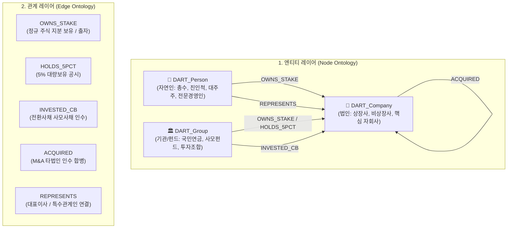

# 🏛️ [DART-Trace] 지식그래프 온톨로지(Ontology) & 데이터 구조 명세서

> **문서 버전**: v2.4 (최신)  
> **기준 일자**: 2026-08-31  
> **문서 목적**: DART-Trace 지식그래프의 데이터 스키마, 온톨로지 설계 근거, 노드/관계 명세, Cypher 쿼리 작성 및 신규 기업 등록 가이드라인 표준화

---

## 1. 🎯 온톨로지(Ontology) 설계 근거 및 배경

대한민국 상법, 자본시장법 및 금융감독원 전자공시시스템(OpenDART)의 법적 규제 체계를 1:1 그래프 데이터 모델로 추상화하였습니다.



### 💡 왜 3대 노드(Person, Company, Group)로 분리했는가?
1. **`DART_Person` (자연인)**: 의결권 행사 주체이자 최종 소유주(Ultimate Beneficial Owner, UBO). 상속·증여 및 세금 납부의 주체.
2. **`DART_Company` (법인)**: 상장(코스피/코스닥/코넥스) 및 비상장 사업체. 법인세 납부 및 배당금 수령 주체.
3. **`DART_Group` (기관/펀드)**: 국민연금(NPS), 사모펀드(PEF), 경영참여형 투자조합. 법인과 달리 LP/GP 구조로 움직이며 대량보유(5% 룰) 및 M&A 세력 식별의 핵심.

---

## 2. 📋 노드 스키마 (Node Schema) 상세 명세

| 노드 라벨 (Label) | 속성명 (Property) | 데이터 타입 | 필수 여부 | 설명 및 예시 값 |
|---|---|---|---|---|
| **`DART_Company`** | `name` | String | **PK (Unique)** | 기업명 (예: `삼성전자`, `가비아`, `현대모비스`) |
| | `stock_code` | String | 선택 | 6자리 거래소 종목코드 (예: `005930`, `00506294`) |
| | `corp_code` | String | 필수 | OpenDART 고유 8자리 번호 (예: `00126380`) |
| | `market` | String | 필수 | 시장구분 (`KOSPI`, `KOSDAQ`, `KONEX`, `UNLISTED`) |
| | `corp_cls` | String | 필수 | 금감원 법인구분 (`Y`: 코스피, `K`: 코스닥, `N`: 코넥스) |
| | `is_listed` | Boolean | 필수 | 상장 여부 (`true`, `false`) |
| | `updated_at` | DateTime | 선택 | 최근 동기화 일시 |
| **`DART_Person`** | `name` | String | **PK (Unique)** | 인물명 (예: `이재용`, `정의선`, `김홍국`) |
| | `updated_at` | DateTime | 선택 | 최근 업데이트 일시 |
| **`DART_Group`** | `name` | String | **PK (Unique)** | 기관/조합명 (예: `국민연금공단`, `MBK파트너스`) |
| | `type` | String | 선택 | 펀드 분류 (`NPS`, `PEF`, `INVESTMENT_UNION`) |

---

## 3. 🔗 관계(Edge) 스키마 상세 명세

모든 지분 관계는 **소유자(Source) ➔ 투자 대상(Target)** 방향으로 연결됩니다.

| 관계 타입 (Edge Type) | 관계 속성 (Properties) | 타입 | 설명 및 비즈니스 의미 |
|---|---|---|---|
| **`OWNS_STAKE`** | `stake` | Float | **보유 지분율(%)** (예: `18.25`, `21.64`) |
| | `position` | String | **직책 또는 주주 관계** (예: `회장`, `최대주주`, `친인척`) |
| | `year` | Integer | **공시 회계연도** (예: `2021`, `2023`, `2024`, `2025`) |
| | `raw_file_path` | String | 출처 로컬/S3 파일 경로 (팩트 검증용) |
| | `updated_at` | DateTime | 데이터 적재 일시 |
| **`HOLDS_5PCT`** | `stake` | Float | 5% 대량보유 지분율 (예: `7.68`, `5.42`) |
| | `purpose` | String | 보유 목적 (`경영참여`, `단순투자`, `일반투자`) |
| **`INVESTED_CB`** | `stake` | Float | 전환 시 잠재 지분율 |
| | `volume` | String | 사모사채 발행 규모 (예: `300억`) |
| **`ACQUIRED`** | `stake` | Float | 인수 지분율 (예: `55.0`, `100.0`) |
| | `amount` | String | 인수 대금 (예: `1조2500억`) |
| **`REPRESENTS`** | `relation` | String | 대표이사 또는 친인척 관계 (예: `처남`, `대표이사`) |

---

## 4. 💻 Cypher 쿼리 표준 작성 가이드 (검색 & 개발용)

### 📌 패턴 1: 3D 인터랙티브 그래프로 시각화할 때 (반드시 `a`, `b`, `r` 반환)
```cypher
MATCH (a)-[r:OWNS_STAKE]->(b)
WHERE r.stake >= 15.0
RETURN a, b, properties(r) AS r_props, type(r) AS r_type
LIMIT 35
```

### 📌 패턴 2: 코스닥(KOSDAQ) 기업들만 조회할 때
```cypher
MATCH (c:DART_Company)
WHERE c.market = 'KOSDAQ'
RETURN c.name AS 코스닥_기업명, c.stock_code AS 종목코드
LIMIT 50
```

### 📌 패턴 3: 순환출자 3-Hop 루프 탐색
```cypher
MATCH path = (a:DART_Company)-[:OWNS_STAKE*3]->(a)
RETURN [n IN nodes(path) | n.name] AS 순환루프_기업목록,
       [r IN relationships(path) | r.stake] AS 연결_지분율
```

### 📌 패턴 4: 특정 오너(예: 이재용)의 직·간접 2-Hop 지배망
```cypher
MATCH (owner:DART_Person {name: '이재용'})-[r1:OWNS_STAKE]->(core:DART_Company)-[r2:OWNS_STAKE]->(sub:DART_Company)
RETURN owner.name AS 총수, core.name AS 지주사, r1.stake AS 1차지분, sub.name AS 자회사, r2.stake AS 2차지분
```

---

## 5. 📥 신규 기업 및 지분 등록 가이드 (MERGE 멱등성 보장)

새로운 상장사 또는 지분을 수기/배치로 등록할 때는 반드시 **`MERGE` 구문**을 사용하여 중복 생성을 원천 차단합니다:

```cypher
// 1. 기업 노드 등록 (Unique 보장)
MERGE (c:DART_Company {name: '안랩'})
ON CREATE SET 
    c.stock_code = '053800',
    c.corp_code = '00259837',
    c.market = 'KOSDAQ',
    c.corp_cls = 'K',
    c.is_listed = true,
    c.updated_at = datetime();

// 2. 지분 관계 등록 (연도별 멱등성 보장)
MERGE (owner:DART_Person {name: '안철수'})
MERGE (target:DART_Company {name: '안랩'})
MERGE (owner)-[r:OWNS_STAKE {year: 2024}]->(target)
SET r.stake = 18.60,
    r.position = '최대주주',
    r.raw_file_path = '내작업폴더/data/dart_raw_filings/안랩_2024_최대주주지분현황_OpenDART.json',
    r.updated_at = datetime();
```

---

## 6. 📊 인프라 및 저장소 매핑 현황

```text
[데이터 스토리지]
├── Neo4j Graph DB      : bolt://localhost:7687 (4,065개 노드 / 264건 팩트 관계)
├── 원본 JSON/TXT 저장소 : 내작업폴더/data/dart_raw_filings/ (금감원 팩트 아카이브)
└── 웹 프론트엔드 대시보드 : http://localhost:8501 (Streamlit + PyVis 3D 엔진)
```
