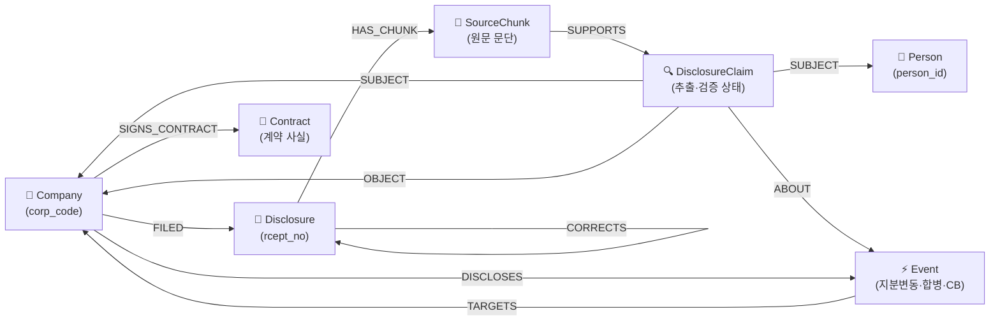

# 🏛️ [DART-Trace] 지식그래프 온톨로지(Ontology) & 데이터 구조 명세서

> **문서 버전**: `v0.1` (공식 기준선)  
> **기준 일자**: 2026-08-31  
> **문서 목적**: OpenDART 1차 공시 데이터에 기반한 지식그래프 데이터 스키마, 온톨로지 설계 근거, 노드/관계 명세 및 단계적 고도화 표준 가이드라인 정립  
> **버전 관리 원칙**:
> 1. 현재 구축된 실제 시스템 기준선을 **`v0.1`**로 공식 지정합니다.
> 2. 향후 기능 확장 및 배포 시 **`0.1` 단위로 버전이 증가**합니다 (`v0.2`, `v0.3`...).
> 3. **모든 신규 버전 작업은 사전에 상세 계획을 보고하고, 사전 승인을 득한 후 실행합니다.**

---

## 1. 🎯 온톨로지(Ontology) 설계 철학 및 포지셔닝

기존 지분관계 결과에 **공시 출처·기준일·검증 상태**를 덧붙여, 사용자가 **“지분율이 얼마인가”뿐 아니라 “어느 공시의 어떤 기준일 정보인가, 이후 정정되었는가”까지 투명하게 되짚어 갈 수 있는 팩트 탐색 그래프**를 지향합니다.



> **핵심 원칙**:
> * **"모든 공시는 검토 대상 문서(Disclosure)이며, 실제 본문과 XBRL에서 검증된 경우에만 이벤트(Event) 또는 사실(OWNS)로 승격된다."**
> * D001(대량보유상황보고), D002(임원·주요주주의 특정증권등 소유상황보고) 공시 검색 결과는 곧바로 지분 관계가 되지 않고, 먼저 `Disclosure` 노드로 인덱싱된 후 파싱을 통해 `DisclosureClaim` ➔ 검증 후 `OWNS` 관계로 단계적으로 승격됩니다.

---

## 2. 📋 7대 핵심 노드 (7 Core Nodes) 스키마

| 노드 라벨 (Label) | 고유 식별자 (PK) | 역할 및 설명 | 주요 속성 (Properties) |
|---|---|---|---|
| **`Company`** | `corp_code` (8자리) | 공시 제출 기업 및 피출자/합병 상대 법인 | `corp_code`, `name`, `stock_code`(6자리), `market`(`KOSPI`/`KOSDAQ`/`KONEX`), `corp_cls`(`Y`/`K`/`N`), `is_listed` |
| **`Person`** | `person_id` (고유UUID) | 총수, 친인척, 주요 경영진, 주주 (동명이인 자동 병합 금지) | `person_id`, `name`, `birth_ym`, `updated_at` |
| **`Disclosure`** | `rcept_no` (14자리) | OpenDART 공시검색 API가 제공하는 공시 문서 인덱스 | `rcept_no`, `report_nm`, `rcept_dt`, `corp_code`, `corp_name`, `flr_nm`, `rm`, `doc_status`(`NORMAL`/`CORRECTED`/`WITHDRAWN`), `viewer_url`, `ingested_at` |
| **`SourceChunk`** | `chunk_id` (`rcept_no`+`_`+`sec_id`) | 공시 원문 텍스트 내 근거 문단/표 블록 | `chunk_id`, `rcept_no`, `section_title`, `text_content`, `table_json` |
| **`DisclosureClaim`** | `claim_id` (고유UUID) | 파서/LLM이 원문에서 추출한 미검증/후보 주장 | `claim_id`, `claim_type`, `raw_value`, `confidence_score`, `verification_status`(`CANDIDATE`/`VERIFIED`/`REJECTED`) |
| **`Event`** | `event_id` (고유UUID) | 지분변동, 합병·분할, 사모CB 발행, 대규모 내부거래 등 검증된 사건 | `event_id`, `event_type`, `effective_date`, `amount`, `status` |
| **`Contract`** | `contract_id` (고유UUID) | 계약금액, 상대방, 계약기간이 핵심인 주요 계약 사실 | `contract_id`, `contract_name`, `amount`, `counterparty`, `start_dt`, `end_dt` |

---

## 3. 🏷️ 이중 상태 관리 체계 (검증 상태 vs 문서 이력 상태)

단일 상태 플래그의 한계를 방지하기 위해 **[사실 검증 상태]**와 **[공시 문서 이력 상태]**를 명확히 분리하여 관리합니다. (예: `✅ 검증완료`이면서 동시에 `⚠️ 정정본`일 수 있음)

### ① 사실 검증 상태 (`verification_status`)
| 상태값 | 의미 및 비즈니스 기준 |
|---|---|
| **`VERIFIED`** | 원문 근거와 스키마 검증을 통과하여 신뢰 가능한 사실로 확정된 상태 |
| **`CANDIDATE`** | 공시 원문에서 추출되었으나 아직 교차 검증 또는 검토 전인 후보 상태 |
| **`REJECTED`** | 파싱 오차나 불일치로 인해 사실 관계 승격이 기각된 상태 |

### ② 문서 이력 상태 (`doc_status` / `document_history`)
| 상태값 | 의미 및 비즈니스 기준 |
|---|---|
| **`NORMAL`** | 최초 공시본으로 정정/철회 이력이 없는 일반 상태 |
| **`CORRECTED`** | 해당 공시가 기재정정본이거나, 이후 정정 공시가 제출된 이력이 있음 |
| **`WITHDRAWN`** | 철회된 공시로, 최신 유효 사실 조회 대상에서 자동 제외 |

---

## 4. 🔗 검증 완료된 지분 관계 (OWNS) 및 Cypher 조회 표준

검증을 통과한 지분 관계는 출처 공시번호(`source_rcept_no`), 공시일(`disclosed_at`), 기준일(`as_of_date`)을 속성으로 유지합니다.

```cypher
// 📌 검증된 지분 관계 표준 생성 구조 (예시 템플릿)
(owner:Person | Company)-[:OWNS {
    shares_pct: 21.85,
    as_of_date: date("2024-12-31"),
    disclosed_at: date("2025-03-21"),
    source_rcept_no: "20250321000854",
    claim_id: "claim-sample-01",
    verification_status: "VERIFIED",
    doc_status: "CORRECTED",
    viewer_url: "https://dart.fss.or.kr/dsaf001/main.do?rcpNo=20250321000854"
}]->(target:Company)
```

### 💻 Cypher 표준 안전 조회 쿼리 (미검증/검증 분리)
```cypher
// 검증 완료된 최신 유효 지분 관계만 안전 조회
MATCH (a)-[r:OWNS]->(b:Company)
WHERE r.verification_status = 'VERIFIED'
  AND (r.doc_status IS NULL OR r.doc_status <> 'WITHDRAWN')
RETURN a.name AS 주주, 
       b.name AS 대상기업, 
       r.shares_pct AS 지분율, 
       r.as_of_date AS 기준일, 
       r.source_rcept_no AS 근거공시접수번호,
       r.viewer_url AS 원문링크
LIMIT 50
```

---

## 5. 🖥️ 프론트엔드(FO) UX 단계적 고도화 원칙

1. **팩트 상세 패널 (Fact Detail Panel)**:
   * 3D 그래프 툴팁 내부에서 링크를 클릭하는 불편한 UX 대신, **노드 또는 지분 화살표를 클릭하면 화면 우측 패널에 공시명, 기준일, 접수번호, [DART 원문 열기] 버튼이 안정적으로 노출**되도록 구성합니다.
2. **원문 추적성 제공**:
   * 모든 수치와 관계 옆에 `rcept_no` 기반 금감원 전자공시 뷰어(`https://dart.fss.or.kr/dsaf001/main.do?rcpNo=...`) 직접 연결 버튼을 제공합니다.
3. **이중 배지 표기**:
   * `[✅ 검증 완료]` 및 `[⚠️ 정정 공시 반영]` 배지를 분리하여 직관적으로 정보의 신뢰성과 변경 이력을 전달합니다.

---

## 6. 🗂️ 버전별 마일스톤 현황

```text
┌─────────────────────────────────────────────────────────────────────────┐
│ [현재 상태] v0.1 (Baseline - 2026-08-31)                                 │
│  • 대한민국 상장사 3,988개 전수 적재 (Company 노드 / KOSPI·KOSDAQ 태깅 완료)│
│  • 10대 그룹 기초 OWNS_STAKE 및 순환출자 3D 그래프 & Table View 구현   │
│  • 테마 시스템 (화이트/다크), Cypher 직접 실행 에디터 완비                │
├─────────────────────────────────────────────────────────────────────────┤
│ [차기 계획] v0.2 (예정 - 사전 보고 및 승인 후 착수)                      │
│  • OpenDART 공시검색 연동 ➔ Disclosure 노드 인덱싱                       │
│  • P1 공시(D001 대량보유, D002 임원·주요주주 소유상황) 파서 구축         │
│  • 우측 [팩트 상세 패널] 및 DART 원문 뷰어 링크 연동                    │
│  • 검증 상태(VERIFIED) 및 문서 이력(CORRECTED) 이중 배지 적용            │
├─────────────────────────────────────────────────────────────────────────┤
│ [향후 계획] v0.3 (예정)                                                 │
│  • SourceChunk 및 DisclosureClaim 미검증/검증 파이프라인 완성           │
│  • CORRECTS 정정공시 체인 추적 및 데이터 커버리지 헬스체크 탭 탑재       │
└─────────────────────────────────────────────────────────────────────────┘
```
