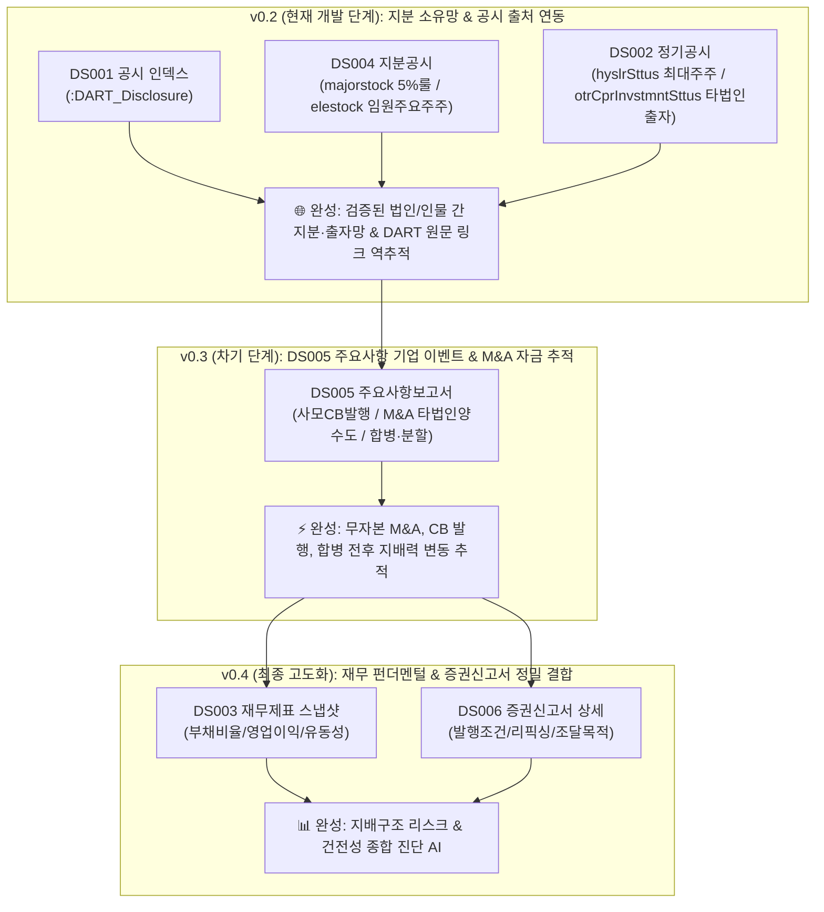

# 🏛️ [DART-Trace] 지식그래프 온톨로지(Ontology) & 데이터 구조 명세서 (v0.2)

> **문서 버전**: `v0.2` (공식 릴리즈 명세서)  
> **상태**: 🟢 **개체 식별 및 정형 API 규격 최종 확정 (Ready for Implementation)**  
> **작성 일자**: 2026-08-31  
> **선행 버전**: `v0.1` (기존 베이스라인 완료)  
> **v0.2 핵심 범위**: **`DS001` (공시 인덱스) + `DS004` (지분공시) + `DS002` (최대주주 및 타법인출자)**  
> **비즈니스 목표**: OpenDART 제공 범위 안에서, `corp_code` 또는 검증된 법인명 매칭이 완료된 지분·출자 사실을 공시번호까지 역추적하는 **공시 출처 추적형 지식그래프 구축**

---

## 1. 🗺️ 전체 버전별 데이터 확장 마스터 로드맵



---

## 2. 🎯 v0.2 아키텍처 및 개체 식별(Entity Resolution) 정책

v0.2는 정형 OpenDART API를 우선 수집·정규화하되, 동명이인 및 비식별 법인에 의한 데이터 왜곡을 방지하기 위해 엄격한 **개체 식별 정책**을 적용합니다.

```mermaid
flowchart LR
    COMP["🏢 :DART_Company<br/>(모회사 / 상장사)"] -->|FILED| DISC["📑 :DART_Disclosure<br/>(DS001 공시 인덱스)"]
    
    OWNER["👤 :DART_Person / 🏛️ :DART_Group"] -->|OWNS_STAKE\n(검증된 주주)| COMP
    
    COMP -->|INVESTED_IN\n(기업마스터 매칭 자회사)| SUB["🏢 :DART_Company<br/>(매칭된 자회사)"]
    
    note["📌 OWNS_STAKE 및 INVESTED_IN 관계의 source_rcept_no 속성으로\n:DART_Disclosure.rcept_no를 역추적 및 조인"]
```

### 🔒 1) 개인·기관 주주 처리 원칙 (동명이인 병합 방지)
1. **검증된 개체 연결**: 기존 `:DART_Person` / `:DART_Group`에 검증된 동일 개체(총수 일가, 주요 인물, 공적 기관)가 확인된 경우에만 연결합니다.
2. **법인 주주 연결**: `corp_code`가 식별된 법인 주주는 `:DART_Company` 노드로 정확히 연결합니다.
3. **동명이인 병합 금지**: 단순 이름(`nm`)만 제공되는 개인·기관은 **임의로 단일 노드로 자동 병합하지 않습니다.**
4. **미식별 주주 보류**: 식별 정보가 부족한 주주는 `Candidate` 큐에 보류하거나, 해당 공시의 원문 텍스트 속성으로만 보존하고 **정규 `OWNS_STAKE` 승격은 보류**합니다.

### 🏢 2) 타법인 출자(`INVESTED_IN`) 대상 법인 매칭 원칙
* API 응답의 대상 법인(`inv_prm`)은 단순 법인명 문자열로 제공됩니다.
* 따라서 "corp_code 매칭"은 API가 직접 제공한 코드가 아니라, **사전 적재된 기업 마스터(`corpCode.xml`)와 검증 매칭이 완료된 경우에만** `:DART_Company` 노드에 `[:INVESTED_IN]` 관계를 생성합니다.
* 이름만 존재하거나 매칭 신뢰도가 낮은 출자 대상은 **자동 엣지 생성을 금지하고 후보 큐에 보류**합니다.

---

## 3. 📋 v0.2 스키마 및 DB 라벨 명세

### ① `:DART_Company` 노드 (기업 마스터)
* **PK (Unique)**: `corp_code` (OpenDART 8자리 고유번호, 예: `'00126380'`)
* `name`: 회사명 (표시용 문자열, 예: `'삼성전자'`)
* `stock_code`: 6자리 상장 종목코드 (예: `'005930'`, 비상장은 `null`)
* `market`: 시장구분 (`'KOSPI'`, `'KOSDAQ'`, `'KONEX'`, `'OTHER'`)
* `corp_cls`: 금감원 법인구분 (`'Y'`: 유가/코스피, `'K'`: 코스닥, `'N'`: 코넥스, `'E'`: 기타/비상장 외감)
* `is_listed`: 상장 여부 (`true` / `false`)

### ② `:DART_Disclosure` 노드 (`DS001` 신규 공시 인덱스)
* **PK (Unique)**: `rcept_no` (OpenDART 14자리 고유 접수번호, 예: `'20250321000854'`)
* `report_nm`: 공시 보고서명 (예: `'[기재정정]주식등의대량보유상황보고서'`)
* `rcept_dt`: OpenDART 원본 접수일자 (문자열, 예: `'20250321'`)
* `received_on`: 조회 및 날짜 계산용 표준 Date (예: `date("2025-03-21")`)
* `corp_code`: 공시 대상 회사 8자리 코드
* `corp_name`: 회사명
* `flr_nm`: 공시 제출인/보고자명 (예: `'국민연금공단'`, `'정의선'`)
* `rm`: 비고 (예: `'정'`, `'철'`)
* `doc_status`: 문서 이력 상태 (`'NORMAL'`: 정정·철회로 분류되지 않은 공시, `'CORRECTED'`: 기재정정 공시, `'WITHDRAWN'`: 철회 공시)
* `viewer_url`: 금감원 DART 원문 뷰어 URL (`'https://dart.fss.or.kr/dsaf001/main.do?rcpNo=...'`)
* `ingested_at`: 수집 일시 (DateTime)

### ③ `:DART_Person` 및 `:DART_Group` 노드
* `:DART_Person`: `name` (인물명), `person_id` (동명이인 분리용 UUID)
* `:DART_Group`: `name` (기관/펀드명), `type` (`'NPS'`, `'PEF'`, `'INVESTMENT_UNION'`)

### ④ `OWNS_STAKE` 관계 속성 (`DS004` 지분공시 + `DS002` 최대주주현황)
* `stake`: 지분율 (Float, 예: `21.85`)
* `position`: 주주 관계 (String, 예: `'최대주주'`, `'특수관계인'`, `'친인척'`, `'10%이상주주'`)
* `as_of_date`: 지분 소유/변동 기준일자 (Date, 예: `date("2024-12-31")`)
* `disclosed_at`: 공시 접수일자 (Date, 예: `date("2025-03-21")`)
* `source_rcept_no`: 근거 공시 접수번호 (String, 예: `'20250321000854'`)
* `verification_status`: 사실 검증 상태 (`'VERIFIED'`, `'CANDIDATE'`, `'REJECTED'`)
* `is_current`: 최신 유효 지분 사실 여부 (`true` / `false`)
* `doc_status`: 출처 공시 문서 상태 (`'NORMAL'`, `'CORRECTED'`, `'WITHDRAWN'`)
* `viewer_url`: 출처 DART 원문 바로가기 URL

### ⑤ `INVESTED_IN` 관계 속성 (`DS002` 타법인출자현황 `otrCprInvstmntSttus`)
* `stake`: 소유 지분율 (Float, 예: `33.40`)
* `shares_count`: 소유 주식수 (Integer, 예: `1500000`)
* `book_value`: 기말 장부가액 (Integer, 단위: 원, 예: `45000000000`)
* `acq_cost`: 최초 취득가액 (Integer, 단위: 원)
* `purpose`: 출자 목적 (String, 예: `'경영참여'`, `'단순투자'`)
* `as_of_date`: 결산 기준일 (Date, 예: `date("2024-12-31")`)
* `source_rcept_no`: 근거 사업보고서 접수번호 (String)
* `viewer_url`: 출처 DART 원문 바로가기 URL

---

## 4. 🔒 Neo4j 제약조건 (Constraints) DDL

```cypher
// [사전 점검 쿼리]
MATCH (c:DART_Company)
WITH c.corp_code AS code, count(c) AS cnt
WHERE cnt > 1 AND code IS NOT NULL
RETURN code, cnt;

// [제약조건 적용]
CREATE CONSTRAINT dart_company_corp_code_unique IF NOT EXISTS
FOR (c:DART_Company) REQUIRE c.corp_code IS UNIQUE;

CREATE CONSTRAINT dart_disclosure_rcept_no_unique IF NOT EXISTS
FOR (d:DART_Disclosure) REQUIRE d.rcept_no IS UNIQUE;
```

---

## 5. 🚀 v0.2 세부 3단계 실행 계획 (Action Plan)

```text
[v0.2 엔드투엔드 파이프라인 흐름]
1. DS001 공시 목록 수집 (list.json) ➔ :DART_Disclosure 노드 적재 (1차 100개사 파일럿 ➔ 옵션 확장)
       ↓
2. 정형 API 수집·정규화 & 엄격한 개체 식별
   • DS004 (majorstock 5%룰 / elestock 임원주요주주) ➔ :OWNS_STAKE 관계 승격
   • DS002 (hyslrSttus 최대주주 / otrCprInvstmntSttus 타법인출자) ➔ 기업마스터 매칭 검증 후 :INVESTED_IN 관계 승격
       ↓
3. FO 대시보드 연동 (테이블 선택 ➔ 팩트 상세 패널 + DART 원문 뷰어 링크)
```

| 단계 | 개발 작업 항목 | 담당 스크립트 및 화면 |
|---|---|---|
| **Step 1** | **Neo4j 제약조건 적용 & `DS001` 공시검색 API(`list.json`) 페이징 연동 ➔ `:DART_Disclosure` 노드 적재 (1차 100개사 파일럿 적재)** | `01_DART_Disclosure_공시인덱스_수집기.py` |
| **Step 2** | **정형 API 수집·정규화 & 개체 식별 (`DS004` 지분공시 + `DS002` 최대주주 및 타법인출자) ➔ `:OWNS_STAKE` 및 `:INVESTED_IN` 관계 승격 (1차 100개사 파일럿)** | `02_DART_P1_지분공시_및_타법인출자_통합파이프라인.py` |
| **Step 3** | **대시보드 UI 연동 (테이블 선택 ➔ 팩트 상세 패널 + DART 원문 뷰어 링크)** | `app_dart_trace_dashboard.py` (Table View & Fact Panel) |
