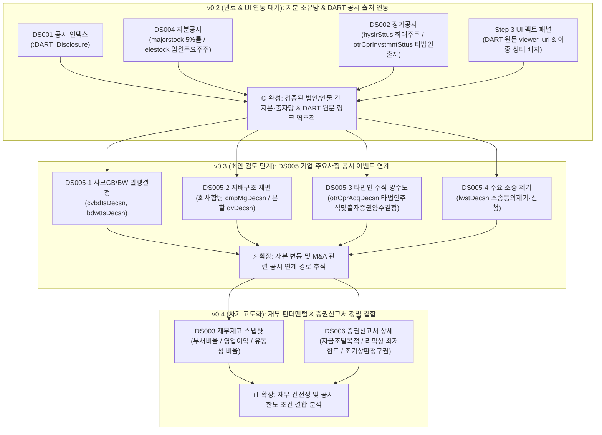

# 🏛️ [DART-Trace] 지식그래프 온톨로지(Ontology) & 데이터 구조 명세서 (v0.3 초안)

> **문서 버전**: `v0.3 Draft` (설계 검토용 초안 명세서)  
> **상태**: 🟡 **자본 변동(CB·BW) & 주요사항 공시 이벤트 온톨로지 초안 (In Review)**  
> **작성 일자**: 2026-09-01  
> **선행 버전**: `v0.2` (지분공시·타법인출자·공시인덱스 정합 완료)  
> **v0.3 핵심 확장 범위**: **`Step 3` (Streamlit 팩트 패널 UI 완성) + `DS005` (기업 주요사항보고서: 사모CB/BW 발행결정, 타법인 주식 및 출자증권 양수도결정, 회사 합병·분할결정, 소송 제기)**  
> **비즈니스 목표**: 지분 소유망 위에 OpenDART `DS005` 주요사항보고서 공시 이벤트를 구조화하여, **전환사채(CB) 발행, 타법인 주식 취득, 합병·분할 등 자본시장 주요 이벤트의 공시 연계 사실을 사실 기반으로 추적하는 지식그래프** 확장 설계.

---

## 1. 🗺️ DART-Trace 버전별 데이터 확장 마스터 로드맵



---

## 2. 🎯 v0.3 확장 아키텍처 & 관계 방향성 표준

v0.3은 **`Company ──[:ANNOUNCED]──> CapitalEvent ──[:EVIDENCED_BY]──> Disclosure`**의 표준 단방향 체계를 엄격히 준수합니다.

```mermaid
flowchart LR
    INVESTOR["🏛️ :DART_Group / 👤 :DART_Person<br/>(사채 인수자 / 양도인)"]
    COMP_A["🏢 :DART_Company<br/>(발행회사 / 공시회사)"]
    COMP_B["🏢 :DART_Company<br/>(양수대상사 / 합병상대방)"]
    DISC["📑 :DART_Disclosure<br/>(DART 공시 원문)"]
    EVENT["⚡ :DART_CapitalEvent<br/>(CB발행 / 합병 / 양수도 이벤트)"]

    COMP_A -->|ANNOUNCED<br/>(이벤트 공시)| EVENT
    INVESTOR -->|SUBSCRIBED<br/>(사채 인수)| EVENT
    EVENT -->|EVIDENCED_BY<br/>(근거 공시)| DISC
    COMP_A -->|FILED| DISC
    COMP_A -->|ACQUIRED_STAKE<br/>(타법인 주식 취득)| COMP_B
    COMP_A -->|MERGED_WITH<br/>(흡수합병)| COMP_B
```

---

## 3. 📋 v0.3 스키마 및 DB 라벨/관계 명세 (Data Dictionary)

### ① 기존 보존 노드 (`v0.2` 규격 유지)
* **`:DART_Company`**: `corp_code` (PK), `name`, `stock_code`, `market`, `corp_cls`, `is_listed`
* **`:DART_Disclosure`**: `rcept_no` (PK), `report_nm`, `rcept_dt`, `received_on`, `flr_nm`, `doc_status`, `viewer_url`
* **`:DART_Person`**: `name`, `person_id` (UUID)
* **`:DART_Group`**: `name`, `type` (`'NPS'`, `'PEF'`, `'INVESTMENT_UNION'`)

### ② 신규 추가 노드 (`v0.3` 설계 초안)

#### `(:DART_CapitalEvent)` (주요사항 공시 이벤트 노드)
* **PK (Unique)**: `event_id` (형식: `{corp_code}_{event_type}_{rcept_no}`)
* `event_type`: 이벤트 유형 (`'CB_ISSUE'`, `'BW_ISSUE'`, `'MERGER'`, `'SPIN_OFF'`, `'STOCK_TRANSFER'`, `'LAWSUIT'`)
* `event_name`: 이벤트 명칭 (예: `'제3회차 무기명식 무보증 사모 전환사채 발행결정'`)
* `announced_at`: 이사회 결의일 / 공시 접수일 (`Date`)
* `source_rcept_no`: 근거 DART 공시 접수번호 (`String`)
* `viewer_url`: DART 원문 바로가기 URL

---

### ③ 신규 관계 (Relationship Types)

#### 1. `[:ANNOUNCED]` (회사 ➔ 이벤트)
* 회사가 특정 주요사항 이벤트를 공시·결의한 관계
* `announced_date`: 공시 접수일자 (`Date`)

#### 2. `[:SUBSCRIBED]` (투자자/조합 ➔ 사채 이벤트)
* `investor_name`: 인수자명 (예: `'골든홀딩스1호투자조합'`)
* `allocated_amount`: 배정 금액 (단위: 원)
* `payment_date`: 납입일자 (`Date`)

#### 3. `[:EVIDENCED_BY]` (이벤트 ➔ 공시 원문)
* 이벤트의 법적 출처가 되는 `:DART_Disclosure` 노드로 연결되는 역추적 엣지

#### 4. `[:MERGED_WITH]` (기업 간 합병)
* `merger_type`: 합병 형태 (`'흡수합병'`, `'신설합병'`, `'소규모합병'`)
* `merger_ratio`: 합병 비율 (예: `'1 : 0.2351421'`)
* `contract_date`: 합병 계약일 (`Date`)
* `effective_date`: 합병 신주 상장예정일 / 효력발생일 (`Date`)
* `source_rcept_no`: 근거 합병결정 공시번호

#### 5. `[:SPUN_OFF_FROM]` / `[:DIVIDED_INTO]` (회사 분할)
* `split_type`: 분할 형태 (`'인적분할'`, `'물적분할'`)
* `split_ratio`: 분할 비율
* `source_rcept_no`: 근거 분할결정 공시번호

#### 6. `[:ACQUIRED_STAKE]` (타법인 주식 및 출자증권 양수도)
* `deal_amount`: 총 양수금액 (단위: 원)
* `acquired_shares`: 취득 주식수
* `post_deal_stake`: 양수 후 지분율 (Float, %)
* `seller_name`: 양도인(매도자)명
* `deal_date`: 양수도 계약일 / 잔금 지급일 (`Date`)
* `source_rcept_no`: 근거 타법인주식양수결정 공시번호

#### 7. `[:SUED_BY]` / `[:LITIGATED_AGAINST]` (주요 소송 제기)
* `lawsuit_type`: 소송 유형 (`'주주총회결의취소'`, `'직무집행정지가처분'`, `'회계장부열람청구'`)
* `claim_content`: 청구 내용 요약
* `plaintiff`: 원고 (주주/기관)
* `court`: 관할 법원
* `source_rcept_no`: 근거 소송공시 접수번호

---

## 4. 🔒 v0.3 제약조건 (Constraints) DDL

```cypher
// 1. 기존 핵심 엔터티 제약조건 보존
CREATE CONSTRAINT dart_company_corp_code_unique IF NOT EXISTS
FOR (c:DART_Company) REQUIRE c.corp_code IS UNIQUE;

CREATE CONSTRAINT dart_disclosure_rcept_no_unique IF NOT EXISTS
FOR (d:DART_Disclosure) REQUIRE d.rcept_no IS UNIQUE;

// 2. v0.3 자본/공시 이벤트 고유 식별 제약조건
CREATE CONSTRAINT dart_capital_event_id_unique IF NOT EXISTS
FOR (e:DART_CapitalEvent) REQUIRE e.event_id IS UNIQUE;
```

---

## 5. 🖥️ Step 3 Streamlit 대시보드 UI 연동 명세 (Front-End Specification)

### 📌 [팩트 상세 패널 (Fact Detail Panel)] 구조
1. **지분 / 타법인 출자 목록 테이블 인터랙션**:
   * 테이블 행(Row) 클릭 또는 셀렉트박스 선택 시 우측 사이드 패널이 실시간 갱신.
2. **우측 팩트 패널 구성 요소**:
   * 🏷️ **공시 문서 이력 상태 배지 (`doc_status`)**:
     * `🟢 정규 공시 (NORMAL)`
     * `🟡 기재 정정 공시 (CORRECTED)`
     * `🔴 철회 공시 (WITHDRAWN)`
   * 🛡️ **데이터 검증 상태 배지 (`verification_status`)**:
     * `🟢 검증 완료 (VERIFIED)`
     * `⚪ 후보 큐 보류 (CANDIDATE)`
   * ⏱️ **최신성 및 일자 표기**:
     * 최신 유효 지분 여부 (`is_current`: `🟢 최신 사실` / `⚪ 과거 이력`)
     * 공시 접수일 (`reported_on`) vs 결산 기준일 (`as_of_date`) 명확 분리
   * 🔗 **원문 검증 바로가기 버튼**:
     * `viewer_url` ➔ 클릭 시 금감원 DART 원문 뷰어 새 탭 오픈 (`https://dart.fss.or.kr/...`)

---

## 6. 📈 v0.3 해금 질문(Q/A) 로드맵 (Fact-based Queries)

| 카테고리 | v0.3 해금 사실 기반 질의 (Q/A) | 검증 메커니즘 |
|---|---|---|
| **사모 CB 발행 이력** | *"최근 2년간 사모 전환사채(CB) 발행 공시(`cvbdIsDecsn`)가 2회 이상 제출된 상장사는 어디인가?"* | `(c:DART_Company)-[:ANNOUNCED]->(e:DART_CapitalEvent {event_type: 'CB_ISSUE'})` 집계 |
| **타법인 주식 양수 연계** | *"사모 CB 발행 공시 이후 6개월 이내에 타법인 주식 양수 공시(`otrCprAcqDecsn`)가 연이어 제출된 기업과 양수 대상 법인은?"* | `(:DART_CapitalEvent)` 간 시계열 기간 조건 연계 질의 |
| **기업 합병 지배구조** | *"A사가 B사에 대한 흡수합병 공시(`cmpMgDecsn`)를 제출했을 때, 공시상 명시된 합병비율과 신주 상장예정일은?"* | `(A)-[:MERGED_WITH]->(B)` 속성 조회 |
| **경영권 분쟁 관련 소송** | *"현재 대표이사 또는 최대주주를 상대로 직무집행정지 등 소송 공시(`lwstDecsn`)가 제출된 기업은?"* | `(:DART_Person)-[:SUED_BY]->(:DART_Company)` 질의 |

---

### ⚠️ [거버넌스 유의사항]
1. **공개매수(`TENDER_OFFER`) 분리**: OpenDART DS005 공식 API에 해당 규격이 없으므로, 공식 엔드포인트 확인 전까지 본 범위에서 제외하고 추후 검토로 보류합니다.
2. **인과관계 단정 금지 원칙**: 본 지식그래프는 DART에 공식 보고된 공시 사실(`ANNOUNCED`, `ACQUIRED_STAKE`)의 시간순 연계 사실만을 제공하며, 자금의 실질 귀속이나 의도에 대한 인과관계 단정 서술을 배제합니다.
