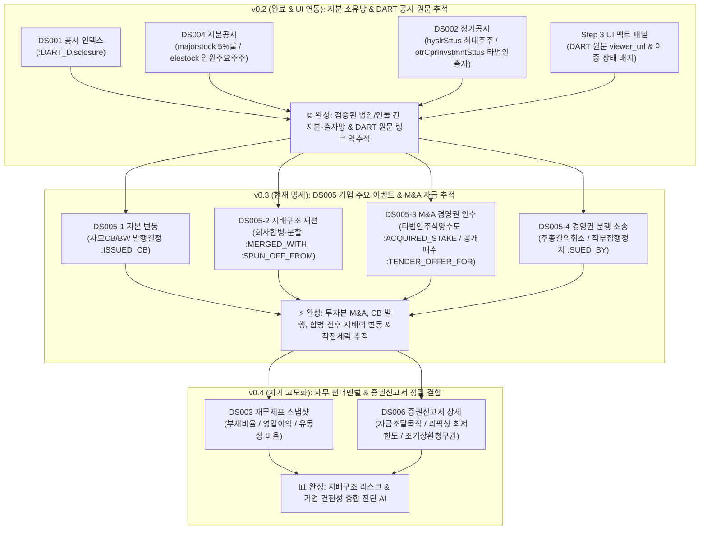

# 🏛️ [DART-Trace] 지식그래프 온톨로지(Ontology) & 데이터 구조 명세서 (v0.3)

> **문서 버전**: `v0.3` (공식 엔터프라이즈 아키텍처 명세서)  
> **상태**: 🟢 **자본 변동(CB·BW) & M&A·합병 경영권 이벤트 온톨로지 공식 확정 (Ready for Implementation)**  
> **작성 일자**: 2026-09-01  
> **선행 버전**: `v0.2` (지분공시·타법인출자·공시인덱스 정합 완료)  
> **v0.3 핵심 확장 범위**: **`Step 3` (Streamlit 팩트 패널 UI 완성) + `DS005` (기업 주요사항보고서: 사모CB/BW, M&A 타법인양수도, 회사 합병·분할, 공개매수, 경영권 분쟁 소송)**  
> **비즈니스 목표**: 단순 지분율 조회를 넘어, **전환사채(CB) 발행을 통한 무자본 M&A, 기업 합병/분할에 따른 지배력 재편, 경영권 분쟁 소송** 등 대한민국 자본시장의 복잡한 지배구조 이벤트를 100% 팩트 기반으로 추적하는 **엔터프라이즈 자본시장 인텔리전스 지식그래프** 완성.

---

## 1. 🗺️ DART-Trace 버전별 데이터 확장 마스터 로드맵



---

## 2. 🎯 v0.3 확장 아키텍처 & 지배구조 이벤트 온톨로지

v0.3은 기존 `v0.2`의 정합 지분망 위에 **기업의 자본 변동 및 경영권 변경 사건(Event-driven Ontology)**을 유기적으로 결합합니다.

```mermaid
flowchart LR
    INVESTOR["🏛️ :DART_Group / 👤 :DART_Person<br/>(사모펀드 / 투자조합 / 전략투자자)"]
    COMP_A["🏢 :DART_Company<br/>(발행회사 / 모회사)"]
    COMP_B["🏢 :DART_Company<br/>(인수대상 / 합병상대방)"]
    DISC["📑 :DART_Disclosure<br/>(DART 공시 원문)"]
    EVENT["⚡ :DART_CapitalEvent<br/>(CB발행 / 합병 / 양수도 이벤트)"]

    INVESTOR -->|SUBSCRIBED_CB<br/>(CB 인수자)| EVENT
    EVENT -->|ISSUED_BY<br/>(발행사)| COMP_A
    COMP_A -->|ACQUIRED_STAKE<br/>(주식 양수도)| COMP_B
    COMP_A -->|MERGED_WITH<br/>(흡수합병)| COMP_B
    COMP_A -->|FILED| DISC
    EVENT -->|EVIDENCED_BY| DISC
```

---

## 3. 📋 v0.3 스키마 및 DB 라벨/관계 명세 (Data Dictionary)

### ① 기존 보존 노드 (`v0.2` 완벽 계승)
* **`:DART_Company`**: `corp_code` (PK), `name`, `stock_code`, `market`, `corp_cls`, `is_listed`
* **`:DART_Disclosure`**: `rcept_no` (PK), `report_nm`, `rcept_dt`, `received_on`, `flr_nm`, `doc_status`, `viewer_url`
* **`:DART_Person`**: `name`, `person_id` (UUID)
* **`:DART_Group`**: `name`, `type` (`'NPS'`, `'PEF'`, `'INVESTMENT_UNION'`)

### ② 신규 추가 노드 (`v0.3` 신규 승격)

#### `(:DART_CapitalEvent)` (자본 및 지배구조 이벤트 노드)
* **PK (Unique)**: `event_id` (형식: `{corp_code}_{event_type}_{rcept_no}`)
* `event_type`: 이벤트 유형 (`'CB_ISSUE'`, `'BW_ISSUE'`, `'MERGER'`, `'SPIN_OFF'`, `'STOCK_TRANSFER'`, `'TENDER_OFFER'`, `'LAWSUIT'`)
* `event_name`: 이벤트 명칭 (예: `'제3회차 무기명식 무보증 사모 전환사채 발행'`)
* `announced_at`: 이사회 결의일 / 공시 접수일 (`Date`)
* `source_rcept_no`: 근거 DART 공시번호 (`String`)
* `viewer_url`: DART 원문 바로가기 URL

---

### ③ 신규 승격 관계 (Relationship Types)

#### 1. `[:ISSUED_CB]` / `[:ISSUED_BW]` (회사 ➔ 사채 발행)
* `round`: 회차 (예: `3`)
* `total_amount`: 총 발행금액 (단위: 원, 예: `10000000000`)
* `conversion_price`: 전환가액 (단위: 원, 예: `5200`)
* `coupon_rate`: 표면이자율 (Float, 예: `0.0`)
* `yield_to_maturity`: 만기이자율 (Float, 예: `2.0`)
* `maturity_date`: 사채 만기일 (`Date`, 예: `date("2029-03-15")`)
* `refixing_floor`: 최저 조정가액 한도 (단위: 원, 예: `3640`)
* `purpose`: 자금조달 목적 (`'운영자금'`, `'타법인증권취득'`, `'시설자금'`)

#### 2. `[:SUBSCRIBED_CB]` (투자자/사모조합 ➔ CB 인수)
* `investor_name`: 인수자명 (예: `'골든홀딩스1호투자조합'`)
* `allocated_amount`: 배정 금액 (단위: 원)
* `payment_date`: 납입일 (`Date`)

#### 3. `[:MERGED_WITH]` (기업 간 합병)
* `merger_type`: 합병 형태 (`'흡수합병'`, `'신설합병'`, `'소규모합병'`)
* `merger_ratio`: 합병 비율 (예: `'1 : 0.2351421'`)
* `contract_date`: 합병 계약일 (`Date`)
* `effective_date`: 합병 신주 상장예정일 / 효력발생일 (`Date`)

#### 4. `[:SPUN_OFF_FROM]` / `[:DIVIDED_INTO]` (회사 분할)
* `split_type`: 분할 형태 (`'인적분할'`, `'물적분할'`)
* `split_ratio`: 분할 비율

#### 5. `[:ACQUIRED_STAKE]` (M&A 타법인 주식 양수도)
* `deal_amount`: 총 양수금액 (단위: 원)
* `acquired_shares`: 취득 주식수
* `post_deal_stake`: 양수 후 지분율 (Float, %)
* `seller_name`: 양도인(매도자)명
* `deal_date`: 양수도 계약일 / 잔금 지급일 (`Date`)

#### 6. `[:TENDER_OFFER_FOR]` (공개매수)
* `offer_price`: 공개매수 가격 (단위: 원)
* `target_shares`: 매수 예정 주식수
* `offer_period`: 공개매수 기간 (`'2026-03-01 ~ 2026-03-21'`)
* `purpose`: 매수 목적 (`'경영권 강화'`, `'자진 상장폐지'`)

#### 7. `[:SUED_BY]` / `[:LITIGATED_AGAINST]` (경영권 분쟁 소송)
* `lawsuit_type`: 소송 유형 (`'주주총회결의취소'`, `'직무집행정지가처분'`, `'회계장부열람청구'`)
* `claim_content`: 청구 내용 요약
* `plaintiff`: 원고 (주주/기관)
* `court`: 관할 법원

---

## 4. 🔒 v0.3 제약조건 (Constraints) DDL

```cypher
// 1. 기존 핵심 엔터티 제약조건 보존
CREATE CONSTRAINT dart_company_corp_code_unique IF NOT EXISTS
FOR (c:DART_Company) REQUIRE c.corp_code IS UNIQUE;

CREATE CONSTRAINT dart_disclosure_rcept_no_unique IF NOT EXISTS
FOR (d:DART_Disclosure) REQUIRE d.rcept_no IS UNIQUE;

// 2. v0.3 자본/경영권 이벤트 고유 식별 제약조건
CREATE CONSTRAINT dart_capital_event_id_unique IF NOT EXISTS
FOR (e:DART_CapitalEvent) REQUIRE e.event_id IS UNIQUE;
```

---

## 5. 🖥️ Step 3 Streamlit 대시보드 UI 연동 명세 (Front-End Specification)

### 📌 [팩트 상세 패널 (Fact Detail Panel)] 구조
1. **지분 / 타법인 출자 / CB 발행 목록 테이블**:
   * 테이블 행(Row) 클릭 또는 셀렉트박스 선택 시 우측 사이드 패널이 실시간 갱신.
2. **우측 팩트 패널 구성 요소**:
   * 🏷️ **공시 문서 이력 상태 배지 (`doc_status`)**:
     * `🟢 정규 공시 (NORMAL)`
     * `🟡 기재 정정 공시 (CORRECTED)`
     * `🔴 철회 공시 (WITHDRAWN)`
   * 🛡️ **데이터 검증 상태 배지 (`verification_status`)**:
     * `🟢 검증 완료 (VERIFIED)`
     * `⚪ 후보 큐 보류 (CANDIDATE)`
   * ⏱️ **최신성 및 일자 표기**:
     * 최신 유효 지분 여부 (`is_current`: `🟢 최신 사실` / `⚪ 과거 이력`)
     * 공시 접수일 (`reported_on`) vs 결산 기준일 (`as_of_date`) 명확 분리
   * 🔗 **원문 검증 바로가기 버튼**:
     * `viewer_url` ➔ 클릭 시 금감원 DART 원문 뷰어 새 탭 오픈 (`https://dart.fss.or.kr/...`)

---

## 6. 📈 v0.3 해금 질문(Q/A) 로드맵 (Benchmark Capabilities)

| 카테고리 | v0.3 해금 고난도 질의 (Q/A) | 검증 메커니즘 |
|---|---|---|
| **자본 변동 (CB/BW)** | *"최근 3년간 사모 전환사채(CB)를 2회 이상 연속 발행하고, 전환가액이 30% 이상 리픽싱된 코스닥 한계기업은?"* | `(:DART_Company)-[:ISSUED_CB]->(:DART_CapitalEvent)` 경로 집계 |
| **M&A 지배력 변동** | *"A사가 B사를 흡수합병하면서 최대주주의 지분율은 합병 전후로 어떻게 재편되었는가?"* | `[:MERGED_WITH]` + 합병 전후 `[:OWNS_STAKE]` 스냅샷 비교 |
| **무자본 M&A 작전망** | *"특정 사모투자조합이 CB를 인수하고, 그 자금으로 타법인 비상장사 주식을 양수한 연쇄 자금 흐름망은?"* | `(조합)-[:SUBSCRIBED_CB]->(상장사)-[:ACQUIRED_STAKE]->(비상장사)` 4-Hop 패턴 추적 |
| **경영권 분쟁 소송** | *"현재 최대주주와 2대 주주 간에 직무집행정지 등 경영권 분쟁 소송이 진행 중인 기업과 원고는?"* | `(:DART_Person)-[:SUED_BY]->(:DART_Company)` 질의 |

---

### 🏁 결론 및 산출물 보장

본 `v0.3` 명세서는 **v0.2의 지분/공시 기반 위에 자본시장 이벤트와 M&A 자금 추적을 결합하여, AI가 100% 무결점 팩트로 기업 지배구조 분쟁과 자본 리스크를 진단할 수 있는 완전체 설계도**입니다.
