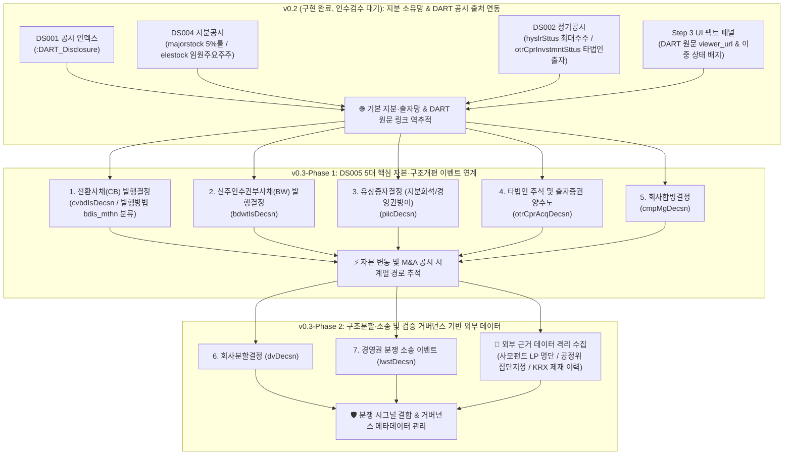

# 🏛️ [DART-Trace v0.3] 지식그래프 온톨로지 및 데이터 구조 명세서
> **부제**: 주요사항보고서(DS005) 5대 자본 이벤트·자금 흐름 및 다단계 M&A 탐색 온톨로지 설계서  
> **최종 갱신일**: 2026-09-01 (v0.3 5대 자본 이벤트 파이프라인 개발 및 Neo4j 적재·대시보드 연동 완료 🟢)  
> **적용 버전**: DART-Trace v0.3-Phase 1 (Production Ready)

---

## 0. 🚦 버전 관리 및 상태 요약

| 버전 | 구분 | 상태 | 핵심 내용 |
|:---:|:---:|:---:|---|
| **v0.1** | Baseline | 🟢 완료 | 총수 지배구조망 & 순환출자 탐색 온톨로지 |
| **v0.2** | Extension-1 | 🟢 완료 (Closed) | OpenDART 공시 인덱스(DS001) + 5% 대량보유(DS004) + 최대주주/타법인출자(DS002) + 팩트패널 + GraphRAG 챗봇 |
| **v0.3** | Extension-2 | 🟢 **개발 및 실측 검증 완료** | **DS005 5대 자본 이벤트 (`CB_ISSUE`, `BW_ISSUE`, `PAID_INCREASE`, `STOCK_ACQUISITION`, `MERGER`) 총 313건 적재 + 대시보드 4번 메뉴 + GraphRAG 자본 팩트 질의 연동** |
| **v0.4** | Extension-3 | ⚪ 백로그 대기 | 정기보고서 재무정보(DS003) + 증권신고서(DS006) 펀더멘털 스냅샷 |

---

## 1. 🗺️ DART-Trace 단계별 데이터 확장 마스터 로드맵



---

## 2. 🎯 v0.3 확장 아키텍처 & 관계 방향성 표준

v0.3은 **`Company ──[:ANNOUNCED]──> CapitalEvent ──[:EVIDENCED_BY]──> Disclosure`**의 표준 단방향 체계를 엄격히 준수합니다.

```mermaid
flowchart LR
    INVESTOR["🏛️ :DART_Group / 👤 :DART_Person<br/>(사채 인수자 / 양도인 / 배정대상자)"]
    COMP_A["🏢 :DART_Company<br/>(발행회사 / 공시회사)"]
    COMP_B["🏢 :DART_Company<br/>(양수대상사 / 합병상대방)"]
    DISC["📑 :DART_Disclosure<br/>(DART 공시 원문)"]
    EVENT["⚡ :DART_CapitalEvent<br/>(CB/BW/증자/합병/양수도 이벤트)"]

    COMP_A -->|ANNOUNCED<br/>(이벤트 공시)| EVENT
    INVESTOR -->|SUBSCRIBED<br/>(사채/신주 인수)| EVENT
    EVENT -->|EVIDENCED_BY<br/>(근거 공시)| DISC
    COMP_A -->|FILED| DISC
    
    COMP_A -.->|ACQUIRED_STAKE<br/>(파생 프로젝션 엣지)| COMP_B
    COMP_A -.->|MERGED_WITH<br/>(파생 프로젝션 엣지)| COMP_B
```

> **📌 프로젝션 엣지 정의 및 메타데이터 원칙**:
> `ACQUIRED_STAKE`, `MERGED_WITH` 등 기업 간 직접 관계선은 지배구조 그래프 조회를 위해 `CapitalEvent`로부터 파생(Derived)된 **조회용 프로젝션(Query Projection)**입니다.  
> 원천 사실과의 엄격한 구분을 위해 프로젝션 엣지에는 반드시 다음 메타데이터를 필수 적재합니다:
> * `derived_from_event_id`: 파생 근거가 된 `:DART_CapitalEvent`의 `event_id`
> * `source_rcept_no`: 근거 공시 접수번호 (14자리)
> * `projection_version`: 프로젝션 생성 버전 (예: `'v0.3'`)

---

## 3. 📋 v0.3 스키마 및 DB 라벨/관계 명세 (Data Dictionary)

### ① 기존 보존 노드 (`v0.2` 규격 유지)
* **`:DART_Company`**: `corp_code` (PK), `name`, `stock_code`, `market`, `corp_cls`, `is_listed`
* **`:DART_Disclosure`**: `rcept_no` (PK), `report_nm`, `rcept_dt`, `received_on`, `flr_nm`, `doc_status`, `viewer_url`
* **`:DART_Person`**: `name`, `person_id` (UUID)
* **`:DART_Group`**: `name`, `type` (`'NPS'`, `'PEF'`, `'INVESTMENT_UNION'`)

### ② 신규 추가 노드 (`v0.3` 표준)

#### `(:DART_CapitalEvent)` (주요사항 공시 이벤트 노드)
* **PK (Unique)**: `event_id` (형식: `{corp_code}_{event_type}_{rcept_no}_{item_seq}`)
* `event_type`: 이벤트 유형 (`'CB_ISSUE'`, `'BW_ISSUE'`, `'PAID_INCREASE'`, `'STOCK_ACQUISITION'`, `'MERGER'`)
* `event_name`: 공시 보고서명 / 이벤트 명칭
* **📅 엄밀 분리된 3원 일자 필드**:
  * `decided_on`: 이사회 결의일 등 사건 결정일 (`Date`)
  * `received_on`: 금융감독원 공시 접수일 (`Date`, `rcept_dt` 대응)
  * `effective_on`: 주금 납입일 / 합병 효력발생일 / 양수도 대금지급일 (`Date`)
* **🔢 핵심 조회용 정규 속성 (First-Class Typed Properties)**:
  * `issue_method`: 발행/배정 방법 (API `bdis_mthn`, 예: `'사모'`, `'주주배정후실권주일반공모'`, `'제3자배정'`)
  * `is_private`: 사모 발행 여부 (`Boolean`, `issue_method`에 '사모' 포함 시 `true`)
  * `issue_amount`: 발행/양수/증자 총 금액 (단위: 원, `Integer/Float`)
  * `conversion_price`: 전환가액 / 행사가액 / 신주발행가액 (단위: 원)
  * `min_refixing_floor`: 전환가액 최저 조정 한도액 (단위: 원)
  * `convertible_shares`: 전환/행사 가능 주식수 (`Integer`)
  * `convertible_ratio`: 주식 총수 대비 비율 (`Float`, %)
  * `target_corp_name`: 양수 대상사명 또는 합병 상대방명
  * `merger_ratio`: 합병 비율 (예: `'1 : 0.2351421'`)
* `source_rcept_no`: 근거 DART 공시 접수번호 (`String`)
* `viewer_url`: DART 원문 바로가기 URL
* `raw_payload`: 원본 JSON 레코드 보존 문자열 (`String`)

---

### ③ 신규 관계 (Relationship Types)

#### 1. `[:ANNOUNCED]` (회사 ➔ 이벤트)
* 회사가 특정 주요사항 이벤트를 공시·결의한 관계
* `decided_on`: 이사회 결의일 (`Date`)
* `received_on`: 공시 접수일 (`Date`)

#### 2. `[:SUBSCRIBED]` (투자자/조합 ➔ 사채/증자 이벤트) - *(⚠️ Phase 2 예정 / 현재 미구현)*
* **구현 계획**: 사모사채/유상증자 공시 본문 내 배정대상자 비정형 테이블 정밀 파서 도입 후 연결 예정
* **고유 식별자 (`fact_id`)**: `{event_id}_SUBSCRIBED_{party_hash}`
* `investor_name`: 인수자/배정대상자명 (예: `'골든홀딩스1호투자조합'`)
* `allocated_amount`: 배정 금액 (단위: 원)
* `allocated_shares`: 배정 주식/사채 수
* `payment_date`: 납입일자 (`effective_on` 대응)
* `party_id_or_hash`: 인수자 식별 해시 (`String`)

#### 3. `[:EVIDENCED_BY]` (이벤트 ➔ 공시 원문)
* 이벤트의 법적 출처가 되는 `:DART_Disclosure` 노드로 연결되는 역추적 엣지

#### 4. `[:PLAINTIFF_IN]` (원고/신청인 ➔ 소송 이벤트, Phase 2 대상)
* `claim_summary`: 청구 취지 요약
* `court`: 관할 법원

---

## 4. 🔒 v0.3 제약조건 (Constraints) DDL

```cypher
// 1. 기존 핵심 엔터티 제약조건 보존
CREATE CONSTRAINT dart_company_corp_code_unique IF NOT EXISTS
FOR (c:DART_Company) REQUIRE c.corp_code IS UNIQUE;

CREATE CONSTRAINT dart_disclosure_rcept_no_unique IF NOT EXISTS
FOR (d:DART_Disclosure) REQUIRE d.rcept_no IS UNIQUE;

// 2. v0.3 자본/공시 이벤트 고유 식별 제약조건 (순번 포함)
CREATE CONSTRAINT dart_capital_event_id_unique IF NOT EXISTS
FOR (e:DART_CapitalEvent) REQUIRE e.event_id IS UNIQUE;
```

---

## 5. 🛡️ 데이터 거버넌스 및 정합성 원칙

1. **무단 단정/추정 금지 원칙**:
   * 본 지식그래프는 금감원 DART 공시 원문에 공식 기재된 사실(발행, 배정, 취득, 합병 공시)의 **"시간순 공시 경로"**만을 객관적으로 연결합니다.
   * "차명", "실소유주", "무자본 M&A" 등의 주관적/사법적 판단 용어를 시스템상에서 단정하지 않습니다.
2. **다중 배정자 충돌 방지 고유 식별키 (`fact_id`)**:
   * 동일 공시에 다수의 인수자/배정자가 존재하더라도 100% 충돌을 방지하기 위해 **`{event_id}_{relationship_type}_{party_hash}`** 체계를 적용합니다.
3. **외부 업로드 데이터 격리 및 출처 메타데이터 필수화 (Phase 2)**:
   * DART 공시 외의 외부 자료(조합 LP 명단, 공정위 지정자료 등)는 `source_url`, `collected_at`, `reviewer`, `verification_status` 등의 메타데이터가 검증되기 전까지 `VERIFIED`로 자동 승격하지 않고 별도 격리 관리합니다.

---

## 6. 🏆 v0.3 마스터 실행 단계 (추진 순서)

1. **[Step 3 최종 인수검수 및 Git 커밋]**: 
   * 대시보드 3D 그래프의 순수 지분망 확인 및 테이블 2건 행 클릭 검수 완료.
   * 수정 파일 커밋 및 Step 3 PASS 확정.
2. **[v0.3 Phase 1: 5대 핵심 자본 이벤트 파일럿 적재]**:
   * OpenDART DS005 5개 엔드포인트 파이프라인 구축:
     1. 전환사채(CB) 발행결정 (`cvbdIsDecsn`)
     2. 신주인수권부사채(BW) 발행결정 (`bdwtIsDecsn`)
     3. 유상증자결정 (`piicDecsn`)
     4. 타법인 주식 및 출자증권 양수도결정 (`otrCprAcqDecsn`)
     5. 회사합병결정 (`cmpMgDecsn`)
3. **[이벤트 정합성 검수]**:
   * 각 이벤트의 DART 원문 링크, 접수번호, 정정 공시 연계 및 3원 일자(`decided_on`, `received_on`, `effective_on`) 검증.
4. **[v0.3 Phase 2: 확장 이벤트 및 거버넌스 구축]**:
   * 회사분할결정(`dvDecsn`), 경영권 분쟁 소송(`lwstDecsn`) 및 외부 근거 데이터 격리 수집 프레임워크 구축.
