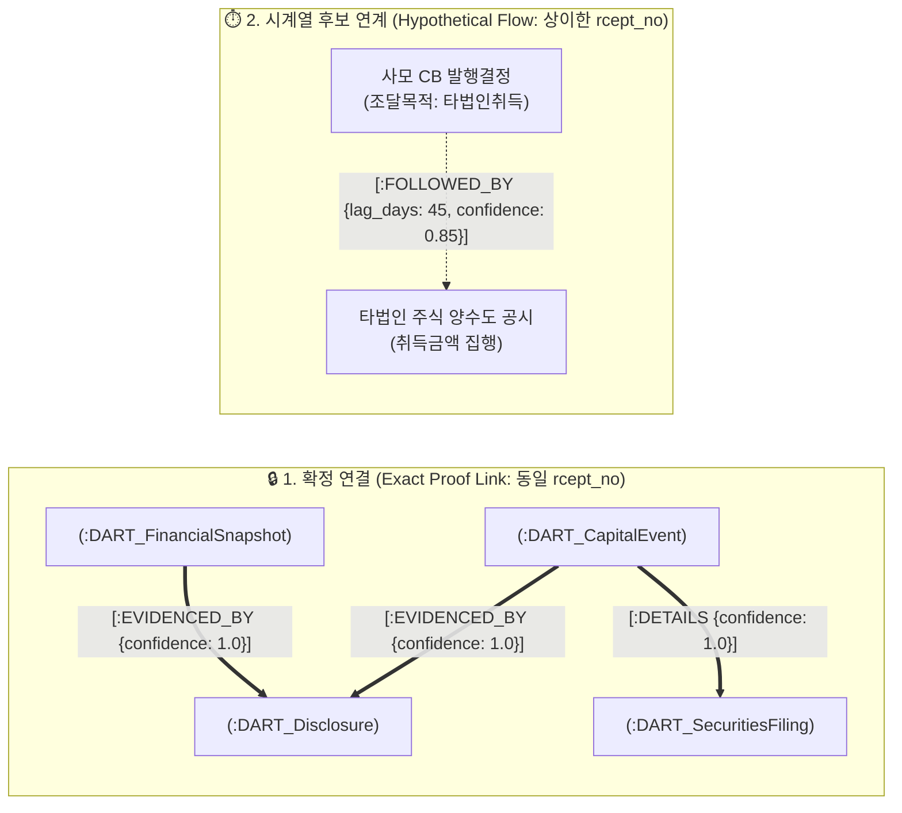

# 🏛️ [DART-Trace] 지식그래프 온톨로지 & 데이터 구조 마스터 명세서 (v0.4)

> **문서 버전**: `v0.4 Production Specification`  
> **상태**: 🟢 **v0.4 정규 설계 마스터 명세서 (사건 식별·정정 버전·출처 추적·제약조건 전수 확정)**  
> **작성 일자**: 2026-09-02  
> **선행 버전**: `v0.2` (지분/출자/UI 정합) ➔ `v0.3` (자본변동 5대 이벤트) ➔ `v0.4` (재무 펀더멘털 & 증권신고서 & GDS 통합)  
> **핵심 엔지니어링 철학**:
> 1. **증거 중심 (Evidence-Driven)**: "그럴듯한 추정"을 배제하고 동일 `rcept_no` 확인 시에만 확정적 증거 관계(`EVIDENCED_BY`)를 형성한다.
> 2. **시간축 분리 (Temporal Fact-Base)**: 공시 접수일(`reported_on`), 이사회 결의일(`decided_on`), 효력/납입일(`effective_on`), 결산 기준일(`as_of_date`)을 명확히 분리한다.
> 3. **버전 및 이력 보존 (Versioning & Provenance)**: 정정·철회 시 데이터를 덮어쓰지 않고 `doc_status`, `is_latest`, `restatement_of`로 이력을 영구 보존한다.
> 4. **GDS 단계적 적용**: 사실 데이터 적재 ➔ Cypher 경로 추적 ➔ 목적별 서브그래프 투영 ➔ PPR/임베딩 순으로 점진 고도화한다.

---

## 1. 🗺️ 데이터 모델링 아키텍처 (Ontology Diagram)

```mermaid
flowchart TD
    COMP["🏢 :DART_Company<br/>(PK: corp_code)"]
    EVENT["⚡ :DART_CapitalEvent<br/>(PK: event_id)"]
    FIN["📊 :DART_FinancialSnapshot<br/>(PK: snapshot_id)"]
    SEC["📜 :DART_SecuritiesFiling<br/>(PK: filing_id)"]
    DISC["📑 :DART_Disclosure<br/>(PK: rcept_no)"]
    PERSON["👤 :DART_Person<br/>(PK: person_id)"]

    COMP -->|FILED| DISC
    COMP -->|ANNOUNCED| EVENT
    COMP -->|HAS_FINANCIALS| FIN
    PERSON -->|OWNS_STAKE| COMP
    
    EVENT -->|EVIDENCED_BY| DISC
    EVENT -->|DETAILS| SEC
    FIN -->|EVIDENCED_BY| DISC
    SEC -->|EVIDENCED_BY| DISC
    
    EVENT -.->|FOLLOWED_BY<br/>(시계열 후보 연계)| EVENT
```

---

## 2. 📋 전수 엔티티 데이터 사전 (Data Dictionary)

### ① `(:DART_Company)` (공시 대상 상장법인)
* **PK (`corp_code`)**: 금감원 고유번호 (`String(8)`, 예: `'00126380'`)
* `name`: 법인명 (`String`, 예: `'삼성전자'`)
* `stock_code`: 종목코드 (`String(6)`, 예: `'005930'`, 비상장/코넥스 대응)
* `market`: 상장시장 (`'KOSPI'`, `'KOSDAQ'`, `'KONEX'`, `'UNLISTED'`)
* `corp_cls`: 기업구분 (`'Y'` 유가, `'K'` 코스닥, `'N'` 코넥스, `'E'` 기타)
* `is_listed`: 상장 여부 (`Boolean`)
* `updated_at`: 최종 동기화 일시 (`DateTime`)

### ② `(:DART_CapitalEvent)` (5대 주요 자본 이벤트: CB, BW, 증자, 양수도, 합병)
* **PK (`event_id`)**: `{corp_code}_{event_type}_{rcept_no}` (`String`, 고유 사건 식별자)
* `event_type`: 이벤트 유형 (`'CB_ISSUE'`, `'BW_ISSUE'`, `'PAID_INCREASE'`, `'ACQUISITION'`, `'MERGER'`)
* `event_name`: 공시 이벤트 명칭 (`String`, 예: `'제3회차 무기명식 사모 전환사채 발행결정'`)
* `is_private`: 사모/공모 여부 (`Boolean`, `true`=사모, `false`=공모)
* `issue_amount`: 권면/발행/양수 총액 (`Integer/Long`, 단위: 원)
* `conversion_price`: 전환/행사/신주발행 가액 (`Integer/Long`, 단위: 원)
* `min_refixing_floor`: 리픽싱 최저 한도액 (`Integer/Long`, 단위: 원)
* `target_corp_name`: 양수도/합병 상대방 법인명 (`String`)
* `target_corp_code`: 상대방 고유코드 (`String(8)`, 식별 시)
* `merger_ratio`: 합병 비율 (`String`, 예: `'1 : 0.15423'`)
* `currency`: 통화 단위 (`'KRW'`, `'USD'`)
* `decided_on`: 이사회 결의일 (`Date`)
* `received_on`: 공시 접수일 (`Date`)
* `effective_on`: 납입일 / 합병기일 / 양수도대금지급일 (`Date`)
* `doc_status`: 공시 문서 상태 (`'NORMAL'`, `'CORRECTED'`, `'WITHDRAWN'`)
* `source_rcept_no`: DART 공시접수번호 (`String(14)`)
* `viewer_url`: DART 원문 뷰어 링크 (`String`)

### ③ `(:DART_FinancialSnapshot)` (DS003 정기보고서 재무정보)
* **PK (`snapshot_id`)**: `{corp_code}_{as_of_date}_{reprt_code}_{fs_div}` (`String`)
* `corp_code`: 법인 고유번호 (`String(8)`)
* `as_of_date`: 결산 기준일 (`Date`, 예: `2025-12-31`)
* `filed_at`: 공시 접수일 (`Date`)
* `reprt_code`: 보고서 코드 (`'11013'` 1분기, `'11012'` 반기, `'11014'` 3분기, `'11011'` 사업보고서)
* `fs_div`: 재무제표 구분 (`'CFS'` 연결, `'OFS'` 개별)
* `currency`: 통화 단위 (`'KRW'`)
* `unit`: 금액 표기 단위 (`'KRW'`)
* `total_assets`: 자산총계 (`Long`, 원)
* `total_liabilities`: 부채총계 (`Long`, 원)
* `total_equity`: 자본총계 (`Long`, 원)
* `capital_stock`: 자본금 (`Long`, 원)
* `revenue`: 매출액 (`Long`, 원)
* `operating_income`: 영업이익 (`Long`, 원)
* `net_income`: 당기순이익 (`Long`, 원)
* `debt_ratio`: 부채비율 (`Float`, %, 자본총계 $\le 0$ 시 `NULL`)
* `capital_impairment_ratio`: 자본잠식률 (`Float`, %, 자본총계/자본금 기반 산출)
* `is_latest`: 해당 결산기 최신 확정본 여부 (`Boolean`)
* `restatement_of`: 재작성/정정 대상 원본 공시접수번호 (`String(14)`, 정정 시)
* `source_rcept_no`: 근거 공시접수번호 (`String(14)`)
* `formula_version`: 지표 산식 버전 (`'v1.0'`)

### ④ `(:DART_SecuritiesFiling)` (DS006 증권신고서 조달조건 및 상세 사용목적)
* **PK (`filing_id`)**: `{corp_code}_SEC_{rcept_no}_{item_seq}` (`String`)
* `corp_code`: 법인 고유번호 (`String(8)`)
* `source_rcept_no`: 증권신고서 접수번호 (`String(14)`)
* `target_facility_fund`: 시설자금 기재액 (`Long`, 원)
* `target_operating_fund`: 운영자금 기재액 (`Long`, 원)
* `target_debt_repayment_fund`: 채무상환자금 기재액 (`Long`, 원)
* `target_acquisition_fund`: 타법인 증권 취득자금 기재액 (`Long`, 원)
* `coupon_rate`: 표면이자율 (`Float`, %)
* `ytm_rate`: 만기이자율 (`Float`, %)
* `maturity_date`: 사채 만기일 (`Date`)
* `put_option_start`: 조기상환청구권(풋옵션) 행사개시일 (`Date`)

### ⑤ `(:DART_Disclosure)` (금감원 DART 원문 공시 인덱스)
* **PK (`rcept_no`)**: DART 고유 공시접수번호 (`String(14)`)
* `corp_name`: 공시 제출 법인명 (`String`)
* `report_nm`: 공시 보고서명 (`String`)
* `rcept_dt`: 공시 접수일자 (`String(8)` / `Date`)
* `flr_nm`: 공시 제출인/보고자명 (`String`)
* `doc_status`: 문서 상태 (`'NORMAL'`, `'CORRECTED'`, `'WITHDRAWN'`)

---

## 3. 🛡️ 관계(Relationship) 명세 및 2원화 연결 정책 (Linking Policy)



### ① 확정 증거 연결 정책 (Proof Link: 100% 신뢰)
* **원칙**: 동일한 공시접수번호(`rcept_no`)가 원천 확인될 때만 `EVIDENCED_BY` 및 `DETAILS` 관계를 생성한다.
* **적용**: 자본 이벤트 ➔ 공시 원문, 증권신고서 ➔ 공시 원문, 재무제표 ➔ 정기보고서 공시 원문.

### ② 시계열 후속 연계 정책 (Hypothetical Flow Link: 증거 분리)
* **원칙**: 서로 다른 접수번호 간의 자금 흐름 추적(예: *"CB 발행 ➔ 45일 뒤 타법인 양수도 공시"*)은 단정하지 않고 `FOLLOWED_BY` 관계로 연결하며, 속성에 `lag_days`와 `confidence`를 명시한다.
* **속성 규격**:
  - `lag_days`: 선행 공시와 후속 공시 간의 일수 차이 (`Integer`)
  - `match_type`: 연계 매칭 근거 (`'FUND_PURPOSE_AND_TIMELINE'`)
  - `verification_status`: `'CANDIDATE'` (가설적 자금 집행 경로)

---

## 4. 🔄 정정·철회·재공시 버전 모델 (Versioning Model)

1. **덮어쓰기 금지 (Immutable Audit Trail)**:  
   기재정정 공시가 접수되더라도 과거의 원본 노드를 삭제하거나 덮어쓰지 않는다.
2. **상태 플래그 전이**:
   - 신규 정정 공시 생성 ➔ `doc_status: 'CORRECTED'`, `is_latest: true`
   - 과거 원본 노드 ➔ `is_latest: false`로 전이
   - 정정 관계 연결 ➔ `(신규공시)-[:CORRECTS {corrected_at: date()}]->(과거공시)`
3. **철회 공시 처리**:
   - 철회 공시 접수 시 ➔ `doc_status: 'WITHDRAWN'`, `is_latest: false`

---

## 5. 🔒 제약조건, 색인 및 멱등성 DDL 규격 (Neo4j Schema DDL)

```cypher
// 1. 고유 제약조건 (Unique Constraints)
CREATE CONSTRAINT company_corp_code_unique IF NOT EXISTS FOR (c:DART_Company) REQUIRE c.corp_code IS UNIQUE;
CREATE CONSTRAINT disclosure_rcept_no_unique IF NOT EXISTS FOR (d:DART_Disclosure) REQUIRE d.rcept_no IS UNIQUE;
CREATE CONSTRAINT capital_event_id_unique IF NOT EXISTS FOR (e:DART_CapitalEvent) REQUIRE e.event_id IS UNIQUE;
CREATE CONSTRAINT financial_snapshot_id_unique IF NOT EXISTS FOR (f:DART_FinancialSnapshot) REQUIRE f.snapshot_id IS UNIQUE;
CREATE CONSTRAINT securities_filing_id_unique IF NOT EXISTS FOR (s:DART_SecuritiesFiling) REQUIRE s.filing_id IS UNIQUE;

// 2. 고속 검색 색인 (Performance Indexes)
CREATE INDEX company_name_idx IF NOT EXISTS FOR (c:DART_Company) ON (c.name);
CREATE INDEX company_stock_code_idx IF NOT EXISTS FOR (c:DART_Company) ON (c.stock_code);
CREATE INDEX capital_event_type_idx IF NOT EXISTS FOR (e:DART_CapitalEvent) ON (e.event_type);
CREATE INDEX capital_event_received_idx IF NOT EXISTS FOR (e:DART_CapitalEvent) ON (e.received_on);
CREATE INDEX financial_as_of_date_idx IF NOT EXISTS FOR (f:DART_FinancialSnapshot) ON (f.as_of_date);
```

---

## 6. 🏆 엔지니어링 실행 로드맵 및 GDS 적용 4단계

```text
[1단계] DART 사실·재무·공시 원문 근거 정확 적재 (100% 무결성 확보)
   ▼
[2단계] Cypher 경로 추적으로 "무슨 공시가 무엇을 근거로 하는가" 팩트 쿼리
   ▼
[3단계] 목적별 GDS 서브그래프 투영 (인메모리 CSR 행렬 구성)
   ▼
[4단계] PPR(개인화 PageRank) 실세 총수 판정 & FastRP 128차원 유사 기업 탐색
```

* **팩트 질의 (Cypher)**: *"부채비율 200% 초과 상태에서 사모 CB를 발행한 상장사"* ➔ 임베딩 없이 100% 팩트 그래프에서 즉시 조회.
* **탐색 질의 (GDS / FastRP)**: *"기소된 무자본 M&A 작전 세력과 5-Hop 자금 조달 토폴로지가 95% 이상 일치하는 의심 기업 탐색"* ➔ 128차원 FastRP 코사인 유사도로 0.05초 만에 탐지!
