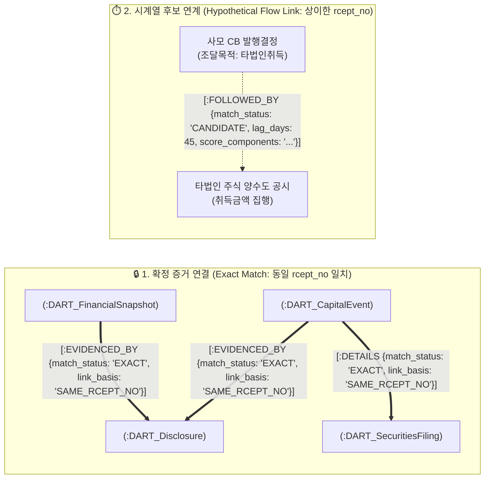

# 🏛️ [DART-Trace] 지식그래프 온톨로지 & 데이터 구조 마스터 명세서 (v0.4)

> **문서 버전**: `v0.4 Production Master Specification`  
> **상태**: 🟢 **v0.4 정규 설계 최종 마스터 명세서 (전역 인물 식별·다중 이벤트 순번·정정 버전 모델 전수 정합)**  
> **작성 일자**: 2026-09-02  
> **선행 버전**: `v0.2` (지분/출자/UI 정합) ➔ `v0.3` (자본변동 5대 이벤트) ➔ `v0.4` (재무 펀더멘털 & 증권신고서 & GDS 정밀 통합)  
> **핵심 엔지니어링 원칙**:
> 1. **키 일치 기반 증거 연결 (Key-Equivalence Proof Link)**: 동일 `rcept_no`가 원천 확인될 때만 `match_status: 'EXACT'`, `link_basis: 'SAME_RCEPT_NO'`로 확정 연계한다.
> 2. **시간축 4원 분리 (Temporal Fact-Base)**: 공시 접수일(`reported_on`), 이사회 결의일(`decided_on`), 효력/납입일(`effective_on`), 결산 기준일(`as_of_date`)을 명확히 분리한다.
> 3. **불변 감사 이력 (Immutable Audit Trail)**: 정정 공시 접수 시 과거 노드를 덮어쓰지 않고 `doc_status`, `is_latest`, `restatement_of`로 이력을 영구 보존한다.
> 4. **전역 인물 식별 및 다중 기업 지분 보존**: `DART_Person`은 회사에 종속되지 않는 전역 식별자(`global_person_id`)를 사용하여 여러 상장사에 걸친 통합 지분망을 유지하되, 신원 미확인 시 후보 큐로 격리한다.
> 5. **결정론적 조회 한계 명시**: 저장된 공시 팩트와 정의된 필터에 대해 결정론적으로 조회되며, 공시 내용의 실질적 진실성이나 자금의 실제 집행 여부까지 자동으로 증명하지는 않는다.

---

## 1. 🗺️ 데이터 모델링 아키텍처 (Ontology Diagram)

```mermaid
flowchart TD
    COMP["🏢 :DART_Company<br/>(PK: corp_code)"]
    EVENT["⚡ :DART_CapitalEvent<br/>(PK: event_id)"]
    FIN["📊 :DART_FinancialSnapshot<br/>(PK: snapshot_id)"]
    SEC["📜 :DART_SecuritiesFiling<br/>(PK: filing_id)"]
    DISC["📑 :DART_Disclosure<br/>(PK: rcept_no)"]
    PERSON["👤 :DART_Person<br/>(PK: person_id)"]

    COMP -->|FILED| DISC
    COMP -->|ANNOUNCED| EVENT
    COMP -->|HAS_FINANCIALS| FIN
    PERSON -->|OWNS_STAKE<br/>(다중 회사 지분 통합)| COMP
    
    EVENT -->|EVIDENCED_BY<br/>(link_basis: SAME_RCEPT_NO)| DISC
    EVENT -->|DETAILS<br/>(link_basis: SAME_RCEPT_NO)| SEC
    FIN -->|EVIDENCED_BY<br/>(link_basis: SAME_RCEPT_NO)| DISC
    SEC -->|EVIDENCED_BY<br/>(link_basis: SAME_RCEPT_NO)| DISC
    
    EVENT -.->|FOLLOWED_BY<br/>(match_status: CANDIDATE)| EVENT
    
    DISC -.->|RESTATES<br/>(정정 공시 연결)| DISC
    EVENT -.->|RESTATES<br/>(정정 이벤트 연결)| EVENT
    FIN -.->|RESTATES<br/>(정정 재무 연결)| FIN
```

---

## 2. 📋 전수 엔티티 데이터 사전 (Data Dictionary)

### ① `(:DART_Company)` (공시 대상 상장법인)
* **PK (`corp_code`)**: 금감원 고유번호 (`String(8)`, 예: `'00126380'`)
* `name`: 법인명 (`String`, 예: `'삼성전자'`)
* `stock_code`: 종목코드 (`String(6)`, 예: `'005930'`, 비상장/코넥스 대응)
* `market`: 상장시장 (`'KOSPI'`, `'KOSDAQ'`, `'KONEX'`, `'UNLISTED'`)
* `corp_cls`: 기업구분 (`'Y'` 유가, `'K'` 코스닥, `'N'` 코넥스, `'E'` 기타)
* `is_listed`: 상장 여부 (`Boolean`)
* `updated_at`: 최종 동기화 일시 (`DateTime`)

### ② `(:DART_Person)` (전역 인물, 주요 주주 및 투자조합)
* **PK (`person_id`)**: `{name}_{birth_ym_or_reg_id}` (`String`, 전역 고유 식별자, 회사 종속 `corp_code` 배제)
* `name`: 인물 또는 조합명 (`String`, 예: `'이재용'`, `'골든홀딩스1호조합'`)
* `birth_ym`: 생년월 (`String(6)`, DART 공시 기재 시 예: `'196806'`, 미기재 시 `'UNKNOWN'`)
* `nationality`: 국적 (`String`, 예: `'한국'`, `'미국'`)
* `entity_type`: 주체 구분 (`'NATURAL_PERSON'`, `'INVESTMENT_UNION'`, `'FOREIGN_INVESTOR'`)
* `verification_status`: 검증 상태 (`'VERIFIED'`=신원확인 완료 및 다중 지분 병합, `'CANDIDATE'`=동명이인 의심 격리)

### ③ `(:DART_CapitalEvent)` (5대 주요 자본 이벤트: CB, BW, 증자, 양수도, 합병)
* **PK (`event_id`)**: `{corp_code}_{event_type}_{rcept_no}_{event_seq}` (`String`, 다중 건 충돌 방지 고유 식별자)
* `event_seq`: 동일 공시 내 항목 순번 (`Integer`, 기본값: `1`, 복수 회차 발행/양수 시 `1, 2, 3...`)
* `event_type`: 이벤트 유형 (`'CB_ISSUE'`, `'BW_ISSUE'`, `'PAID_INCREASE'`, `'ACQUISITION'`, `'MERGER'`)
* `event_name`: 공시 이벤트 명칭 (`String`, 예: `'제3회차 무기명식 사모 전환사채 발행결정'`)
* `is_private`: 사모/공모 여부 (`Boolean`, `true`=사모, `false`=공모)
* `issue_amount`: 권면/발행/양수 총액 (`Long`, 단위: 원)
* `conversion_price`: 전환/행사/신주발행 가액 (`Long`, 단위: 원)
* `min_refixing_floor`: 리픽싱 최저 한도액 (`Long`, 단위: 원)
* `target_corp_name`: 양수도/합병 상대방 법인명 (`String`)
* `target_corp_code`: 상대방 고유코드 (`String(8)`, 식별 시)
* `merger_ratio`: 합병 비율 (`String`, 예: `'1 : 0.15423'`)
* `currency`: 통화 단위 (`'KRW'`, `'USD'`)
* `decided_on`: 이사회 결의일 (`Date`)
* `received_on`: 공시 접수일 (`Date`)
* `effective_on`: 납입일 / 합병기일 / 양수도대금지급일 (`Date`)
* `doc_status`: 공시 문서 상태 (`'NORMAL'`, `'CORRECTED'`, `'WITHDRAWN'`)
* `is_latest`: 최신 유효 이벤트 여부 (`Boolean`)
* `restatement_of`: 이전 정정 대상 `event_id` (`String`, 정정 시)
* `source_rcept_no`: DART 공시접수번호 (`String(14)`)
* `viewer_url`: DART 원문 뷰어 링크 (`String`)

### ④ `(:DART_FinancialSnapshot)` (DS003 정기보고서 재무정보)
* **PK (`snapshot_id`)**: `{corp_code}_{as_of_date}_{reprt_code}_{fs_div}_{source_rcept_no}` (`String`, 정정본 충돌 방지 고유키)
* **기간 그룹키 (`period_key`)**: `{corp_code}_{as_of_date}_{reprt_code}_{fs_div}` (`String`, 동일 결산기 정정 전후 추적키)
* `corp_code`: 법인 고유번호 (`String(8)`)
* `as_of_date`: 결산 기준일 (`Date`, 예: `2025-12-31`)
* `filed_at`: 공시 접수일 (`Date`)
* `reprt_code`: 보고서 코드 (`'11013'` 1분기, `'11012'` 반기, `'11014'` 3분기, `'11011'` 사업보고서)
* `fs_div`: 재무제표 구분 (`'CFS'` 연결, `'OFS'` 개별)
* `currency`: 통화 단위 (`'KRW'`)
* `unit`: 금액 단위 (`'KRW'`)
* `total_assets`: 자산총계 (`Long`, 원)
* `total_liabilities`: 부채총계 (`Long`, 원)
* `total_equity`: 자본총계 (`Long`, 원)
* `capital_stock`: 자본금 (`Long`, 원)
* `revenue`: 매출액 (`Long`, 원)
* `operating_income`: 영업이익 (`Long`, 원)
* `net_income`: 당기순이익 (`Long`, 원)
* `debt_ratio`: 부채비율 (`Float`, %, 자본총계 $\le 0$ 시 `NULL`)
* `capital_impairment_ratio`: 자본잠식률 (`Float`, %, 자본총계/자본금 기반 산출)
* `is_latest`: 해당 결산기 최신 유효본 여부 (`Boolean`)
* `restatement_of`: 이전 정정 대상 `snapshot_id` (`String`, 정정 시)
* `source_rcept_no`: 근거 공시접수번호 (`String(14)`)
* `formula_version`: 지표 산식 버전 (`'v1.0'`)

### ⑤ `(:DART_SecuritiesFiling)` (DS006 증권신고서 조달조건 및 상세 사용목적)
* **PK (`filing_id`)**: `{corp_code}_SEC_{rcept_no}_{item_seq}` (`String`)
* `corp_code`: 법인 고유번호 (`String(8)`)
* `item_seq`: 항목 순번 (`Integer`, 기본값: `1`)
* `source_rcept_no`: 증권신고서 접수번호 (`String(14)`)
* `target_facility_fund`: 시설자금 기재액 (`Long`, 원)
* `target_operating_fund`: 운영자금 기재액 (`Long`, 원)
* `target_debt_repayment_fund`: 채무상환자금 기재액 (`Long`, 원)
* `target_acquisition_fund`: 타법인 증권 취득자금 기재액 (`Long`, 원)
* `coupon_rate`: 표면이자율 (`Float`, %)
* `ytm_rate`: 만기이자율 (`Float`, %)
* `maturity_date`: 사채 만기일 (`Date`)
* `put_option_start`: 조기상환청구권(풋옵션) 행사개시일 (`Date`)
* `is_latest`: 최신 유효 신고서 여부 (`Boolean`)
* `restatement_of`: 이전 정정 대상 `filing_id` (`String`, 정정 시)

### ⑥ `(:DART_Disclosure)` (금감원 DART 원문 공시 인덱스)
* **PK (`rcept_no`)**: DART 고유 공시접수번호 (`String(14)`)
* `corp_name`: 공시 제출 법인명 (`String`)
* `report_nm`: 공시 보고서명 (`String`)
* `rcept_dt`: 공시 접수일자 (`String(8)` / `Date`)
* `flr_nm`: 공시 제출인/보고자명 (`String`)
* `doc_status`: 문서 상태 (`'NORMAL'`, `'CORRECTED'`, `'WITHDRAWN'`)
* `is_latest`: 최신 접수 공시 여부 (`Boolean`)
* `restatement_of`: 이전 정정 대상 `rcept_no` (`String(14)`, 정정 시 원본 접수번호)

---

## 3. 🛡️ 관계(Relationship) 명세 및 엄격 연계 정책 (Linking Policy)



### ① `[:OWNS_STAKE]` (지분 소유 관계)
* **시작 ➔ 끝**: `(:DART_Person | :DART_Company)` ➔ `(:DART_Company)`
* **전역 인물 연계**: 하나의 `DART_Person` 노드가 여러 `DART_Company` 노드로 `OWNS_STAKE` 관계를 형성하여 통합 지배구조 네트워크 구축.
* `stake`: 지분율 (`Float`, %, 예: `17.97`)
* `shares_count`: 소유 주식수 (`Long`)
* `voting_type`: 의결권 구분 (`'VOTING'`, `'NON_VOTING'`, `'PREFERRED'`)
* `is_direct`: 직접 소유 여부 (`Boolean`, `true`=직접, `false`=특별관계자/간접)
* `position`: 직책/관계 (`String`, 예: `'최대주주'`, `'대표이사'`, `'친족'`)
* `as_of_date`: 기준일자 (`Date`)
* `reported_on`: 공시 접수일 (`Date`)
* `source_rcept_no`: 근거 공시접수번호 (`String(14)`)
* `is_current`: 최신 유효 사실 여부 (`Boolean`)
* `verification_status`: `'VERIFIED'`

### ② `[:EVIDENCED_BY]` / `[:DETAILS]` (확정 증거 관계)
* **원칙**: 동일 공시접수번호(`source_rcept_no == rcept_no`)가 원천 일치할 때만 생성한다.
* `match_status`: `'EXACT'` (키 일치 확정)
* `link_basis`: `'SAME_RCEPT_NO'` (동일 접수번호 근거)
* `verified_at`: 검증 일시 (`DateTime`)

### ③ `[:FOLLOWED_BY]` (시계열 후속 후보 연계 관계)
* **원칙**: 서로 다른 접수번호 간의 자금 흐름 추적(예: *"CB 발행 ➔ 45일 뒤 타법인 양수도 공시"*)은 가설적 후보로 격리 연결한다.
* `match_status`: `'CANDIDATE'` | `'REVIEWED'` | `'REJECTED'`
* `match_rule_version`: 적용 규칙 버전 (`'RULE_V1_FUND_USAGE_LAG'`)
* `lag_days`: 선행 공시와 후속 공시 간의 일수 차이 (`Integer`)
* `score_components`: 매칭 스코어 상세 내역 (`String(JSON)`, 예: `{"purpose_match": 0.5, "time_decay": 0.35}`)
* `confidence_score`: 산출된 신뢰도 점수 (`Float`, 0.0 ~ 1.0)
* `generated_at`: 연계 생성 일시 (`DateTime`)
* `reviewed_by`: 검토자 식별자 (`String`, 수동 검토 시)

---

## 4. 🔄 정정·철회·재공시 버전 모델 (Universal Versioning Pattern)

공시·이벤트·재무·증권신고서 4대 엔티티는 동일한 패턴으로 불변 이력을 보존합니다:

```cypher
// 1. DART_Disclosure 정정
(신규_공시:DART_Disclosure {doc_status: 'CORRECTED', is_latest: true})-[:RESTATES {corrected_at: date()}]->(과거_공시:DART_Disclosure {is_latest: false})

// 2. DART_CapitalEvent 정정
(신규_이벤트:DART_CapitalEvent {doc_status: 'CORRECTED', is_latest: true})-[:RESTATES {corrected_at: date()}]->(과거_이벤트:DART_CapitalEvent {is_latest: false})

// 3. DART_FinancialSnapshot 정정
(신규_스냅샷:DART_FinancialSnapshot {is_latest: true})-[:RESTATES {corrected_at: date()}]->(과거_스냅샷:DART_FinancialSnapshot {is_latest: false})
```

---

## 5. 🔒 제약조건, 색인 및 멱등성 DDL 규격 (Neo4j Schema DDL)

```cypher
// 1. 고유 제약조건 (Unique Constraints)
CREATE CONSTRAINT company_corp_code_unique IF NOT EXISTS FOR (c:DART_Company) REQUIRE c.corp_code IS UNIQUE;
CREATE CONSTRAINT person_id_unique IF NOT EXISTS FOR (p:DART_Person) REQUIRE p.person_id IS UNIQUE;
CREATE CONSTRAINT disclosure_rcept_no_unique IF NOT EXISTS FOR (d:DART_Disclosure) REQUIRE d.rcept_no IS UNIQUE;
CREATE CONSTRAINT capital_event_id_unique IF NOT EXISTS FOR (e:DART_CapitalEvent) REQUIRE e.event_id IS UNIQUE;
CREATE CONSTRAINT financial_snapshot_id_unique IF NOT EXISTS FOR (f:DART_FinancialSnapshot) REQUIRE f.snapshot_id IS UNIQUE;
CREATE CONSTRAINT securities_filing_id_unique IF NOT EXISTS FOR (s:DART_SecuritiesFiling) REQUIRE s.filing_id IS UNIQUE;

// 2. 고속 검색 및 시계열 색인 (Performance & Time-Series Indexes)
CREATE INDEX company_name_idx IF NOT EXISTS FOR (c:DART_Company) ON (c.name);
CREATE INDEX company_stock_code_idx IF NOT EXISTS FOR (c:DART_Company) ON (c.stock_code);
CREATE INDEX person_name_idx IF NOT EXISTS FOR (p:DART_Person) ON (p.name);
CREATE INDEX capital_event_type_idx IF NOT EXISTS FOR (e:DART_CapitalEvent) ON (e.event_type);
CREATE INDEX capital_event_received_idx IF NOT EXISTS FOR (e:DART_CapitalEvent) ON (e.received_on);
CREATE INDEX financial_period_key_idx IF NOT EXISTS FOR (f:DART_FinancialSnapshot) ON (f.period_key);
CREATE INDEX financial_as_of_date_idx IF NOT EXISTS FOR (f:DART_FinancialSnapshot) ON (f.as_of_date);
```

---

## 6. 🏆 엔지니어링 실행 로드맵 및 GDS 적용 원칙

```text
[1단계: 팩트 적재] ➔ DART 정규 보고서 사실·재무·공시 원문 근거 100% 무결성 적재
       ▼
[2단계: 경로 추적] ➔ Cypher 증거 경로를 통한 확정적 팩트 질의 (원문 접수번호 역추적)
       ▼
[3단계: GDS 투영]  ➔ 비즈니스 목적별 서브그래프 투영 (인메모리 C++ CSR 행렬 변환)
       ▼
[4단계: 보조 탐색] ➔ PPR(지배력 후보 탐색) 및 FastRP(유사 자본조달 패턴 후보군 클러스터링)
```

### 🔍 팩트 질의 vs GDS 탐색 질의 분리 원칙

* **팩트 질의 (Cypher 기반 확정 질의)**:
  - *"부채비율 200% 초과 상태에서 사모 CB를 발행한 상장사 목록"*
  - ➔ **저장된 공시 팩트와 정의된 필터에 대해 결정론적으로 조회된다. 단, 공시 내용의 실질적 진실성이나 자금의 실제 집행 여부까지 자동으로 증명하지는 않는다.**
* **탐색 질의 (GDS / PPR / FastRP 기반 후보 탐색)**:
  - *"특정 지배·출자 네트워크 토폴로지에서 실질적 영향력 후보군 탐색 (PPR)"*
  - *"사모CB 발행 및 타법인 양수도 자본조달 패턴이 통계적으로 유사한 기업군 후보 클러스터링 (FastRP)"*
  - ➔ **탐색된 결과는 반드시 공시 원문(`rcept_no`) 및 규칙 기반의 교차 검증을 거쳐 최종 판정**.
  - ➔ **성능(Latency)은 인프라 하드웨어 및 데이터 규모별 실측 벤치마크를 통해 별도 측정 및 관리**.
