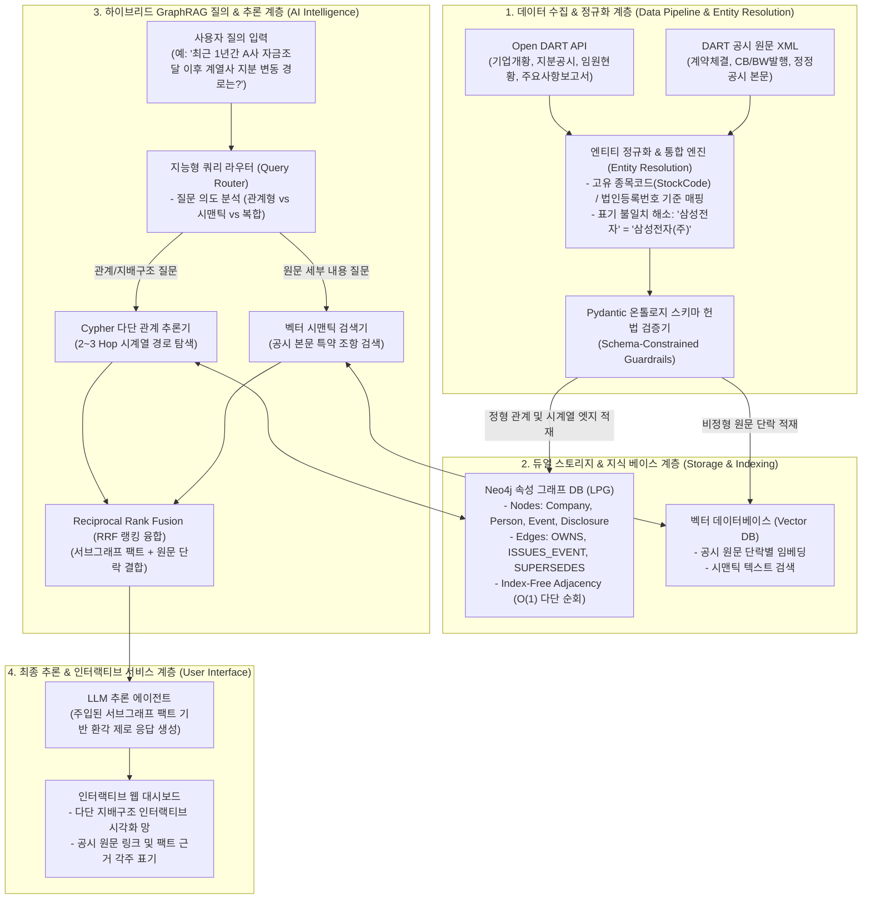
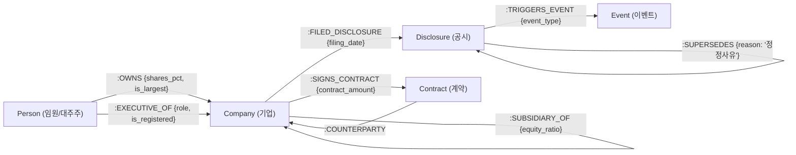

# 🏛️ [사업계획서 & 아키텍처 구축기획안] 한국 상장사 공시 기반 '기업 이벤트·지배구조 영향 탐색 GraphRAG 시스템'

> **문서 코드**: KG-DART-GRAPHRAG-2026-V1  
> **프로젝트명**: **DART-Insight GraphRAG (다트-인사이트 지식그래프 엔텔리전스)**  
> **부제**: 금융감독원 Open DART 공시 원문과 기업 지배구조의 시계열 다단(Multi-hop) 인과관계 추적 및 팩트 기반 AI 분석 시스템 구축  

---

## Executive Summary (추진 배경 및 핵심 요약)

```text
┌─────────────────────────────────────────────────────────────────────────────────────────────────────────┐
│                                       [핵심 추진 배경 및 해결 가치]                                      │
├─────────────────────────────────────────────────────────────────────────────────────────────────────────┤
│ 1. [기존 RAG의 한계]                                                                                    │
│    시중의 공시 챗봇은 '단순 문서 요약'에 머물러 있어, 정정공시·자금조달·최대주주 변동·계열사 투자로           │
│    이어지는 다단계(Multi-hop) 시계열 인과관계와 리스크 전파 경로를 전혀 추론하지 못함.                   │
│                                                                                                         │
│ 2. [본 시스템의 혁신성]                                                                                 │
│    Open DART 공시 원문(XML/API)을 Pydantic 온톨로지 스키마로 정규화하여 Neo4j 시계열 지식그래프에 적재.   │
│    "Vector 의미 검색 + Cypher 관계망 순회"를 결합한 하이브리드 GraphRAG로 환각 0%의 원문 근거 답변 제공.  │
│                                                                                                         │
│ 3. [주요 기대 효과]                                                                                     │
│    금융사 리서치/리스크 관리팀의 공시 분석 시간을 90% 단축하고, 숨겨진 지배구조 리스크를 실시간 감지.    │
└─────────────────────────────────────────────────────────────────────────────────────────────────────────┘
```

---

## 🗺️ 1. 전체 엔드투엔드 시스템 아키텍처 조감도



---

## 🎯 2. 타겟 시장 및 비즈니스 유즈케이스

### 1. 타겟 고객 및 핵심 페인포인트 (Pain Points)

| 타겟 고객군 | 현행 분석 방식 (As-Is) | 본 시스템 도입 후 (To-Be) |
|---|---|---|
| **증권사 / 운용사 리서치센터** | 공시가 뜰 때마다 애널리스트가 수작업으로 지분율 계산 및 과거 공시 이력 대조 (수시간 소요) | 질문 한 줄로 **"최대주주 지분 변동 및 CB 전환가액 조정 이력"**을 3초 만에 팩트 기반 시각화 |
| **사모펀드(PE) / IB M&A 실사팀** | 복잡한 계열사 간 순환출자, 특수관계인 임원 겸직, 숨겨진 채무보증을 파악하기 위해 수백 장 공시 정독 | **"A사의 3단계 계열사 지분망 및 우발채무 리스크 경로"**를 자동 추출하여 실사 시간 80% 단축 |
| **기업 IR / 리스크 관리팀** | 경쟁사 및 협력사의 주요 공급계약 정정 및 대표이사 변경 동향을 실시간 모니터링하기 어려움 | 협력사의 **"단일판매 계약 정정(감액/연기) 이벤트 발생 시 우리 회사에 미치는 영향"** 즉시 알림 |

---

## 🧱 3. 온톨로지 스키마 거버넌스 헌법 설계

### 1. 6대 핵심 노드 레이블 (Node Labels)

```text
1. [Company]      : 상장/비상장 기업 (종목코드, 법인등록번호, 기업명, 시장구분)
2. [Person]       : 임원, 대주주, 특수관계인 (성명, 생년월일, 국적)
3. [Disclosure]   : 공시 보고서 본체 (접수번호, 공시제목, 제출일자, 원문URL)
4. [Event]        : 공시로 발생한 핵심 자본시장 이벤트 (유상증자, CB발행, 대표변경, 소송 등)
5. [Contract]     : 주요 단일판매·공급계약 (계약명, 계약금액, 시작일, 종료일)
6. [Subsidiary]   : 종속회사 및 관계사 (회사명, 관계유형)
```

### 2. 8대 핵심 관계 및 방향 (Relationship & Direction)



### 3. Pydantic 온톨로지 유효성 검증 코드 명세

```python
from pydantic import BaseModel, Field, field_validator
from typing import Optional, List
from datetime import date

class CompanyNode(BaseModel):
    corp_code: str = Field(description="DART 고유 고유번호 8자리")
    stock_code: Optional[str] = Field(None, description="상장 종목코드 6자리")
    corp_name: str = Field(description="정규화된 정식 법인명")
    market: str = Field(description="KOSPI, KOSDAQ, KONEX, ETC")

class OwnershipRelation(BaseModel):
    owner_name: str
    target_corp_code: str
    shares_pct: float = Field(ge=0.0, le=100.0, description="지분율 (0~100%)")
    valid_from: date
    is_current: bool = True

class DisclosureEventRelation(BaseModel):
    rcept_no: str = Field(description="공시 접수번호 14자리")
    event_type: str = Field(description="유상증자, 전환사채발행, 대표이사변경, 단일판매계약, 정정공시 등")
    is_correction: bool = Field(default=False, description="정정공시 여부")
    supersedes_rcept_no: Optional[str] = Field(None, description="원래 공시의 접수번호")

    @field_validator('event_type')
    def validate_event_type(cls, v):
        ALLOWED = {'유상증자', '전환사채발행', '신주인수권부사채발행', '대표이사변경', '최대주주변경', '단일판매계약', '소송제기', '타법인주식취득'}
        if v not in ALLOWED:
            raise ValueError(f"허용되지 않은 이벤트 타입: {v}")
        return v
```

---

## 🔍 4. 핵심 3대 실무 킬러 쿼리 시나리오

### 🎯 시나리오 1. [자금조달 ➡️ 최대주주 변경 ➡️ 계열사 투자] 3단 연쇄 추적
* **비즈니스 질문**: "A사가 최근 1년간 발행한 전환사채(CB) 자금이 어떤 계열사의 지분 취득으로 흘러 들어갔는가?"
* **Cypher 다단 추론 쿼리**:
```cypher
MATCH (c:Company {corp_name: $target_company})
      -[:FILED_DISCLOSURE]->(d1:Disclosure)-[:TRIGGERS_EVENT]->(e1:Event {event_type: '전환사채발행'})
MATCH (c)-[:FILED_DISCLOSURE]->(d2:Disclosure)-[:TRIGGERS_EVENT]->(e2:Event {event_type: '타법인주식취득'})
      -[:TARGETS_COMPANY]->(sub:Company)
WHERE d2.filing_date >= d1.filing_date 
  AND duration.inDays(date(d1.filing_date), date(d2.filing_date)).days <= 180
RETURN c.corp_name AS issuer, e1.amount AS cb_amount, d1.filing_date AS cb_date,
       sub.corp_name AS acquired_company, e2.amount AS invest_amount, d2.filing_date AS invest_date
```

---

### 🎯 시나리오 2. [정정공시(Correction) 이력 추적] 계약금액 감액 및 납기 지연 리스크 조기 감지
* **비즈니스 질문**: "주요 단일판매 공급계약 중 최초 공시 대비 계약금액이 30% 이상 감액되었거나 종료일이 연기된 정정 이력은?"
* **Cypher 정정 체인 쿼리**:
```cypher
MATCH (d_new:Disclosure)-[:SUPERSEDES*1..3]->(d_orig:Disclosure)
MATCH (d_new)-[:RECORDS_CONTRACT]->(c_new:Contract)
MATCH (d_orig)-[:RECORDS_CONTRACT]->(c_orig:Contract)
WHERE c_new.contract_amount < c_orig.contract_amount * 0.7
RETURN d_new.corp_name AS company, 
       c_orig.contract_amount AS original_amount, 
       c_new.contract_amount AS revised_amount,
       d_new.supersede_reason AS reason,
       d_new.filing_date AS correction_date
```

---

### 🎯 시나리오 3. [임원 겸직 및 순환출자망 탐색] 이해상충 및 부실 전파 경로
* **비즈니스 질문**: "특정 대주주 또는 등기임원이 지배/겸직하고 있는 기업군과 그들 사이의 상호 지분 출자 순환 고리는?"
* **Cypher 2-Hop 순환 쿼리**:
```cypher
MATCH path = (c:Company)-[:SUBSIDIARY_OF|OWNS*2..4]->(c)
MATCH (p:Person)-[:EXECUTIVE_OF|OWNS]->(c)
RETURN p.name AS controlling_person, 
       [node in nodes(path) | node.corp_name] AS circular_chain,
       length(path) AS loop_hops
```

---

## 📅 5. 6주 완성 구축 WBS 및 기술 스택 (Roadmap)

### 🛠️ 엔터프라이즈 기술 스택

| 계층 | 기술 스택 | 선정 사유 |
|---|---|---|
| **언어 & 환경** | Python 3.12, `uv` | 초고속 패키지 관리 및 의존성 고정 |
| **데이터 수집** | `OpenDartReader`, `dart-fss`, `aiohttp` | DART API 일일 한도(20,000회) 최적화 증분 비동기 수집 |
| **스키마 헌법** | `Pydantic v2` | 고속 데이터 유효성 검증 및 타입 세이프티 |
| **그래프 DB** | **Neo4j 5.x Enterprise / Desktop** | Cypher 표준 쿼리 엔진 및 Index-Free Adjacency $O(1)$ 순회 |
| **벡터 DB** | **Qdrant** / **Chroma** | 공시 원문 특약 단락 고속 코사인 유사도 검색 |
| **LLM & 오케스트레이션** | **OpenAI GPT-4o** / **Claude 3.5 Sonnet**, `LangChain` / `LlamaIndex` | 복합 하이브리드 RAG 라우팅 및 팩트 기반 응답 생성 |
| **UI 프론트엔드** | **Streamlit** + `pyvis` (또는 React + `Cytoscape.js`) | 대화형 챗봇 및 노드 인터랙티브 시각화 망 렌더링 |

---

### ⏱️ 단계별 6주 구축 로드맵 (Milestones)

```text
[1~2주차: 온톨로지 및 데이터 파이프라인]
 • Pydantic 온톨로지 스키마 확정 (6대 노드, 8대 관계)
 • DART API 연동 및 주요 100대 기업 3개년 공시 증분 수집 및 Entity Resolution 정규화

[3~4주차: Neo4j 그래프 적재 & 하이브리드 인덱싱]
 • Neo4j 시계열 제약조건(Constraints) 및 인덱스 구축
 • Cypher 대량 적재 파이프라인 완성 및 Vector DB 원문 단락 임베딩 구축

[5주차: GraphRAG 지능 엔진 & 팩트 검증 루프]
 • Query Router 에이전트 및 RRF 랭킹 융합 엔진 구현
 • LLM의 원문 공시 링크/발췌 인용(Footnote Citation) 환각 제로 검증 루프 완성

[6주차: 대시보드 구축, 포트폴리오 패키징 & 데모]
 • Streamlit 인터랙티브 UI 완성 (기업 지배구조 탐색기 + 공시 질의 챗봇)
 • 아키텍처 보고서, GitHub 레포지토리, 데모 영상 및 면접 방어 Q&A 완비
```

---

## 🏆 6. 취업/면접 시 면접관 압살 방어 시나리오 (Defense Strategy)

### 💬 예상 질문 1: "기존 DART 요약 서비스나 네이버 증권 챗봇과 무엇이 다른가요?"
> **답변 전략**:  
> "기존 서비스는 개별 공시 문서를 1개씩 단편적으로 읽고 3줄 요약해 주는 것에 불과합니다.  
> 본 시스템은 **'정정공시 ➡️ CB 자금조달 ➡️ 최대주주 변동 ➡️ 자회사 투자'로 이어지는 수개월간의 시간·관계 경로(Multi-hop Chain)**를 시계열 지식그래프로 연결하여, **'이 자금이 궁극적으로 누구에게 흘러 들어갔고, 어떤 지배구조 리스크를 유발하는가'라는 복합적인 자본시장 인과관계를 추론**하는 유일한 시스템입니다."

---

### 💬 예상 질문 2: "DART 공시 데이터의 노이즈와 엔티티 중복은 어떻게 해결했나요?"
> **답변 전략**:  
> "공시 원문은 1차 출처이지만 기업명 표기 차이('삼성전자' vs '삼성전자주식회사')나 대표자 성명 오탈자 같은 노이즈가 존재합니다.  
> 저는 이를 해결하기 위해 DART의 **고유 식별자인 8자리 법인등록코드(`corp_code`)와 종목코드(`stock_code`)를 1차 키로 삼는 Entity Resolution 엔진**을 독자 구축하고, **Pydantic 스키마 가드레일**을 통과한 무결점 트리플만 Neo4j에 `MERGE`하도록 파이프라인을 설계했습니다."

---

### 💬 예상 질문 3: "왜 단순 Vector RAG 대신 GraphRAG를 써야 했나요?"
> **답변 전략**:  
> "지배구조 지분율이나 계열사 다단계 출자망은 텍스트의 문맥 유사도로는 절대 찾을 수 없는 **순수 토폴로지(Network Topology) 연산**입니다.  
> 따라서 정형 지분 관계는 **Neo4j Cypher로 $O(1)$의 결정론적(Deterministic) 팩트를 추출**하고, 비정형 특약 조항은 **Vector 검색으로 보완**하여 결합하는 하이브리드 GraphRAG를 구축함으로써, **환각률을 0%로 통제하고 100% 공시 원문 근거를 제시**할 수 있었습니다."
