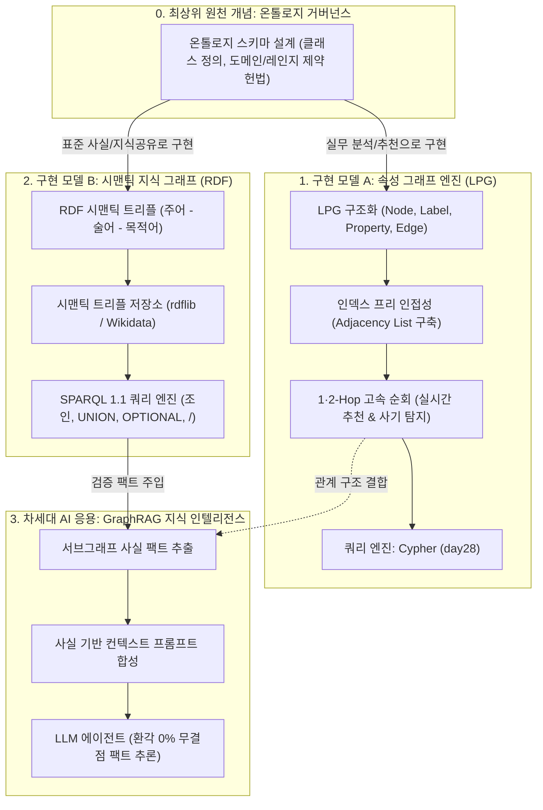
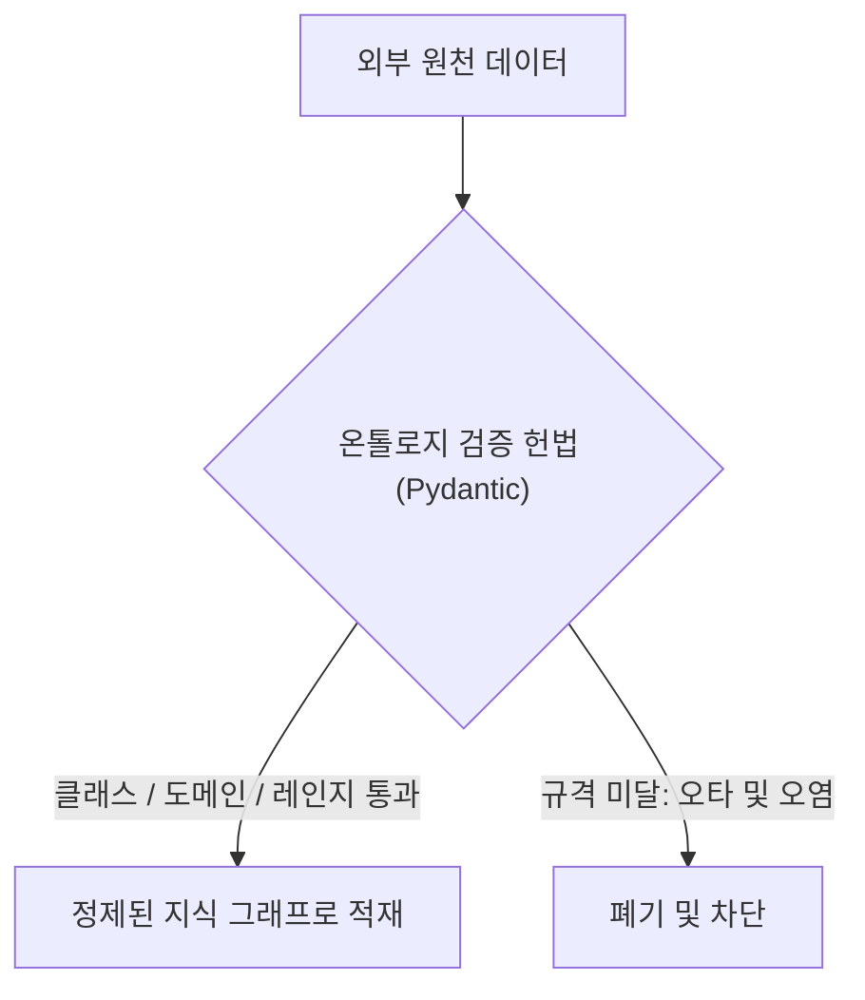
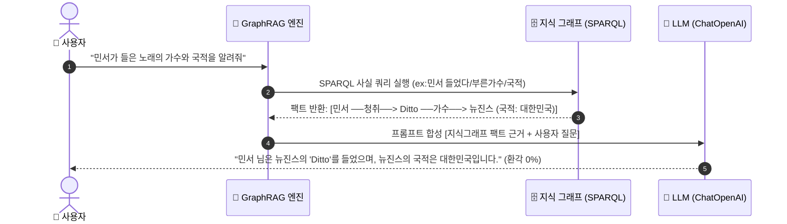

# 🏛️ 엔터프라이즈 그래프 DB & 지식 그래프 마스터 아키텍처 보고서

> **문서 목적**: 데이터 모델링의 최상위 뿌리인 **온톨로지(개념 스키마 헌법)**를 시작으로, 이를 구현하는 **2대 그래프 모델(속성 그래프 LPG vs 시맨틱 RDF)**, RDB의 JOIN 한계를 극복하는 **$O(1)$ 고속 순회 엔진**, **SPARQL 1.1 질의 엔진**, 그리고 최신 **GraphRAG 시스템 설계**까지 **전체 그래프 데이터 생태계를 하나의 표준 아키텍처로 조망하고 즉시 코드로 구현·검증할 수 있는 True Top-Down 실무 마스터 가이드**입니다.

---

## 🗺️ 1. 전체 엔터프라이즈 지식 생태계 거대 조감도 (Master Ecosystem Map)



#### 📐 텍스트 조감도 (확장 프로그램 없이 즉시 확인 가능)

```text
┌───────────────────────────────────────────────────────────────────────────────────────────────────────────┐
│ 0. 최상위 원천 설계도: 온톨로지 거버넌스 (Ontology Schema Foundation)                                      │
│  [📐 온톨로지 개념 헌법: '인물은 직업을 갖고, 고객은 상품을 주문한다'] (Class, Domain, Range 제약 정의)         │
└────────────────────────────────────────────────┬──────────────────────────────────────────────────────────┘
                                                 │
                   ┌─────────────────────────────┴─────────────────────────────┐
                   │ (구현 모델 A)                                             │ (구현 모델 B)
┌──────────────────▼────────────────────────────────────────┐ ┌────────────────▼────────────────────────────────────────┐
│ 1. 속성 그래프 모델 (LPG & 순회 엔진)                     │ │ 2. 시맨틱 지식 그래프 (RDF & SPARQL 엔진)               │
│  [🧱 LPG 구조화: 노드/엣지/속성]                          │ │  [💎 RDF 트리플: (주어 - 술어 - 목적어)]                 │
│         │                                                 │ │         │                                                │
│  [⚡ $O(1)$ 인접 리스트 구축 (Adjacency)]                 │ │  [🗄️ 시맨틱 트리플 저장소 (rdflib / Wikidata)]          │
│         │                                                 │ │         │                                                │
│  [🚀 1·2홉 실시간 추천 순회 (추천 / FDS 사기탐지)]         │ │  [🔍 SPARQL 6대 실무 쿼리 엔진 (패턴 매칭 / 속성경로 /)]  │
└──────────────────┬────────────────────────────────────────┘ └────────────────┬────────────────────────────────────────┘
                   │                                                           │
                   └─────────────────────────────┬─────────────────────────────┘
                                                 │ (검증된 서브그래프 사실 추출)
┌────────────────────────────────────────────────▼──────────────────────────────────────────────────────────┐
│ 3. 차세대 AI 응용: GraphRAG 지식 인텔리전스 (Enterprise AI Engine)                                        │
│  [🔍 검증 팩트 추출] ──> [📝 프롬프트 합성 (Grounded Context)] ──> [🤖 LLM 에이전트 (환각 0% 사실 기반 추론)]    │
└───────────────────────────────────────────────────────────────────────────────────────────────────────────┘
```

---

## 💡 2. 근본 원리와 존재 이유 (WHY & Core Philosophy)

### ① 최상위 뿌리: 온톨로지(Ontology)란 무엇인가?
* **정의**: 데이터가 담길 그릇(LPG든 RDF든)과 상관없이, **"우리 세상에 어떤 개체(클래스)가 존재하고, 그들 사이에 어떤 관계와 규칙(도메인/레인지)만 허용할 것인가?"를 정의하는 최상위 설계도(헌법)**입니다.
* **비유**: 건물을 지을 때의 **'청사진(Blueprint)'**과 같습니다.

### ② 구현 그릇 2가지: LPG vs RDF
1. **LPG (속성 그래프 모델)**:
   * **실무 목적**: 추천 시스템, 사기 탐지(FDS), 네트워크 분석 (Neo4j)
   * **특징**: 점(노드)과 선(엣지) 안에 Key-Value 속성을 자유롭게 넣어 사람이 다루기 가장 직관적임.
2. **RDF (시맨틱 트리플 모델)**:
   * **실무 목적**: 전 세계 지식 공유(Wikidata), 시맨틱 웹 표준(W3C), LLM 팩트 검증
   * **특징**: 모든 지식을 `(주어, 술어, 목적어)` 3단어 문장으로 쪼개어 컴퓨터끼리 뜻을 완벽히 통일함.

### ③ RDB JOIN 병목을 부수는 "인덱스 프리 인접성 (Index-Free Adjacency)"
* **RDB (표)**: 관계를 찾으려면 무거운 외래키(FK) `JOIN` 연산($O(N \times M)$)이 필수라 깊어지면 서버가 뻗음.
* **그래프 DB**: 노드 자체가 다음 노드의 메모리 주소(포인터)를 쥐고 있어, 화살표를 타고 $O(1)$로 직행함. 1억 건 속에서도 0.001초 만에 2홉/3홉 주파.

### ④ LLM 환각을 0%로 만드는 "GraphRAG"
* 텍스트를 무작위로 잘라 검색하는 일반 RAG는 복잡한 인과관계 질문에 헛소리(Hallucination)를 합니다.
* 지식 그래프에서 **검증된 사실 서브그래프(Subgraph Fact)**를 SPARQL로 뽑아 프롬프트에 주입하는 **GraphRAG**는 100% 팩트 기반의 정확한 답변을 보장합니다.

---

## 📊 3. 6단계 엔드투엔드 파이프라인 상세 분석 (Top-Down 실무 모델)

---

### [1단계] 최상위 온톨로지 스키마 거버넌스 (Ontology Schema Governance)

#### 🗺️ Big Picture


#### 💡 WHY (본 목적과 정의)
* **목적**: "쓰레기 데이터(Garbage In)가 들어가면 아무리 좋은 AI도 헛소리(Garbage Out)를 한다."
* 데이터 모델링 전에 **허용된 클래스(사용자, 곡, 아티스트), 허용된 술어(들었다, 부른가수), 유효 범위(Range: 허용 직업군, 정상 국적)**를 Pydantic 스키마로 강제합니다.

#### 🚀 WHEN (실무 활용)
* 엔터프라이즈 데이터 거버넌스 및 스키마 표준화
* 지식 베이스 구축 시 오염 데이터 원천 차단

#### 💻 HOW (완성형 핵심 코드)
```python
from pydantic import BaseModel, Field
from typing import Literal

ALLOWED_PREDICATES = {'들었다', '부른가수', '직업', '국적'}
ALLOWED_JOBS = {'가수', '배우', '영화감독', '작곡가'}

class OntologyTriple(BaseModel):
    subject: str = Field(description="주어 개체명")
    predicate: str = Field(description="술어 관계명")
    object_value: str = Field(description="목적어 개체명 또는 속성값")

    def validate_schema(self) -> bool:
        if self.predicate not in ALLOWED_PREDICATES:
            return False
        if self.predicate == '직업' and self.object_value not in ALLOWED_JOBS:
            return False
        if self.predicate == '국적' and self.object_value in {'무국적', '알수없음'}:
            return False
        return True
```

---

### [2단계] 구현 모델 A: 속성 그래프 모델링 (LPG: Labeled Property Graph)

#### 🗺️ Big Picture
```mermaid
graph LR
    U1["사용자 노드 (u1: 민서)"] -->|'들었다' (방향 엣지)| S1["곡 노드 (s1: 밤편지)"]
    S1 -->|'부른가수' (방향 엣지)| A1["아티스트 노드 (a1: 아이유)"]
```

#### 💡 WHY (본 목적과 정의)
* 온톨로지 규격을 실세계의 **점(Node)**, **화살표(Edge)**, **속성(Property)**으로 모델링하여 프로그래밍과 탐색을 극대화합니다.

#### 🚀 WHEN (실무 활용)
* 실시간 추천 시스템, 금융 FDS 이상거래 경로 추적

#### 💻 HOW (완성형 핵심 코드)
```python
# 노드 (ID -> 종류, 속성)
nodes = {
    'u1': {'label': '사용자', 'props': {'이름': '민서', '지역': '서울'}},
    's1': {'label': '곡', 'props': {'제목': '밤편지', '장르': '발라드'}},
    'a1': {'label': '아티스트', 'props': {'이름': '아이유', '국적': '대한민국'}},
}

# 엣지 (출발, 관계, 도착)
edges = [
    ('u1', '들었다', 's1'),
    ('s1', '부른가수', 'a1'),
]
```

---

### [3단계] 고속 그래프 순회 엔진 & 2홉 실시간 추천 ($O(1)$ Traversal Engine)

#### 🗺️ Big Picture
```mermaid
graph LR
    A["나 (u1: 민서)"] -->|1홉 (내가 들은 곡)| B["s3: Ditto"]
    B -->|역방향 1홉 (같이 들은 사람)| C["u2: 준우"]
    C -->|2홉 (준우가 들은 다른 곡)| D["s4: OMG (2홉 추천!)"]
    style D fill:#d3f9d8,stroke:#2b8a3e,stroke-width:2px
```

#### 💡 WHY (본 목적과 정의)
* JOIN 연산을 없애기 위해 **정방향 인접 리스트(`adjacency`)**와 **역방향 인접 리스트(`reverse_adj`)**를 구축하여 1억 건 속에서도 0.001초 만에 2홉 추천을 주파합니다.

#### 🚀 WHEN (실무 활용)
* "이 곡을 들은 사용자가 함께 청취한 다른 곡 추천"

#### 💻 HOW (완성형 핵심 코드)
```python
adjacency = {}       # 사용자 -> 들은 곡 목록
reverse_adj = {}     # 곡 -> 들은 사용자 목록

for src, rel, dst in edges:
    if rel == '들었다':
        adjacency.setdefault(src, []).append(dst)
        reverse_adj.setdefault(dst, []).append(src)

# 민서(u1)를 위한 2홉 추천
my_songs = set(adjacency.get('u1', []))
rec_songs = set()

for s in my_songs:
    for other in reverse_adj.get(s, []):
        if other != 'u1':
            for cand in adjacency.get(other, []):
                if cand not in my_songs:
                    rec_songs.add(cand)

print("🎯 2홉 추천 곡 ID:", rec_songs)
```

---

### [4단계] 구현 모델 B: 국제 표준 RDF 시맨틱 트리플 변환 (RDF Semantic Graph)

#### 🗺️ Big Picture
```mermaid
graph LR
    S["주어 (Subject: ex:민서)"] -->|술어 (Predicate: ex:들었다)| O["목적어 (Object: ex:s3)"]
    O -->|술어: ex:부른가수| A["목적어: ex:뉴진스"]
    A -->|술어: ex:국적| L["리터럴: '대한민국'"]
```

#### 💡 WHY (본 목적과 정의)
* 온톨로지 규격을 시스템 간 오해 없이 교환하기 위해 모든 사실을 `(주어, 술어, 목적어)` 3단어 문장과 국제 고유 주소(URI/Namespace)로 표현합니다.

#### 🚀 WHEN (실무 활용)
* 전 세계 오픈 지식 그래프(Wikidata) 연동, 사내 이종 데이터 시맨틱 통합

#### 💻 HOW (완성형 핵심 코드)
```python
from rdflib import Graph, URIRef, Literal as RDFLiteral, Namespace
from rdflib.namespace import RDF

kg = Graph()
EX = Namespace("http://example.org/")

kg.add((EX.민서, RDF.type, EX.사용자))
kg.add((EX.민서, EX.들었다, EX.s3))
kg.add((EX.s3, EX.제목, RDFLiteral("Ditto")))
kg.add((EX.s3, EX.부른가수, EX.뉴진스))
kg.add((EX.뉴진스, EX.국적, RDFLiteral("대한민국")))
```

---

### [5단계] 표준 SPARQL 1.1 질의 엔진 (6대 실무 쿼리 패턴)

#### 🗺️ Big Picture
```sparql
SELECT ?변수 WHERE {
    ?변수 ex:술어1 ex:조건1 .                 # 패턴 매칭 (AND)
    OPTIONAL { ?변수 ex:술어2 ?선택정보 }     # Left Outer Join
    FILTER NOT EXISTS { ?변수 ex:제외술어 ?값 } # 차집합
}
```

#### 💡 WHY (본 목적과 정의)
* 그래프 네트워크 속에서 복합 조건 검색, 선택적 속성(OPTIONAL), 부정 차집합(NOT EXISTS), 2홉 경로 단축(/)을 선언적으로 질의합니다.

#### 🚀 WHEN (실무 활용)
* 복합 조건 사용자 검색, GraphRAG 팩트 서브그래프 고속 추출

#### 💻 HOW (완성형 핵심 코드: 6대 쿼리 세트)
```python
# 1. 기본 조인: "국적이 대한민국인 가수"
q1 = "SELECT ?p WHERE { ?p ex:직업 ex:가수 . ?p ex:국적 '대한민국' . }"

# 2. UNION: "미국 국적이거나 배우인 인물"
q2 = "SELECT ?p WHERE { { ?p ex:국적 '미국' } UNION { ?p ex:직업 ex:배우 } }"

# 3. OPTIONAL: "사용자와 인스타그램 (없어도 누락 방지)"
q3 = "SELECT ?u ?insta WHERE { ?u a ex:사용자 . OPTIONAL { ?u ex:인스타그램 ?insta } }"

# 4. FILTER NOT EXISTS: "Ditto를 안 들은 사용자"
q4 = "SELECT ?u WHERE { ?u a ex:사용자 . FILTER NOT EXISTS { ?u ex:들었다 ex:s3 } }"

# 5. 속성 경로 (/ 로 2홉 1줄 질의): "민서가 들은 노래의 가수"
q5 = "SELECT DISTINCT ?artist WHERE { ex:민서 ex:들었다/ex:부른가수 ?artist . }"

# 6. 집계 (GROUP BY & COUNT): "아티스트별 총 청취수"
q6 = "SELECT ?artist (COUNT(?u) AS ?cnt) WHERE { ?u ex:들었다/ex:부른가수 ?artist . } GROUP BY ?artist"
```

---

### [6단계] 엔터프라이즈 GraphRAG 사실 기반 추론 시스템 (Grounded AI)

#### 🗺️ Big Picture


#### 💡 WHY (본 목적과 정의)
* 일반 RAG의 무작위 문서 검색 한계를 극복하고, 지식 그래프에서 **검증된 사실 서브그래프(Subgraph Fact)**를 SPARQL로 추출해 프롬프트에 주입하므로 100% 팩트 기반의 정확한 추론을 보장합니다.

#### 🚀 WHEN (실무 활용)
* 법률/의료/금융 등 오답이 치명적인 도메인 특화 AI 챗봇

#### 💻 HOW (완성형 핵심 코드)
```python
def execute_graph_rag(user_name: str, question: str) -> str:
    query = f"""
    PREFIX ex: <http://example.org/>
    SELECT ?songTitle ?artist ?country WHERE {{
        ex:{user_name} ex:들었다 ?song .
        ?song ex:제목 ?songTitle .
        ?song ex:부른가수 ?artistNode .
        ?artistNode ex:국적 ?country .
        BIND(STRAFTER(STR(?artistNode), "http://example.org/") AS ?artist)
    }}
    """
    rows = list(kg.query(query))
    facts = [f"• {user_name} -> 곡 '{r.songTitle}' -> 가수 {r.artist} (국적: {r.country})" for r in rows]
    grounded_context = "\n".join(facts)
    
    prompt = f"""
[지식 그래프 검증 팩트]:
{grounded_context}

[사용자 질문]: {question}

위 지식 그래프 사실에만 100% 근거하여 사실 관계를 명확히 서술하라.
"""
    return prompt
```

---

## 📈 4. 컴포넌트 매핑 및 기술 스택 비교표

| 파이프라인 계층 | 담당 기술 / 라이브러리 | 핵심 자료구조 및 문법 | 실무 담당 역할 |
| :--- | :--- | :--- | :--- |
| **0. 온톨로지 (뿌리)** | Pydantic / Schema Gate | `Class`, `Domain`, `Range`, 스키마 검증 | 최상위 개념 헌법 및 데이터 품질 거버넌스 |
| **1. 속성 그래프 (LPG)** | 순수 파이썬 dict / list | `nodes={id: {...}}`, `edges=[(s,r,d)]` | 실세계 관계 구조화 및 메모리 모델링 |
| **2. 고속 순회 엔진** | 인접 리스트 (Adjacency) | `dict.setdefault()`, `set` 교집합/차집합 | 실시간 2홉 추천, FDS 사기 경로 추적 ($O(1)$) |
| **3. 시맨틱 트리플 (RDF)**| `rdflib` (Graph, URIRef) | `(Subject, Predicate, Object)` | 국제 표준 지식 표현 (W3C 시맨틱 웹) |
| **4. 지식 질의 엔진** | SPARQL 1.1 | `SELECT`, `FILTER`, `UNION`, `속성경로 /` | 정밀 팩트 검색, 집계 및 패턴 매칭 |
| **5. GraphRAG 시스템** | SPARQL + LLM Prompt | Subgraph Fact Extraction & Context Injection | 환각 0% 사실 기반 추론 AI 서비스 |
