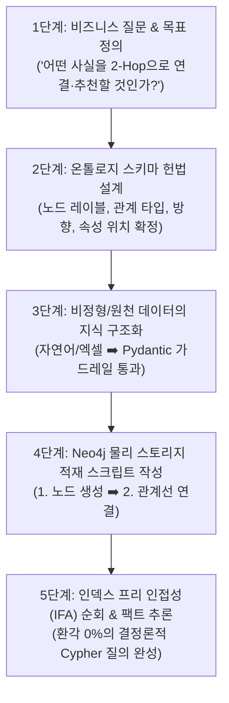
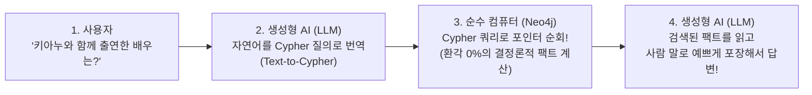

# 🏛️ [마스터 가이드] 지식 그래프(Knowledge Graph) 구축의 전체 절차와 구조적 핵심

> **문서 목적**: 단순한 쿼리 따라치기를 넘어, **"지식 그래프란 도대체 무엇이며, 어떤 절차와 구조적 원리로 설계되고 Neo4j에 물리적으로 적재되는가?"**를 엔터프라이즈 아키텍처 관점에서 완벽하게 정리한 단 하나의 마스터 개념 가이드입니다.

---

## 🗺️ 1. 지식 그래프(Knowledge Graph)의 진짜 정체

### 1) 단순 그래프 DB vs 지식 그래프의 차이

```text
┌────────────────────────────────────────────────────────────────────────────────────────┐
│ 1. 단순 그래프 DB (Graph DB)                                                            │
│    • 아무런 규칙이나 헌법 없이, 그냥 컴퓨터 메모리/디스크에 점과 선만 마구잡이로 그어놓은 것│
├────────────────────────────────────────────────────────────────────────────────────────┤
│ 2. 지식 그래프 (Knowledge Graph) 🌟                                                     │
│    • 현실 세계의 개념과 사실(Fact)을 사전에 정의된 '온톨로지(Ontology) 헌법'에 맞추어  │
│      완벽하게 [구조화]하여 컴퓨터와 AI가 인과관계를 스스로 추론할 수 있게 만든 지식 베이스│
└────────────────────────────────────────────────────────────────────────────────────────┘
```

---

## 🚀 2. 지식 그래프 구축 5단계 전체 엔드투엔드 라이프사이클

지식 그래프는 반드시 아래 **5단계의 엄격한 순서**를 거쳐서 탄생합니다:



---

### [1단계] 비즈니스 질문 & 도달성(Reachability) 목표 정의
* 그래프를 만들기 전에 **"이 지식그래프로 어떤 질문에 답할 것인가?"**를 먼저 정의합니다.
* 예: *"같은 카테고리의 책 추천"*, *"A사 자금조달 후 계열사 지분 변동 경로"*

---

### [2단계] 온톨로지 스키마 헌법 설계 (Ontology Governance)
* 데이터를 넣기 전에 **4대 스키마 규격**을 사전에 협의하여 확정합니다:
  1. **노드 레이블 (명사/개체)**: `:Person`, `:Movie`, `:Company`
  2. **관계 타입 및 방향 (동사/선)**: `(Author) -[:WROTE]-> (Book)`
  3. **노드 속성**: `title`, `name`, `born`
  4. **관계 속성**: `roles`, `rating`, `shares_pct`

---

### [3단계] 비정형/원천 데이터의 "지식 구조화 (Structuring)"
* 단순 전처리(오탈자 청소)를 넘어, 원천 데이터를 스키마 헌법에 맞춰 **트리플(주어-술어-목적어) 형태의 객체로 변환**합니다.
* 예: *"송강호가 기생충에 주연으로 출연했다"*  
  ➡️ `(:Person {name: '송강호'})` ── `[:ACTED_IN {roles: ['기택']}]` ──> `(:Movie {title: '기생충'})`

---

### [4단계] Neo4j 물리 스토리지 적재 스크립트 작성 (`MERGE`)
* Neo4j에 데이터를 넣을 때는 **"점(노드)을 먼저 만들고 ➡️ 그 점들 사이에 선(관계)을 꽂는다"**는 대원칙을 지킵니다:

```cypher
// 1. 노드(점)를 먼저 등록!
MERGE (TheMatrix:Movie {title: 'The Matrix'})
MERGE (Keanu:Person {name: 'Keanu Reeves'})

// 2. 이미 등록된 노드들을 가져와서 가운데 화살표(선)를 꽂는다!
MERGE (Keanu)-[:ACTED_IN {roles: ['Neo']}]->(TheMatrix)
```

---

### [5단계] 인덱스 프리 인접성(IFA) 물리 저장 & 사실 추론
* Neo4j 엔진이 노드 레코드 안에 다음 노드의 물리 메모리 주소 포인터를 기록합니다.
* 이제 Cypher 질의를 던지면 **데이터가 수억 건으로 커져도 $O(1)$의 속도로 2-Hop, 3-Hop 인과관계를 즉시 추론**합니다!

---

## 🧱 3. LPG(Labeled Property Graph) 4대 요소 정밀 해부

```text
( p : Person { born: 1964 } ) ──[ r : ACTED_IN { roles: ['Neo'] } ]──> ( m : Movie { title: 'The Matrix' } )
│ │ └───────┘ └───────────┘ │   │ │ └────────┘ └────────────────┘ │    │ │ └─────┘ └───────────────────┘ │
│ └─ 변수        속성       │   │ └─ 변수            속성         │    │ └─ 변수            속성         │
└───────── 노드 1 ──────────┘   └──────────── 관계(선) ───────────┘    └───────────── 노드 2 ────────────┘
```

| 구분 | 문법적 위치 및 기호 | 성격 | 실무 특징 |
|:---:|:---:|:---:|---|
| **노드 (Node)** | 소괄호 `( )` | **실체 / 명사** (RDB의 행) | 현실 세계의 개체 그 자체 |
| **레이블 (Label)** | 노드 안 콜론(`:`) 뒤 | **종류 / 명찰** (RDB의 테이블) | **다중 레이블 가능** (`:Person:Actor:Director`) |
| **관계 타입 (Rel Type)** | 대괄호 `[ ]` 안 콜론(`:`) 뒤 | **행위 / 동사** (RDB의 FK/조인) | **단일 타입 필수** (`:ACTED_IN`). 방향성 보유 |
| **노드 속성 (Node Prop)** | 노드 안 중괄호 `{ }` | **개체의 고유 수식어** | 단일값 뿐만 아니라 **리스트(배열)도 가능** |
| **관계 속성 (Rel Prop)** | 관계 안 중괄호 `{ }` | **두 개체 간 상호작용 문맥** | **별점(`rating`), 배역(`roles`), 지분율(`shares_pct`)** |

---

## ⚖️ 4. 실무 아키텍트의 양대 핵심 모델링 판정 공식

### 🎯 공식 1. "노드 속성으로 둘 것인가 vs 독립 노드로 승격할 것인가?"

```text
┌────────────────────────────────────────────────────────────────────────────────────────┐
│ Q. "이 값을 통해 다른 데이터와 다리(Bridge)를 놓아 2-Hop으로 연결/추천하는가?"         │
├────────────────────────────────────────────────────────────────────────────────────────┤
│ • 단순 화면 표시용 부가정보일 때 ──> [노드 속성]                                        │
│   예: 출생연도(born: 1964) ➡️ 1964년생끼리 모아서 추천할 일이 없음                    │
│                                                                                        │
│ • 여러 데이터가 공유하며 추천의 허브가 될 때 ──> [독립 노드로 승격!] 🌟               │
│   예: 장르(Genre), 카테고리(Category), 작가(Author), 국가(Country)                     │
│   ➡️ (매트릭스:Movie) ──[:IN_GENRE]──> (SF:Genre) <──[:IN_GENRE]── (인터스텔라:Movie) │
└────────────────────────────────────────────────────────────────────────────────────────┘
```

---

### 🎯 공식 2. "노드 속성으로 둘 것인가 vs 관계 속성으로 둘 것인가?"

```text
┌────────────────────────────────────────────────────────────────────────────────────────┐
│ Q. "그 값이 특정 대상에 고정된 값인가, 아니면 '누가 누구를' 만날 때마다 달라지는가?"    │
├────────────────────────────────────────────────────────────────────────────────────────┤
│ • 대상 자체에 고정된 값 ──> [노드 속성] (예: 책 제목, 발행연도, 사람 이름)             │
│ • 두 개체의 만남(상호작용)마다 달라지는 값 ──> [관계 속성!] 🌟                         │
│   예 1: 별점(rating) ➡️ 독자마다 책에 주는 별점이 다름 (`(Reader)-[:REVIEWED {rating: 5}]->(Book)`) │
│   예 2: 배역(roles)  ➡️ 배우마다 영화에서 맡은 역할이 다름 (`(Person)-[:ACTED_IN {roles: [...]}]->(Movie)`) │
└────────────────────────────────────────────────────────────────────────────────────────┘
```

---

## 🤖 5. 순수 컴퓨터(Neo4j)와 AI(LLM)의 명확한 역할 분담

> **"지식그래프 연산은 AI가 아니라, 순수 컴퓨터(Neo4j)가 Cypher 규칙에 따라 0.001초 만에 기계적으로 수행하는 결정론적(Deterministic) 계산입니다!"**



* **순수 컴퓨터 (Neo4j)**: 포인터를 타고 팩트를 찾아내는 **'무결점 계산 엔진'**
* **생성형 AI (LLM)**: 사람의 말을 컴퓨터 쿼리로 바꾸고 결과를 설명해 주는 **'비서(인터페이스)'**

---

### 💡 최종 결론

1. **지식 그래프는 우연히 만들어지는 것이 아니라, 철저한 [온톨로지 헌법 설계 ➡️ 데이터 지식 구조화 ➡️ Neo4j 물리 적재] 파이프라인을 통해 완성됩니다.**
2. **이 구조적 원리를 이해하고 통제할 수 있는 사람만이 AI 시대에 대체되지 않는 진정한 'AI 데이터 아키텍트'로 인정받습니다!** 🚀
