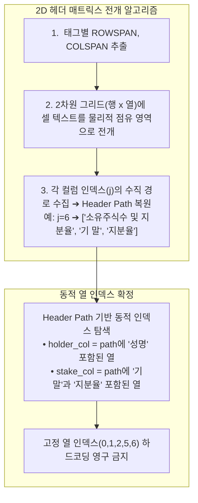
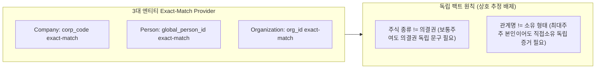

# 🏛️ [DART-Trace v0.4] 변조 탐지 실행 매니페스트 및 감사 영수증 아키텍처 명세서
**문서 식별자:** `DART-TRACE-ARCH-20260903-MANIFEST`  
**문서 버전:** `v1.3.0` (2D 헤더 그리드 및 4대 독립 팩트 검증 규격)  
**작성일자:** `2026-09-03`  
**상태:** `APPROVED_ENTERPRISE_STANDARD`  

---

## 1. 아키텍처 개요 및 제정 목적
본 문서는 DART 지식그래프의 인제스천(Ingestion), 갱신(Update), 논리적 격리(Quarantine) 과정에서 발생할 수 있는 **임의의 데이터 오염, 원천 파괴적 쓰기(DELETE), 사후 추정성 감사, 비정상 프로세스 종료 시 고아 쓰기(Orphan Write)**를 방지하고 탐지·재조정하기 위한 **[변조 탐지 가능한 3대 감사 영수증 아키텍처(Tamper-evident Triple-Receipt Architecture)]**를 규정합니다.

특히 본 버전(`v1.3.0`)에서는 고정 열 인덱스 가정과 속성 간 상호 추정을 영구 배제하기 위한 **[2D 헤더 그리드 동적 매핑 규격]** 및 **[4대 독립 팩트 검증 규격]**을 명문화합니다.

---

## 2. 4대 절대 금지 및 기본 실행 원칙 (Non-Negotiable Rules)

```text
[규칙 1] DELETE / DETACH DELETE 원천 금지 (물리적 롤백 용어 배제)
- 모든 인제스천 파이프라인, 원문 파서, 배치 코드 내에서 DELETE 또는 DETACH DELETE 쿼리의 사용을 문법/정적 분석 수준에서 전면 금지합니다.
- 본 시스템의 '롤백'이란 물리적 삭제가 아니며, 항상 [논리적 격리 및 무효화(Logical Quarantine & Invalidation: is_current=false, verification_status='UNVERIFIED_QUARANTINE')]만을 의미합니다.
- 오파싱되거나 원문 미확인 레코드는 파서 단계에서 DB 생성 자체를 원천 차단(Skip)해야 합니다.

[규칙 2] 기본 실행 모드는 DRY_RUN
- 모든 파서와 배치는 파라미터가 없거나 dry_run=True일 때 실제 DB 쓰기(CREATE/MERGE/SET)를 100% 차단합니다.
- DRY_RUN 모드에서는 오직 변조 탐지 실행 매니페스트(Execution Manifest) 생성 및 Diff 시뮬레이션만 수행합니다.

[규칙 3] 2단계 상태 머신 기반 고아 쓰기 탐지 및 명시적 WRITE
- 작업자가 DRY_RUN 매니페스트를 검증한 후 명시적 --commit 플래그를 입력해야 합니다.
- [PREPARED → DB COMMITTED → RECEIPT FINALIZED] 상태 머신을 통과하며,
  커밋 직후 비정상 종료되더라도 고아 쓰기를 '탐지 및 자동 재조정(Reconciliation)' 가능하도록 보장합니다.

[규칙 4] 4대 독립 팩트 미확인 = DB 적재 대신 skipped_records 기록 (0건 WRITE 정상성 원칙)
- 주식종류(share_class), 의결권(voting_type), 소유형태(ownership_basis), 엔티티PK 등 4대 메타데이터 중
  단 하나라도 공시 원문의 독립적 문구로 입증되지 않거나 마스터 1:1 매핑에 실패하면,
  어떠한 기본값(fallback)도 주입하지 않고 매니페스트의 skipped_records에만 사유와 함께 기록합니다.
- 원문 표에 독립적 법률 증거 필드가 없어 '0건의 WRITE 후보'가 도출되더라도, 이는 실패가 아니라 완벽한 무결성 성공으로 간주합니다.
```

---

## 3. 2D 헤더 그리드 동적 매핑 규격 (Dynamic Header Grid Specification)



### 3.1. 2D 그리드 복원 알고리즘
1. 표의 헤더 행 수 $R$과 총 열 수 $C$를 산출하고, $R \times C$ 크기의 2차원 빈 배열 `grid[r][c]`를 할당합니다.
2. 각 행 $r$의 `<TH>` 셀을 순회하며:
   * 이미 상위 행의 `ROWSPAN`에 의해 점유된 열을 건너뛰고 비어 있는 첫 번째 열 $c$를 찾습니다.
   * 셀의 `rowspan = s_r`, `colspan = s_c`에 해당하는 영역 `grid[r .. r+s_r-1][c .. c+s_c-1]`에 셀 텍스트를 채웁니다.
3. 각 열 $c \in [0, C-1]$에 대해 위에서 아래로 중복을 제거한 텍스트 리스트를 수집하여 `header_paths[c]`를 구성합니다.
4. **엄격 헤더 경로 매칭**:
   * 성명 열: `header_paths[c]`에 `성명` 또는 `성 명`이 포함된 열
   * 기말 지분율 열: `header_paths[c]`에 `기말`(또는 `기 말`)과 `지분율`이 모두 포함된 열
   * 기말 주식수 열: `header_paths[c]`에 `기말`(또는 `기 말`)과 `주식수`가 모두 포함된 열
   * 주식 종류 열: `header_paths[c]`에 `주식의종류`가 포함된 열
5. 위 필수 열 중 단 하나라도 고유하게 매핑되지 않으면, 해당 표는 파싱을 중단하고 `skipped_records`(`UNVERIFIED_HEADER_GRID_LAYOUT`)로 분류합니다.

---

## 4. 4대 독립 팩트 검증 및 마스터 Provider 규격



### 4.1. 3대 공인 엔티티 Exact-Match Provider
* `ExistingEdgeProvider`는 단일 회사가 아닌 3대 엔티티 마스터의 정확 일치를 지원해야 합니다:
  * `resolve_company(name_or_code) -> Optional[corp_code]`
  * `resolve_person(name, resident_no_or_id) -> Optional[global_person_id]`
  * `resolve_organization(name_or_id) -> Optional[org_id]`
* 마스터에 존재하지 않는 주체는 **`planned_creations` 진입을 영구 금지**하며, 반드시 `skipped_records`(`UNRESOLVED_MASTER_ENTITY`)로 격리합니다.

### 4.2. 팩트 독립성 원칙 (No Cross-Field Inferences)
1. **주식 종류(`share_class`) vs 의결권(`voting_type`)**:
   * 원문에 "보통주"라고 적혀 있어도, "의결권 있는 주식"이라는 문구가 별도 독립 필드 또는 행 텍스트에 명시되지 않는 한 `VOTING`으로 승격할 수 없습니다.
   * 원문에 "의결권 있는 주식"이라고만 적혀 있고 주식 종류가 기재되지 않은 경우, `COMMON`으로 단정할 수 없습니다.
2. **관계명(`position`) vs 소유 형태(`ownership_basis`)**:
   * "최대주주 본인"이라는 관계명은 신분일 뿐, 법률상 직접 소유(`DIRECT`)인지 신탁/간접 보유인지의 독립 증거가 아닙니다.
   * 원문 표에 명시적인 소유 형태 컬럼(직접/간접/신탁 등)이 없는 한 `DIRECT`로 단정할 수 없으며, 미기재 시 `skipped_records`(`UNVERIFIED_OWNERSHIP_BASIS`)로 격리합니다.

---

## 5. 결론 및 단계별 이행 로드맵
1. **Step 1**: 2D 헤더 그리드 및 4대 독립 팩트 아키텍처 확정 (본 문서 v1.3.0)
2. **Step 2**: Company/Person/Organization exact-match Provider 인터페이스 정의
3. **Step 3**: 2D 그리드 및 4대 독립 팩트 단위 테스트(`test_dry_run_parser.py`) 작성
4. **Step 4**: `dry_run_parser_engine.py` 2D 그리드 엔진 구현
5. **Step 5**: Aura READ 읽기 전용 통합 테스트 검증
