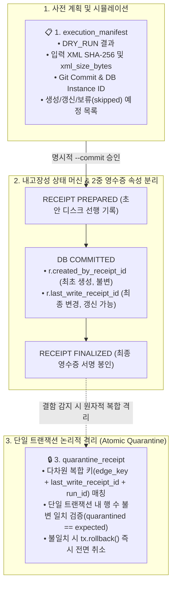

# 🏛️ [DART-Trace v0.4] 변조 탐지 실행 매니페스트 및 감사 영수증 아키텍처 명세서
**문서 식별자:** `DART-TRACE-ARCH-20260903-MANIFEST`  
**문서 버전:** `v1.2.1` (DRY_RUN 프레임워크 설계 기준 명세서 - 혈통 모델 분리)  
**작성일자:** `2026-09-03`  
**상태:** `APPROVED_DRY_RUN_DESIGN_STANDARD`  

---

## 1. 아키텍처 개요 및 제정 목적
본 문서는 DART 지식그래프의 인제스천(Ingestion), 갱신(Update), 논리적 격리(Quarantine) 과정에서 발생할 수 있는 **임의의 데이터 오염, 원천 파괴적 쓰기(DELETE), 사후 추정성 감사, 비정상 프로세스 종료 시 고아 쓰기(Orphan Write)**를 방지하고 탐지·재조정하기 위한 **[변조 탐지 가능한 3대 감사 영수증 아키텍처(Tamper-evident Triple-Receipt Architecture)]**를 규정합니다.

본 문서는 실제 WRITE 프로토타입 개발 전, **[DRY_RUN 파서 프레임워크 설계 기준]**으로 동결 적용됩니다.

---

## 2. 4대 절대 금지 및 기본 실행 원칙 (Non-Negotiable Rules)

```text
[규칙 1] DELETE / DETACH DELETE 원천 금지 (물리적 롤백 용어 배제)
- 모든 인제스천 파이프라인, 원문 파서, 배치 코드 내에서 DELETE 또는 DETACH DELETE 쿼리의 사용을 문법/정적 분석 수준에서 전면 금지합니다.
- 본 시스템의 '롤백'이란 물리적 삭제가 아니며, 항상 [논리적 격리 및 무효화(Logical Quarantine & Invalidation: is_current=false, verification_status='UNVERIFIED_QUARANTINE')]만을 의미합니다.
- 오파싱되거나 원문 미확인 레코드는 파서 단계에서 DB 생성 자체를 원천 차단(Skip)해야 합니다.

[규칙 2] 기본 실행 모드는 DRY_RUN
- 모든 파서와 배치는 파라미터가 없거나 dry_run=True일 때 실제 DB 쓰기(CREATE/MERGE/SET)를 100% 차단합니다.
- DRY_RUN 모드에서는 오직 변조 탐지 실행 매니페스트(Execution Manifest) 생성 및 Diff 시뮬레이션만 수행합니다.

[규칙 3] 2단계 상태 머신 기반 고아 쓰기 탐지 및 명시적 WRITE
- 작업자가 DRY_RUN 매니페스트를 검증한 후 명시적 --commit 플래그를 입력해야 합니다.
- [PREPARED → DB COMMITTED → RECEIPT FINALIZED] 상태 머신을 통과하며,
  커밋 직후 비정상 종료되더라도 고아 쓰기를 '탐지 및 자동 재조정(Reconciliation)' 가능하도록 보장합니다.

[규칙 4] 원문 필드 미확인 = DB 적재 대신 skipped_records 기록
- 주식종류, 의결권, 기준일, 지분율 등 필수 메타데이터 중 단 하나라도 공시 원문 팩트에서 검증되지 않으면,
  어떠한 기본값(fallback)도 주입하지 않고 매니페스트의 skipped_records에만 사유와 함께 기록하고 DB 적재를 보류합니다.
```

---

## 3. 3대 문서 경계 및 영수증 혈통 모델 (Receipt Lineage Model)



### 3.1. `execution_manifest` (실행 매니페스트)
* **생성 시점:** DRY_RUN 및 WRITE 실행 전 준비 단계
* **주요 필드:**
  * `manifest_id`: 고유 식별자 (`MANIFEST_YYYYMMDD_RUNXX`)
  * `status`: `DRY_RUN` | `READY_FOR_COMMIT`
  * `git_commit`: 실행 시점의 Git Commit SHA-1
  * `database_instance_id`: 타겟 Neo4j Aura 인스턴스 ID (예: `a8a048c8`)
  * `input_documents`: 각 `rcept_no`별 원문 XML 파일명, **`xml_size_bytes`**, SHA-256 해시
  * `planned_creations`: 생성 예정 관계 목록
  * `planned_updates`: 갱신 예정 관계 목록
  * `skipped_records`: 원문 미확인/결측으로 인해 적재 보류된 원문 행 및 보류 사유

### 3.2. `write_receipt` (쓰기 영수증 및 2중 영수증 혈통 속성)
본 규격을 준수하는 파이프라인(`v0.5.0+`)이 생성 또는 변경하는 관계는 영수증과의 연결을 위해 **최초 생성 영수증과 최종 변경 영수증을 엄격히 분리**하여 기록합니다:

```cypher
MERGE (holder)-[r:OWNS_STAKE {source_edge_key: $edge_key}]->(target)
ON CREATE SET
    r.created_by_receipt_id = $receipt_id,  // 최초 생성 영수증 (불변 영구 보존)
    r.created_at = datetime()
SET
    r.last_write_receipt_id = $receipt_id,  // 마지막 변경 영수증 (갱신 시 업데이트)
    r.updated_at = datetime()
```

* **적용 범위 한정 원칙**:
  * 본 영수증 속성은 **본 규격을 적용한 파이프라인이 생성·변경한 관계에만 부여**되며, 기존 레거시 관계에 사후 임의 백필하지 않습니다.
* **영수증 상태 머신 (고아 쓰기 탐지/재조정)**:
  1. `PREPARED`: DB 트랜잭션 전 영수증 초안 선행 디스크 기록.
  2. `DB COMMITTED`: Neo4j Aura DB 트랜잭션 완료.
  3. `FINALIZED`: 실제 영향 행 수 및 변경 전/후 상태 해시를 기록하여 최종 봉인.

### 3.3. `quarantine_receipt` (원자적 논리적 격리 영수증)
* **다차원 복합 키 대상화**:
  ```cypher
  UNWIND $targeted_items AS item
  MATCH ()-[r:OWNS_STAKE {
      source_edge_key: item.source_edge_key,
      last_write_receipt_id: item.write_receipt_id,
      ingestion_run_id: item.ingestion_run_id
  }]->()
  SET r.verification_status = 'UNVERIFIED_QUARANTINE',
      r.is_current = false,
      r.quarantine_receipt_id = $quarantine_receipt_id,
      r.quarantined_at = datetime()
  RETURN count(r) AS quarantined_count;
  ```
* **단일 트랜잭션 원자적 가드 (Atomic Guard)**:
  * 하나의 애플리케이션 트랜잭션(`session.begin_transaction()`) 내에서 실행하며,
  * `quarantined_count == expected_count`가 일치하지 않으면 즉시 `tx.rollback()`을 호출하여 부분 격리를 원천 차단합니다.

---

## 4. 해시 체인 블록 규격 및 불변 앵커링 (Hash Chain & Anchoring)

### 4.1. 해시 체인 블록 직렬화 포맷 (Deterministic Block Format)
```text
block_payload = f"{block_index}\n{prev_hash}\n{timestamp}\n{canonical_json_sha256}"
current_block_hash = sha256(block_payload.encode('utf-8')).hexdigest()
```
* `block_index`: 0부터 시작하는 단조 증가 정수
* `prev_hash`: 직전 블록의 `current_block_hash` (제네시스 블록은 `0`*64)
* `canonical_json_sha256`: RFC 8785 표준 키 정렬 후 산출된 SHA-256

### 4.2. Truncation 방어를 위한 외부 앵커링 및 Fail-Closed 정책
* 매 블록 생성 시 `current_block_hash`를 **Git 서명 커밋(Signed Tag/Commit) 및 외부 WORM/보호 브랜치에 즉시 기록(Anchoring)**합니다.
* **Fail-Closed 정책**: 외부 앵커링 또는 WORM 저장에 실패할 경우, 다음 WRITE 배치는 즉시 실행을 중단합니다.

---

## 5. 엔터프라이즈 감사 질의 표준

### 5.1. 엄격 SSOT 5대 조건 투영 불변식 (Zero Active Baseline)
```cypher
MATCH (master)-[r:OWNS_STAKE]->(target:DART_Company)
WHERE r.is_current = true
  AND r.verification_status = 'VERIFIED'
  AND r.source_edge_key IS NOT NULL
  AND r.current_scope IS NOT NULL
  AND r.source_rcept_no IS NOT NULL
  AND r.as_of_date IS NOT NULL
  AND r.stake > 0.0
  AND r.voting_type = 'VOTING'
RETURN count(r) AS active_ssot_count;
```

---

## 6. 결론 및 단계별 이행 규정
1. **문서 지위**: 본 문서는 **DRY_RUN 프레임워크 설계 기준(v1.2.1)**으로 확정합니다.
2. **실행 안전 보류**: 실제 DB WRITE 프로토타입 및 운영 GDS는 본 규격을 100% 충족하는 **DRY_RUN 파서 프레임워크(`dry_run_parser_engine.py`)** 구현 및 검증이 완료된 이후에만 단계적으로 진행합니다.
