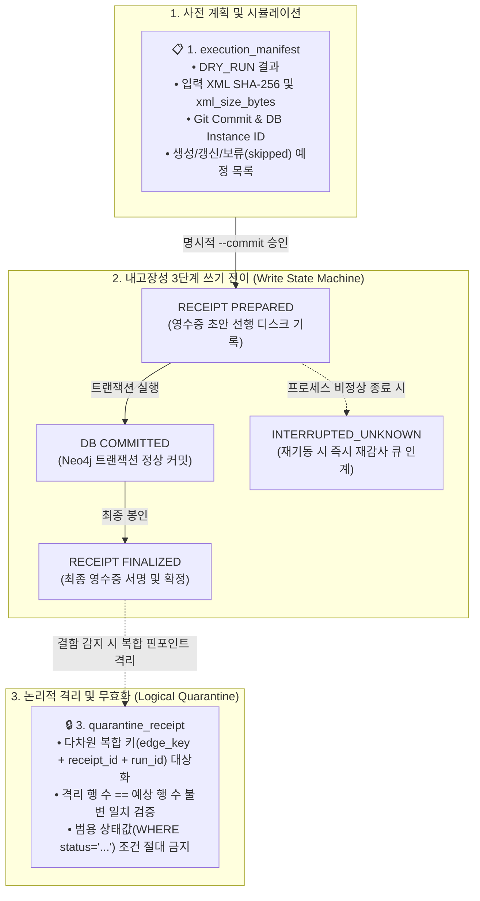
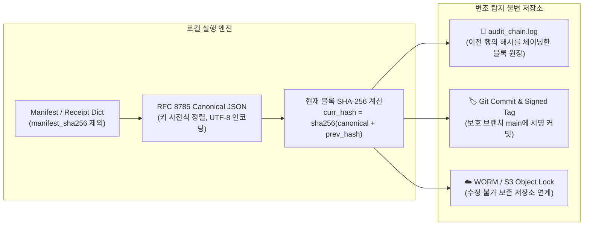

# 🏛️ [DART-Trace v0.4] 변조 탐지 실행 매니페스트 및 감사 영수증 아키텍처 명세서
**문서 식별자:** `DART-TRACE-ARCH-20260903-MANIFEST`  
**문서 버전:** `v1.1.0` (운영 규격 최종 보완본)  
**작성일자:** `2026-09-03`  
**상태:** `APPROVED_ENTERPRISE_STANDARD`  

---

## 1. 아키텍처 개요 및 제정 목적
본 문서는 DART 지식그래프의 인제스천(Ingestion), 갱신(Update), 논리적 격리(Quarantine) 과정에서 발생할 수 있는 **임의의 데이터 오염, 원천 파괴적 쓰기(DELETE), 사후 추정성 감사, 비정상 종료 시 고아 쓰기(Orphan Write)**를 원천 차단하기 위한 **[변조 탐지 가능한 3대 감사 영수증 아키텍처(Tamper-evident Triple-Receipt Architecture)]**를 규정합니다.

---

## 2. 4대 절대 금지 및 기본 실행 원칙 (Non-Negotiable Rules)

```text
[규칙 1] DELETE / DETACH DELETE 원천 금지 (물리적 롤백 용어 배제)
- 모든 인제스천 파이프라인, 원문 파서, 배치 코드 내에서 DELETE 또는 DETACH DELETE 쿼리의 사용을 문법/정적 분석 수준에서 전면 금지합니다.
- 본 시스템의 '롤백'이란 물리적 삭제가 아니며, 항상 [논리적 격리 및 무효화(Logical Quarantine & Invalidation: is_current=false, verification_status='QUARANTINED')]만을 의미합니다.
- 오파싱되거나 원문 미확인 레코드는 파서 단계에서 DB 생성 자체를 원천 차단(Skip)해야 합니다.

[규칙 2] 기본 실행 모드는 DRY_RUN
- 모든 파서와 배치는 파라미터가 없거나 dry_run=True일 때 실제 DB 쓰기(CREATE/MERGE/SET)를 100% 차단합니다.
- DRY_RUN 모드에서는 오직 변조 탐지 실행 매니페스트(Execution Manifest) 생성 및 Diff 시뮬레이션만 수행합니다.

[규칙 3] 2단계 상태 전이 기반 명시적 WRITE (Crash-Fault Tolerant)
- 작업자가 DRY_RUN 매니페스트를 검증한 후 명시적 --commit 플래그를 입력해야 하며,
  영수증 없는 실제 쓰기(Orphan Write)를 방지하기 위해 [PREPARED → DB COMMITTED → RECEIPT FINALIZED] 상태 머신을 통과해야 합니다.

[규칙 4] 원문 필드 미확인 = DB 적재 대신 skipped_records 기록
- 주식종류, 의결권, 기준일, 지분율 등 필수 메타데이터 중 단 하나라도 공시 원문 팩트에서 검증되지 않으면, 어떠한 기본값(fallback)도 주입하지 않고 매니페스트의 skipped_records에만 사유와 함께 기록하고 DB 적재를 보류합니다.
```

---

## 3. 3대 문서 경계 및 내고장성 상태 머신 (Triple Document Boundaries)



### 3.1. `execution_manifest` (실행 매니페스트)
* **생성 시점:** DRY_RUN 및 WRITE 실행 전 준비 단계
* **주요 규격:**
  * `manifest_id`: 고유 식별자 (`MANIFEST_YYYYMMDD_RUNXX`)
  * `status`: `DRY_RUN` | `READY_FOR_COMMIT`
  * `git_commit`: 실행 시점의 Git Commit SHA-1
  * `database_instance_id`: 타겟 Neo4j Aura 인스턴스 ID (예: `a8a048c8`)
  * `input_documents`: 각 `rcept_no`별 원문 XML 파일명, **`xml_size_bytes` (바이너리 바이트 크기)**, SHA-256 해시
  * `planned_creations`: 생성 예정 관계 목록
  * `planned_updates`: 갱신 예정 관계 목록
  * `skipped_records`: 원문 미확인/결측으로 인해 적재 보류된 원문 행 및 보류 사유

### 3.2. `write_receipt` (쓰기 영수증 및 내고장성 상태 머신)
프로세스 충돌(Crash)로 인해 DB에는 쓰기가 반영되었으나 영수증 파일이 누락되는 "고아 쓰기(Orphan Write)"를 원천 방지하기 위해 다음 3단계 전이를 거칩니다:
1. **`PREPARED`**: 트랜잭션 실행 전, 예정 내역과 UUID를 포함한 영수증 초안을 디스크에 영구 기록.
2. **`DB COMMITTED`**: 실제 Neo4j Aura DB 트랜잭션 성공 완료.
3. **`FINALIZED`**: 실제 영향 행 수와 변경 전후 속성 해시를 기록하고 영수증을 최종 서명 봉인.
   * *중간 실패 시:* 영수증 상태가 `INTERRUPTED_UNKNOWN`으로 잔류하여, 다음 시스템 시작 시 자동 재감사/격리 큐로 인계.
* **핵심 분리 필드:**
  * `created_edge_keys`: 신규 생성된 관계 키 배열 (기존 관계 침범 없음 증빙)
  * `updated_edge_keys`: 기존 레코드의 속성이 갱신된 관계 키 배열
  * `pre_post_state_hashes`: 변경된 핵심 관계별 변경 전/후 속성 스냅샷 해시
  * `affected_row_counts`: 실제 DB 영향 행 수

### 3.3. `quarantine_receipt` (논리적 격리 영수증 및 복합 검증 가드)
* **다차원 복합 키 검증 가드**: 키 충돌이나 재사용으로 인한 타 배치 오염을 원천 차단하기 위해 단일 `source_edge_key` 조건 매칭을 금지하고, 반드시 아래 복합 조건으로만 격리합니다:
  ```cypher
  UNWIND $targeted_items AS item
  MATCH ()-[r:OWNS_STAKE {
      source_edge_key: item.source_edge_key,
      write_receipt_id: item.write_receipt_id,
      ingestion_run_id: item.ingestion_run_id
  }]->()
  SET r.verification_status = 'UNVERIFIED_QUARANTINE',
      r.is_current = false,
      r.quarantine_receipt_id = $quarantine_receipt_id,
      r.quarantined_at = datetime()
  RETURN count(r) AS quarantined_count;
  ```
* **행 수 일치 검증 (Count Verification Guard)**:
  * 쿼리 실행 후 실제로 격리된 행 수(`quarantined_count`)가 영수증에 명시된 예상 행 수(`expected_count`)와 **정확히 1:1 일치(`==`)할 때만 최종 성공 처리**합니다. 불일치 시 트랜잭션을 롤백하고 즉시 장애 경보를 발행합니다.

---

## 4. Canonical JSON 해시 체인 및 불변 저장소 연계



1. **순환 참조 방지**:
   * 매니페스트/영수증 본문에서 `manifest_sha256` 필드를 완전히 배제하고, 키를 사전식 정렬한 RFC 8785 Canonical JSON을 해싱합니다.
2. **해시 체인 원장 (`audit_chain.log`)**:
   * 단순 로컬 텍스트 추가가 아닌, **직전 블록의 해시(`prev_hash`)를 입력으로 포함하여 연결된 블록체인 구조**로 기록합니다. (임의의 중간 행 수정 시 후속 체인 전체가 파괴되어 변조 즉각 탐지)
3. **불변 저장 위치 고정**:
   * 산출된 블록 해시는 로컬에 머물지 않고, **Git 서명 커밋(Signed Git Commit / Tag)** 및 **수정 이력이 보존되는 원격 저장소(GitHub main 보호 브랜치 및 WORM 스토리지)**에 즉시 푸시하여 영구 봉인합니다.

---

## 5. 엔터프라이즈 감사 질의 표준

### 5.1. 엄격 SSOT 5대 조건 투영 불변식 (Zero Active Baseline)
```cypher
MATCH (master)-[r:OWNS_STAKE]->(target:DART_Company)
WHERE r.is_current = true
  AND r.verification_status = 'VERIFIED'
  AND r.source_edge_key IS NOT NULL
  AND r.current_scope IS NOT NULL
  AND r.source_rcept_no IS NOT NULL
  AND r.as_of_date IS NOT NULL
  AND r.stake > 0.0
  AND r.voting_type = 'VOTING'
RETURN count(r) AS active_ssot_count;
```

---

## 6. 결론 및 다음 단계
1. **아키텍처 동결**: 본 규격(`v1.1.0`)은 이후 모든 파서 및 배치의 헌법적 기준으로 동결합니다.
2. **다음 단계 이행**: 실제 DB 쓰기 및 GDS는 계속 보류하며, 본 규격을 100% 준수하는 **DRY_RUN 전용 파서 프레임워크(`dry_run_parser_engine.py`)**의 설계 및 단위 테스트 프로토타이핑을 진행합니다.
