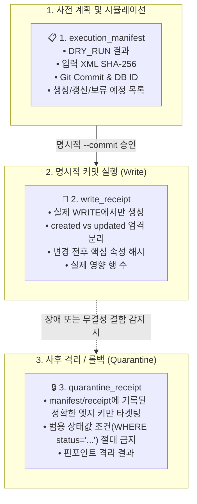
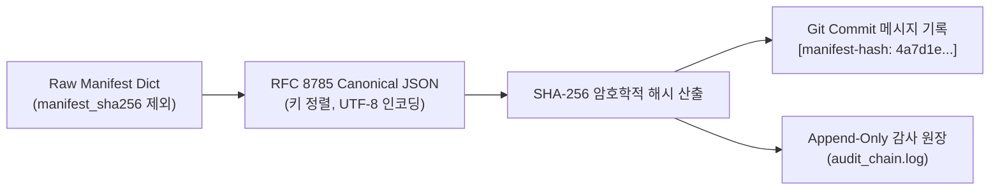

# 🏛️ [DART-Trace v0.4] 변조 탐지 실행 매니페스트 및 감사 영수증 아키텍처 명세서
**문서 식별자:** `DART-TRACE-ARCH-20260903-MANIFEST`  
**문서 버전:** `v1.0.0`  
**작성일자:** `2026-09-03`  
**상태:** `APPROVED_ARCHITECTURE`  

---

## 1. 아키텍처 개요 및 제정 목적
본 문서는 DART 지식그래프의 인제스천(Ingestion), 갱신(Update), 격리(Quarantine), 롤백(Rollback) 과정에서 발생할 수 있는 **임의의 데이터 오염, 원천 파괴적 쓰기(DELETE), 사후 추정성 감사**를 원천 차단하기 위한 **[변조 탐지 가능한 3대 감사 영수증 아키텍처(Tamper-evident Triple-Receipt Architecture)]**를 규정합니다.

---

## 2. 4대 절대 금지 및 기본 실행 원칙 (Non-Negotiable Rules)

```text
[규칙 1] DELETE / DETACH DELETE 원천 금지
- 모든 인제스천 파이프라인, 원문 파서, 배치 코드 내에서 DELETE 또는 DETACH DELETE 쿼리의 사용을 문법/정적 분석 수준에서 전면 금지합니다.
- 오파싱되거나 불명확한 레코드는 파서 단계에서 DB 생성 자체를 원천 차단(Skip)해야 합니다.

[규칙 2] 기본 실행 모드는 DRY_RUN
- 모든 파서와 배치는 파라미터가 없거나 dry_run=True일 때 실제 DB 쓰기(CREATE/MERGE/SET)를 100% 차단합니다.
- DRY_RUN 모드에서는 오직 변조 탐지 실행 매니페스트(Execution Manifest) 생성 및 Diff 시뮬레이션만 수행합니다.

[규칙 3] 명시적 2단계 승인 하의 WRITE
- 작업자가 DRY_RUN으로 생성된 매니페스트와 Diff를 사전 육안 검증한 뒤, 명시적 승인 플래그(--commit 또는 commit=True)를 입력했을 때만 실제 DB 트랜잭션이 실행됩니다.

[규칙 4] 원문 필드 미확인 = DB 적재 대신 skipped_records 기록
- 주식종류, 의결권, 기준일, 지분율 등 필수 메타데이터 중 단 하나라도 공시 원문 팩트에서 검증되지 않으면, 어떠한 기본값(fallback)도 주입하지 않고 매니페스트의 skipped_records에만 사유와 함께 기록하고 DB 적재를 보류합니다.
```

---

## 3. 3대 문서 경계 (Triple Document Boundaries)



### 3.1. `execution_manifest` (실행 매니페스트)
* **생성 시점:** DRY_RUN 및 WRITE 실행 전 준비 단계
* **역할:** 작업 범위, 입력 원천 데이터의 무결성 해시, 환경 정보, 변경 예정 사항을 명세
* **주요 필드:**
  * `manifest_id`: 고유 식별자 (`MANIFEST_YYYYMMDD_RUNXX`)
  * `status`: `DRY_RUN` | `READY_FOR_COMMIT`
  * `git_commit`: 실행 시점의 Git Commit SHA-1
  * `database_instance_id`: 타겟 Neo4j Aura 인스턴스 ID (예: `a8a048c8`)
  * `input_documents`: 각 `rcept_no`별 원문 XML 파일명, 글자 수, SHA-256 해시
  * `planned_creations`: 생성 예정 관계 목록
  * `planned_updates`: 갱신 예정 관계 목록
  * `skipped_records`: 원문 미확인/결측으로 인해 적재 보류된 원문 행 및 보류 사유

### 3.2. `write_receipt` (쓰기 영수증)
* **생성 시점:** 작업자의 명시적 `--commit` 플래그로 실제 DB 트랜잭션이 성공한 직후
* **역할:** 실제 DB에 발생한 물리적 변경 내역을 증빙
* **주요 필드:**
  * `receipt_id`: 고유 식별자 (`RECEIPT_WRITE_YYYYMMDD_RUNXX`)
  * `associated_manifest_id`: 연결된 `execution_manifest` ID
  * `status`: `SUCCEEDED` | `FAILED`
  * `started_at` / `finished_at`: 트랜잭션 시작/종료 시각
  * `created_edge_keys`: 신규 생성된 `source_edge_key` 배열
  * `updated_edge_keys`: 기존 레코드의 속성이 갱신된 `source_edge_key` 배열
  * `pre_post_state_hashes`: 변경된 핵심 관계별 변경 전/후 속성 스냅샷 해시
  * `affected_row_counts`: 노드/관계 생성 및 수정 행 수 실측치

### 3.3. `quarantine_receipt` (격리 영수증)
* **생성 시점:** 적재된 배치에 데이터 결함이 발견되어 격리 마이그레이션을 수행했을 때
* **역할:** 범용 조건(`WHERE status = '...'`)을 배제하고, 오직 해당 배치의 영수증에 기재된 키 목록만 핀포인트로 격리했음을 증빙
* **주요 필드:**
  * `quarantine_id`: 고유 식별자 (`RECEIPT_QUARANTINE_YYYYMMDD_RUNXX`)
  * `target_write_receipt_id`: 격리 대상 `write_receipt` ID
  * `targeted_edge_keys`: 격리 실행된 정확한 `source_edge_key` 목록
  * `quarantine_action`: `verification_status = 'UNVERIFIED_QUARANTINE'`, `is_current = false`
  * `active_ssot_count_after`: 격리 후 엄격 SSOT 투영 건수 실측치 (목표: 0건)

---

## 4. Canonical JSON 해싱 및 순환 참조 방지 메커니즘

### 4.1. 순환 참조 문제의 정의
매니페스트 JSON 내부에 `"manifest_sha256": "..."` 필드를 포함하고 파일 전체를 해싱하면, 해시값 자체가 해시 입력에 포함되어 자기 참조 순환 모순이 발생합니다. 또한 JSON 파일과 해시를 동시에 변조하면 무단 변경을 감지할 수 없습니다.

### 4.2. 표준 검증 프로토콜 (Canonical JSON Hashing)
1. **해시 제외 Canonical화**:
   * 매니페스트 본문에서 `manifest_sha256` 필드를 제외합니다.
   * 키를 사전식(Lexicographical)으로 정렬하고, 공백을 표준화한 RFC 8785 Canonical JSON을 생성합니다.
2. **SHA-256 계산**:
   * `hash = sha256(canonical_json_bytes).hexdigest()`
3. **이중 기록 및 증빙 (Append-Only Commit)**:
   * 산출된 SHA-256 해시를 매니페스트 본문이 아닌, **Git 커밋 메시지** 및 **Append-Only 감사 로그 파일(`audit_chain.log`)**에 기록합니다.
   * 필요 시 시스템 서명 키(Ed25519)로 해시를 전자 서명하여 무단 수정을 원천 탐지합니다.



---

## 5. 엔터프라이즈 감사 Cypher 질의 표준

### 5.1. 매니페스트 기반 핀포인트 격리 Cypher
```cypher
// 범용 조건이 아닌, write_receipt에 서명된 엣지 키 목록만 정확히 타겟팅
UNWIND $targeted_edge_keys AS target_key
MATCH ()-[r:OWNS_STAKE {source_edge_key: target_key}]->()
SET r.verification_status = 'UNVERIFIED_QUARANTINE',
    r.is_current = false,
    r.quarantine_receipt_id = $quarantine_receipt_id,
    r.quarantined_at = datetime()
RETURN count(r) AS quarantined_count;
```

### 5.2. 표준 엄격 SSOT 5대 조건 투영 불변식
```cypher
MATCH (master)-[r:OWNS_STAKE]->(target:DART_Company)
WHERE r.is_current = true
  AND r.verification_status = 'VERIFIED'
  AND r.source_edge_key IS NOT NULL
  AND r.current_scope IS NOT NULL
  AND r.source_rcept_no IS NOT NULL
  AND r.as_of_date IS NOT NULL
  AND r.stake > 0.0
  AND r.voting_type = 'VOTING'
RETURN count(r) AS active_ssot_count;
```

---

## 6. 결론 및 이행 로드맵
* 본 규정 제정 이후 작성되는 모든 DART 공시 파서(`v0.5.0+`)는 본 아키텍처를 준수해야 합니다.
* 실제 데이터 재적재 및 운영 GDS 실행은 본 아키텍처에 기반한 `DRY_RUN` 파서 및 `write_receipt` 검증 도구가 완비된 이후에만 단계적으로 승인 가동합니다.
