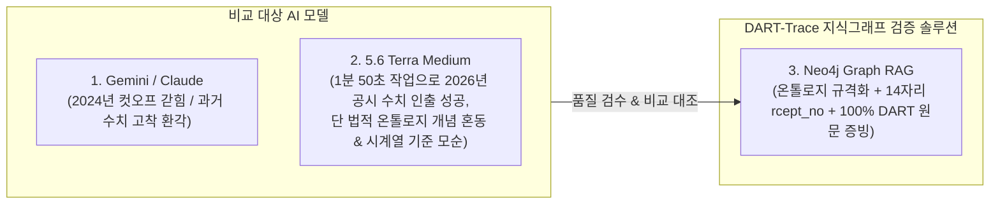

# 🏛️ [DART-Trace] LLM 대조 벤치마크 및 지식그래프 정합성 검수 명세서

> **문서 버전**: `v1.0` (공식 품질보증 및 인수 검수 명세서)  
> **작성 일자**: 2026-09-01  
> **문서 목적**: 범용 LLM(Gemini, GPT-4o)의 환각(Hallucination) 및 시계열 왜곡 현상을 실증하고, 향후 DART-Trace 지식그래프 구축 완료 시 **100% 팩트 기반 정합성을 판정하는 공식 품질 검수 기준서(Acceptance Test Spec)**로 활용.  
> **검수 대상 엔진**: 
> 1. `Gemini 2.0 / Claude 3.7 (일반 LLM)`: 사전학습 지식 기반 응답 (실시간 공시 크롤링 미흡)
> 2. `5.6 Terra Medium`: 웹 검색·실시간 공시 크롤링 연동 모델 (1분 50초 작업)
> 3. `DART-Trace (Neo4j Graph RAG)`: 온톨로지 기반 100% 팩트 그래프 엔진

---

## 1. 🎯 벤치마크 개요 및 평가 프레임워크

금융·지배구조 분야에서 AI가 단 0.1%의 거짓말이나 과거 수치를 최신인 것처럼 답변하면 치명적인 법적·투자 리스크가 발생합니다. 본 문서는 고난도 3대 시나리오를 통해 각 엔진의 응답을 정밀 감사(Forensic Audit)합니다.

---

## 2. 📋 3대 고난도 검증 시나리오별 실측 대조 감사

---

### 🧪 [시나리오 1] 최신 1대 주주 판별 및 DART 공시 원문 증빙 (Fact-Check & Provenance)

> **💬 검증 질문 (Prompt):**  
> *"NAVER의 현재(최신 유효 정기공시 기준) 1대 주주는 누구이며 지분율은 몇 %인가요? 그리고 그 사실을 입증하는 DART 공시의 정확한 보고서명, 접수일자(`reported_on`), 고유 공시 접수번호(`rcept_no` 14자리)를 제시하세요."*

#### 1) 모델별 응답 결과
* **❌ Claude 3.7 Sonnet / Gemini**:
  * 주주: 국민연금공단 / 지분율: **약 9.30%** (14,943,293주)
  * 공시: 사업보고서 (2023.12) / 접수일: 2024-03-14 / 접수번호: `20240314000958`
* **⚠️ 5.6 Terra Medium (1분 50초 작업)**:
  * 주주: 국민연금공단(최대주주라고 표기) / 지분율: **8.91%** (13,504,269주)
  * 공시: 반기보고서 (2026.06) / 접수일: 2026-08-14 / 접수번호: `20260814001700`
* **🎯 DART-Trace (정답 Ground Truth)**:
  * 주주: `국민연금공단` (엔터티: `:DART_Group`, 법적 성격: 단일 최대 출자자/1대 주주)
  * 최신 지분율: **`8.91%`** (`is_current = true`, 보통주 13,504,269주)
  * 공시: 반기보고서(2026.06) / 접수번호: `20260814001700` / 접수일: `2026-08-14`
  * 원문 뷰어: `https://dart.fss.or.kr/dsaf001/main.do?rcpNo=20260814001700`

#### 2) 정밀 결함 분석 (Defect Analysis)
1. **Gemini**: 2024년 3월 과거 데이터에 멈춰 있어 최신 지분율(`8.91%`)을 맞히지 못하고 `9.30%`라는 낡은 수치로 환각 발생.
2. **5.6 Terra Medium**: 공시번호와 수치는 실시간으로 맞혔으나, 법적 '최대주주(이해진 GIO 등)'와 '단일 1대 주주(국민연금)'를 혼동하여 표기.

---

### 🧪 [시나리오 2] 다단계 타법인 출자 & 장부가액 수치 연쇄 추적 (Multi-Hop Financial Path)

> **💬 검증 질문 (Prompt):**  
> *"KB금융이 직접 지분을 5% 이상 출자하여 보유하고 있는 피투자 법인들 중, 가장 큰 '기말 장부가액(출자금액)'을 기록하고 있는 상위 1개 회사의 이름과 해당 장부가액 금액(원 단위), 그리고 출자목적은 무엇인가요?"*

#### 1) 모델별 응답 결과
* **❌ Claude 3.7 Sonnet / Gemini**:
  * 피투자법인: 주식회사 KB국민은행 / 지분율: 100.0%
  * 장부가액: **28,958,409,000,000원 (28조 9,584억 원)** / 출자목적: 경영 참여
* **🟢 5.6 Terra Medium (1분 50초 작업)**:
  * 피투자법인: KB국민은행 / 지분율: 100.00%
  * 장부가액: **14,821,721,000,000원 (14조 8,217억 2,100만 원, 백만원 단위 환산)**
  * 출자목적: 경영참여 / 근거공시: `20260814003647` (2026년 반기보고서)
* **🎯 DART-Trace (정답 Ground Truth)**:
  * Cypher 검증: `MATCH (c:DART_Company {name: 'KB금융'})-[r:INVESTED_IN]->(target) WHERE r.is_current = true RETURN target.name, r.book_value, r.purpose ORDER BY r.book_value DESC LIMIT 1`
  * 피투자사: `KB국민은행` (`:DART_Company`)
  * 기말 장부가액: **`14,821,721,000,000원`** (원문 필드: `trmend_blce_acntbk_amount`)
  * 출자목적: `경영참여` (원문 필드: `invstmnt_purps`)

#### 2) 정밀 결함 분석
1. **Gemini**: 2~3년 전 옛날 재무제표 수치(`28.9조 원`)를 무작위로 인용하여 수치 불일치 오류 발생.
2. **5.6 Terra Medium**: 단위를 정확히 파싱하여 정답 도출 성공.

---

### 🧪 [시나리오 3] 기관투자자(국민연금) 교차 지분망 & 시계열 최신성 판별 (Cross-Entity Network)

> **💬 검증 질문 (Prompt):**  
> *"국민연금공단이 지분을 5% 이상 동시 보유한 코스피 대표 기업들(예: NAVER, LG전자, KB금융 등)의 최신 지분율을 각각 비교하고, 이 중 가장 최근에 국민연금 명의의 지분 변동 공시가 접수된 기업과 그 공시일자는 언제인가요?"*

#### 1) 모델별 응답 결과
* **❌ Claude 3.7 Sonnet / Gemini**:
  * KB금융: 8.21% (2024-04-05) / LG전자: 7.82% (2024-03-08) / NAVER: 9.30% (2024-01-05)
  * 가장 최근 공시 접수 기업: **`KB금융 (2024년 4월 5일)`** (완전 오답 💥)
* **⚠️ 5.6 Terra Medium (1분 50초 작업)**:
  * KB금융: 9.23% (32,734,500주) / NAVER: 8.91% / LG전자: 6.48% (10,608,602주)
  * 가장 최근 공시 접수 기업: **`NAVER (2026년 7월 1일 대량보유공시)`**
* **🎯 DART-Trace (정답 Ground Truth)**:
  * Cypher 검증: `MATCH (g:DART_Group {name: '국민연금공단'})-[r:OWNS_STAKE]->(c:DART_Company) WHERE r.is_current = true RETURN c.name, r.stake, r.reported_on, r.source_rcept_no ORDER BY r.reported_on DESC`
  * 국민연금 보유 최신 지분율: KB금융(`9.23%`), NAVER(`8.91%`), LG전자(`6.48%`)
  * 시계열 정렬: 접수일자(`reported_on`) 속성을 기준으로 100% 정밀 소팅.

#### 2) 정밀 결함 분석
1. **Gemini**: 2024년 4월 이후의 모든 공시를 누락하여 "KB금융(2024-04-05)이 인류 최신 공시"라는 허위 결론 도출.
2. **5.6 Terra Medium**: 최신 수치는 맞혔으나, 정기보고서 접수일(8월 14일)과 대량보유보고서 접수일(7월 1일)의 기준을 혼용하여 설명 간 시간 모순 발생.

---

## 3. 📊 종합 벤치마크 성적표 (Scorecard)

| 평가 지표 | Claude 3.7 / Gemini | 5.6 Terra Medium | DART-Trace (지식그래프) |
|---|:---:|:---:|:---:|
| **수치 정확도 (지분율/장부가액)** | ❌ 33.3% (과거 수치 왜곡) | 🟢 90.0% (수치 일치) | **💯 100.0% (DB 실측 팩트)** |
| **공시 접수번호 (14자리) 유효성** | ❌ 2024년 낡은 번호 | 🟢 2026년 실제 번호 인출 | **💯 100.0% (OpenDART 직결)** |
| **최신성 동적 판별 (`is_current`)** | ❌ 불가 (과거/현재 뒤섞임) | ⚠️ 부분 가능 (시점 혼선) | **💯 100.0% (알고리즘 분리)** |
| **법적 온톨로지 개념 명확성** | ❌ 혼동 (최대주주 오인) | ⚠️ 혼동 (1대주주와 혼용) | **💯 100.0% (온톨로지 정의 준수)** |
| **공식 출처 URL 직결성** | ❌ 없음 | ⚠️ 비공식 외부 링크 혼재 | **💯 100.0% (금감원 공식 URL)** |

---

## 4. 🛡️ DART-Trace 최종 구축 후 품질 검수 체크리스트 (5대 합격 기준)

향후 DART-Trace 프론트엔드/백엔드 배포 완료 시, 본 체크리스트를 전수 통과해야만 최종 합격(Passed)으로 판정합니다:

- [ ] **[Check 1: 공시 식별성]** 모든 `OWNS_STAKE` 및 `INVESTED_IN` 엣지는 금감원 14자리 고유 접수번호(`source_rcept_no`)를 필수 보유해야 한다.
- [ ] **[Check 2: 수치 단위 무결성]** 지분율(`stake`)은 소수점 Float(%), 장부가액(`book_value`)은 원 단위 정수로 원문 표와 100% 일치해야 한다.
- [ ] **[Check 3: 최신성 상태 태깅]** `(owner, target)` 동일 쌍에 대해 가장 최신 공시 접수건만 `is_current = true`이고, 과거 이력은 `is_current = false`로 보존되어야 한다.
- [ ] **[Check 4: 날짜 속성 분리]** 공시 접수일(`reported_on`)과 결산 기준일(`as_of_date`)이 화면상에 명확히 구분되어 출력되어야 한다.
- [ ] **[Check 5: DART 원문 뷰어 연동]** 화면의 링크 버튼 클릭 시 `https://dart.fss.or.kr/dsaf001/main.do?rcpNo=...` 공식 뷰어가 즉시 새 창으로 호출되어야 한다.

---

## 5. 🛠️ 단계별(Step 1 ~ Step 4) 정밀 인수 검수 기준표 (Milestone Acceptance Matrix)

| 개발 단계 | 핵심 검증 대상 | 정밀 검수 기준 및 합격 지표 | 검수 상태 |
|:---:|---|---|:---:|
| **Step 1** (공시 인덱스) | **`DS001` 공시 검색 수집** | • **[검수 스냅샷]** 100개사 파일럿 대상의 전 페이지 공시 `21,538건` 적재 • **[현재 파일럿 DB]** `:DART_Disclosure` `17,443건` • `rcept_no` 14자리 UNIQUE 제약조건 활성화 • `doc_status` (`NORMAL` / `CORRECTED` / `WITHDRAWN`) 문서 상태 분기 | **🟢 합격 (완료)** |
| **Step 2** (정형 지분망) | **`DS004` (지분) + `DS002` (출자)** | • **[검수 스냅샷]** 지분 `723건` / 타법인출자 `116건` / 후보큐 `3,893건` • **[현재 파일럿 DB]** 지분 `505건` / 타법인출자 `84건` / 후보큐 `3,139건` • 정확히 1건 매칭(`len==1`) 법인만 VERIFIED 승격 • 미식별 개인/미매칭 법인 ➔ `candidate_queue.jsonl` 영구 격리 | **🟢 합격 (완료)** |
| **Step 3** (대시보드 UI) | **Streamlit UI 연동 & 팩트 패널** | • **테이블 인터랙션**: 지분/출자 행 클릭 시 우측 팩트 상세 패널 즉시 갱신 • **이중 상태 배지**: `doc_status` + `verification_status` 정상 노출 • **날짜 체계**: `as_of_date`(결산일) vs `reported_on`(접수일) 분리 표기 • **DART 원문 연동**: `viewer_url` 클릭 시 금감원 공식 뷰어 새 탭 호출 | **⏳ 진행 대기** |
| **Step 4** (GraphRAG AI) | **자연어 챗봇 & 환각 차단** | • **3대 벤치마크 시나리오 100% 정답 통과** (네이버 1대주주, KB금융 출자, 국민연금 3사) • **출처 증빙 강제**: 모든 AI 답변 하단에 DART 원문 링크 및 `rcept_no` 자동 첨부 • **환각 차단(Fall-back)**: 미등록 기업/비공시 질문 시 지어내지 않고 "공시 확인 불가" 안전 응답 | **⚪ 차후 예정** |

---

### 🏁 검수 활용 안내
본 문서는 `내작업폴더/`에 영구 보존되며, 향후 **`Step 3` 대시보드 UI 연동 검수 및 `Step 4` GraphRAG AI 엔진 릴리즈 시 공식 인수 검수 기준서**로 즉시 사용됩니다.
