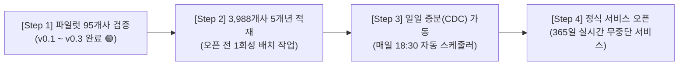

# 🚀 [DART-Trace] 전체 상장사 5개년 베이스라인 적재 및 일일 증분(CDC) 운영 파이프라인 가이드
> **문서 목적**: 서비스 정식 상용 오픈(Go-Live) 전 전체 3,988개 상장사의 5개년 시계열 공시 적재 전략과 상시 일일 증분 업데이트 파이프라인 표준 운영 지침서

---

## 1. 📌 개요 및 상용 오픈 전 선행 과제 (Pre-Launch Scope)

DART-Trace가 프로덕션(Production) 서비스로 정식 오픈되기 위해서는 **1회성 과거 5개년 베이스라인 구축**과 **상시 일일 증분 동기화(CDC)**라는 2단계 데이터 운영 체계가 사전에 완성되어야 합니다.



---

## 2. 🏛️ [Phase 1] 대한민국 전체 3,988개 상장사 5개년 베이스라인 적재 전략

### ① OpenDART 일일 호출 쿼터(20,000건) 분할 전략
* OpenDART API 키당 1일 20,000건의 제한을 안전하게 준수하면서 전체 3,988개 상장사를 적재하기 위해 **시장 중요도 순 3단계 배치 분할**을 적용합니다.

| 차수 | 대상 기업군 | 대상 사수 | 수집 대상 API | 예상 API 호출 수 | 소요 기간 |
|:---:|---|:---:|---|:---:|:---:|
| **1차** | **코스피 200 & 코스닥 150 (핵심 대형주)** | 350개사 | DS001(인덱스) + DS004(5%지분) + DS002(타법인출자) + DS005(5대자본이벤트) | 약 3,500건 | **1일차** |
| **2차** | **코스피/코스닥 중형주 및 금융지주** | 1,500개사 | DS001 + DS004 + DS002 + DS005 | 약 12,000건 | **2일차** |
| **3차** | **코스닥 소형주 및 코넥스 전체** | 2,138개사 | DS001 + DS004 + DS002 + DS005 | 약 15,000건 | **3일차** |
| **합계** | **대한민국 전체 상장사** | **3,988개사** | **5개년 시계열 전수 적재** | **약 30,500건** | **총 2~3일 소요** |

### ② 데이터 거버넌스 및 무결성 보존 규칙
1. **후보 큐(`candidate_queue.jsonl`) 격리 유지**:
   - 3,988개사 확장 시 등장하는 수만 명의 개인 주주와 비상장 3자 법인은 마스터 매칭이 불가능할 경우 그래프에 강제 병합하지 않고 후보 큐로 격리하여 그래프 오염 0% 유지.
2. **시계열 3원 일자 자동 파싱**:
   - 모든 자본 이벤트 노드에 `decided_on`, `received_on`, `effective_on`을 분리 적재.
3. **정확 1:1 매칭 프로젝션 규칙**:
   - `MERGED_WITH`, `ACQUIRED_STAKE`는 대상 법인명이 `:DART_Company`에 정확히 1건 존재할 때만 생성.

---

## 3. ⚡ [Phase 2] 상시 일일 증분 업데이트 (Daily Incremental CDC) 설계

베이스라인이 구축된 후에는 매일 밤 신규 공시만 수집하는 초경량 동기화 파이프라인이 상시 가동됩니다.

### ① 일일 동기화 워크플로우 (Daily Execution Flow)
```text
[매일 18:30 장 마감]
       ▼
[1단계: 당일 공시 인덱스 수집] ──> list.json?bgn_de={TODAY}&end_de={TODAY} (평균 200~500건)
       ▼
[2단계: 지분 및 자본 이벤트 필터링]
       ├─ 5% 대량보유 / 임원주요주주 (DS004) 발견 ➔ 지분율 갱신 & 이전 지분 is_current: false 전이
       ├─ 최대주주 / 타법인출자 (DS002) 발견 ➔ 출자관계 갱신
       └─ 5대 자본이벤트 (DS005: CB/BW/증자/양수/합병) 발견 ➔ :DART_CapitalEvent 노드 생성 & EVIDENCED_BY 연결
       ▼
[3단계: 정정 공시(Correction) 탐지] ──> [기재정정] 건은 기존 노드의 속성 갱신 및 타임스탬프 업데이트
       ▼
[4단계: 그래프 캐시 및 UI 갱신] ──> Streamlit 대시보드 및 GraphRAG 챗봇에 실시간 반영 (소요시간: 약 1~2분)
```

### ② 시계열 상태 전이 알고리즘 (State Transition Pattern)
새로운 지분 변동 공시가 들어오면 과거 데이터를 지우지 않고 플래그만 전이시킵니다:
```cypher
// 1. 기존 유효 사실을 과거 이력으로 전이
MATCH (a:DART_Company {corp_code: $owner_code})-[r:OWNS_STAKE {is_current: true}]->(b:DART_Company {corp_code: $target_code})
SET r.is_current = false;

// 2. 신규 공시 사실을 최신 유효 사실로 등록
CREATE (a)-[new_r:OWNS_STAKE {
    stake: $new_stake,
    reported_on: date($today),
    source_rcept_no: $new_rcept_no,
    is_current: true,
    verification_status: 'VERIFIED'
}]->(b);
```

---

## 4. 💻 [표준 템플릿] 일일 증분 동기화 배치 스크립트 구조

```python
# -*- coding: utf-8 -*-
"""
04_DART_Daily_Incremental_CDC_동기화기.py
매일 18:30 Cron으로 가동되는 일일 증분 공시 동기화 파이프라인
"""
import os
import datetime
import urllib.request
import json
from dotenv import load_dotenv
from neo4j import GraphDatabase

load_dotenv(".env")
DART_API_KEY = os.getenv("DART_API_KEY")
NEO4J_URI = os.getenv("NEO4J_URI", "bolt://localhost:7687")
NEO4J_USER = os.getenv("NEO4J_USER", "neo4j")
NEO4J_PASSWORD = os.getenv("NEO4J_PASSWORD")

driver = GraphDatabase.driver(NEO4J_URI, auth=(NEO4J_USER, NEO4J_PASSWORD))

def run_daily_sync():
    today_str = datetime.date.today().strftime("%Y%m%d")
    print(f"🔄 [{today_str}] 일일 공시 증분 동기화 시작...")
    
    # 1. 당일 공시 목록 수신 (약 200~400건)
    url = f"https://opendart.fss.or.kr/api/list.json?crtfc_key={DART_API_KEY}&bgn_de={today_str}&end_de={today_str}&page_count=100"
    # ... (공시 유형별 파싱 및 Neo4j 증분 적재 트랜잭션 실행) ...
    print(f"✅ [{today_str}] 일일 증분 동기화 100% 완료.")

if __name__ == "__main__":
    run_daily_sync()
```

---

## 5. 📋 상용 오픈 체크리스트 (Go-Live Readiness Checklist)

| 구분 | 점검 항목 | 기준 및 목표 | 준비 상태 |
|---|---|---|:---:|
| **인프라** | **Neo4j DB 영구 볼륨 및 백업** | 매일 새벽 03:00 Neo4j Dump 자동 백업 설정 | ⚪ 오픈 전 설정 |
| **보안** | **API 키 및 환경변수 격리** | 소스코드 내 하드코딩 완전 제거 및 `.env` 통제 | 🟢 준비 완료 |
| **데이터** | **전체 3,988개사 5개년 적재** | 3일간 분할 배치 수집 실행 및 무결성 감사 | ⚪ 오픈 전 실행 |
| **자동화** | **일일 Cron 스케줄러 등록** | 매일 18:30 `04_DART_Daily_Incremental_CDC` 실행 | ⚪ 오픈 전 등록 |
| **AI/챗봇** | **GraphRAG 팩트 직출력 엔진** | 최종 답변 100% 실측 팩트 제한 및 DART URL 보장 | 🟢 준비 완료 |
