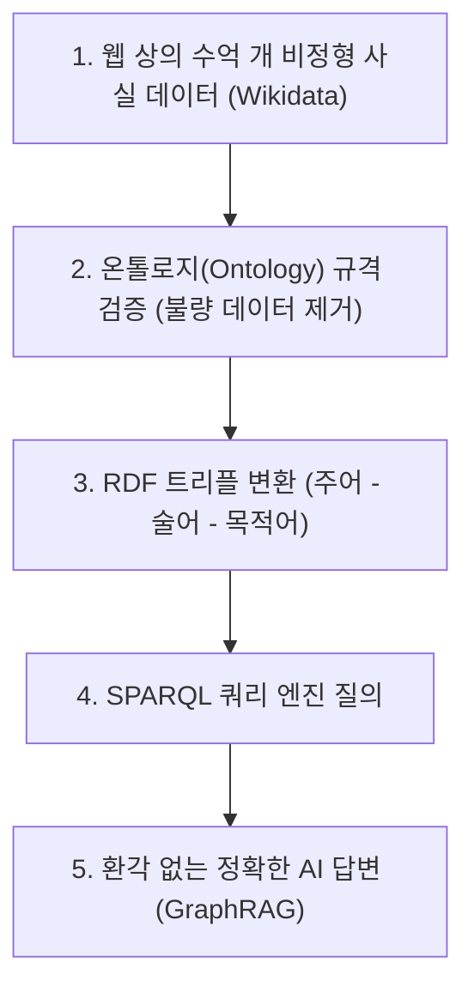

# 🧠 Day 27: 그래프 DB & 지식 그래프 (Top-Down 실무 마스터 가이드)

> **이 가이드의 목적**  
> 복잡하고 불친절한 교안 코드를 외우는 것이 아니라, **"실무에서 왜 그래프 구조를 쓰고, 데이터가 어떻게 흘러가는지"**를 1초 만에 파악할 수 있도록 Top-Down 실무 아키텍처 관점으로 재구성한 문서입니다.

---

# 📑 목차
1. [PART 1. 관계형 DB (RDB) vs 그래프 DB (LPG 모델)](#part-1-관계형-db-rdb-vs-그래프-db-lpg-모델)
2. [PART 2. 그래프 순회 (1홉·2홉 실무 추천 알고리즘)](#part-2-그래프-순회-1홉2홉-실무-추천-알고리즘)
3. [PART 3. 지식 그래프 (Knowledge Graph) & RDF 트리플 & 온톨로지](#part-3-지식-그래프-knowledge-graph--rdf-트리플--온톨로지)
4. [PART 4. SPARQL 쿼리 언어 실무 마스터](#part-4-sparql-쿼리-언어-실무-마스터)

---

# PART 1. 관계형 DB (RDB) vs 그래프 DB (LPG 모델)

## 🗺️ 1. Big Picture (5분 지도)

```mermaid
flowchart LR
    subgraph RDB["1. 기존 RDB 방식 (표 연결)"]
        T1["고객 테이블 (c1)"] -->|JOIN/Merge| T2["주문 테이블 (o1)"]
        T2 -->|JOIN/Merge| T3["상품 테이블 (p1)"]
        style RDB fill:#f9f9f9,stroke:#ff6b6b,stroke-width:2px
    end

    subgraph GRAPH["2. 그래프 DB 방식 (LPG: 노드 + 관계)"]
        N1["민준 (c1: 고객)"] -->|'주문' 화살표| N2["노트북 (p1: 상품)"]
        N1 -->|'주문' 화살표| N3["마우스 (p2: 상품)"]
        N3 <--|'주문'| N4["서연 (c2: 고객)"]
        style GRAPH fill:#eef9ff,stroke:#339af0,stroke-width:2px
    end
```

---

## 💡 2. WHY (본 목적과 정의)
> **"전화번호부 대조 vs 내비게이션 길찾기"** (10초 비유)

* **기존 RDB (표)**: 
  * "민준이가 산 물건을 산 다른 사람은 또 뭘 샀지?"를 알려면 고객표, 주문표, 상품표를 계속해서 `JOIN`(`merge`)해야 합니다.
  * 데이터가 100만 건만 넘어가도 DB가 뻗습니다.
* **그래프 DB (LPG: Labeled Property Graph)**:
  * 점(노드)과 화살표(관계)로 데이터를 저장하므로, 이미 길이 연결되어 있습니다.
  * `JOIN` 연산 없이 화살표만 타고 넘어가기 때문에 데이터가 1억 건이어도 **0.001초 만에 즉시 탐색**합니다. (이를 **인덱스 프리 인접성, Index-free Adjacency**라 부름)

---

## 🚀 3. WHEN (실무 활용)
* **쇼핑몰/OTT 추천**: "이 상품을 본 고객이 함께 구매한 상품" (2홉 탐색)
* **FDS (이상 금융거래 탐지)**: 대포통장 10단계를 거쳐 돈이 세탁되는 경로 실시간 추적
* **SNS 친구 추천**: "내가 알 수도 있는 사람 (친구의 친구)"

---

## 💻 4. HOW (완성형 핵심 코드 & 코드의 숨은 목적 WHY)

### 📌 코드 설계의 숨은 목적 (WHY)
1. **왜 `nodes`를 딕셔너리로 만들었는가?**  
   $\rightarrow$ `nodes['c1']`처럼 ID만 던져주면 $O(1)$로 이름/속성을 1초 만에 꺼내오기 위해!
2. **왜 `edges`를 `(출발, 관계, 도착)` 튜플로 만들었는가?**  
   $\rightarrow$ 화살표의 방향(`c1` $\rightarrow$ `p1`)과 관계 이름(`주문`)을 정형화하기 위해!
3. **왜 `adjacency` 인접 사전을 만드는가?**  
   $\rightarrow$ 무거운 표 병합(Merge) 대신, 내 이웃 목록을 0초 만에 바로 꺼내기 위해!

```python
# [실행 가능한 완성형 코드]
# 1. 노드(점) 정의: ID -> {종류(label), 속성(props)}
nodes = {
    'c1': {'label': '고객', 'props': {'이름': '민준'}},
    'c2': {'label': '고객', 'props': {'이름': '서연'}},
    'c3': {'label': '고객', 'props': {'이름': '지호'}},
    'p1': {'label': '상품', 'props': {'상품명': '노트북'}},
    'p2': {'label': '상품', 'props': {'상품명': '마우스'}},
    'p3': {'label': '상품', 'props': {'상품명': '키보드'}},
    'p4': {'label': '상품', 'props': {'상품명': '이어폰'}},
    'p5': {'label': '상품', 'props': {'상품명': '모니터'}},
}

# 2. 엣지(화살표) 정의: (출발, 관계, 도착)
edges = [
    ('c1', '주문', 'p1'),
    ('c1', '주문', 'p2'),
    ('c2', '주문', 'p2'),
    ('c2', '주문', 'p3'),
    ('c2', '주문', 'p4'),
    ('c3', '주문', 'p1'),
    ('c3', '주문', 'p5'),
]

# 3. 정방향/역방향 인접 딕셔너리 구축
adjacency = {}       # 고객 -> 주문한 상품 목록
reverse_adj = {}     # 상품 -> 주문한 고객 목록

for src, rel, dst in edges:
    adjacency.setdefault(src, []).append(dst)
    reverse_adj.setdefault(dst, []).append(src)

# 4. 조회 (JOIN 없이 1초 만에 이웃 찾기)
print("민준(c1)이 산 상품 ID:", adjacency['c1']) # ['p1', 'p2']
minjun_items = [nodes[pid]['props']['상품명'] for pid in adjacency['c1']]
print("민준이 산 상품 이름:", minjun_items) # ['노트북', '마우스']
```

---
---

# PART 2. 그래프 순회 (1홉·2홉 실무 추천 알고리즘)

## 🗺️ 1. Big Picture (5분 지도)

```mermaid
graph LR
    A["나 (c1: 민준)"] -->|1홉 (정방향)| B["내가 산 상품 (p2: 마우스)"]
    B -->|1홉 (역방향)| C["같은 상품 산 다른 사람 (c2: 서연)"]
    C -->|2홉 (정방향)| D["그 사람이 산 다른 상품 (p3, p4)"]
    
    style D fill:#d3f9d8,stroke:#2b8a3e,stroke-width:2px
```

---

## 💡 2. WHY (본 목적과 정의)
* **1홉(1-hop)**: 화살표를 딱 **1번** 건너간 거리 (내가 산 상품)
* **2홉(2-hop)**: 화살표를 **2번** 건너간 거리 (내가 산 상품을 산 사람이 산 다른 상품)
* **역방향 딕셔너리가 필요한 이유**: 
  화살표가 `고객 -> 상품`으로만 그어져 있어서, 반대로 `상품 -> 고객`으로 되짚어 가려면 방향을 뒤집은 인접 사전(`watched_by` 또는 `reverse_adj`)이 반드시 필요함!

---

## 💻 3. HOW (실무 2홉 추천 완성 코드)

```python
# [재현(v2)에게 영화 추천하는 실무 2홉 추천 로직]
# 1) 내가 본 영화 집합 (1홉)
my_watched = set(watched_adj.get('v2', [])) # {'m2', 'm3', 'm4'}

recommended = set()

# 2) 내가 본 영화들을 순회
for mid in my_watched:
    # 그 영화를 본 다른 사람들 찾기 (역방향 1홉)
    for other_user in watched_by.get(mid, []):
        if other_user == 'v2':
            continue # 나 자신은 제외
        
        # 그 사람이 본 영화들 찾기 (2홉)
        for candidate_mid in watched_adj.get(other_user, []):
            # 내가 이미 본 영화는 제외하고 추천 후보에 추가
            if candidate_mid not in my_watched:
                recommended.add(candidate_mid)

# 3) 영화 ID를 제목으로 변환하여 최종 출력
recommended_titles = sorted([movie_nodes[mid]['props']['제목'] for mid in recommended])
print("🎯 재현(v2)님을 위한 추천 영화:", recommended_titles) # ['별빛 아래 도시']
```

---
---

# PART 3. 지식 그래프 & RDF 트리플 & 온톨로지

## 🗺️ 1. Big Picture (5분 지도)



---

## 💡 2. WHY (본 목적과 정의)
> **"단어들의 의미 백과사전 + 데이터 입학 기준표"** (10초 비유)

1. **지식 그래프 (Knowledge Graph)**:
   * 단순 텍스트가 아니라 세상 만물의 사실을 `(주어, 술어, 목적어)` 3단어 문장(트리플)으로 쪼개어 컴퓨터가 뜻을 이해하게 만든 그래프.
   * 예: `(봉준호, 직업, 영화감독)`, `(기생충, 감독, 봉준호)`
2. **온톨로지 (Ontology)**:
   * 지식 그래프에 들어올 데이터의 **"입학 자격 규격(Schema)"**.
   * 예: "인물 노드는 직업 속성을 가져야 하고, 직업 값은 사전에 등록된 10종류 안에서만 허용한다!"처럼 데이터 품질을 통제하는 헌법.

---

## 🚀 3. WHEN (실무 활용)
* **GraphRAG (LLM 환각 제거)**: ChatGPT가 거짓말할 때, 검증된 지식그래프(RDF) 사실을 검색해 정확한 팩트만 주입.
* **Wikidata 자동 수집**: 전 세계 위키백과 데이터베이스에서 SPARQL 쿼리 한 줄로 크롤링 없이 팩트 추출.

---
---

# PART 4. SPARQL 쿼리 언어 실무 마스터

## 🗺️ 1. Big Picture (SPARQL 쿼리 구조)
SQL이 `테이블`을 조회한다면, **SPARQL은 `트리플 패턴`을 조립하여 조회**합니다.

```sparql
SELECT ?구하고싶은변수 WHERE {
    ?변수  ex:술어1  ex:조건값1 .   # 조건 1 (패턴 1)
    ?변수  ex:술어2  ?또다른변수 .   # 조건 2 (패턴 2)
}
```

---

## 💻 2. 실무 필수 SPARQL 패턴 5대 천왕

### ① 기본 패턴 매칭 & 조인 (한국인 가수 찾기)
```sparql
PREFIX ex: <http://example.org/>
SELECT ?person WHERE {
    ?person ex:직업 ex:가수 .
    ?person ex:국적 "대한민국" .
}
```
* **원리**: 두 줄에 똑같이 `?person` 변수를 쓰면, 두 조건을 **동시에 만족하는 사람(AND 조인)**만 뽑아냅니다.

### ② UNION (또는 / OR 조건)
```sparql
SELECT ?person WHERE {
    { ?person ex:국적 "대한민국" }
    UNION
    { ?person ex:국적 "미국" }
}
```

### ③ OPTIONAL (있으면 가져오고 없으면 빈칸)
```sparql
SELECT ?person ?sns WHERE {
    ?person ex:직업 ex:가수 .
    OPTIONAL { ?person ex:인스타그램 ?sns }  # SNS가 없어도 사람은 결과에 포함됨!
}
```

### ④ FILTER NOT EXISTS (부정 조건: ~하지 않은 사람)
```sparql
SELECT ?person WHERE {
    ?person a ex:사용자 .
    FILTER NOT EXISTS { ?person ex:들었다 ex:Ditto }  # Ditto를 안 들은 사용자만!
}
```

### ⑤ 속성 경로 (`/` 로 2홉을 한 줄에 적기)
```sparql
# 조인 2줄로 쓰던 것:
# ?user ex:들었다 ?song .
# ?song ex:부른가수 ?artist .

# 속성 경로 1줄로 단축:
SELECT ?artist WHERE {
    ex:민서 ex:들었다/ex:부른가수 ?artist .
}
```
* **원리**: 중간에 거치는 곡(`?song`)을 임시 변수로 둘 필요 없이, `/` 슬래시 하나로 화살표 2개를 연속 통과합니다.

---

## 📊 종합 핵심 요약표

| 비교 항목 | 관계형 DB (RDB) | 속성 그래프 (LPG, Neo4j) | 지식 그래프 (RDF, SPARQL) |
|---|---|---|---|
| **기본 단위** | 2차원 테이블 (Row & Column) | 노드(점), 엣지(화살표), 속성(키-값) | 주어 - 술어 - 목적어 (트리플) |
| **연결 방식** | 외래키(FK) + JOIN ($O(N)$ 연산) | 직접 포인터 연결 (순회, $O(1)$) | URI 기반 식별자 연결 |
| **적합한 작업** | 정형 데이터, 단순 집계, 결제/장부 | 추천 시스템, 사기 탐지, 경로 분석 | 개념 체계, 온톨로지, LLM GraphRAG |
| **표준 쿼리** | SQL | Cypher (day28) | SPARQL |
