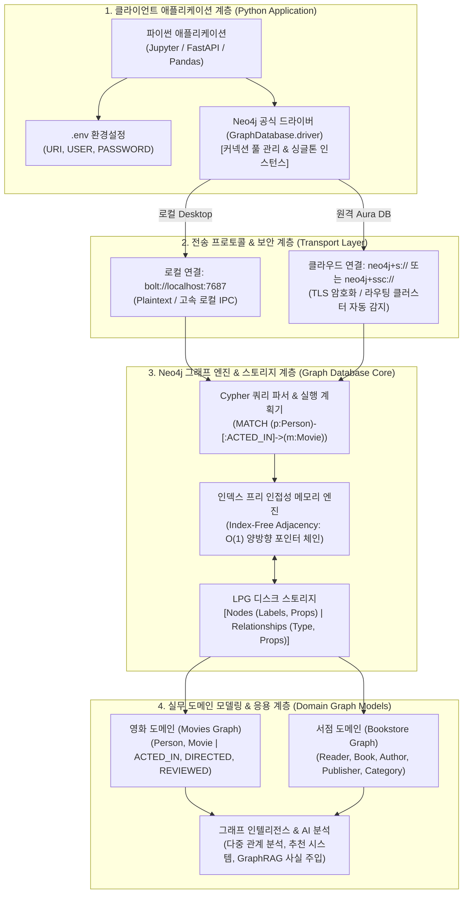
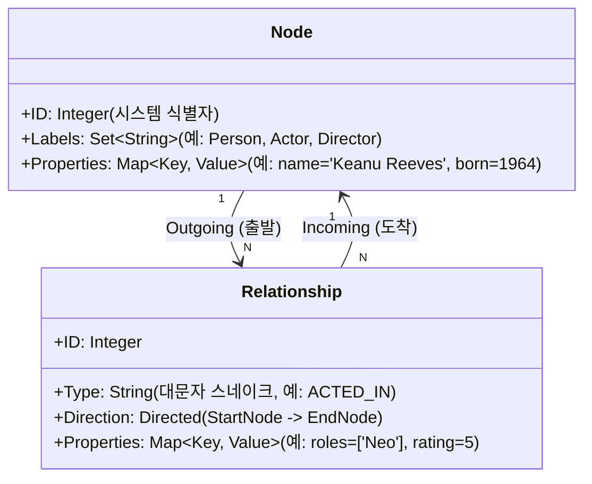
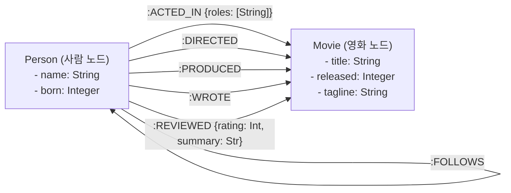
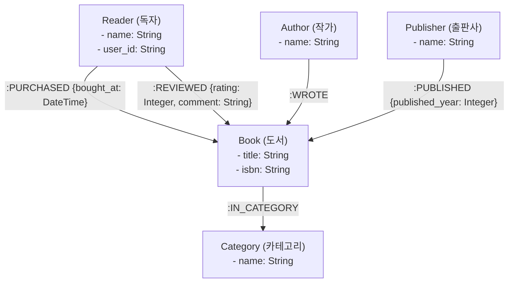

# 🏛️ Neo4j & LPG 그래프 모델 마스터 아키텍처 보고서

> **문서 목적**: 단순한 쿼리 따라치기를 넘어, **Neo4j 드라이버 통신 메커니즘**, **원천 데이터에서 진짜 그래프 DB로 적재되는 ETL 파이프라인**, **LPG(Labeled Property Graph) 4대 핵심 구조와 탄생 과정**, **RDB의 N:M JOIN 한계를 극복하는 포인터 기반 인접성(Index-Free Adjacency)**, **실전 도메인 모델링 헌법**, 그리고 **Movies 데이터셋 분석과 서점 도메인 설계**까지 **Neo4j 그래프 데이터베이스의 전 과정을 엔터프라이즈 아키텍처 관점으로 조망하고 즉시 코드로 검증할 수 있는 True Top-Down 실무 마스터 가이드**입니다.

---

## 🗺️ 1. 전체 엔터프라이즈 그래프 생태계 거대 조감도 (Master Ecosystem Map)



#### 📐 텍스트 조감도 (모든 뷰어 호환)

```text
┌───────────────────────────────────────────────────────────────────────────────────────────────────────────┐
│ 1. 클라이언트 계층: Python App (Jupyter Notebook / FastAPI)                                                │
│  [🔑 .env 환경변수 관리] ──> [🚗 GraphDatabase.driver (싱글톤 커넥션 풀 & 세션 라이프사이클 관리)]        │
└────────────────────────────────────────────────┬──────────────────────────────────────────────────────────┘
                                                 │
                   ┌─────────────────────────────┴─────────────────────────────┐
                   │ (로컬 통신)                                               │ (원격 클라우드 통신)
┌──────────────────▼────────────────────────────────────────┐ ┌────────────────▼────────────────────────────────────────┐
│ 2-A. 로컬 Neo4j Desktop (bolt://localhost:7687)            │ │ 2-B. 원격 Neo4j Aura (neo4j+s:// or neo4j+ssc://)         │
│  - 전용 바이너리 프로토콜 (Bolt v4/v5/v6)                  │ │  - TLS/SSL 암호화 터널링 (보안망 SSL 인증서 처리)         │
└──────────────────┬────────────────────────────────────────┘ └────────────────┬────────────────────────────────────────┘
                   │                                                           │
                   └─────────────────────────────┬─────────────────────────────┘
                                                 │ (Cypher 바이너리 요청 전달)
┌────────────────────────────────────────────────▼──────────────────────────────────────────────────────────┐
│ 3. Neo4j 핵심 엔진 (Graph Database Core Engine)                                                            │
│  ├─ [⚡ Cypher Parser & Query Planner] : 패턴 매칭 AST 생성 및 최적 실행 계획 수립                          │
│  ├─ [🔗 Index-Free Adjacency (인덱스 프리 인접성)] : 레코드 간 직접 메모리 포인터 체인 ($O(1)$ 홉 순회)     │
│  └─ [🧱 LPG Multi-Store Architecture] : NodeStore, RelStore, PropertyStore, SchemaIndex                   │
└────────────────────────────────────────────────┬──────────────────────────────────────────────────────────┘
                                                 │
                   ┌─────────────────────────────┴─────────────────────────────┐
                   │ (실전 그래프 데이터셋)                                     │ (비즈니스 도메인 설계)
┌──────────────────▼────────────────────────────────────────┐ ┌────────────────▼────────────────────────────────────────┐
│ 4-A. 영화 지식 그래프 (Movies Dataset)                    │ │ 4-B. 서점 커머스 모델 (Bookstore Domain)                 │
│  - 노드 171개 (Person, Movie)                             │ │  - 5대 핵심 노드: Reader, Book, Author, Publisher, Category│
│  - 관계 253개 (ACTED_IN, DIRECTED, REVIEWED 등)          │ │  - 다중 관계 및 평가 속성({rating}) 도달성 100% 설계    │
└───────────────────────────────────────────────────────────┘ └──────────────────────────────────────────────────────────┘
```

---

## 🛠️ 2. 환경 구축 및 실무 드라이버 연결 트러블슈팅

### 🚀 드라이버 아키텍처 원칙 (Best Practice)
1. **싱글톤 드라이버 패턴 (Singleton Driver)**: `GraphDatabase.driver()`는 내부적으로 **커넥션 풀(Connection Pool)**을 관리합니다. 쿼리마다 드라이버를 생성하지 않고 **애플리케이션 생명주기 전체에서 단 1개만 생성하여 재사용**합니다.
2. **세션(Session) 단위 트랜잭션 격리**: 실제 Cypher 쿼리 실행은 가벼운(lightweight) 객체인 `driver.session()`을 열고 `with` 블록을 통해 자동으로 닫히도록(Auto-close) 관리합니다.

```python
import os
from dotenv import load_dotenv
from neo4j import GraphDatabase

# [중요] 기존 메모리에 적재된 환경변수를 강제 덮어쓰기 위해 override=True 적용
load_dotenv(".env", override=True)

NEO4J_URI = os.getenv("NEO4J_URI", "bolt://localhost:7687")
NEO4J_USER = os.getenv("NEO4J_USER", "neo4j")
NEO4J_PASSWORD = os.getenv("NEO4J_PASSWORD", "neo4j")

# 전역 싱글톤 드라이버 생성
driver = GraphDatabase.driver(NEO4J_URI, auth=(NEO4J_USER, NEO4J_PASSWORD))
driver.verify_connectivity()

def run_cypher(query: str, **params) -> list[dict]:
    """Cypher 실행 후 결과를 표준 파이썬 dict 리스트로 반환하는 표준 헬퍼 함수."""
    with driver.session() as session:
        return [record.data() for record in session.run(query, **params)]
```

### ⚠️ 실무 엔지니어링 빈출 이슈 & 해결 공식

| 증상 / 에러 메시지 | 발생 원인 | 정확한 해결책 (Action Item) |
|---|---|---|
| `ConfigurationError: URI scheme '' is not supported` | `.env` 작성 시 `NEO4J_URI=NEO4J_URI=...` 처럼 키 이름이 중복 붙여넣기 됨 | `.env`에서 중복된 `NEO4J_URI=` 접두사를 제거하고 `bolt://...` 형태로 단일 작성 |
| `.env`를 고쳤는데도 주피터에서 이전 오류가 반복됨 | `load_dotenv()`의 기본값이 `override=False`라 메모리 캐시를 덮어쓰지 않음 | 1) 주피터 상단 **🔄 Restart Kernel** 실행 또는<br>2) `load_dotenv(".env", override=True)`로 변경 |
| `ServiceUnavailable: Unable to retrieve routing info` | 사내/학원 보안 Wi-Fi의 SSL 중간자 패킷 검사로 인증서 체인 검증 실패 | Aura 접속 시 URI 스킴을 `neo4j+s://` 대신 **`neo4j+ssc://`**(Self-Signed Cert 허용)로 변경 |
| `AuthError: Unauthorized` | 인스턴스 비밀번호 불일치 또는 계정명에 인스턴스 ID(`2fa50db4`)를 잘못 입력 | 계정명은 기본값 **`neo4j`**로 두고, 비밀번호를 재확인/재설정 |

---

## 📥 3. 원천 데이터 ➡️ 진짜 Neo4j 그래프 적재(ETL) 및 LPG 5대 요소의 탄생 과정

> **💡 핵심 팩트**: 어제(Day 27)는 파이썬 `dict`/`list`로 그래프를 시뮬레이션했지만, **오늘(Day 28)부터는 컴퓨터 7687번 포트에 켜져 있는 '진짜 Neo4j 데이터베이스 엔진'에 직접 바이너리로 통신하며 데이터를 저장하고 조회**하고 있습니다.

### 🔄 실무 데이터 적재 파이프라인 (ETL Workflow)

```text
[1. 전처리된 원천 데이터] ───> [2. 파이썬 Cypher 매핑] ───> [3. 진짜 Neo4j DB 스토리지 저장]
• 엑셀/CSV / RDB 테이블         • MERGE (p:Person ...)        • NodeStore: 노드 & 레이블
• 파이썬 dict 리스트            • MERGE (m:Movie ...)         • RelStore: 방향성 포인터
• API 응답 JSON                • MERGE (p)-[r]->(m)          • PropStore: Key-Value 속성
```

### 🎬 실제 적재 코드 3줄로 보는 5대 요소의 탄생

아까 실행했던 `movies_setup.cypher`의 실제 3줄입니다:

```cypher
// [1단계] 영화 노드 생성
MERGE (TheMatrix:Movie {title: 'The Matrix'}) 
ON CREATE SET TheMatrix.released = 1999, TheMatrix.tagline = 'Welcome to the Real World'

// [2단계] 사람 노드 생성
MERGE (Keanu:Person {name: 'Keanu Reeves'}) 
ON CREATE SET Keanu.born = 1964

// [3단계] 둘을 잇는 관계 & 관계 속성 생성
MERGE (Keanu)-[:ACTED_IN {roles: ['Neo']}]->(TheMatrix)
```

### 🔍 5대 요소가 결정되는 순간의 도식화

```text
  [🧑 Person 노드] ──────────── ( 🔗 ACTED_IN 관계 ) ────────────> [🎬 Movie 노드]
  ├─ 🏷️ 레이블: :Person         ├─ ➡️ 방향: 주어(Keanu) ➔ 목적어(Matrix) ├─ 🏷️ 레이블: :Movie
  └─ 📝 노드 속성:              └─ ✨ 관계 속성:                        └─ 📝 노드 속성:
     • name: 'Keanu Reeves'         • roles: ['Neo']                     • title: 'The Matrix'
     • born: 1964                                                        • released: 1999
                                                                         • tagline: 'Welcome to...'
```

### 🚀 실무 대용량 적재 3대 표준 기법

1. **대용량 CSV 파일 일괄 적재 (`LOAD CSV`)**:
   ```cypher
   LOAD CSV WITH HEADERS FROM 'file:///movies.csv' AS row
   CREATE (:Movie {title: row.title, released: toInteger(row.released)})
   ```
2. **파이썬 판다스/리스트 배치 적재 (`UNWIND $batch`)**:
   ```python
   # 10만 개 데이터를 한 번의 트랜잭션으로 초고속 적재
   run_cypher("""
   UNWIND $batch AS row
   MERGE (p:Person {name: row.name})
   MERGE (m:Movie {title: row.movie})
   MERGE (p)-[:ACTED_IN {roles: [row.role]}]->(m)
   """, batch=my_data_list)
   ```
3. **Cypher 스크립트 일괄 실행 (우리가 오늘 한 방식)**:
   - `movies_setup.cypher` 파일을 통째로 읽어 실행하여 **노드 171개, 관계 253개**를 즉시 구축.

---

## 🧱 4. LPG(Labeled Property Graph) 4대 핵심 구조 완전 해부

LPG는 현실 세계의 복잡한 비즈니스 관계를 가장 직관적으로 표현하는 산업 표준 그래프 데이터 모델입니다.



### [요소 1] 노드(Node) & 레이블(Label)
* **노드(Node)**: 현실 세계의 실체(Entity/개체). RDB의 **'행(Row)'**에 대응됩니다.
* **레이블(Label)**: 노드의 종류와 도메인을 분류하는 태그(Tag). RDB의 **'테이블 이름'** 역할을 수행합니다.
* **핵심 특징**:
  * 한 노드는 **0개 이상의 다중 레이블(Multiple Labels)**을 가질 수 있습니다 (예: 한 사람이 `:Person:Actor:Director`를 동시에 보유).
  * Neo4j는 레이블 단위로 스키마 인덱스를 생성하여 특정 레이블의 노드를 초고속 검색합니다.

### [요소 2] 관계(Relationship) & 방향성(Direction)
* **관계(Relationship)**: 두 노드를 잇는 연결선. RDB의 **'외래키(FK) + 조인 테이블'**에 대응됩니다.
* **방향성(Direction)**: 모든 관계는 반드시 **출발 노드(Start Node)에서 도착 노드(End Node)**로 향하는 방향을 가집니다.
  * `(:Person)-[:ACTED_IN]->(:Movie)` ➡️ "사람이 영화에 출연했다" (사실의 인과/행위 방향)
  * Cypher 질의 시에는 필요에 따라 단방향(`->`), 역방향(`<-`), 무방향(`-`) 조회가 모두 가능합니다.
* **인덱스 프리 인접성(Index-Free Adjacency)**:
  * 관계는 B-Tree 인덱스를 거치지 않고, **노드 레코드 안에 다음 연결 노드의 물리적 메모리 포인터 주소를 직접 저장**합니다.
  * 데이터가 수억 건으로 증가해도 $1$홉, $2$홉 순회 속도가 **$O(1)$의 일정한 속도**를 유지합니다.

### [요소 3] 다중 관계 (Multiple Relationships)
* 동일한 두 노드(예: `Clint Eastwood`와 `Unforgiven`) 사이에 **서로 다른 의미를 가진 관계가 여러 개 공존**할 수 있습니다.
  * `(Clint)-[:DIRECTED]->(Unforgiven)`
  * `(Clint)-[:ACTED_IN {roles:['Bill Munny']}]->(Unforgiven)`
  * `(Clint)-[:PRODUCED]->(Unforgiven)`
* RDB라면 교차 테이블을 3개 만들거나 복잡한 구분 컬럼을 둬야 하지만, 그래프에서는 관계선 3개를 노드 사이에 직관적으로 연결하면 끝납니다.

### [요소 4] 속성(Property on Node & Edge)
* 노드와 관계는 모두 **Key-Value 쌍의 속성(Property)**을 담을 수 있습니다.
* **노드 속성**: 개체 고유의 영속적인 특성 (예: `Person.born = 1964`, `Movie.title = 'The Matrix'`)
* **관계 속성(엣지 속성)**: **"두 개체가 상호작용할 때만 발생하는 문맥적 속성"**
  * `[:ACTED_IN {roles: ['Neo']}]` ➡️ 키아누 리브스가 '매트릭스'에서 맡은 배역
  * `[:REVIEWED {rating: 65, summary: 'Fun movie'}]` ➡️ 특정 사용자가 특정 영화에 매긴 평가 점수
  * ⚠️ **중요 설계 규칙**: 한 독자가 책마다 다른 별점을 매기므로, `rating`은 Book 노드에 두면 안 되고 반드시 `[:REVIEWED]` 또는 `[:RATED]` **관계 속성**에 두어야 합니다.

---

## 📊 5. RDB 관계형 모델 vs Neo4j 그래프 모델 매핑 헌법

| 설계 관점 | 관계형 데이터베이스 (RDB / SQL) | Neo4j 속성 그래프 (LPG / Cypher) |
|---|---|---|
| **개체 저장** | 테이블(Table)의 행(Row) | 레이블(Label)이 지정된 노드(Node) |
| **속성 저장** | 고정된 스키마의 컬럼(Column) | 동적 Key-Value 맵 (Node/Rel Property) |
| **1:N 관계** | 자식 테이블의 외래키(FK) 컬럼 | 단방향 관계 엣지 `(Parent)-[:HAS]->(Child)` |
| **N:M 관계** | **별도의 조인/교차 테이블 (Join Table)** | **양 노드를 잇는 직접 관계 엣지 + 엣지 속성** |
| **조인 연산** | 실행 시점 인덱스 탐색 기반 조인 ($O(\log N)$) | 물리 메모리 포인터 순회 ($O(1)$) |
| **다중 역할** | 조인 테이블에 컬럼 추가 및 복합키 관리 | 노드 간 여러 종류의 관계선 직접 추가 |

### 🧭 그래프 모델링 3대 황금률 (The 3 Golden Rules)

```text
1. [명사 (Noun)]    ──>  노드 (Node)와 레이블 (Label)
   "독자(Reader), 도서(Book), 작가(Author), 출판사(Publisher), 영화(Movie)"

2. [동사 (Verb)]    ──>  관계 (Relationship)와 방향 (Direction)
   "구매했다(PURCHASED), 집필했다(WROTE), 출연했다(ACTED_IN), 평가했다(REVIEWED)"

3. [수식어 (Adj/Adv)] ──>  속성 (Property on Node or Edge)
   "제목(title), 출생연도(born), 배역(roles), 별점(rating), 구매일시(bought_at)"
```

---

## 🎬 6. 실전 Movies 데이터셋 (노드 171개·관계 253개) 시각적 스키마 & 핵심 질의 패턴

### 🗺️ Movies 전체 스키마 다이어그램



### 🔍 Cypher 구문 읽기 5대 공식

1. **단순 노드 탐색**: `MATCH (m:Movie) RETURN count(m) AS movie_count`
2. **관계 패턴 탐색**: `MATCH (p:Person)-[:ACTED_IN]->(m:Movie {title: 'The Matrix'}) RETURN p.name AS actor`
3. **다중 역할 동시 수행자 탐색**:
   ```cypher
   MATCH (p:Person)-[:ACTED_IN]->(m:Movie), (p)-[:DIRECTED]->(m)
   RETURN p.name AS person, m.title AS movie
   ```
4. **관계 속성 언패킹 & 집계**:
   ```cypher
   MATCH (p:Person)-[r:ACTED_IN]->(m:Movie)
   RETURN p.name AS actor, count(m) AS movies_count
   ORDER BY movies_count DESC LIMIT 5
   ```
5. **양방향 순회 (2-Hop 추천)**:
   ```cypher
   MATCH (p:Person {name: 'Keanu Reeves'})-[:ACTED_IN]->(m:Movie)<-[:ACTED_IN]-(coActor:Person)
   RETURN coActor.name AS co_actor, count(m) AS shared_movies
   ORDER BY shared_movies DESC LIMIT 5
   ```

---

## 🛒 7. 실전 도메인 모델링: 온라인 서점 (Bookstore) 엔터프라이즈 아키텍처

### 📐 서점 도메인 정밀 스키마 설계도



### 📋 도메인 모델 딕셔너리 명세 (`book_model`)

```python
book_model = {
    # 1. 5대 핵심 개체 노드 집합
    'nodes': {'Reader', 'Book', 'Author', 'Publisher', 'Category'},
    
    # 2. 5대 핵심 관계 및 방향 (출발 노드, 도착 노드)
    'relationships': {
        'PURCHASED': ('Reader', 'Book'),
        'REVIEWED': ('Reader', 'Book'),
        'WROTE': ('Author', 'Book'),
        'PUBLISHED': ('Publisher', 'Book'),
        'IN_CATEGORY': ('Book', 'Category')
    },
    
    # 3. 노드 고유 속성
    'node_properties': {
        'Reader': {'user_id', 'name'},
        'Book': {'title', 'isbn', 'price'},
        'Author': {'name'},
        'Publisher': {'name'},
        'Category': {'name'}
    },
    
    # 4. 상호작용 문맥에 따른 관계 속성 (별점은 반드시 관계에 위치)
    'rel_properties': {
        'PURCHASED': {'bought_at'},
        'REVIEWED': {'rating', 'comment'},
        'PUBLISHED': {'published_year'}
    }
}
```

### 🎯 4대 핵심 비즈니스 질문과 경로(Reachability) 검증

| 비즈니스 질문 | 필요한 관계 순회 경로 (Chain) | 시작 ➡️ 거치는 노드 ➡️ 도착 |
|---|---|---|
| **1. 같은 카테고리 책** | `['IN_CATEGORY', 'IN_CATEGORY']` | `Book` ➡️ `Category` ➡️ `Book` (2-Hop 왕복) |
| **2. 이 저자의 다른 책** | `['WROTE', 'WROTE']` | `Book` ➡️ `Author` ➡️ `Book` (2-Hop 왕복) |
| **3. 이 독자가 산 책** | `['PURCHASED']` | `Reader` ➡️ `Book` (1-Hop 직접 연결) |
| **4. 이 책 평균 별점** | `['REVIEWED']` | `Book` ⬅️ `Reader` (별점 `{rating}` 속성을 가진 관계) |

### ⚠️ 모델링 결함(Anti-Pattern) 심층 분석

```text
[후보 모델 분석 요약]
- 후보 A: ✅ 완전 무결한 표준 모델 (모든 검증기 통과)
- 후보 B: ❌ 결함 - rating을 Book 노드 속성에 둠 (다양한 사용자의 개별 평가 저장 불가)
- 후보 C: ⚠️ 치명적 시맨틱 결함 - 'WROTE': ('Book', 'Author')로 방향 역전 (책이 작가를 집필함).
          구조적 유효성 검사기는 통과하지만 의미론적 비즈니스 오류 발생!
- 후보 D: ❌ 결함 - Publisher 노드가 어떤 관계에도 연결되지 않고 고립됨 (Orphan Node)
- 후보 E: ✅ 한글 레이블과 다양한 관계 속성({bought_at})을 적용한 유효한 확장 모델
```

---

## 🎯 8. 결론 및 마스터 로드맵

1. **설계의 본질**: 그래프 모델링은 고정된 표를 만드는 것이 아니라 **"비즈니스 현실 세계의 질문에 답하는 연결망"**을 그리는 작업입니다.
2. **도달성(Reachability) 우선주의**: "같은 카테고리의 책", "함께 본 상품"처럼 2홉 순회가 필요한 대상은 반드시 **공통 노드(Category, Author)**로 승격시켜 모델링해야 합니다.
3. **다음 단계 예고**: 다음 단원부터는 본 아키텍처 위에서 본격적으로 **Cypher의 고급 필터링, 가변 길이 경로 순회(`*1..3`), 서브그래프 생성 및 변형(CREATE, MERGE, SET)**을 실습합니다.
