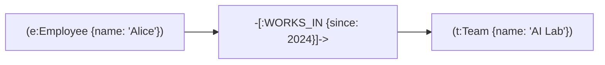
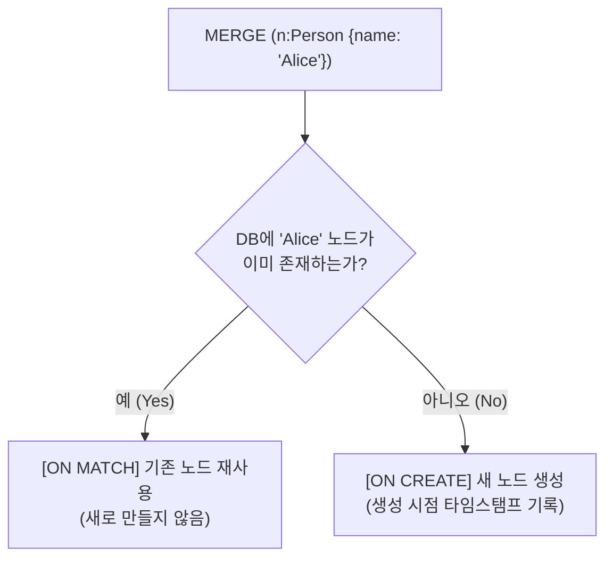
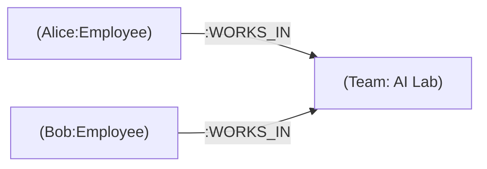

# 🏛️ [Day 29 마스터 아키텍처 보고서] Cypher 그래프 질의 언어(GQL)의 본질과 실전 완성 체계

> **문서 목적**: 단순한 문법 암기를 넘어, **"Cypher가 왜 관계형 SQL과 완전히 다른 선언형 그래프 질의 체계인가?"**, **"노드/관계의 CRUD, 멱등성(`MERGE`), 다단계 2-Hop 패턴 매칭, 결과 가공까지 어떻게 최적화되는가?"**를 엔터프라이즈 아키텍트의 시야에서 집대성한 최상위 개념 및 실전 참조 보고서입니다.

---

## 🗺️ 1. Cypher 언어의 본질: ASCII-Art 선언형 그래프 질의

### 1) Cypher의 핵심 철학 (What You Draw is What You Query)
* Cypher는 텍스트로 **"원하는 그래프 모양(Pattern)을 아스키 아트로 그리면, 엔진이 물리 메모리에서 그 모양을 찾아내는"** 선언형(Declarative) 질의 언어입니다.
* SQL이 `FROM`, `JOIN`, `ON`, `GROUP BY`로 복잡하게 테이블을 결합할 때, Cypher는 화살표 하나로 관계를 표현합니다.

```text
┌────────────────────────────────────────────────────────────────────────────────────────┐
│ [Cypher 아스키 아트 표기법 원리]                                                       │
│                                                                                        │
│   ( e : Employee { name: 'Alice' } ) ──[ :WORKS_IN ]──> ( t : Team { name: 'AI Lab' } )│
│   └──┬──┘ └───┬──┘   └──────┬─────┘    └─────┬─────┘     └──┬─┘ └──┬─┘   └─────┬──────┘│
│      │        │             │                │              │      │           │    │
│    소괄호   콜론:뒤        중괄호          대괄호         소괄호  콜론:뒤     중괄호  │
│   (노드점) (레이블)       (속성Map)        (관계선)      (노드점) (레이블)   (속성Map) │
└────────────────────────────────────────────────────────────────────────────────────────┘
```



---

## 🧱 2. Cypher 핵심 CRUD 4대 기둥

```text
┌────────────────────────────────────────────────────────────────────────────────────────┐
│ 1. [Create] 데이터 생성 : CREATE (무조건 새 점/선 생성), MERGE (중복 없이 멱등 생성)   │
│ 2. [Read]   데이터 조회 : MATCH (그래프 패턴 검색), RETURN (필요한 속성/별칭 반환)     │
│ 3. [Update] 데이터 수정 : SET (속성 추가/변경, 레이블 부여), REMOVE (속성/레이블 삭제) │
│ 4. [Delete] 데이터 삭제 : DELETE (고립된 점/선 삭제), DETACH DELETE (관계 포함 강제삭제)│
└────────────────────────────────────────────────────────────────────────────────────────┘
```

### 1) 생성 (CREATE) & 자료형 체계
* **자료형의 엄격성**: 정수, 실수, 문자열, 불리언, **동종 리스트(`['AI', 'DevOps']`)**, **날짜(`date('2026-03-01')`)**.
* ⚠️ **주의**: 날짜를 단순 문자열(`'2026-03-01'`)로 저장하면 `.year`, `duration.between()` 같은 시계열 연산이 불가능하므로 반드시 `date()` 함수를 사용해야 합니다.

### 2) 수정 (SET & REMOVE)
* **속성 갱신**: `SET e.email = 'alice@novalabs.com'`
* **다중 속성 갱신**: `SET e.salary = 8500, e.updated_at = date()`
* **레이블 동적 부여**: `SET e:Manager` (기존 `:Employee`에 `:Manager`가 추가되어 다중 레이블 노드가 됨)
* **속성/레이블 박탈**: `REMOVE e.temporary_code`, `REMOVE e:Intern`

### 3) 삭제 (DELETE vs DETACH DELETE)
```text
┌────────────────────────────────────────────────────────────────────────────────────────┐
│ • DELETE r            : 관계(선)만 끊고 노드는 살려둠                                  │
│ • DELETE n            : 연결된 관계가 '0개'인 고립 노드만 삭제 가능 (관계 있으면 에러!)│
│ • DETACH DELETE n     : 노드에 붙은 모든 화살표를 먼저 잘라낸 후 노드까지 완전 파괴    │
└────────────────────────────────────────────────────────────────────────────────────────┘
```

---

## ⚡ 3. 멱등성(Idempotency)의 심장: MERGE vs CREATE

지식그래프 엔지니어링에서 가장 위험한 함정은 **"같은 스크립트를 2번 실행했을 때 노드와 관계가 2배로 불어나는 것"**입니다.



### 1) `ON CREATE SET` vs `ON MATCH SET` 문법
```cypher
MERGE (e:Employee {emp_id: 'EMP001'})
ON CREATE SET 
    e.name = 'Alice',
    e.created_at = datetime()
ON MATCH SET 
    e.last_login = datetime(),
    e.login_count = coalesce(e.login_count, 0) + 1
RETURN e
```

---

## 🔍 4. 다단계 그래프 패턴 매칭 & 2-Hop 순회

### 1) 체인 패턴 (Chain Traversal)
* *"어떤 직원이 참여 중인 프로젝트의 마감일은?"*
```cypher
MATCH (e:Employee)-[:ASSIGNED_TO]->(p:Project)
RETURN e.name AS employee, p.name AS project, p.deadline AS deadline
```

### 2) 공유 허브 패턴 (Shared Hub Traversal / 2-Hop 추천)
* *"Alice와 같은 팀에 속한 동료들은?"*



```cypher
// 2-Hop 징검다리 순회: Alice -> Team -> 동료
MATCH (me:Employee {name: 'Alice'})-[:WORKS_IN]->(t:Team)<-[:WORKS_IN]-(colleague:Employee)
RETURN colleague.name AS colleague_name, t.name AS team_name
```

---

## 📊 5. 조건 필터링(`WHERE`) 및 결과 가공(`DISTINCT`, `ORDER BY`)

### 1) `WHERE` 절의 정밀성
* **비교 연산**: `WHERE p.deadline >= date('2026-06-01')`
* **복합 조건**: `WHERE (e.grade >= 3 OR e.role = 'Lead') AND e.resigned IS NULL`
* **널(NULL) 체크**: `WHERE e.department IS NOT NULL`

### 2) 결과 행 수(Row Count)의 곱 법칙과 `DISTINCT`
* `MATCH (t:Team), (p:Project)` 처럼 쉼표로 연결하면 카테시안 곱(Cartesian Product, $N \times M$)이 발생합니다.
* 중복을 제거할 때는 반드시 **`RETURN DISTINCT`**를 사용합니다.

```cypher
MATCH (e:Employee)-[:ASSIGNED_TO]->(p:Project)
RETURN DISTINCT p.category AS active_categories
ORDER BY active_categories ASC
LIMIT 5
```

---

## 🔒 6. 파라미터 바인딩 (`$param`): 보안 및 쿼리 캐싱

절대로 쿼리 문자열 안에 파이썬 변수를 직접 포맷팅(`f"MATCH (p {name: '{user_input}'})"`)하지 않습니다! (Cypher Injection 공격 및 쿼리 플랜 캐시 미스 발생)

```python
# ✅ 완벽한 엔터프라이즈 파라미터 바인딩
query = """
MATCH (e:Employee {department: $dept})
WHERE e.salary >= $min_salary
RETURN e.name AS name, e.salary AS salary
ORDER BY e.salary DESC
"""
result = run_cypher(query, dept="AI Lab", min_salary=7000)
```

---

### 💡 Day 29 총평 및 아키텍처 공식

| 기능 | SQL (RDB) | Cypher (Graph DB) |
|---|---|---|
| **기본 단위** | 테이블 행(Row) | 노드(Node) & 관계(Relationship) |
| **관계 표현** | 외래키(FK) + JOIN (무거운 인덱스 검색) | 직접 포인터 연결 (`-[:REL]->`, $O(1)$) |
| **다단계 탐색** | 다중 JOIN (성능 기하급수적 저하) | N-Hop 체인 패턴 (`()-[]->()<-[]-()`) |
| **멱등 적재** | `INSERT ON DUPLICATE KEY UPDATE` | `MERGE ... ON CREATE / ON MATCH SET` |
