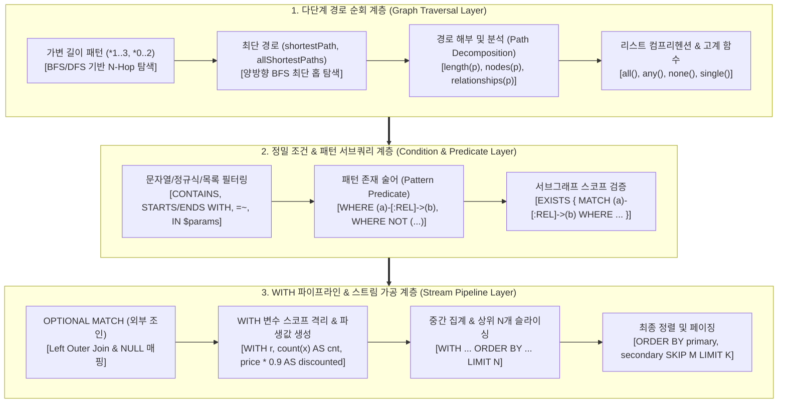
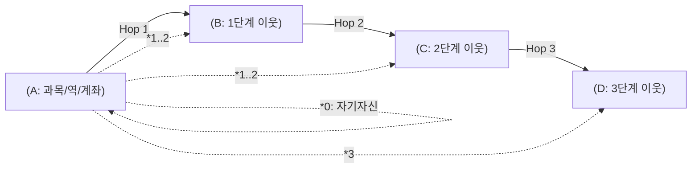
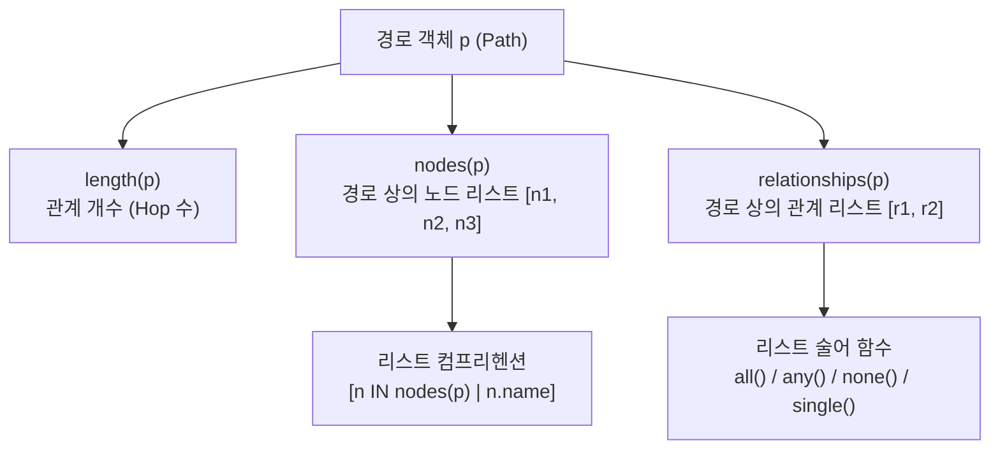
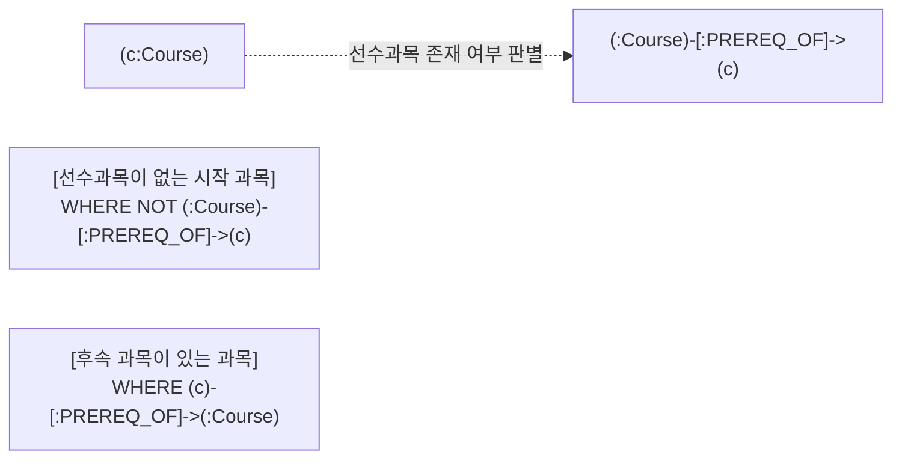
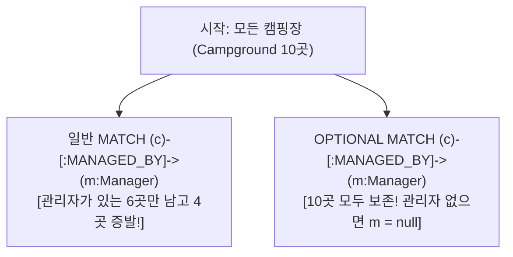

# 🏛️ [Day 30 마스터 아키텍처 보고서] Cypher 심화: 다차원 경로 탐색(Path Traversal)과 WITH 파이프라인 아키텍처

> **문서 목적**: 단순 문법 나열을 넘어, **"가변 길이 경로(Variable-Length Path)와 최단 경로(Shortest Path)가 그래프 엔진 메모리에서 어떻게 순회되는가?"**, **"함수형 리스트 연산자(`nodes`, `relationships`, `all`/`any`/`none`)를 통한 경로 해부"**, **"패턴 자체를 조건으로 사용하는 서브그래프 술어(`EXISTS { }`)"**, **"`OPTIONAL MATCH`의 NULL 핸들링 함정과 `WITH` 격리 파이프라인"**, 그리고 **"대규모 지식그래프 질의 시의 $O(1)$ 홉 확장과 정렬/페이징(`SKIP`/`LIMIT`) 최적화 원리"**까지 엔터프라이즈 아키텍트의 시야에서 집대성한 최상위 개념 및 실무 참조 보고서입니다.

---

## 🗺️ 1. Cypher 심화 그래프 순회(Traversal) 패러다임 조감도



#### 📐 텍스트 아키텍처 조감도 (모든 뷰어 완벽 호환)

```text
┌───────────────────────────────────────────────────────────────────────────────────────────────────────────┐
│ 1. 경로 순회 (Path Traversal) : (a)-[:REL*1..3]->(b)  /  p = shortestPath((a)-[:REL*]-(b))                │
│    └─ [경로 해부] : length(p), nodes(p), relationships(p), [n IN nodes(p) | n.name]                       │
│    └─ [경로 술어] : all(r IN relationships(p) WHERE r.cost <= 100), any(...), none(...)                  │
├───────────────────────────────────────────────────────────────────────────────────────────────────────────┤
│ 2. 패턴 술어 & 서브그래프 검증 (Graph Pattern Predicate)                                                   │
│    └─ [패턴 자체 조건] : WHERE (node)-[:WORKS_AT]->(:Company)  /  WHERE NOT (node)-[:BLOCKED]->()         │
│    └─ [EXISTS 서브쿼리] : WHERE EXISTS { MATCH (node)-[:ORDERED]->(p) WHERE p.price > 10000 }             │
├───────────────────────────────────────────────────────────────────────────────────────────────────────────┤
│ 3. WITH 파이프라인 & 다단계 제어 (Stream Pipeline Processing)                                              │
│    └─ [OPTIONAL MATCH] : 일치하지 않아도 행(Row) 보존 (NULL 매핑) ──> [WITH 격리] ──> WHERE null 체크     │
│    └─ [파생값/집계 격리] : WITH a, count(b) AS b_cnt, (a.score * 1.5) AS weighted_score                   │
│    └─ [중간/최종 페이징] : WITH ... ORDER BY a.score DESC, a.id ASC SKIP 10 LIMIT 10                      │
└───────────────────────────────────────────────────────────────────────────────────────────────────────────┘
```

---

## ⚡ 2. 가변 길이 경로(Variable-Length Path)의 엔진 동작 원리

### 1) 가변 길이 패턴 문법 총정리

가변 길이 패턴은 시작 노드로부터 N단계(Hop) 떨어진 이웃 노드를 탐색할 때 사용합니다. RDB에서 자기 참조(Self-Join)를 3번, 4번 중첩해야 하는 연산을 화살표 내부의 정수 범위로 단순화합니다.

```text
┌────────────────────────────────────────────────────────────────────────────────────────┐
│ [가변 길이 수량자(Quantifier) 패턴 표기법]                                             │
│                                                                                        │
│  • -[:REL*1..2]->   : 1단계부터 2단계까지의 모든 경로 (직접 연결 + 1다리 건너)         │
│  • -[:REL*2..2]->   : 정확히 2단계 떨어진 경로 (징검다리 2-Hop)                        │
│  • -[:REL*..3]->    : 1단계부터 최대 3단계까지 (상한만 지정, 하한 기본값 1)            │
│  • -[:REL*2..]->    : 최소 2단계 이상 무제한 (하한만 지정, 대규모 그래프 주의!)        │
│  • -[:REL*]->       : 1단계 이상 무제한 순회 (메모리 폭발 주의, 그래프 분리망 확인)   │
│  • -[:REL*0..2]->   : 0단계(자기 자신 포함)부터 2단계까지                              │
└────────────────────────────────────────────────────────────────────────────────────────┘
```



### 2) ⚠️ 0-Hop(`*0..N`)의 동작 원리와 실무적 의미
* **0-Hop(`*0..`)의 본질**: 관계를 **0번** 탔다는 것은 "출발 노드 자신"을 의미합니다.
* **실무 활용처**: 트리/조직도/계층 구조에서 **"자기 자신을 포함한 하위 부서/후행 과목 전체"**를 조회할 때 별도의 `UNION` 없이 한 줄로 표현할 수 있습니다.
* **주의**: 0-Hop 상태에서는 관계(Relationship)가 존재하지 않으므로 관계 속성에 접근하면 `null`이 반환됩니다.

### 3) ⚠️ 경로 탐색 시 `DISTINCT`의 필수성 (다중 경로 병합)
* 그래프 구조상 A에서 C로 가는 경로가 여러 갈래(예: A→B1→C, A→B2→C) 존재할 경우, 도착 노드 C가 결과 행에 중복 출현합니다.
* 노드 목록만 필요하다면 반드시 **`RETURN DISTINCT c.name`**을 명시하여 카테시안 확장을 차단해야 합니다.

---

## 🧭 3. 최단 경로 탐색 엔진: `shortestPath` & `allShortestPaths`

### 1) 최단 경로 알고리즘의 동작 방식 (BFS)
Neo4j의 `shortestPath()`는 양방향 너비 우선 탐색(Bidirectional Breadth-First Search)을 수행하여 **"가장 적은 홉(Hop) 수"**를 가진 경로를 $O(b^{d/2})$의 빠른 속도로 찾아냅니다.

```mermaid
flowchart LR
    subgraph BidirectionalBFS ["양방향 BFS 최단 경로 (shortestPath)"]
        S["출발 노드 (Start)"] --> F1["Hop 1 탐색"]
        F1 --> F2["Hop 2 탐색"]
        M((중간 만남 지점))
        F2 --> M
        B2["Hop 2 탐색"] <-- B1["Hop 1 탐색"] <-- E["도착 노드 (End)"]
        M <-- B2
    end
```

```cypher
// 서울역에서 이태원역까지의 최단 경로 (방향 무관)
MATCH p = shortestPath((start:Station {name: '서울역'})-[:NEXT_TO*]-(end:Station {name: '이태원'}))
RETURN p, length(p) AS hop_count
```

### 2) `shortestPath` vs `allShortestPaths` 비교

| 함수명 | 반환 경로 수 | 설명 | 실무 활용 시나리오 |
|---|---|---|---|
| **`shortestPath(...)`** | **단 1개 (Any 1 shortest)** | 최소 홉을 만족하는 경로 중 엔진이 가장 먼저 도달한 1개 경로만 반환 | 빠른 도달 가능 여부 확인, 단일 내비게이션 |
| **`allShortestPaths(...)`** | **동점 최단 경로 전부 (All ties)** | 최소 홉 수가 동일한 모든 갈래의 최단 경로를 모두 반환 | 다중 대체 우회로 탐색, 환승/비용 동등 비교 |

### 3) 🚨 그래프 DB 최단 경로의 결정적 한계와 실무 헌법
* **홉 수(Hop Count) $\neq$ 실제 물리적 거리/비용(Weight)**:
  - `shortestPath()`는 **"간선(관계)의 개수"**만 최소화합니다.
  - 정거장 수는 3개로 같아도, 실제 선로 거리(`km`)나 소요시간(`time`), 통행료(`toll`)는 다를 수 있습니다.
  - 가중치 기반 최단 경로(Dijkstra, A*)가 필요한 경우 APOC 라이브러리의 `apoc.algo.dijkstra()` 또는 Graph Data Science (GDS) 플러그인을 활용해야 합니다.

---

## 🔬 4. 경로 분석 함수 및 함수형 리스트 연산 체계

경로 변수 `p = (a)-[:REL*]->(b)`로 캡처된 서브그래프 스트림은 다양한 내장 함수와 리스트 표현식으로 해부할 수 있습니다.



### 1) 핵심 내장 함수 3총사
1. **`length(p)`**: 경로 내 관계의 개수(홉 수). ($N$개의 노드가 있으면 $N-1$개의 관계)
2. **`nodes(p)`**: 경로를 구성하는 노드들의 순서화된 리스트 `[Node, Node, ...]`.
3. **`relationships(p)`**: 경로를 구성하는 관계들의 순서화된 리스트 `[Rel, Rel, ...]`.

### 2) 리스트 컴프리헨션 (List Comprehension)
Python의 리스트 컴프리헨션과 동일한 문법으로 노드/관계 객체에서 원하는 속성만 추출하거나 필터링합니다.

```cypher
// 1) 노드 객체 리스트에서 이름만 추출
[n IN nodes(p) | n.name]

// 2) 특정 조건을 만족하는 노드의 속성만 추출 (세로선 앞 WHERE)
[n IN nodes(p) WHERE n.credits >= 4 | n.name]

// 3) 구간 관계에서 이동 시간(time)이 60분 이상인 병목 구간만 추출
[r IN relationships(p) WHERE r.time >= 60 | r.line + ' (' + toString(r.time) + '분)']
```

### 3) 4대 리스트 고계 술어 함수 (`all`, `any`, `none`, `single`)

```text
┌────────────────────────────────────────────────────────────────────────────────────────┐
│ • all(r IN relationships(p) WHERE r.time <= 70)  : 모든 구간이 70분 이하인가? (전칭) │
│ • any(r IN relationships(p) WHERE r.line = '4호선'): 4호선 구간이 하나라도 있는가?    │
│ • none(r IN relationships(p) WHERE r.blocked)    : 차단된 구간이 하나도 없는가?      │
│ • single(r IN relationships(p) WHERE r.transfer) : 환승 구간이 딱 1곳만 존재하는가?  │
└────────────────────────────────────────────────────────────────────────────────────────┘
```

---

## 🎯 5. 정밀 조건 필터링 & 파라미터화 바인딩

### 1) 문자열 및 컬렉션 필터링 연산자

| 연산자 | 동작 및 특징 | 예시 |
|---|---|---|
| **`IN`** | 컬렉션/배열 포함 여부 검사 ($O(1) \sim O(N)$) | `WHERE 'Python' IN e.skills` |
| **`CONTAINS`** | 문자열 부분 일치 검사 (대소문자 구분) | `WHERE c.name CONTAINS '데이터'` |
| **`STARTS WITH`** | 접두사 일치 (B-Tree 인덱스 활용 가능 ⚡) | `WHERE c.code STARTS WITH 'CS'` |
| **`ENDS WITH`** | 접미사 일치 | `WHERE c.name ENDS WITH '개론'` |
| **`< >`** | 불일치 비교 (`!=` 와 동일) | `WHERE c.category <> '교양'` |
| **`=~`** | 정규 표현식 매칭 (`(?i)`로 대소문자 무시) | `WHERE c.name =~ '(?i).*cloud.*'` |

### 2) 파라미터화 바인딩 ($params) 원칙
* 문자열 조합(`f"WHERE c.name = '{user_val}'"`)은 **Cypher Injection 취약점** 및 **쿼리 플랜 캐시 미스**를 유발합니다.
* `$names`처럼 파이썬 리스트/값을 파라미터로 넘기면 Neo4j가 실행 계획(Execution Plan)을 100% 재사용하여 초당 수만 건의 쿼리를 고속 처리합니다.

```python
# ✅ 리스트 파라미터 바인딩 예시
query = "MATCH (c:Course) WHERE c.name IN $target_courses RETURN c.name, c.credits"
result = run_cypher(query, target_courses=["CS101 프로그래밍입문", "CS201 자료구조"])
```

---

## 🔍 6. 패턴 기반 관계 유무 필터링 (`WHERE (a)-[]->(b)`)

### 1) 패턴 술어 (Pattern Comprehension / Predicate)
Cypher에서는 관계의 존재 여부를 `WHERE` 절에 직접 그래프 패턴으로 서술할 수 있습니다.



```cypher
// 1) 선수과목이 하나도 없는 기초 시작 과목 검색 (In-Degree = 0)
MATCH (c:Course)
WHERE NOT (:Course)-[:PREREQ_OF]->(c)
RETURN c.name AS root_course

// 2) 더 상위 과목으로 이어지는 관계가 있는 과목만 검색
MATCH (c:Course)
WHERE (c)-[:PREREQ_OF]->(:Course)
RETURN DISTINCT c.name AS prerequisite_course
```

### 2) `EXISTS { }` 서브쿼리 술어 (상대 노드에 세부 조건이 붙을 때)
단순한 관계 유무를 넘어, 상대방 노드나 관계에 **추가 조건**이 붙는 경우 `EXISTS { MATCH ... WHERE ... }` 블록을 사용합니다.

```cypher
// 천안으로 향하는 배송 노선이 없는 허브 검색
MATCH (h:Hub)
WHERE NOT EXISTS {
    MATCH (h)-[:ROUTE]->(dest:City {name: '천안'})
}
RETURN h.name AS hubs_without_cheonan
```

---

## 🛡️ 7. `OPTIONAL MATCH`의 동작 원리와 `WITH` 격리 패턴

### 1) `OPTIONAL MATCH`의 본질 (Left Outer Join)
* 일반 `MATCH`는 패턴과 일치하지 않는 노드가 발생하면 해당 행(Row)을 **결과에서 완전히 제거(Drop)**합니다.
* `OPTIONAL MATCH`는 대상이 없더라도 **원래 행을 유지하고, 없는 변수에 `null`을 채워 반환**합니다.



### 2) 🚨 `OPTIONAL MATCH` 직후 `WHERE` 연결 시의 치명적 함정

```cypher
// ❌ [안티패턴]: 관리자가 없는 캠핑장을 찾으려고 WHERE m IS NULL을 바로 붙인 경우
MATCH (c:Campground)
OPTIONAL MATCH (c)-[:MANAGED_BY]->(m:Manager)
WHERE m IS NULL   // ⚠️ 경고: 이 WHERE는 OPTIONAL MATCH 절의 매칭 조건으로 흡수되어버림!
RETURN c.name, m.name
```

* **함정의 원인**: `OPTIONAL MATCH ... WHERE ...` 구문에서 `WHERE`는 전체 행을 거르는 필터가 아니라 **"OPTIONAL 대상의 매칭 필터"**로 작동합니다. 결과적으로 관리자가 있는 곳도 `m`을 매칭시키지 않아 모든 캠핑장의 `m`이 `null`로 나와버립니다.
* **✅ 완벽한 해법**: `WITH` 절로 변수 스코프를 닫아 행 스트림을 확정한 후 `WHERE`를 걸어야 합니다!

```cypher
// ✅ [모범 패턴]: WITH 파이프라인으로 격리 후 필터링
MATCH (c:Campground)
OPTIONAL MATCH (c)-[:MANAGED_BY]->(m:Manager)
WITH c, m
WHERE m IS NULL  // 이제 행 스트림 전체에서 m이 null인 행만 정확히 필터링됨!
RETURN c.name AS camping_without_manager
```

### 3) 🌐 연결성 판별(Reachability Check)과 불리언 플래그 (`p IS NOT NULL`)
* 두 노드 사이에 경로가 있는지 판별할 때, 일반 `MATCH shortestPath(...)`를 쓰면 **경로가 없을 때 행 자체가 증발**하여 0건(`[]`)이 됩니다.
* **`OPTIONAL MATCH shortestPath(...)`**를 사용하면 경로가 없어도 기본 행이 보존되면서 `p`에 `null`이 채워집니다.
* 이를 통해 항상 1행을 보장받으면서 **`p IS NOT NULL`**로 `True`/`False` 불리언 연결 플래그를 생성할 수 있습니다!

```cypher
// 손님 a와 b가 맛집 방문 네트워크로 연결되어 있는지 판별 (항상 1행 반환)
MATCH (a:Diner {name: $n1}), (b:Diner {name: $n2})
OPTIONAL MATCH p = shortestPath( (a)-[:VISITED*]-(b) )
RETURN p IS NOT NULL AS connected
```

---

## 🚰 8. `WITH` 파이프라인 아키텍처 (Stream Processing)

Cypher는 쿼리를 단일 문장이 아니라 **"유닉스 파이프(`|`)처럼 데이터 행 스트림을 단계별로 가공하고 넘기는 파이프라인"**으로 처리합니다. 이 파이프라인의 중심축이 바로 **`WITH`**입니다.


### 1) `WITH`의 4대 핵심 역할
1. **변수 스코프 격리**: 다음 단계로 넘길 변수를 명시적으로 선언 (`WITH a, b`를 하면 `c`는 소멸되어 메모리 절약).
2. **파생값 생성 및 별칭(`AS`)**: 계산된 수식이나 표현식에 별칭을 부여해 전달 (`WITH r, (r.price / r.capacity) AS unit_price`).
3. **중간 집계 및 필터링**: 집계 함수를 실행한 결과를 기반으로 후속 `WHERE` 실행 (`WITH team, count(e) AS cnt WHERE cnt >= 5`).
4. **중간 정렬 및 상위 N개 자르기**: 비싼 후속 탐색(`OPTIONAL MATCH` 등)을 수행하기 전에 후보군을 상위 N개로 압축.

```cypher
// 실전 응용: 수도권 맛집 중 가성비 상위 2곳을 뽑은 뒤, 그 2곳의 셰프 정보만 조회
MATCH (r:Restaurant)
WHERE r.area IN ['강남', '서초', '마포']
WITH r, (r.price_per_person * 1.0) AS cost
ORDER BY cost ASC
LIMIT 2
OPTIONAL MATCH (r)<-[:WORKS_AT]-(chef:Chef)
RETURN r.name AS restaurant, cost, coalesce(chef.name, '미배정') AS chef_name
```

---

## 📄 9. 정렬(`ORDER BY`) 및 페이징(`SKIP` / `LIMIT`) 최적화

### 1) 페이징 공식과 결정성(Determinism) 원칙
웹 애플리케이션의 무한 스크롤이나 페이지네이션을 구현할 때의 표준 공식입니다.

$$\text{SKIP} = (\text{PageNumber} - 1) \times \text{PageSize}, \quad \text{LIMIT} = \text{PageSize}$$

### 2) ⚠️ 일관성 보장을 위한 보조 정렬키 (Secondary Key)
* 데이터베이스 정렬 시 1차 기준(예: `price`)에 **동점(Tie)**이 발생하면, 페이지를 넘길 때 같은 항목이 1페이지와 2페이지에 중복 노출되거나 누락되는 심각한 결함이 발생합니다.
* **실무 헌법**: 반드시 고유 식별자(`id`, `name`)를 **보조 정렬키**로 명시해야 합니다.

```cypher
// 2페이지 조회 (페이지당 3건, 1차: 가격 오름차순, 2차: 이름 오름차순)
MATCH (c:Campground)
RETURN c.name AS name, c.price AS price
ORDER BY c.price ASC, c.name ASC
SKIP 3
LIMIT 3
```

---

## 📊 10. RDB (SQL) vs Cypher 심화 아키텍처 비교표

| 기능 및 개념 | 관계형 데이터베이스 (RDB / SQL) | 그래프 데이터베이스 (Neo4j / Cypher) |
|---|---|---|
| **가변 길이 순회** | Recursive CTE (`WITH RECURSIVE`), 무거운 Self-JOIN | `-[:REL*1..3]->` 단 한 줄 ($O(1)$ 직접 포인터 순회) |
| **최단 경로 계산** | 복잡한 재귀 프로시저 작성 필요 (성능 극악) | `shortestPath()`, `allShortestPaths()` 엔진 내장 |
| **경로 분석/해부** | 불가 (중간 결합 키 테이블을 일일이 추적해야 함) | `nodes(p)`, `relationships(p)`, 리스트 컴프리헨션 |
| **경로 내 전칭/존재 조건** | 복잡한 `NOT EXISTS` 다중 서브쿼리 중첩 | `all(r IN rels WHERE ...)`, `any(...)` |
| **서브패턴 필터** | `WHERE EXISTS (SELECT 1 FROM FK_Table ...)` | `WHERE (a)-[:REL]->(b)`, `WHERE NOT (...)` |
| **외부 조인 (Outer Join)** | `LEFT OUTER JOIN ON A.id = B.fk` | `OPTIONAL MATCH (a)-[:REL]->(b)` |
| **파이프라인 스트림** | 파생 테이블 `FROM (SELECT ...) temp` 중첩 지옥 | `WITH` 파이프라인으로 선형적 데이터 정제 및 스코프 제어 |

---

## 🏛️ 11. 엔터프라이즈 그래프 엔지니어링 5대 실무 헌법

1. **[무제한 가변길이 `*` 금지 헌법]**: 대규모 지식그래프에서 상한이 없는 `-[:REL*]->`는 메모리 고갈(OOM)을 유발하므로 반드시 `*1..4`와 같이 최대 홉 상한을 설정한다.
2. **[리스트 파라미터 `$params` 바인딩 헌법]**: 사용자 입력이나 다중 검색 조건은 무조건 `$list` 파라미터로 전달하여 쿼리 실행 계획(Execution Plan) 캐시 효율을 100% 달성한다.
3. **[`OPTIONAL MATCH` 뒤 `WITH` 격리 헌법]**: `OPTIONAL MATCH` 이후 `null` 체크나 후속 필터링을 수행할 때는 반드시 `WITH` 절로 변수를 묶은 후 `WHERE`를 실행한다.
4. **[페이징 시 복합 정렬키 보장 헌법]**: `SKIP`/`LIMIT`를 사용할 때는 동점으로 인한 데이터 누락을 방지하기 위해 유일한 보조 정렬키를 `ORDER BY`에 추가한다.
5. **[가중치 최단경로 식별 헌법]**: `shortestPath`는 간선 개수 기준이므로, 물리적 거리/금액/시간 최적화 시 구간 속성을 합산하거나 APOC/GDS 최단경로 알고리즘을 사용한다.
