# 📊 [Day 30 데이터 구조 마스터 명세서] 전 도메인 지식그래프 완전 전수 스키마 명세서

> **문서 원칙**: 본 명세서는 요약이나 생략 없이, Day 30(교안 01, 교안 02, 과제 LV1, LV2, LV3)에 등장하는 **모든 도메인의 모든 노드 레이블, 관계 타입, 노드 속성, 관계 속성, 방향성 규칙 및 전수 데이터 인스턴스**를 100% 누락 없이 전수 수록한 표준 스키마 레퍼런스입니다.

---

## 🗺️ 1. Day 30 전체 도메인 그래프 스키마 총괄 조감도

```mermaid
flowchart TD
    subgraph D1 ["1. 수도권 전철 네트워크 (교안 01 데모)"]
        S1[":Station\n(name, lines)"] <-->|":NEXT_TO\n{line, km}"| S2[":Station\n(name, lines)"]
    end

    subgraph D2 ["2. 계좌 송금 흐름망 (교안 01 실습)"]
        A1[":Account\n(name, owner, bank)"] -->|":TRANSFER\n{amount, date}"| A2[":Account\n(name, owner, bank)"]
    end

    subgraph D3 ["3. 맛집 다이닝 추천망 (교안 02 데모)"]
        DN[":Diner\n(name)"] -->|":VISITED"| REST[":Restaurant\n(name, rating, price)"]
        REST -->|":SERVES"| CUIS[":Cuisine\n(name)"]
        REST -->|":LOCATED_IN"| AREA[":Area\n(name)"]
        CHEF[":Chef\n(name)"] -->|":WORKS_AT"| REST
    end

    subgraph D4 ["4. 캠핑장 시설 & 투숙망 (교안 02 실습)"]
        CMP[":Camper\n(name)"] -->|":STAYED"| CS[":Campsite\n(name, rating, price)"]
        CS -->|":IN_REGION"| REG[":Region\n(name)"]
        CS -->|":HAS_FACILITY"| FAC[":Facility\n(name)"]
        MGR[":Manager\n(name)"] -->|":MANAGES"| CS
    end

    subgraph D5 ["5. 대학 선수과목 이수망 (과제 LV1)"]
        C1[":Course\n(name, credits)"] -->|":PREREQ_OF"| C2[":Course\n(name, credits)"]
    end

    subgraph D6 ["6. 스마트 물류 배송망 (과제 LV2)"]
        WH[":Warehouse\n(name)"] -->|":ROUTE / :AIR_ROUTE\n{time}"| HUB[":Hub\n(name)"]
        HUB -->|":ROUTE\n{time}"| CITY[":City\n(name)"]
    end

    subgraph D7 ["7. SNS 친구 네트워크 (과제 LV3)"]
        P1[":Person\n(name, city)"] <-->|":FRIEND"| P2[":Person\n(name, city)"]
    end
```



---

## 🚇 2. [교안 01 데모] 수도권 전철 네트워크 (`Station`, `NEXT_TO`)

* **도메인**: 수도권 지하철 25개 노선 실데이터 (OpenStreetMap ODbL 기반)
* **순회 성격**: **양방향 통행 (무방향 조회 `-[:NEXT_TO]-`)**

### 1) 노드 전수 명세
| 노드 레이블 | 건수 | 속성명 (Property) | 타입 | 필수여부 | 속성 설명 및 샘플 데이터 |
|---|:---:|---|:---:|:---:|---|
| **`:Station`** (역) | **659개** | `name` | String | 필수 | 역 이름 (예: `'서울역'`, `'강남'`, `'남부터미널'`, `'이태원'`) |
| | | `lines` | List\<String\> | 필수 | 해당 역을 지나는 경유 노선 목록<br>• 서울역: `['1호선', '4호선', 'GTX-A', '경의·중앙선', '공항철도']`<br>• 삼각지: `['4호선', '6호선']` |

### 2) 관계 전수 명세
| 관계 타입 | 건수 | 속성명 (Property) | 타입 | 필수여부 | 방향 | 속성 설명 및 샘플 데이터 |
|---|:---:|---|:---:|:---:|:---:|---|
| **`:NEXT_TO`** (인접구간) | **778개** | `line` | String | 필수 | `->` (저장)<br>`-` (조회) | 해당 구간의 호선 이름 (예: `'1호선'`, `'3호선'`, `'신분당선'`) |
| | | `km` | Float | 필수 | 두 역 사이의 직선거리 (단위: km) (예: `0.83`, `1.19`, `1.2`) |

---

## 💳 3. [교안 01 실습] 계좌 송금 흐름 네트워크 (`Account`, `TRANSFER`)

* **도메인**: 11개 개인 계좌 간의 14건 금융 이체 흐름 (자금 세탁 및 우회 송금 모델)
* **순회 성격**: **단방향 흐름 (유향 조회 `-[:TRANSFER*]->`)**

### 1) 노드 전수 명세 (11개 계좌)
| 계좌 코드 (`name`) | 예금주 (`owner`) | 거래 은행 (`bank`) | 비고 |
|---|---|---|---|
| **`A-1001`** | 김도윤 | ㄱ은행 | 출발 시드 계좌 (순환 거래의 시작과 끝) |
| **`A-1002`** | 박서연 | ㄱ은행 | A-1001로부터 800만원 수취 |
| **`A-1003`** | 이준호 | ㄴ은행 | A-1002로부터 500만원 수취 |
| **`A-1004`** | 최유진 | ㄴ은행 | A-1003으로부터 450만원 수취 ➔ A-1001로 400만원 재송금 |
| **`A-1005`** | 정민수 | ㄷ은행 | A-1002로부터 250만원 수취 |
| **`A-1006`** | 한지우 | ㄷ은행 | A-1005로부터 180만원 수취 |
| **`A-1007`** | 오세훈 | ㄱ은행 | A-1006으로부터 220만원 수취 |
| **`A-1008`** | 윤채원 | ㄴ은행 | 최원거리 수취 계좌 (A-1007, A-1010에서 수취) |
| **`A-1009`** | 강태민 | ㄷ은행 | A-1004, A-1005에서 수취 |
| **`A-1010`** | 임소라 | ㄱ은행 | A-1006, A-1009에서 수취 |
| **`A-1011`** | 서준영 | ㄴ은행 | **고립 노드 (송금/수취 기록 전무)** |

### 2) 관계 전수 명세 (14건 송금)
| 관계 타입 | 건수 | 속성명 (Property) | 타입 | 방향 | 속성 설명 및 샘플 데이터 |
|---|:---:|---|:---:|:---:|---|
| **`:TRANSFER`** | **14건** | `amount` | Integer | `->` (필수) | 이체 금액 (단위: 원) (예: `8000000`, `5000000`, `4500000`, `4000000`) |
| | | `date` | String | 송금 일자 (`'YYYY-MM-DD'`) (예: `'2026-03-02'`, `'2026-03-08'`) |

---

## 🍽️ 4. [교안 02 데모] 맛집 다이닝 추천 네트워크 (`Restaurant`, `Cuisine`, `Area`, `Chef`, `Diner`)

* **도메인**: 서울 주요 상권 맛집 6곳과 셰프, 요리 분류, 방문 손님 네트워크
* **순회 성격**: 다중 관계 결합, `OPTIONAL MATCH`, 손님 간 연결성 판별

### 1) 노드 전수 명세 (5개 레이블, 17개 노드)
| 노드 레이블 | 건수 | 인스턴스 전수 목록 | 보유 속성 스키마 |
|---|:---:|---|---|
| **`:Restaurant`** (식당) | **6곳** | • **스시효** (`rating: 4.8, price: 80000`)<br>• **파스타부오노** (`rating: 4.6, price: 30000`)<br>• **국밥천국** (`rating: 4.2, price: 9000`)<br>• **딤섬각** (`rating: 4.6, price: 25000`)<br>• **라멘야마** (`rating: 4.3, price: 12000`)<br>• **비스트로홍** (`rating: 4.7, price: 45000`) | `name` (String)<br>`rating` (Float)<br>`price` (Integer) |
| **`:Cuisine`** (요리) | **4개** | • 일식, 양식, 한식, 중식 | `name` (String) |
| **`:Area`** (지역) | **3곳** | • 강남, 홍대, 종로 | `name` (String) |
| **`:Chef`** (셰프) | **4명** | • 김효 (스시효), 이부오노 (파스타부오노)<br>• 왕각 (딤섬각), 홍비 (비스트로홍)<br>*(※ 국밥천국, 라멘야마는 셰프 없음)* | `name` (String) |
| **`:Diner`** (손님) | **3명** | • **지민**: 스시효, 딤섬각, 비스트로홍 방문<br>• **하준**: 파스타부오노, 라멘야마 방문<br>• **서연**: 스시효, 국밥천국 방문 | `name` (String) |

### 2) 관계 전수 명세
| 관계 타입 | 시작 노드 ➔ 도착 노드 | 전수 연결 관계 목록 |
|---|:---:|---|
| **`:SERVES`** | `(:Restaurant) ➔ (:Cuisine)` | 스시효➔일식, 파스타부오노➔양식, 국밥천국➔한식, 딤섬각➔중식, 라멘야마➔일식, 비스트로홍➔양식 |
| **`:LOCATED_IN`** | `(:Restaurant) ➔ (:Area)` | 스시효➔강남, 파스타부오노➔홍대, 국밥천국➔종로, 딤섬각➔강남, 라멘야마➔홍대, 비스트로홍➔강남 |
| **`:WORKS_AT`** | `(:Chef) ➔ (:Restaurant)` | 김효➔스시효, 이부오노➔파스타부오노, 왕각➔딤섬각, 홍비➔비스트로홍 |
| **`:VISITED`** | `(:Diner) ➔ (:Restaurant)` | 지민➔(스시효, 딤섬각, 비스트로홍), 하준➔(파스타부오노, 라멘야마), 서연➔(스시효, 국밥천국) |

---

## ⛺ 5. [교안 02 실습] 캠핑장 시설 & 투숙 네트워크 (`Campsite`, `Region`, `Facility`, `Manager`, `Camper`)

* **도메인**: 권역별 캠핑장 6곳과 보유 시설, 배정 관리자, 투숙 캠퍼 네트워크
* **순회 성격**: `EXISTS { }`, `OPTIONAL MATCH` (관리자 미배정 처리), 다단계 `WITH` 필터링

### 1) 노드 전수 명세 (5개 레이블, 17개 노드)
| 노드 레이블 | 건수 | 인스턴스 전수 목록 | 보유 속성 스키마 |
|---|:---:|---|---|
| **`:Campsite`** (캠핑장) | **6곳** | • **별빛캠핑장** (`rating: 4.8, price: 90000`)<br>• **숲속카라반** (`rating: 4.6, price: 55000`)<br>• **파도소리** (`rating: 4.2, price: 30000`)<br>• **노을언덕** (`rating: 4.6, price: 45000`)<br>• **별빛숲** (`rating: 4.3, price: 38000`)<br>• **강가마루** (`rating: 4.7, price: 70000`) | `name` (String)<br>`rating` (Float)<br>`price` (Integer) |
| **`:Region`** (권역) | **3곳** | • 강원, 제주, 경기 | `name` (String) |
| **`:Facility`** (시설) | **4개** | • 글램핑, 카라반, 오토캠핑, 수영장 | `name` (String) |
| **`:Manager`** (관리자) | **4명** | • 김한별 (별빛캠핑장), 이나무 (숲속카라반)<br>• 박노을 (노을언덕), 정강가 (강가마루)<br>*(※ 별빛숲, 파도소리는 관리자 미배정/NULL)* | `name` (String) |
| **`:Camper`** (캠퍼) | **3명** | • **지우**: 별빛캠핑장, 노을언덕, 강가마루 투숙<br>• **하람**: 숲속카라반, 별빛숲 투숙<br>• **서윤**: 별빛캠핑장, 파도소리 투숙 | `name` (String) |

### 2) 관계 전수 명세
| 관계 타입 | 시작 노드 ➔ 도착 노드 | 전수 연결 관계 목록 |
|---|:---:|---|
| **`:IN_REGION`** | `(:Campsite) ➔ (:Region)` | 별빛캠핑장➔강원, 숲속카라반➔강원, 파도소리➔제주, 노을언덕➔제주, 별빛숲➔경기, 강가마루➔경기 |
| **`:HAS_FACILITY`** | `(:Campsite) ➔ (:Facility)` | 별빛캠핑장➔글램핑, 숲속카라반➔카라반, 파도소리➔오토캠핑, 노을언덕➔수영장, 별빛숲➔오토캠핑, 강가마루➔글램핑 |
| **`:MANAGES`** | `(:Manager) ➔ (:Campsite)` | 김한별➔별빛캠핑장, 이나무➔숲속카라반, 박노을➔노을언덕, 정강가➔강가마루 |
| **`:STAYED`** | `(:Camper) ➔ (:Campsite)` | 지우➔(별빛캠핑장, 노을언덕, 강가마루), 하람➔(숲속카라반, 별빛숲), 서윤➔(별빛캠핑장, 파도소리) |

---

## 🎓 6. [과제 LV1] 대학 선수과목 네트워크 (`Course`, `PREREQ_OF`)

* **도메인**: 컴퓨터공학(CS) 9개 교과목의 이수 체계 (Directed Acyclic Graph)
* **순회 성격**: 다단계 선행/후속 순회(`*1..2`, `*0..2`), 진입차수 0 검출(`WHERE NOT ()`)

### 1) 노드 전수 명세 (9개 교과목)
| 과목명 (`name`) | 이수 학점 (`credits`) | 이수 단계 성격 |
|---|:---:|---|
| **`CS101 프로그래밍입문`** | 3 | **기초 시작 과목 (선수과목 없음, In-Degree = 0)** |
| **`MATH101 이산수학`** | 3 | **기초 시작 과목 (선수과목 없음, In-Degree = 0)** |
| **`CS102 객체지향프로그래밍`** | 3 | CS101 이수 후 수강 가능 |
| **`CS201 자료구조`** | 3 | CS101, MATH101 이수 후 수강 가능 |
| **`CS202 컴퓨터구조`** | 3 | CS102 이수 후 수강 가능 |
| **`CS301 알고리즘`** | 3 | CS201 이수 후 수강 가능 |
| **`CS302 운영체제`** | 3 | CS201, CS202 이수 후 수강 가능 |
| **`CS401 머신러닝`** | 3 | CS301 이수 후 수강 가능 |
| **`CS402 분산시스템`** | 3 | CS302 이수 후 수강 가능 |

### 2) 관계 전수 명세 (`:PREREQ_OF`, 9건)
```text
(CS101) ──[:PREREQ_OF]──> (CS102) ──[:PREREQ_OF]──> (CS202) ──[:PREREQ_OF]──> (CS302) ──[:PREREQ_OF]──> (CS402)
(CS101) ──[:PREREQ_OF]──> (CS201) ──[:PREREQ_OF]──> (CS301) ──[:PREREQ_OF]──> (CS401)
(MATH101) ─[:PREREQ_OF]──> (CS201)
(CS201) ──[:PREREQ_OF]──> (CS302)
```

---

## 🚚 7. [과제 LV2] 스마트 물류 배송망 네트워크 (`Warehouse`, `Hub`, `City`)

* **도메인**: 창고 2곳, 허브 3곳, 목적지 도시 5곳 간의 육상 간선 및 항공 특송 복합 운송망
* **순회 성격**: 다중 간선 체인, 소요시간 합산(`r1.time + r2.time`), 병목 구간 필터링

### 1) 노드 전수 명세 (10개 노드)
| 노드 구분 | 레이블 | 건수 | 인스턴스 전수 목록 | 속성 |
|---|---|:---:|---|---|
| **출발 창고** | **`:Warehouse`** | 2곳 | • **인천창고**, **부산창고** | `name` (String) |
| **중계 허브** | **`:Hub`** | 3곳 | • **서울허브**, **대전허브**, **광주허브** | `name` (String) |
| **도착 도시** | **`:City`** | 5곳 | • **수원시**, **천안시**, **전주시**, **목포시**, **제주시** | `name` (String) |

### 2) 관계 전수 명세 (`:ROUTE`, `:AIR_ROUTE`)
| 관계 타입 | 운송 수단 | 출발 ➔ 도착 노드 | 전수 구간 및 소요시간 (`time`, 단위: 분) |
|---|:---:|:---:|---|
| **`:ROUTE`** | 육상 트럭 | `Warehouse ➔ Hub` | • 인천창고 ➔ 서울허브 (`40분`), 대전허브 (`90분`)<br>• 부산창고 ➔ 대전허브 (`120분`), 광주허브 (`110분`) |
| | | `Hub ➔ City` | • 서울허브 ➔ 수원시 (`30분`), 천안시 (`80분`)<br>• 대전허브 ➔ 천안시 (`45분`), 전주시 (`70분`)<br>• 광주허브 ➔ 전주시 (`50분`), 목포시 (`55분`) |
| **`:AIR_ROUTE`** | 항공 특송 | `Warehouse ➔ City` | • 인천창고 ➔ 제주시 (`60분`)<br>• 부산창고 ➔ 제주시 (`45분`) |

---

## 👥 8. [과제 LV3] SNS 친구 네트워크 (`Person`, `FRIEND`)

* **도메인**: 8명 사용자 간의 상호 친구 네트워크 및 거주 도시
* **순회 성격**: 2-Hop 친구 추천 알고리즘, 고립 노드 및 네트워크 단절 진단

### 1) 노드 전수 명세 (8명 사용자)
| 사용자 이름 (`name`) | 거주 도시 (`city`) | 연결 친구 수 | 네트워크 상의 위치 |
|---|---|:---:|---|
| **`아리`** | 서울 | 2명 | 보미, 달이와 친구 |
| **`보미`** | 서울 | 3명 | 아리, 크리스, 은우와 친구 |
| **`크리스`** | 부산 | 2명 | 보미, 은우와 친구 |
| **`달이`** | 대구 | 2명 | 아리, 가람과 친구 |
| **`은우`** | 부산 | 3명 | 보미, 크리스, 하늘과 친구 |
| **`가람`** | 대구 | 1명 | 달이와 친구 |
| **`하늘`** | 광주 | 1명 | 은우와 친구 |
| **`바다`** | 제주 | **0명** | **완전 고립 노드 (친구 관계 0개)** |

### 2) 관계 전수 명세 (`:FRIEND`, 9건)
* 모든 친구 관계는 **상호 무방향(`-[:FRIEND]-`)**으로 조회합니다.
* 연결망: `(아리)-(보미)`, `(아리)-(달이)`, `(보미)-(크리스)`, `(보미)-(은우)`, `(크리스)-(은우)`, `(달이)-(가람)`, `(은우)-(하늘)`
