# 📊 [Day 31 데이터 구조 마스터 명세서] 전 도메인 지식그래프 완전 전수 스키마 & Hetionet 데이터 분석 명세서

> **문서 원칙**: 본 명세서는 요약이나 생략 없이, Day 31(교안 01, 교안 02, 과제 LV1, LV2, LV3 및 data 폴더의 Hetionet v1.0 바이오 의료 지식그래프 실데이터)에 등장하는 **모든 도메인의 노드 레이블, 관계 타입, 속성 스키마, 토폴로지 매핑, 전수 데이터 통계 및 중복/특이점 분석**을 100% 누락 없이 집대성한 표준 스키마 레퍼런스입니다.

---

## 🗺️ 1. Day 31 전체 도메인 그래프 스키마 총괄 조감도

```mermaid
flowchart TD
    subgraph D1 ["1. Hetionet v1.0 의료 지식그래프 (교안 01 & 02 실데이터)"]
        CP[":Compound\n(1,531개)"] -->|":TREATS (755)\n:PALLIATES (390)"| DIS[":Disease\n(136개)"]
        CP -->|":BINDS (11,571)\n:UPREGULATES_CG (18,756)\n:DOWNREGULATES_CG (21,102)"| GEN[":Gene\n(13,113개)"]
        DIS -->|":ASSOCIATES (12,623)\n:UPREGULATES_DG (7,731)\n:DOWNREGULATES_DG (7,623)"| GEN
        DIS -->|":PRESENTS (3,357)"| SYM[":Symptom\n(415개)"]
        PC[":PharmacologicClass\n(345개)"] -->|":INCLUDES (1,029)"| CP
        CP <-->|":RESEMBLES_CC (6,486)"| CP
        DIS <-->|":RESEMBLES_DD (543)"| DIS
    end

    subgraph D2 ["2. 음식 배달 네트워크 (과제 LV1)"]
        CUST[":Customer\n(name)"] -->|":ORDERED\n{qty, price}"| MN[":Menu\n(name, price, total_ordered)"]
        REST[":Restaurant\n(name, category)"] -->|":SERVES"| MN
    end

    subgraph D3 ["3. 음악 스트리밍 차트 (과제 LV2)"]
        LIS[":Listener\n(name)"] -->|":PLAYED\n{cnt}"| SG[":Song\n(title, tag, is_hit)"]
        ART[":Artist\n(name)"] -->|":PERFORMS"| SG
    end

    subgraph D4 ["4. 이커머스 함께구매 & 판매 대시보드 (과제 LV3)"]
        BUY[":Buyer\n(name)"] -->|":PURCHASED\n{qty}"| PROD[":Product\n(name, code, price, category)"]
    end

    subgraph D5 ["5. 실습 격리 네임스페이스 (Bio-Commerce & Smart)"]
        BSPOT[":SmartSpot\n(name, category, price)"] -->|":MANAGED_BY"| BMGR[":SmartManager\n(name, grade)"]
        BHUB[":SmartHub\n(name, capacity)"] -->|":TRUCK_ROUTE\n{time, cost}"| BCITY[":SmartCity\n(name, zone)"]
    end
```

---

## 🔬 2. [data/ 폴더 분석] Hetionet v1.0 의료 지식그래프 전수 분석

* **출처**: Hetionet v1.0 (CC0 1.0 슬라이스, Himmelstein DS et al., eLife 2017)
* **파일 구성**:
  * `data/hetionet_nodes.csv` (15,540행, 418KB)
  * `data/hetionet_edges.csv` (91,966행, 4.0MB)

### 1) 노드 데이터 전수 통계 & 스키마 (`hetionet_nodes.csv`)
* **CSV 컬럼 구조**: `id` (식별자 코드), `name` (표준 명칭), `label` (노드 분류)

| 노드 레이블 (`label`) | 건수 | ID 체계 (식별자 접두사) | 속성 스키마 | 설명 및 대표 인스턴스 |
|---|:---:|---|---|---|
| **`:Gene`** | **13,113개** | `Gene::NCBI_ENTREZ_ID` | `id` (String) `name` (String) | 인간 유전자 (예: `ALB`(알부민), `EGFR`, `TNF`, `INS`) |
| **`:Compound`** | **1,531개** | `Compound::DrugBank_ID` | `id` (String) `name` (String) | FDA 승인/임상 약물 (예: `Goserelin`, `Warfarin`, `Simvastatin`, `Aspirin`) |
| **`:Symptom`** | **415개** | `Symptom::MeSH_ID` | `id` (String) `name` (String) | 질환 임상 증상 (예: `Headache`, `Fever`, `Pain`, `Fatigue`) |
| **`:PharmacologicClass`** | **345개** | `Pharmacologic Class::FDA_ID` | `id` (String) `name` (String) | FDA 약효/작용기전 분류 (예: `Beta-Blockers`, `Statins`, `ACE Inhibitors`) |
| **`:Disease`** | **136개** | `Disease::DOID` | `id` (String) `name` (String) | 인간 질병 (예: `hypertension`, `asthma`, `migraine`, `lung cancer`) |
| **총합 (Total Nodes)** | **15,540개** | - | - | **5개 레이블** |

#### ⚠️ 데이터 무결성 분석: 동음이의어(중복 이름) 노드 12건
> `name` 속성을 기본키로 사용할 수 없는 핵심 이유입니다. `id`는 15,540개 모두 고유(Unique)하지만, `name`은 15,534개로 **6개 이름이 `Compound`와 `PharmacologicClass`에 동시 존재**합니다.

| 중복 명칭 (`name`) | Compound 노드 ID | PharmacologicClass 노드 ID | 비고 |
|---|---|---|---|
| **`Folic Acid`** | `Compound::DB00158` | `Pharmacologic Class::N0000006996` | 엽산 제제 vs 약효 분류 |
| **`Vitamin A`** | `Compound::DB00162` | `Pharmacologic Class::N0000006269` | 비타민 A 단일제 vs 비타민군 |
| **`Cholecalciferol`** | `Compound::DB00169` | `Pharmacologic Class::N0000006996` | 비타민 D3 물질 vs 약효 분류 |
| **`Nicotine`** | `Compound::DB00184` | `Pharmacologic Class::N0000006496` | 니코틴 화합물 vs 금연치료제군 |
| **`Progesterone`** | `Compound::DB00396` | `Pharmacologic Class::N0000005934` | 프로게스테론 호르몬 vs 프로게스틴류 |
| **`Estradiol`** | `Compound::DB00783` | `Pharmacologic Class::N0000005934` | 에스트라디올 화합물 vs 에스트로겐류 |

---

### 2) 관계 데이터 전수 토폴로지 (`hetionet_edges.csv`)
* **CSV 컬럼 구조**: `source` (출발 노드 ID), `rel` (관계 타입), `target` (도착 노드 ID)

| 관계 타입 (`rel`) | 출발 노드 (`source`) | 도착 노드 (`target`) | 건수 | 관계의 생물학적 의미 |
|---|:---:|:---:|:---:|---|
| **`:DOWNREGULATES_CG`** | `Compound` | `Gene` | **21,102건** | 약물이 해당 유전자의 발현량을 억제/감소시킴 |
| **`:UPREGULATES_CG`** | `Compound` | `Gene` | **18,756건** | 약물이 해당 유전자의 발현량을 촉진/증가시킴 |
| **`:ASSOCIATES`** | `Disease` | `Gene` | **12,623건** | 질병 발병과 유전자 변이/발현이 통계적으로 연관됨 |
| **`:BINDS`** | `Compound` | `Gene` | **11,571건** | 약물이 해당 단백질(유전자 산물)에 직접 결합(약물 표적 Target) |
| **`:UPREGULATES_DG`** | `Disease` | `Gene` | **7,731건** | 질병 상태에서 해당 유전자 발현이 상향 조절됨 |
| **`:DOWNREGULATES_DG`** | `Disease` | `Gene` | **7,623건** | 질병 상태에서 해당 유전자 발현이 하향 조절됨 |
| **`:RESEMBLES_CC`** | `Compound` | `Compound` | **6,486건** | 두 약물 간의 화학적 구조/물성이 유사함 (양방향 성격) |
| **`:PRESENTS`** | `Disease` | `Symptom` | **3,357건** | 질병에 걸렸을 때 특정 임상 증상이 발현됨 |
| **`:INCLUDES`** | `PharmacologicClass` | `Compound` | **1,029건** | 특정 약효 분류에 해당 약물이 포함됨 |
| **`:TREATS`** | `Compound` | `Disease` | **755건** | 약물이 해당 질병의 원인 및 본태를 **직접 치료**함 |
| **`:RESEMBLES_DD`** | `Disease` | `Disease` | **543건** | 두 질병 간의 임상적/유전적 특성이 유사함 |
| **`:PALLIATES`** | `Compound` | `Disease` | **390건** | 약물이 질병 완치가 아닌 **증상 완화(대증 요법)**에 쓰임 |
| **총합 (Total Edges)** | - | - | **91,966건** | **12개 관계 타입** |

---

## 🍔 3. [과제 LV1] 음식 배달 지식그래프 (`Restaurant`, `Menu`, `Customer`)

### 1) 노드 전수 명세
| 노드 레이블 | 건수 | 속성 | 인스턴스 전수 목록 |
|---|:---:|---|---|
| **`:Restaurant`** | **3곳** | `name`, `category` | • **한마당** (`category: '한식'`) • **초밥왕** (`category: '일식'`) • **파스타팩토리** (`category: '양식'`) |
| **`:Menu`** | **7개** | `name`, `price` *(파생: `total_ordered`)* | • **비빔밥** (9,000원), **불고기** (12,000원) • **연어초밥** (15,000원), **우동** (8,000원) • **까르보나라** (13,000원), **마르게리타** (14,000원), **알리오올리오** (11,000원) |
| **`:Customer`** | **4명** | `name` | • **강민**, **서연**, **준호**, **예린** |

### 2) 관계 전수 명세
| 관계 타입 | 시작 ➔ 도착 | 건수 | 속성 | 전수 인스턴스 목록 |
|---|:---:|:---:|---|---|
| **`:SERVES`** | `Restaurant ➔ Menu` | 7건 | 없음 | 한마당➔(비빔밥, 불고기), 초밥왕➔(연어초밥, 우동), 파스타팩토리➔(까르보나라, 마르게리타, 알리오올리오) |
| **`:ORDERED`** | `Customer ➔ Menu` | 10건 | `qty` (주문수량) `price` (결제금액) | • 강민: 비빔밥(2개, 18,000), 연어초밥(1개, 15,000) • 서연: 연어초밥(2개, 30,000), 까르보나라(1개, 13,000) • 준호: 비빔밥(1개, 9,000), 불고기(2개, 24,000), 연어초밥(1개, 15,000) • 예린: 마르게리타(2개, 28,000), 우동(1개, 8,000), 까르보나라(1개, 13,000) |

---

## 🎵 4. [과제 LV2] 음악 스트리밍 차트 (`Artist`, `Song`, `Listener`)

### 1) 노드 전수 명세
| 노드 레이블 | 건수 | 속성 | 인스턴스 전수 목록 |
|---|:---:|---|---|
| **`:Artist`** | **3명** | `name` | • **루나**, **제이드**, **카이** |
| **`:Song`** | **6곡** | `title`, `tag` *(파생: `is_hit`)* | • **은하수** (`루나`, `tag: ' 발라드|2021 '`) • **밤하늘** (`루나`, `tag: '발라드|2019 '`) • **파도** (`제이드`, `tag: ' 댄스|2022'`)\n• **모래성** (`제이드`, `tag: ' 발라드|2020 '`)\n• **등대** (`제이드`, `tag: '댄스|2023 '`)\n• **질주** (`카이`, `tag: ' 록|2022 '`) |
| **`:Listener`** | **4명** | `name` | • **하늘**, **바다**, **별**, **산** |

### 2) 관계 전수 명세
| 관계 타입 | 시작 ➔ 도착 | 건수 | 속성 | 전수 인스턴스 목록 |
|---|:---:|:---:|---|---|
| **`:PERFORMS`** | `Artist ➔ Song` | 6건 | 없음 | 루나➔(은하수, 밤하늘), 제이드➔(파도, 모래성, 등대), 카이➔(질주) |
| **`:PLAYED`** | `Listener ➔ Song` | 10건 | `cnt` (재생횟수) | • 하늘: 은하수(50), 파도(30) • 바다: 은하수(40), 등대(60) • 별: 밤하늘(20), 파도(45), 질주(35) • 산: 모래성(25), 등대(55), 은하수(15) |

---

## 🛒 5. [과제 LV3] 이커머스 상품 추천 & 판매망 (`Product`, `Buyer`)

### 1) 노드 전수 명세
| 노드 레이블 | 건수 | 속성 | 인스턴스 전수 목록 |
|---|:---:|---|---|
| **`:Product`** | **6개** | `name`, `code`, `price`, `category` | • **무선이어폰** (`code: 'P01'`, `price: 80000`, `category: '가전'`) • **블루투스스피커** (`code: 'P02'`, `price: 60000`, `category: '가전'`) • **노트북거치대** (`code: 'P03'`, `price: 40000`, `category: '가전'`) • **텀블러** (`code: 'P04'`, `price: 20000`, `category: '리빙'`) • **담요** (`code: 'P05'`, `price: 30000`, `category: '리빙'`) • **머그컵** (`code: 'P06'`, `price: 15000`, `category: '리빙'`) |
| **`:Buyer`** | **5명** | `name` | • **도윤**, **하윤**, **지호**, **서아**, **민재** |

### 2) 관계 전수 명세
| 관계 타입 | 시작 ➔ 도착 | 건수 | 속성 | 전수 구매 이력 (`PURCHASED`) |
|---|:---:|:---:|---|---|
| **`:PURCHASED`** | `Buyer ➔ Product` | 11건 | `qty` (수량) | • 도윤: 무선이어폰(1), 텀블러(2) • 하윤: 무선이어폰(2), 텀블러(1), 블루투스스피커(1) • 지호: 무선이어폰(1), 담요(2) • 서아: 머그컵(3), 담요(1), 노트북거치대(1) • 민재: 무선이어폰(1), 텀블러(1) |

---

## ⚙️ 6. 인덱스 및 제약조건(Constraint) 표준 명세

| 적용 대상 레이블 | 속성명 | 인덱스/제약 종류 | 이름 (Index/Constraint Name) | 목적 및 효과 |
|---|---|:---:|---|---|
| **`:Gene`** | `id` | UNIQUE Constraint | `gene_id` | 중복 방지 및 O(1) 해시 룩업 |
| **`:Gene`** | `name` | RANGE Index | `gene_name` | 유전자 명칭 조회 속도 최적화 (dbHits 26,228 ➔ 3) |
| **`:Compound`** | `name` | TEXT Index | `compound_name_text` | 부분일치(`CONTAINS`) 전용 텍스트 인덱스 (13,114 ➔ 9) |
| **`:Song`** | `title` | UNIQUE Constraint | `song_title_unique` | 곡 제목 중복 삽입 원천 차단 (`ConstraintError`) |
| **`:Song`** | `title` | TEXT Index | `song_title_text` | 곡 제목 부분일치 검색 가속화 |
| **`:Product`** | `code` | UNIQUE Constraint | `product_code_unique` | 상품 코드 고유성 보장 |
| **`:Product`** | `name` | RANGE Index | `product_name_idx` | 상품명 기반 초고속 검색 |
