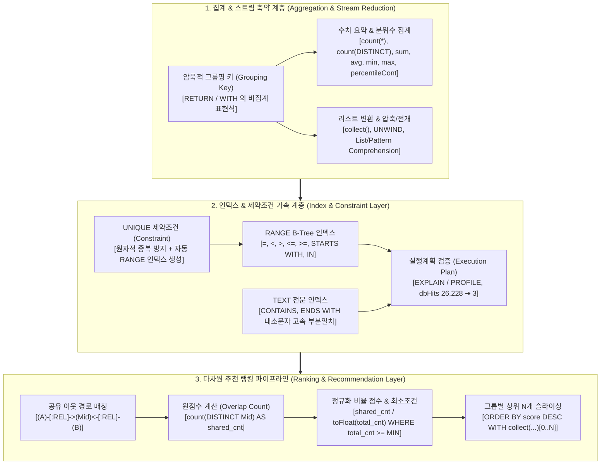
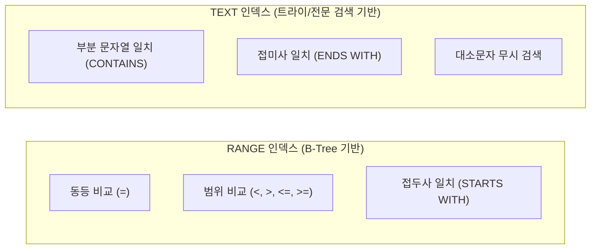

# 🏛️ [Day 31 마스터 아키텍처 보고서] Cypher 그래프 집계·인덱스 최적화 및 랭킹 추천 아키텍처

> **문서 목적**: 단순한 함수 문법 습득을 넘어, **"Neo4j 집계 엔진이 그룹핑 키(Grouping Key)를 결정하고 파이프라인 스트림을 축약하는 메커니즘"**, **"`collect`와 `UNWIND`를 통한 1:N 리스트 직렬화 및 역직렬화"**, **"RANGE vs TEXT 인덱스의 내부 인덱스 트리 구조와 `dbHits` 비용 절감 원리"**, **"실행계획(`EXPLAIN`/`PROFILE`) 연산자 분석(`NodeIndexSeek` vs `AllNodesScan`)"**, **"UNIQUE 제약조건의 원자적 인덱스 겸용 아키텍처"**, 그리고 **"공유 이웃 기반 그래프 추천 랭킹(원점수 vs 정규화 비율 점수 및 최소 임계치 필터)"**까지 지식그래프 엔지니어링 관점에서 집대성한 최상위 개념 및 실무 설계 아키텍처 보고서입니다.

---

## 🗺️ 1. Cypher 집계·인덱스·랭킹 아키텍처 조감도



#### 📐 텍스트 아키텍처 조감도 (모든 뷰어 완벽 호환)

```text
┌───────────────────────────────────────────────────────────────────────────────────────────────────────────┐
│ 1. 집계 파이프라인 (Aggregation & Collection)                                                             │
│    ├─ [그룹핑 원리] : 비집계 컬럼이 Group By 키 자동 결정 (RETURN d.name, count(c))                       │
│    ├─ [수치 요약]   : count(*), count(DISTINCT x), sum, avg(toFloat), min, max, percentileCont(x, 0.5)    │
│    └─ [컬렉션 가공] : collect(DISTINCT x) ──> [UNWIND] ──> [x IN list WHERE cond | expr]                 │
├───────────────────────────────────────────────────────────────────────────────────────────────────────────┤
│ 2. 인덱스 엔진 & 제약조건 (Indexes & Constraints)                                                         │
│    ├─ [RANGE Index] : CREATE INDEX ON (n.prop) ➔ NodeIndexSeek (STARTS WITH, =, 범위)                     │
│    ├─ [TEXT Index]  : CREATE TEXT INDEX ON (n.prop) ➔ NodeIndexContainsScan (CONTAINS, ENDS WITH)         │
│    ├─ [UNIQUE 제약] : CREATE CONSTRAINT ON (n.id) REQUIRE n.id IS UNIQUE ➔ ConstraintError 원천 차단       │
│    └─ [주의 3대 함정]: ① 레이블 누락(AllNodesScan) ② 함수 감싸기(toLower) ③ 제약 전 중복 데이터 존재    │
├───────────────────────────────────────────────────────────────────────────────────────────────────────────┤
│ 3. 그래프 기반 추천 랭킹 (Graph Ranking Engine)                                                           │
│    ├─ [원점수 랭킹] : MATCH (a)-[:R]->(m)<-[:R]-(b) WHERE a <> b RETURN b, count(DISTINCT m) AS score     │
│    ├─ [비율 랭킹]   : score / toFloat(total_m) (※ 최소 노드 수 필터: total_m >= 3 미적용 시 오탐지 발생)   │
│    └─ [그룹별 Top-N]: ORDER BY group_key, score DESC WITH group_key, collect(b.name)[0..3] AS top3       │
└───────────────────────────────────────────────────────────────────────────────────────────────────────────┘
```

---

## ⚡ 2. Cypher 집계(Aggregation) 엔진의 동작 원리

### 1) 암묵적 그룹핑 키(Grouping Key) 결정 규칙
SQL에서는 `GROUP BY column1, column2`를 명시해야 하지만, Cypher는 **`RETURN`이나 `WITH` 절에 선언된 표현식 중 집계 함수(`count`, `sum`, `avg` 등)로 감싸지지 않은 모든 비집계 항을 자동으로 그룹핑 키로 채택**합니다.

```cypher
// d.name 이 자동으로 Grouping Key 가 됨
MATCH (c:Compound)-[:TREATS]->(d:Disease)
RETURN d.name AS disease_name, count(c) AS drug_count
ORDER BY drug_count DESC
```

### 2) `count(*)` vs `count(x)` vs `count(DISTINCT x)`의 3대 차이점

| 집계 표현식 | 카운트 대상 | NULL 포함 여부 | 중복 처리 | 사용 권장 상황 |
|---|---|:---:|:---:|---|
| **`count(*)`** | 스트림의 전체 행(Row) 수 | **포함** (NULL 행도 1로 카운트) | 중복 유지 | 전체 매칭된 레코드 건수를 셀 때 |
| **`count(x)`** | 변수 `x`가 `null`이 아닌 행 수 | **제외** (NULL은 0으로 무시) | 중복 유지 | `OPTIONAL MATCH` 조인 대상의 실제 매칭 수 |
| **`count(DISTINCT x)`** | 고유한 식별 대상의 개수 | **제외** | **중복 제거** | N-Hop 경로 분기로 인해 복제된 노드 수 계산 |

> **⚠️ OPTIONAL MATCH에서의 극명한 차이 실측**:
> ```cypher
> MATCH (d:Disease)
> OPTIONAL MATCH (c:Compound)-[:TREATS]->(d)
> RETURN count(*) AS total_rows, count(c) AS actual_drugs
> // 결과: total_rows = 814, actual_drugs = 755 (차이 59개는 치료약물이 0개인 질병)
> ```

### 3) 수치 집계의 3대 함정과 해결책

1. **정수 나눗셈의 소수점 절삭(Truncation)**:
   * 정수끼리 나누면(`755 / 77`) 소수점이 버려져 `9`가 됩니다. 반드시 `toFloat(755) / 77` 또는 `avg(x)`를 사용해야 `9.81`의 정밀한 실수를 얻습니다.
2. **`sum(null)`의 반환값**:
   * Cypher에서 `sum(null)`은 `null`이 아닌 **`0`**을 반환합니다. 반면 `avg(null)`은 `null`을 반환하므로 `coalesce(avg(x), 0)`로 방어해야 합니다.
3. **평균의 왜곡과 중앙값(`percentileCont`)**:
   * 극단적 이상치(Outlier)가 있는 그래프에서 산술평균은 왜곡됩니다.
   * `percentileCont(val, 0.5)`로 중앙값(Median, 50th percentile)을 구하고, `percentileCont(val, 0.9)`로 p90을 산출하여 데이터 분포를 진단합니다.

---

## 📦 3. 리스트 변환(`collect` & `UNWIND`)과 컴프리헨션

```text
┌────────────────────────────────────────────────────────────────────────────────────────┐
│ [1:N 행(Row)과 리스트(List)의 상호 변환 메커니즘]                                      │
│                                                                                        │
│   (Row 1: 피자) ──┐                                   ┌──> (Row 1: 피자)               │
│   (Row 2: 파스타) ─┼──> collect(m.name) ──> ['피자', '파스타', '샐러드'] ──> UNWIND ──┼──> (Row 2: 파스타) │
│   (Row 3: 샐러드) ──┘                                   └──> (Row 3: 샐러드)           │
└────────────────────────────────────────────────────────────────────────────────────────┘
```

### 1) 리스트 컴프리헨션 vs 패턴 컴프리헨션
* **리스트 컴프리헨션**: 이미 메모리에 존재하는 리스트를 순회하며 필터링/변환
  ```cypher
  [x IN tags WHERE x STARTS WITH '202' | toInteger(x)]
  ```
* **패턴 컴프리헨션**: 쿼리 내에서 즉석으로 서브그래프 패턴을 탐색하여 리스트 생성 (매칭이 없으면 안전하게 빈 리스트 `[]` 반환)
  ```cypher
  MATCH (rt:Restaurant)
  RETURN rt.name, [(rt)-[:SERVES]->(m:Menu) WHERE m.price >= 10000 | m.name] AS expensive_menus
  ```

---

## ⚡ 4. Neo4j 인덱스 엔진 구조 및 실행계획(`EXPLAIN`/`PROFILE`)

### 1) RANGE 인덱스 vs TEXT 인덱스 비교



| 구분 | RANGE Index | TEXT Index |
|---|---|---|
| **생성 구문** | `CREATE INDEX idx_name FOR (n:Label) ON (n.prop)` | `CREATE TEXT INDEX idx_name FOR (n:Label) ON (n.prop)` |
| **지원 연산자** | `=`, `<>`, `<`, `>`, `<=`, `>=`, `STARTS WITH`, `IN` | `CONTAINS`, `ENDS WITH`, `=` |
| **부분일치 성능** | `CONTAINS` 사용 시 **인덱스 스킵** (`NodeIndexScan` 풀스캔 발생) | `NodeIndexContainsScan`으로 **초고속 탐색** |
| **실측 비용 비교** | 13,114 dbHits (스캔) | **9 dbHits** (전용 텍스트 인덱스 탐색) |

### 2) 인덱스를 무력화시키는 3대 안티패턴(Anti-Patterns)
1. **레이블(Label) 누락**:
   * `MATCH (n {id: 'DB00014'})` ➔ 인덱스가 걸려 있어도 전체 15,540개 노드를 전수 스캔(`AllNodesScan`, dbHits 31,082).
   * **해결책**: 반드시 `MATCH (n:Compound {id: 'DB00014'})`와 같이 레이블을 명시(`NodeIndexSeek`, dbHits 3).
2. **속성을 함수로 감싸기**:
   * `WHERE toLower(g.name) = 'alb'` ➔ B-Tree 키가 훼손되어 인덱스를 타지 못하고 레이블 풀스캔(`NodeByLabelScan`, dbHits 26,228).
   * **해결책**: 데이터를 적재할 때 소문자 전용 속성(`g.name_lower`)을 생성하여 인덱스를 부여.
3. **대량 적재(`LOAD CSV`/`UNWIND`) 시 레이블 미지정**:
   * 200건 관계 병합 시 레이블을 빠뜨리면 dbHits가 4,099에서 **12,436,099(약 3,034배 폭증)**하여 DB 락/타임아웃 유발.

---

## 🎯 5. 추천 랭킹(Recommendation Ranking) 알고리즘 설계

### 1) 공유 이웃 기반 원점수(Overlap Count)
두 엔티티 $A, B$가 공유하는 중간 매개 노드 $M$의 개수를 집계:
$$\text{Score}(A, B) = |\{ M \mid (A \to M) \land (B \to M) \}|$$

```cypher
MATCH (target:Disease {name: 'hypertension'})<-[:TREATS]-(c:Compound)-[:BINDS]->(g:Gene)
MATCH (other:Compound)-[:BINDS]->(g)
WHERE other <> c
RETURN other.name AS recommended_drug, count(DISTINCT g) AS shared_targets
ORDER BY shared_targets DESC, recommended_drug ASC
LIMIT 5
```

### 2) 정규화 비율 점수(Normalized Ratio)와 최소 지지도 필터
원점수만 사용하면 표적 유전자가 1,000개인 거대 화합물이 상위를 독점합니다. 반대로 비율만 사용하면 표적이 1개뿐인 희귀 화합물이 $1/1 = 1.0(100\%)$으로 과대평가됩니다.

$$\text{Ratio}(A, B) = \frac{\text{Shared}(A, B)}{\text{TotalTargets}(B)} \quad (\text{단, } \text{TotalTargets}(B) \ge \text{MinThreshold})$$

```cypher
MATCH (b:Compound)-[:BINDS]->(g:Gene)
WITH b, count(g) AS total_genes
WHERE total_genes >= 5  // 최소 크기 필터 (오탐지 방지)
MATCH (b)-[:BINDS]->(g:Gene)<-[:BINDS]-(target:Compound {name: 'Simvastatin'})
WITH b, total_genes, count(DISTINCT g) AS shared_genes
RETURN b.name AS candidate,
       shared_genes,
       total_genes,
       round(toFloat(shared_genes) / total_genes, 4) AS ratio_score
ORDER BY ratio_score DESC, shared_genes DESC
LIMIT 5
```

### 3) 그룹별 상위 N개(Group-wise Top-N) 슬라이싱 아키텍처
전체 쿼리에 `LIMIT`을 걸면 전체에서 N개만 잘리지만, **아티스트별/카테고리별 상위 2개**를 뽑으려면 `ORDER BY`로 정렬한 뒤 `collect(...)[0..N]`으로 슬라이싱합니다.

```cypher
MATCH (a:Artist)-[:PERFORMS]->(s:Song)<-[p:PLAYED]-(:Listener)
WITH a, s, sum(p.cnt) AS song_plays
ORDER BY a.name ASC, song_plays DESC, s.title ASC
WITH a, collect({title: s.title, plays: song_plays})[0..2] AS top2_songs
RETURN a.name AS artist, top2_songs
```
