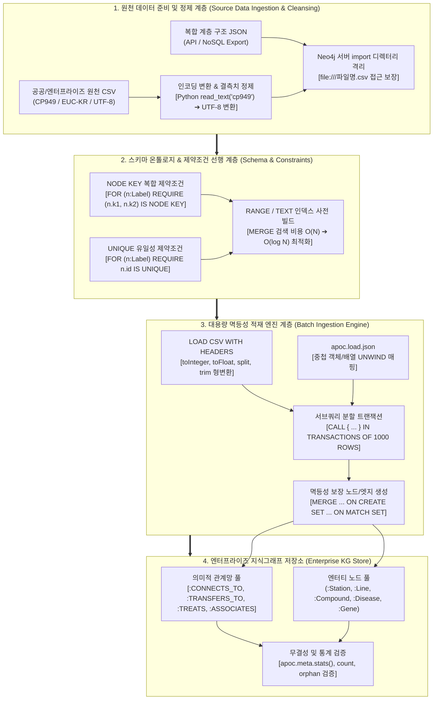

# 🏛️ [Day 32 마스터 아키텍처 보고서] 지식그래프(Knowledge Graph) 대용량 구축·적재 및 ETL 파이프라인 아키텍처

> **문서 목적**: 단순한 파일 읽기 문법 습득을 넘어, **"엔터프라이즈 지식그래프 적재 파이프라인 설계 원칙"**, **"LOAD CSV vs APOC(JSON/XML)의 내부 스트리밍 및 메모리 메커니즘"**, **"CP949 ➔ UTF-8 인코딩 변환 및 데이터 정제 거버넌스"**, **"제약조건(UNIQUE/NODE KEY) 선행 구축을 통한 멱등성(Idempotency) 보장 원리"**, **"대용량 서브쿼리 배치 트랜잭션(`IN TRANSACTIONS OF n ROWS` / `apoc.periodic.iterate`)"**, 그리고 **"생물의학 Hetionet & 서울 지하철 대중교통 멀티모달 그래프 모델링 실무"**까지 지식그래프 엔지니어링 관점에서 집대성한 최상위 개념 및 실무 아키텍처 보고서입니다.

---

## 🗺️ 1. 지식그래프 구축·적재 파이프라인 조감도



#### 📐 텍스트 아키텍처 조감도 (모든 뷰어 완벽 호환)

```text
┌───────────────────────────────────────────────────────────────────────────────────────────────────────────┐
│ 1. 원천 데이터 준비 (Data Ingestion & Preprocessing)                                                      │
│    ├─ [인코딩 정제] : CP949 원천 파일 ➔ Python UTF-8 변환 (LOAD CSV는 UTF-8만 지원)                        │
│    ├─ [보안 격리]   : Neo4j 서버 import 디렉터리 내 배치 (`file:///seoul_metro.csv`)                         │
│    └─ [결측치 대응] : coalesce(val, default), CASE WHEN val IS NULL THEN ... 형변환 안정성 확보            │
├───────────────────────────────────────────────────────────────────────────────────────────────────────────┤
│ 2. 제약조건 선행 (Schema Constraints First)                                                               │
│    ├─ [선행 이유]   : 제약조건이 없으면 MERGE 시 매 행마다 전체 노드 스캔(AllNodesScan) 발생 ➔ 극심한 병목   │
│    ├─ [복합 식별자] : (역명, 호선) 복합 키 ➔ CREATE CONSTRAINT ... REQUIRE (s.name, s.line) IS NODE KEY     │
│    └─ [단일 식별자] : 노드 ID 유일성 ➔ CREATE CONSTRAINT ... REQUIRE n.id IS UNIQUE                          │
├───────────────────────────────────────────────────────────────────────────────────────────────────────────┤
│ 3. 대용량 배치 적재 파이프라인 (Batch Ingestion Pipeline)                                                 │
│    ├─ [LOAD CSV]    : CSV 1행 단위 스트림 파싱 + toInteger/toFloat/split 가공                               │
│    ├─ [APOC JSON]   : apoc.load.json ➔ UNWIND $.items AS item ➔ 중첩 키-값 분해                             │
│    ├─ [배치 분할]   : CALL { ... } IN TRANSACTIONS OF 1000 ROWS ➔ 힙 메모리 OOM(Out Of Memory) 원천 차단   │
│    └─ [멱등성 보장] : MERGE + ON CREATE SET (최초 생성 시만 실행) / ON MATCH SET (중복 시 갱신)               │
├───────────────────────────────────────────────────────────────────────────────────────────────────────────┤
│ 4. 검증 및 프로덕션 안착 (Validation & Production)                                                        │
│    ├─ [메타 통계]   : apoc.meta.stats() ➔ 노드 수, 관계 수, 레이블별 카운트 즉시 점검                       │
│    ├─ [고립 노드]   : MATCH (n) WHERE NOT (n)--() RETURN count(n) ➔ 고립 엔터티 감지                         │
│    └─ [파라미터화]  : $station_name 기반 실전 질의 바인딩 ➔ 캐시 적중률 및 SQL Injection 방어                │
└───────────────────────────────────────────────────────────────────────────────────────────────────────────┘
```

---

## 🎯 2. 핵심 5대 지식그래프 엔지니어링 패턴

### Pattern 1. 제약조건 선행 생성 (Constraint First Principle)
* **원리**: `LOAD CSV`로 10만 건을 적재할 때, `MERGE (n:Item {id: row.id})` 구문은 인덱스가 없으면 매 행마다 전체 노드를 풀스캔($O(N)$)하여 $O(N^2)$의 연산 지옥에 빠집니다.
* **해법**: 적재 전 반드시 `IS UNIQUE` 또는 `IS NODE KEY` 제약을 먼저 생성하여 $O(1) \sim O(\log N)$ 해시/B-Tree 인덱스 탐색을 보장합니다.

```cypher
// [1단계] 복합 식별자 NODE KEY 제약 생성 (역명 + 호선)
CREATE CONSTRAINT station_key_unique IF NOT EXISTS
FOR (s:Station) REQUIRE (s.name, s.line) IS NODE KEY;

// [2단계] 단일 식별자 UNIQUE 제약 생성 (호선 ID)
CREATE CONSTRAINT line_id_unique IF NOT EXISTS
FOR (l:Line) REQUIRE l.line_id IS UNIQUE;
```

---

### Pattern 2. 안전한 형변환과 결측치 방어 (`LOAD CSV`)
* **원리**: CSV에서 읽어온 모든 값은 `String` 타입입니다. 수치 필드(`int`, `float`)는 명시적으로 변환해야 하며, 빈 문자열(`""`)이나 `null`에 `toInteger()`를 바로 적용하면 쿼리가 실패합니다.
* **해법**: `coalesce`와 `CASE WHEN`으로 결측치를 방어합니다.

```cypher
LOAD CSV WITH HEADERS FROM 'file:///seoul_metro_transfer_utf8.csv' AS row
WITH row
WHERE row.station_name IS NOT NULL
MERGE (s:Station {name: trim(row.station_name), line: trim(row.line)})
SET s.transfer_count = toInteger(coalesce(row.transfer_count, "0")),
    s.peak_ratio = toFloat(coalesce(row.peak_ratio, "0.0")),
    s.updated_at = datetime();
```

---

### Pattern 3. 복합 JSON 계층 분해 (`apoc.load.json`)
* **원리**: 엔터프라이즈 데이터는 계층 구조의 JSON으로 제공되는 경우가 많습니다.
* **해법**: `apoc.load.json`으로 읽고 `UNWIND`로 1:N 배열을 분해하여 노드와 관계를 동시에 구축합니다.

```cypher
CALL apoc.load.json('file:///seoul_metro_lines.json') YIELD value
UNWIND value.lines AS line_data
MERGE (l:Line {line_id: line_data.line_id})
SET l.name = line_data.line_name,
    l.color = line_data.color
WITH line_data, l
UNWIND line_data.stations AS st_name
MERGE (s:Station {name: st_name, line: line_data.line_name})
MERGE (s)-[:BELONGS_TO]->(l);
```

---

### Pattern 4. 대량 데이터 서브쿼리 배치 트랜잭션 (`IN TRANSACTIONS`)
* **원리**: 100만 건 이상의 데이터를 단일 트랜잭션으로 넣으면 JVM 힙 메모리가 가득 차서 `OutOfMemoryError`가 발생합니다.
* **해법**: `CALL { ... } IN TRANSACTIONS OF 1000 ROWS` 구문으로 1,000건마다 트랜잭션을 커밋하여 메모리를 즉시 반환합니다.

```cypher
LOAD CSV WITH HEADERS FROM 'file:///hetionet_edges.csv' AS row
CALL {
    WITH row
    MATCH (source {id: row.source_id})
    MATCH (target {id: row.target_id})
    MERGE (source)-[r:RELATION {type: row.metaedge}]->(target)
    SET r.source_doc = row.source
} IN TRANSACTIONS OF 1000 ROWS;
```

---

### Pattern 5. 멱등성(Idempotency) 유지 및 갱신 거버넌스
* **원리**: 적재 파이프라인은 네트워크 장애나 중간 중단 후 언제 다시 실행해도 데이터가 중복 생성되지 않아야 합니다.
* **해법**: `MERGE` 구문과 `ON CREATE SET` / `ON MATCH SET`을 완벽히 분리합니다.

```cypher
MERGE (s:Station {name: row.station_name, line: row.line})
ON CREATE SET
    s.created_at = datetime(),
    s.initial_load = true,
    s.passengers = toInteger(row.passengers)
ON MATCH SET
    s.updated_at = datetime(),
    s.passengers = toInteger(row.passengers);
```

---

## 📊 3. Day 32 핵심 실습 데이터 스키마 요약

| 데이터셋 | 파일명 | 대상 노드 레이블 | 대상 관계 타입 | 핵심 식별자 |
|---|---|---|---|---|
| **서울 지하철 환승** | `seoul_metro_transfer_utf8.csv` | `:Station`, `:Day` | `[:HAS_TRANSFER]`, `[:TRANSFERS_TO]` | `(name, line)` NODE KEY |
| **서울 지하철 노선망** | `seoul_metro_lines.json` | `:Station`, `:Line` | `[:BELONGS_TO]`, `[:NEXT_STATION]` | `line_id`, `(name, line)` |
| **Hetionet 바이오 KG** | `hetionet_nodes.csv`<br>`hetionet_edges.csv` | `:Compound`, `:Disease`, `:Gene`, `:Anatomy` | `[:TREATS]`, `[:CAUSES]`, `[:ASSOCIATES]`, `[:EXPRESSES]` | `id` (예: `Compound::DB00001`) |

---

## 🏆 4. 실무 체크리스트 (Knowledge Graph Ingestion Best Practices)

- [x] **인코딩 검증**: 공공데이터(CP949/EUC-KR)는 Python 사전 변환을 거쳐 UTF-8로 저장 후 `LOAD CSV` 호출.
- [x] **제약조건 선행**: 적재 스크립트 1단계에서 유일성/복합키 제약조건 무조건 선행 배포.
- [x] **메모리 보호**: 1만 건 이상 대량 적재 시 `CALL { ... } IN TRANSACTIONS OF 1000 ROWS` 필수 적용.
- [x] **안전한 결측치 제어**: `coalesce`와 `trim`을 통한 빈 문자열/공백/NULL 무결성 방어.
- [x] **적재 후 메타 점검**: `apoc.meta.stats()` 및 고립 노드 검사 쿼리로 E2E 정합성 100% 검증.
