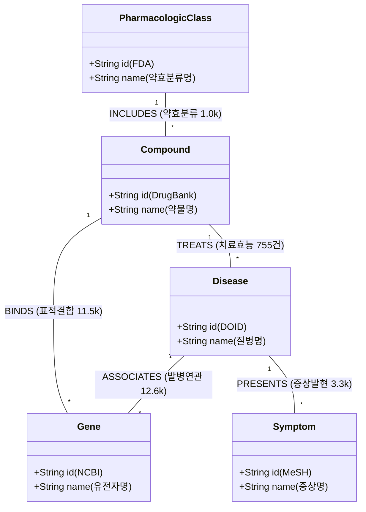

# 📋 [Day 33] GDS 알고리즘 & 투영 스키마 마스터 명세서

> **목적**: Hetionet 의생명 그래프 및 서울 지하철 환승 네트워크의 GDS 인메모리 투영 DDL 및 알고리즘 파라미터 표준 규격서

---

## 🗺️ 1. Big Picture (스키마 & 파이프라인 조감도)



---

## 💡 2. WHY (스키마 설계 의도 및 데이터 규격)

### ① 왜 단일 노드가 아니라 5개 이종(Heterogeneous) 노드로 분리했을까?
* **이유**: 단순 텍스트 검색은 "이 약이 이 병에 왜 듣는지"의 생물학적 메커니즘을 설명하지 못합니다.
* **해결**: `질병(Disease) ➔ 타겟 유전자(Gene) ➔ 결합 약물(Compound)`의 **삼각 릴레이 경로(Path)**를 구축하여 GraphRAG 및 PageRank가 원인과 결과를 역추적할 수 있도록 설계했습니다.

---

## 🚀 3. WHEN (투영 DDL 및 알고리즘 모드 규격)

### ① 투영 3대 모드 규격서

| 투영 모드 | 문법 규격 | 장점 및 특징 | 실무 사용 시점 |
|---|---|---|---|
| **Native 단일** | `['Compound', 'Gene'], ['BINDS']` | 가장 단순하고 빠름 | 단일 관계망 분석 |
| **Native 복합 삼각** | `['Disease', 'Gene', 'Compound'], {ASSOCIATES: ..., BINDS: ..., TREATS: ...}` | 다중 이종 엣지 통합 계산 | 신약 후보 발굴, 복합 출자망 |
| **Cypher 조건부** | `gds.graph.project.cypher(..., nodeQuery, relQuery)` | `WHERE gene_count >= 100` 필터 가능 | 특정 조건의 서브그래프만 동적 추출 |

---

## 💻 4. HOW (표준 DDL 및 알고리즘 실행 명세)

### ① [DDL] 삼각 인메모리 그래프 투영 DDL
```cypher
// 투영 멱등성 보장: 기존 것 삭제 후 생성
CALL gds.graph.drop('bioMasterGraph', false) YIELD graphName;

CALL gds.graph.project(
    'bioMasterGraph',
    ['Disease', 'Gene', 'Compound'],
    {
        ASSOCIATES: {type: 'ASSOCIATES', orientation: 'UNDIRECTED'},
        BINDS: {type: 'BINDS', orientation: 'UNDIRECTED'},
        TREATS: {type: 'TREATS', orientation: 'UNDIRECTED'}
    }
)
YIELD graphName, nodeCount, relationshipCount, projectMillis;
```

---

### ② [Algorithm] 3대 중심성 지표 실행 규격

```cypher
// 1. 차수 중심성 (Degree: 로컬 연결 수)
CALL gds.degree.stream('bioMasterGraph')
YIELD nodeId, score
WITH gds.util.asNode(nodeId) AS n, score
RETURN n.name AS name, labels(n)[0] AS type, toInteger(score) AS degree
ORDER BY degree DESC LIMIT 5;

// 2. PageRank (전역 권력/실세 랭킹)
CALL gds.pageRank.stream('bioMasterGraph', {maxIterations: 20, dampingFactor: 0.85})
YIELD nodeId, score
WITH gds.util.asNode(nodeId) AS n, score
RETURN n.name AS name, labels(n)[0] AS type, round(score, 4) AS pagerank
ORDER BY pagerank DESC LIMIT 5;

// 3. 매개 중심성 (Betweenness: 네트워크 길목)
CALL gds.betweenness.stream('bioMasterGraph')
YIELD nodeId, score
WITH gds.util.asNode(nodeId) AS n, score
RETURN n.name AS name, labels(n)[0] AS type, round(score, 2) AS betweenness
ORDER BY betweenness DESC LIMIT 5;
```

---

### ③ [Algorithm] 개인화 PageRank (PPR: 타겟팅 인텔리전스)

```cypher
// 특정 질환 관점에서의 표적 치료제 Top 5 랭킹
MATCH (d:Disease {name: 'breast cancer'})
WITH collect(id(d)) AS sources
CALL gds.pageRank.stream('bioMasterGraph', {
    maxIterations: 20,
    dampingFactor: 0.85,
    sourceNodes: sources
})
YIELD nodeId, score
WITH gds.util.asNode(nodeId) AS n, score
WHERE n:Compound
RETURN n.name AS target_drug, round(score, 6) AS ppr_score
ORDER BY ppr_score DESC LIMIT 5;
```
