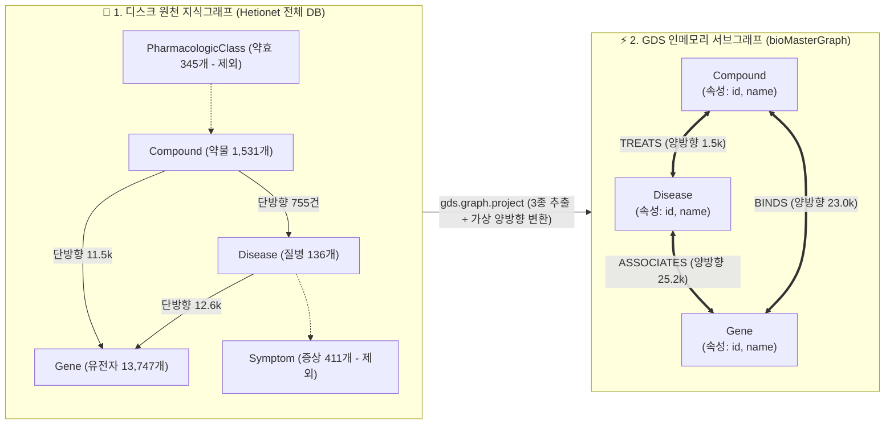

# 📋 [Day 33] GDS 서브그래프 데이터 구조 & 알고리즘 마스터 명세서

> 💡 **10초 본질 요약**:  
> 새 노드나 관계를 DB에 만드는 것이 아닙니다!  
> 이미 DB에 있는 데이터를 가지고 **"단순 글자(텍스트) 검색으로는 영원히 찾을 수 없는 2-Hop, 3-Hop 뒤의 숨은 신약 표적과 실세 권력자"를 GDS 인메모리 위에서 0.05초 만에 수학적으로 밝혀내는 기술**입니다.

---

## 🗺️ 1. 원천 DB vs GDS 인메모리 서브그래프 데이터 구조



---

## 📊 2. 서브그래프(bioMasterGraph) 노드·관계 데이터 규격

### ① 투영 노드 (Nodes: 14,780개)
| 노드 레이블 | 주요 속성 (Property) | 역할 및 설명 |
|---|---|---|
| **`Disease`** | `id` (DOID), `name` (질병명) | 분석의 출발점/도착점 (예: `breast cancer`) |
| **`Gene`** | `id` (NCBI), `name` (유전자명) | 질병과 약물을 잇는 생물학적 열쇠 구멍 (예: `BRCA1`, `HER2`) |
| **`Compound`** | `id` (DrugBank), `name` (약물명) | 최종 추천 및 표적 치료제 후보군 (예: `Tamoxifen`, `Doxorubicin`) |

### ② 투영 엣지 (Relationships: 49,898건 - 2배 검산 적용)
| 관계 타입 | 시작 노드 $\leftrightarrow$ 끝 노드 | 방향성 (Orientation) | 서브그래프 엣지 수 |
|---|---|:---:|:---:|
| **`ASSOCIATES`** | `Disease` $\leftrightarrow$ `Gene` | `UNDIRECTED` (양방향) | 25,236건 (원본 12,618건 $\times$ 2) |
| **`BINDS`** | `Compound` $\leftrightarrow$ `Gene` | `UNDIRECTED` (양방향) | 23,074건 (원본 11,537건 $\times$ 2) |
| **`TREATS`** | `Compound` $\leftrightarrow$ `Disease` | `UNDIRECTED` (양방향) | 1,510건 (원본 755건 $\times$ 2) |

---

## 🚀 3. GDS 투영 3대 모드 DDL 규격서

### ① 모드별 비교 요약

| 투영 모드 | 문법 규격 | 장점 및 특징 | 실무 사용 시점 |
|---|---|---|---|
| **Native 단일** | `['Compound', 'Gene'], ['BINDS']` | 가장 단순하고 빠름 | 단일 관계망 분석 |
| **Native 복합 삼각** | `['Disease', 'Gene', 'Compound'], {ASSOCIATES: ..., BINDS: ..., TREATS: ...}` | 다중 이종 엣지 통합 계산 | 신약 후보 발굴, 복합 출자망 |
| **Cypher 조건부** | `gds.graph.project.cypher(..., nodeQuery, relQuery)` | `WHERE gene_count >= 100` 필터 가능 | 특정 조건의 서브그래프만 동적 추출 |

---

### ② [DDL 1] Native 단일 투영 (약물-약효분류망)
```cypher
CALL gds.graph.drop('classGraph', false) YIELD graphName;

CALL gds.graph.project(
    'classGraph',
    ['PharmacologicClass', 'Compound'],
    {
        INCLUDES: {type: 'INCLUDES', orientation: 'UNDIRECTED'},
        RESEMBLES_CC: {type: 'RESEMBLES_CC', orientation: 'UNDIRECTED'}
    }
)
YIELD graphName, nodeCount, relationshipCount;
```

---

### ③ [DDL 2] Native 복합 삼각 투영 (신약 발굴 표준)
```cypher
CALL gds.graph.drop('bioMasterGraph', false) YIELD graphName;

CALL gds.graph.project(
    'bioMasterGraph',
    ['Disease', 'Gene', 'Compound'],
    {
        ASSOCIATES: {type: 'ASSOCIATES', orientation: 'UNDIRECTED'},
        BINDS: {type: 'BINDS', orientation: 'UNDIRECTED'},
        TREATS: {type: 'TREATS', orientation: 'UNDIRECTED'}
    }
)
YIELD graphName, nodeCount, relationshipCount, projectMillis;
```

---

### ④ [DDL 3] Cypher 조건부 투영 (필터링 서브그래프)
```cypher
CALL gds.graph.drop('filteredGraph', false) YIELD graphName;

CALL gds.graph.project.cypher(
    'filteredGraph',
    'MATCH (d:Disease) WHERE d.gene_count >= 50 RETURN id(d) AS id, ["Disease"] AS labels ' +
    'UNION MATCH (g:Gene) RETURN id(g) AS id, ["Gene"] AS labels',
    'MATCH (d:Disease)-[r:ASSOCIATES]->(g:Gene) RETURN id(d) AS source, id(g) AS target, "ASSOCIATES" AS type'
)
YIELD graphName, nodeCount, relationshipCount;
```

---

## 💻 4. 5대 알고리즘별 상세 소스 규격 (Full Cypher Reference)

### ① 차수 중심성 (Degree Centrality: 마당발 지수)

```cypher
// 1-1. Stream 모드 (화면 출력 및 DataFrame 변환)
CALL gds.degree.stream('bioMasterGraph')
YIELD nodeId, score
WITH gds.util.asNode(nodeId) AS n, score
RETURN n.name AS name, labels(n)[0] AS type, toInteger(score) AS degree
ORDER BY degree DESC LIMIT 5;

// 1-2. Stats 모드 (요약 통계 검산)
CALL gds.degree.stats('bioMasterGraph')
YIELD centralityDistribution
RETURN centralityDistribution.mean AS mean_degree,
       centralityDistribution.p50 AS median_degree,
       centralityDistribution.max AS max_degree;

// 1-3. 방향 및 관계 필터링 차수 (나가는 선 vs 들어오는 선)
CALL gds.degree.stream('classDirected', {
    relationshipTypes: ['INCLUDES'],
    orientation: 'REVERSE'   // 들어오는 선(In-Degree) 1위 측정
})
YIELD nodeId, score
RETURN gds.util.asNode(nodeId).name AS name, score
ORDER BY score DESC LIMIT 5;
```

---

### ② 전역 PageRank (실세/권력자 랭킹)

```cypher
// 2-1. Stream 모드 (실시간 순위 도출)
CALL gds.pageRank.stream('bioMasterGraph', {
    maxIterations: 20,
    dampingFactor: 0.85
})
YIELD nodeId, score
WITH gds.util.asNode(nodeId) AS n, score
RETURN n.name AS name, labels(n)[0] AS type, round(score, 4) AS pagerank
ORDER BY pagerank DESC LIMIT 5;

// 2-2. Mutate 모드 (디스크 쓰기 없이 RAM 서브그래프에만 임시 캐싱)
CALL gds.pageRank.mutate('bioMasterGraph', {
    maxIterations: 20,
    dampingFactor: 0.85,
    mutateProperty: 'temp_pagerank'
})
YIELD nodePropertiesWritten;

// 2-3. Write 모드 (검증된 최종 점수를 디스크 DB에 영구 기록)
CALL gds.pageRank.write('bioMasterGraph', {
    maxIterations: 20,
    dampingFactor: 0.85,
    writeProperty: 'final_pagerank'
})
YIELD nodePropertiesWritten;
```

---

### ③ 매개 중심성 (Betweenness Centrality: 네트워크 길목/브로커)

```cypher
CALL gds.betweenness.stream('bioMasterGraph')
YIELD nodeId, score
WITH gds.util.asNode(nodeId) AS n, score
RETURN n.name AS name, labels(n)[0] AS type, round(score, 2) AS betweenness
ORDER BY betweenness DESC LIMIT 5;
```

---

### ④ 개인화 PageRank (PPR: 타겟팅 인텔리전스)

```cypher
// 특정 질환(유방암) 관점에서의 표적 치료제 Top 10 랭킹
MATCH (d:Disease {name: 'breast cancer'})
WITH collect(id(d)) AS sources
CALL gds.pageRank.stream('bioMasterGraph', {
    maxIterations: 20,
    dampingFactor: 0.85,
    sourceNodes: sources
})
YIELD nodeId, score
WITH gds.util.asNode(nodeId) AS n, score
WHERE n:Compound
RETURN n.name AS target_drug, round(score, 6) AS ppr_score
ORDER BY ppr_score DESC LIMIT 10;
```

---

### ⑤ FastRP 그래프 임베딩 (128차원 지문 압축)

```cypher
CALL gds.fastRP.stream('bioMasterGraph', {
    embeddingDimension: 128,
    iterationWeights: [0.0, 1.0, 0.7, 0.4]
})
YIELD nodeId, embedding
RETURN gds.util.asNode(nodeId).name AS name,
       embedding[0..3] AS sample_vector
LIMIT 5;
```

---

## 🧹 5. 인메모리 수명주기 관리 DDL (Lifecycle)

```cypher
// [1] 현재 RAM에 올라온 서브그래프 목록 조회
CALL gds.graph.list()
YIELD graphName, nodeCount, relationshipCount, memoryUsage
RETURN graphName, nodeCount, relationshipCount, memoryUsage;

// [2] 분석 완료 후 메모리 안전 반환 (멱등성 보장)
CALL gds.graph.drop('bioMasterGraph', false) YIELD graphName;
```
