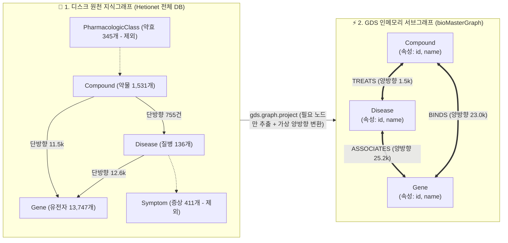

# 📋 [Day 33] GDS 서브그래프 데이터 구조 & 알고리즘 마스터 명세서

> 💡 **10초 본질 요약**:  
> 새 노드나 관계를 DB에 만드는 것이 아닙니다!  
> 이미 DB에 있는 데이터를 가지고 **"단순 글자(텍스트) 검색으로는 영원히 찾을 수 없는 2-Hop, 3-Hop 뒤의 숨은 신약 표적과 실세 권력자"를 GDS 인메모리 위에서 0.05초 만에 수학적으로 밝혀내는 기술**입니다.

---

## 🗺️ 1. 원천 DB vs GDS 인메모리 서브그래프 데이터 구조 비교



---

## 📊 2. 서브그래프(bioMasterGraph) 전용 데이터 규격서

### ① 투영 노드 (Nodes: 14,780개)
| 노드 레이블 | 주요 속성 (Property) | 역할 및 설명 |
|---|---|---|
| **`Disease`** | `id` (DOID), `name` (질병명) | 분석의 출발점/도착점 (예: `breast cancer`) |
| **`Gene`** | `id` (NCBI), `name` (유전자명) | 질병과 약물을 잇는 생물학적 열쇠 구멍 (예: `BRCA1`, `HER2`) |
| **`Compound`** | `id` (DrugBank), `name` (약물명) | 최종 추천 및 표적 치료제 후보군 (예: `Tamoxifen`, `Doxorubicin`) |

### ② 투영 엣지 (Relationships: 49,898건 - 2배 검산 적용)
| 관계 타입 | 시작 노드 $\leftrightarrow$ 끝 노드 | 방향성 (Orientation) | 서브그래프 엣지 수 |
|---|---|:---:|:---:|
| **`ASSOCIATES`** | `Disease` $\leftrightarrow$ `Gene` | `UNDIRECTED` (양방향) | 25,236건 (원본 12,618건 $\times$ 2) |
| **`BINDS`** | `Compound` $\leftrightarrow$ `Gene` | `UNDIRECTED` (양방향) | 23,074건 (원본 11,537건 $\times$ 2) |
| **`TREATS`** | `Compound` $\leftrightarrow$ `Disease` | `UNDIRECTED` (양방향) | 1,510건 (원본 755건 $\times$ 2) |

---

## 🧬 3. 서브그래프 위에서 생성되는 가상 파생 데이터 (In-Memory Outputs)

| 가상 데이터명 | 데이터 타입 | 생성 알고리즘 | 비즈니스 해석 |
|---|:---:|---|---|
| **`degree`** | `Integer` | `gds.degree.stream` | 단순 연결 마당발 지수 (선 개수) |
| **`pagerank`** | `Float` | `gds.pageRank.stream` | 전역 네트워크 내 실세 권력도 |
| **`betweenness`** | `Float` | `gds.betweenness.stream` | 네트워크 분단을 막는 핵심 길목도 |
| **`ppr_score`** | `Float` | `gds.pageRank.stream(sourceNodes)` | **특정 질환(유방암) 타겟 맞춤형 표적 신약 지수** |
| **`fastRP_vec`** | `Float[128]` | `gds.fastRP.stream` | 네트워크 연결 형태를 압축한 128차원 지문 벡터 |

---

## 💻 4. [완성형 DDL] 서브그래프 생성 및 파생 분석 템플릿

```cypher
// [1] 서브그래프 멱등성 생성 (디스크 수정 없이 RAM에만 생성)
CALL gds.graph.drop('bioMasterGraph', false) YIELD graphName;

CALL gds.graph.project(
    'bioMasterGraph',
    ['Disease', 'Gene', 'Compound'],
    {
        ASSOCIATES: {type: 'ASSOCIATES', orientation: 'UNDIRECTED'},
        BINDS: {type: 'BINDS', orientation: 'UNDIRECTED'},
        TREATS: {type: 'TREATS', orientation: 'UNDIRECTED'}
    }
)
YIELD graphName, nodeCount, relationshipCount, projectMillis;

// [2] 유방암 타겟 개인화 PageRank (PPR) 신약 후보군 10선 도출
MATCH (d:Disease {name: 'breast cancer'})
WITH collect(id(d)) AS sources
CALL gds.pageRank.stream('bioMasterGraph', {
    maxIterations: 20,
    dampingFactor: 0.85,
    sourceNodes: sources
})
YIELD nodeId, score
WITH gds.util.asNode(nodeId) AS n, score
WHERE n:Compound
RETURN n.name AS target_drug, round(score, 6) AS ppr_score
ORDER BY ppr_score DESC LIMIT 10;

// [3] 메모리 반환
CALL gds.graph.drop('bioMasterGraph') YIELD graphName;
```
