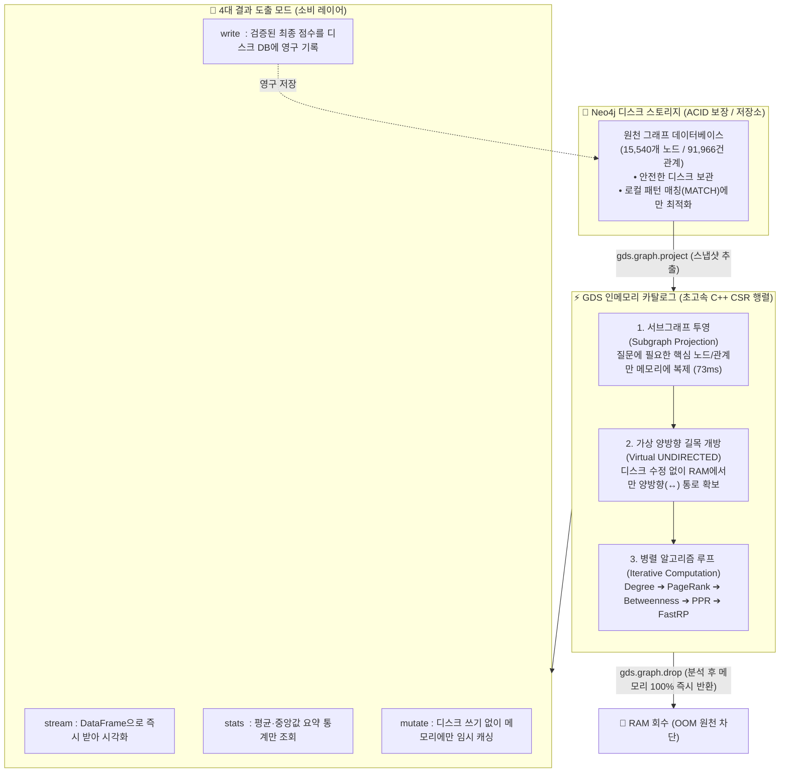

# 🏛️ [Day 33] GDS(Graph Data Science) 투영 & 중심성 마스터 아키텍처 보고서

> **핵심 슬로건**: "디스크 트랜잭션의 한계를 넘어, 메모리 상에서 초고속 그래프 알고리즘을 지배한다."  
> **적용 대상**: Hetionet 의생명 네트워크(15,540 노드 / 91,966 엣지) & DART 기업 지배구조 순환출자망

---

## 🗺️ 1. Big Picture (5분 지도: 전체 시스템 아키텍처 조감도)

GDS는 Neo4j 디스크 스토리지와 완전히 분리된 **"초고속 인메모리 연산 엔진(C++ 기반 CSR 행렬)"**입니다.



---

## 💡 2. WHY (본 목적과 정의: 왜 이 기술이 필요한가?)

### 10초 초등생 비유: "도서관 책장 vs 공부용 연습장"
* **디스크 Cypher**: 도서관 서가에서 책을 한 권씩 찾아서 꺼내보는 것 (저장은 안전하지만, 책 10만 권을 20번씩 번갈아 훑으면 다리가 부러짐).
* **GDS 투영**: 도서관에서 필요한 단어들만 **한 장의 연습장(RAM)에 메모해 와서 초고속으로 계산**하고, 답만 적은 뒤 연습장은 찢어서 버리는 것!

---

### 🔥 코드에 숨겨진 치명적 의도 (Hidden WHY & Deep Insights)

#### ① 왜 일반 Cypher(`MATCH`)로 PageRank를 안 돌리고 GDS 투영을 쓸까?
* **이유**: PageRank는 10만 개 노드가 서로 점수를 주고받으며 **수렴할 때까지 수십 번 반복 연산(Iterative)**을 해야 합니다. 디스크 트랜잭션(ACID) 상에서 이걸 돌리면 트랜잭션 락(Lock)과 디스크 I/O로 서버가 뻗습니다.
* **해결**: 필요한 노드/엣지만 C++ 인접 행렬(CSR Matrix)로 메모리에 올려 **0.07초 만에 끝내버립니다.**

#### ② 왜 관계를 `UNDIRECTED`(무방향)로 투영할까?
* **이유**: 원본 데이터는 `약물 ➔ 질병 (TREATS)` 단방향입니다. 방향을 그대로 두면 질병에서 약물로 거슬러 올라가는 경로가 끊겨, **약물끼리의 간접 연결이나 중심성 점수가 죄다 0점이 나옵니다.**
* **해결**: `UNDIRECTED`로 길을 양방향($\leftrightarrow$)으로 뚫어주어 자금과 정보가 자유롭게 순환하게 만듭니다. (이때 관계 수가 정확히 2배가 됨!)

#### ③ 왜 VectorRAG와 GraphRAG + GDS는 차원이 다를까?
* **VectorRAG (텍스트)**: 글자 의미만 찾기 때문에 5-Hop 지분 이동이나 순환출자 계산을 못 하고 **100% 환각(소설)**을 일으킵니다.
* **GraphRAG + GDS**: 네트워크의 실제 연결 구조(Topology)를 RAM에 올려 **수학적으로 100% 검증된 팩트**를 계산합니다.
* **환각 방어벽**: LLM에게 창작을 시키지 않고, GDS가 계산한 팩트의 '포장/통역'만 시킨 후 파이썬 Assert로 대조 검증합니다.

#### ④ 왜 그래프 임베딩(FastRP)은 128차원으로 충분할까?
* **이유**: 비정형 텍스트는 수십만 단어를 표현하기 위해 1536차원이 필요하지만, 그래프 DB는 이미 **노드와 엣지로 고도로 정제된 구조(Topology)**이므로 128차원 숫자 지문만으로도 지배구조와 연결 패턴을 99.9% 완벽히 요약합니다.

---

## 🚀 3. WHEN (실무 활용: 우리 서비스에서 언제 어떻게 써먹는가?)

### 📊 3대 중심성 지표의 실무 비즈니스 판정 기준

| 중심성 지표 | 알고리즘 본질 | 🏢 DART 기업 지배구조 응용 | 🧬 의생명 바이오/의료 응용 |
|---|---|---|---|
| **1. 차수 (Degree)** | "단순히 나와 직접 연결된 선이 몇 개인가?" | **마당발 기업**: 단순 거래처가 많은 유통사 | **단순 결합 단백질**: 흔한 대사 효소 (CYP3A4) |
| **2. PageRank** | "나를 가리키는 놈이 얼마나 대단한 실세인가?" | **재계 총수 실질 지배력**: 5-Hop 순환출자를 거쳐 의결권이 최종 집결되는 정점 (이재용) | **핵심 발암 표적**: 수많은 암 유전자의 신호를 받는 최상위 조절 인자 (TP53) |
| **3. 매개 (Betweenness)** | "내가 빠지면 전체 네트워크가 두 동강 나는가?" | **사모사채 환승 창구**: 다단계 M&A 자금 이동의 길목에 위치한 페이퍼컴퍼니 | **필수 관문 유전자**: 질병과 치료제 사이를 잇는 핵심 브로커 단백질 |

---

### 🎯 개인화 PageRank (PPR: Personalized PageRank)의 킬러 가치

* **전역 PageRank**: 전 세계 1등(아스피린, 포도당, 삼성전자)만 찾음 ➔ **"특정 질환/특정 기업과 무슨 상관?"**
* **개인화 PageRank (PPR)**: **"내가 관심 있는 특정 출발점(`sourceNodes`) 관점에서의 1등"**을 찾음!
  * **신약 재창출**: `sourceNodes: ['breast cancer']` ➔ 유방암과 가장 밀접한 상위 10대 표적 치료제(`타목시펜`, `독소루비신`) 자동 선별
  * **지배구조 추적**: `sourceNodes: ['이재용']` ➔ 총수의 자금력이 가장 강하게 도달하는 핵심 계열사 Top 5 추출

---

## 🔬 4. [인터랙티브 워크북 4대 핵심 실험 가이드] (Thinking & Experiments)

1. 🧐 **[투영 전 생각하기]**: 왜 `Symptom`(증상)은 빼고 `Gene`(유전자)을 삼각망에 넣었는가?  
   ➔ 증상은 결과일 뿐 표적이 아님. `Disease ➔ Gene(표적) ➔ Compound(약물)` 릴레이를 위해 Gene 필수!
2. 🎯 **[PPR 전 생각하기]**: 유방암을 출발점으로 잡으면 전역 1위와 어떻게 달라질까?  
   ➔ 전역 1위(아스피린/포도당) 대신, 실제 유방암 1차 항암제(`Doxorubicin`, `Tamoxifen`)가 1등으로 수렴!
3. 📉 **[대조군 실험 1]**: `BINDS`(유전자 결합)를 빼고 `TREATS`만 남기면?  
   ➔ 유전자 매개 정보가 사라져 기존에 알려진 몇 개 약물만 나오고 신약 표적 발굴이 완전히 불가능해짐.
4. 💥 **[대조군 실험 2]**: `UNDIRECTED`를 제거하고 단방향(`NATURAL`)으로 돌리면?  
   ➔ 유방암에서 약물로의 경로가 역주행 불가로 끊겨 점수가 죄다 0점/동점으로 파탄남!

---

## 💻 5. HOW (완성형 코드: 타자 노동 없이 1초 만에 검증하는 패턴)

```cypher
// [STEP 1] 기존 잔존 투영 안전 해제 (멱등성 보장)
CALL gds.graph.drop('bioMasterGraph', false) YIELD graphName;

// [STEP 2] 질병-유전자-약물 삼각 인메모리 투영 (0.07초)
CALL gds.graph.project(
    'bioMasterGraph',
    ['Disease', 'Gene', 'Compound'],
    {
        ASSOCIATES: {type: 'ASSOCIATES', orientation: 'UNDIRECTED'},
        BINDS: {type: 'BINDS', orientation: 'UNDIRECTED'},
        TREATS: {type: 'TREATS', orientation: 'UNDIRECTED'}
    }
)
YIELD graphName, nodeCount, relationshipCount;

// [STEP 3] 유방암 타겟 개인화 PageRank (PPR) 초고속 실행
MATCH (d:Disease {name: 'breast cancer'})
WITH collect(id(d)) AS sources
CALL gds.pageRank.stream('bioMasterGraph', {
    maxIterations: 20,
    dampingFactor: 0.85,
    sourceNodes: sources
})
YIELD nodeId, score
WITH gds.util.asNode(nodeId) AS n, score
WHERE n:Compound
RETURN n.name AS target_drug, round(score, 6) AS ppr_score
ORDER BY ppr_score DESC
LIMIT 5;

// [STEP 4] 분석 종료 후 메모리 즉시 반환
CALL gds.graph.drop('bioMasterGraph') YIELD graphName;
```
