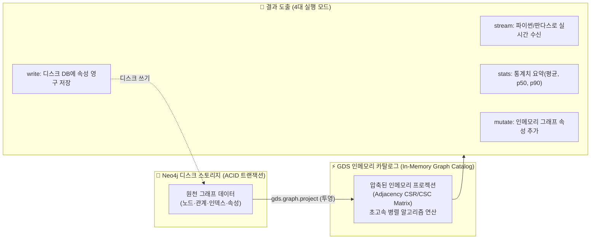
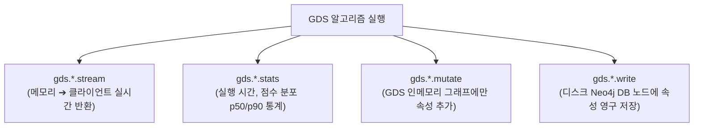

# 🏛️ [Day 33] Neo4j GDS(Graph Data Science) 투영 및 중심성 마스터 아키텍처 보고서
> **문서 버전**: v1.0 (2026-09-02)  
> **핵심 주제**: 인메모리 그래프 투영(Native / Cypher Projection), 차수(Degree), PageRank, 개인화 PageRank(PPR), 매개 중심성(Betweenness) 및 대규모 지식그래프 분석 아키텍처  
> **분석 데이터셋**: Hetionet v1.0 의료 지식그래프(15,540개 노드, 91,966건 관계) & 서울 지하철 환승 네트워크

---

## 1. 📌 개요 및 GDS 아키텍처의 패러다임 전환

### ① 왜 Cypher 탐색을 넘어 GDS(Graph Data Science)가 필요한가?
일반적인 Cypher 쿼리는 디스크 기반 트랜잭션(ACID)과 로컬 패턴 매칭(`MATCH (a)-[r]->(b)`)에 최적화되어 있습니다.  
그러나 **수만~수억 개의 노드 전역을 대상으로 수렴할 때까지 반복 계산(Iterative Computation)해야 하는 그래프 알고리즘**(예: PageRank 20회 반복, 최단 경로 전수 탐색)을 디스크 트랜잭션 상에서 직접 돌리면 막대한 디스크 I/O와 트랜잭션 락(Lock) 오버헤드가 발생합니다.



---

## 2. ⚡ 인메모리 그래프 투영 (Graph Projection) 메커니즘

GDS는 디스크의 원천 데이터를 고도로 압축된 **인메모리 인접 행렬(CSR: Compressed Sparse Row)** 구조로 복제(투영)하여 CPU 캐시 친화적인 병렬 연산을 수행합니다.

### ① 네이티브 투영 (Native Projection) vs Cypher 투영 (Cypher Projection)

| 비교 항목 | 네이티브 투영 (`gds.graph.project`) | Cypher 투영 (`gds.graph.project.cypher`) |
|---|---|---|
| **동작 원리** | C++ 최적화 커널이 디스크 포인터를 직접 읽어 메모리 행렬 빌드 | Cypher 쿼리 엔진을 거쳐 결과 레코드를 메모리로 파이프라이닝 |
| **성능 (속도)** | **압도적 초고속** (수백만 노드/엣지를 수 초 내 적재) | Cypher 파싱 및 런타임 오버헤드로 상대적으로 느림 |
| **유연성** | 레이블, 관계 타입, 방향, 속성 선언 위주 | `WHERE`, `CASE WHEN`, 가변 경로 등 복잡한 조건 필터링 가능 |
| **추천 사용처** | 대규모 표준 그래프, 전수 분석, 실시간 배치 파이프라인 | 특정 날짜 이전 공시, 가중치 조건 계산 등 동적 서브그래프 |

---

### ② 방향성(Orientation) 설정과 2배 검산 법칙

GDS는 원천 DB의 방향과 별개로 알고리즘의 성격에 맞게 투영 시 방향성을 재정의할 수 있습니다.

* `NATURAL` (기본값): 원천 그래프의 화살표 방향 그대로 투영 ($A \rightarrow B$)
* `REVERSE`: 원천 그래프의 화살표 방향을 역전하여 투영 ($A \leftarrow B$)
* `UNDIRECTED`: 양방향으로 동시에 투영 ($A \leftrightarrow B$) ➔ **관계 건수가 정확히 2배로 계산됨**

```cypher
// 네이티브 투영 표준 문법 (약물-표적 유전자 그래프)
CALL gds.graph.project(
    'drugGeneGraph',
    ['Compound', 'Gene'],
    {
        CbG: {type: 'BINDS_CbG', orientation: 'UNDIRECTED'},
        CuG: {type: 'UPREGULATES_CuG', orientation: 'NATURAL'}
    }
);
```

---

## 3. 🎯 3대 핵심 중심성(Centrality) 알고리즘 비교


| 알고리즘 | 수식 및 핵심 원리 | 의미 및 비즈니스 해석 | 실전 활용 사례 |
|---|---|---|---|
| **차수 중심성**<br>(Degree) | $C_D(v) = \text{deg}(v)$<br>(연결된 엣지의 단순 총합) | "마당발" (단순히 직접 아는 사람이 많음) | 공항 허브, 트위터 단순 팔로워 수 |
| **PageRank** | $PR(v) = \frac{1-d}{N} + d \sum_{u \in M(v)} \frac{PR(u)}{L(u)}$<br>($d$: 감쇄계수, 기본 0.85) | "실세 / 권력자" (영향력 높은 주체들로부터 집중적인 출자/지지를 받음) | 구글 웹페이지 랭킹, **재계 총수 실질 지배력**, 핵심 표적 단백질 발굴 |
| **매개 중심성**<br>(Betweenness) | $C_B(v) = \sum_{s \neq v \neq t} \frac{\sigma_{st}(v)}{\sigma_{st}}$<br>($\sigma$: 최단 경로 수) | "길목 / 브로커" (정보나 자금이 흐르기 위해 반드시 거쳐야 하는 핵심 거점) | 물류 유통 병목, 금융 자금세탁 환승 창구, 지하철 환승역 |

---

## 4. 🧠 개인화 PageRank (Personalized PageRank: PPR)

일반 PageRank는 모든 노드에 동일한 확률($\frac{1}{N}$)로 텔레포트(Teleport)하여 전역적 중요도를 계산합니다.  
반면 **개인화 PageRank**는 텔레포트 목적지를 **특정 출발점 노드 집합(`sourceNodes`)으로 한정**하여, "특정 노드의 관점에서 바라본 상대적 영향력 순위"를 도출합니다.

$$PR_{source}(v) = (1-d) \cdot \mathbf{1}_{v \in S} + d \sum_{u \in M(v)} \frac{PR_{source}(u)}{L(u)}$$

### 💡 실무 활용 가치
* **신약 재창출(Drug Repurposing)**: 특정 질병(예: '당뇨병') 노드를 `sourceNodes`로 지정하고 PPR을 실행하면, 해당 질병과 가장 밀접하게 연결된 유전자와 약물 후보가 최상위에 랭크됩니다.
* **기업 지배구조 추적**: 특정 총수(예: '이재용') 노드를 `sourceNodes`로 설정하면, 복잡한 5-Hop 지분망 속에서 총수의 의결권이 가장 강하게 도달하는 계열사 순위가 계산됩니다.

---

## 5. 🛠️ GDS 4대 실행 모드 (Execution Modes) 거버넌스



1. **`stream`**: 결과 레코드를 파이썬/판다스 DataFrame으로 직접 수신하여 탐색적 데이터 분석(EDA) 및 시각화에 사용.
2. **`stats`**: 대규모 그래프에서 결과를 전부 스트리밍하지 않고 통계적 요약(최소, 최대, 평균, 백분위수)만 빠르게 확인.
3. **`mutate`**: 연속된 알고리즘 파이프라인(예: PageRank 점수를 가중치로 삼아 커뮤니티 탐지 실행)을 위해 인메모리 그래프에 가상 속성으로 캐싱.
4. **`write`**: 검증이 완료된 최종 랭킹/스코어를 Neo4j 디스크 스토리지에 영구 속성(예: `n.pagerank_score`)으로 커밋.

---

## 6. 🔒 프로덕션 환경 GDS 운영 및 메모리 수명 주기 (Lifecycle)

GDS 투영은 Neo4j JVM Heap 메모리 외부에 별도의 **Off-Heap 메모리**를 점유합니다.  
따라서 분석이 종료된 투영은 반드시 카탈로그에서 명시적으로 삭제(Drop)해야 메모리 누수(OOM)를 방지할 수 있습니다.

```cypher
// 1. 투영 메모리 사용량 사전 추정 (Memory Estimation)
CALL gds.graph.project.estimate(['Gene', 'Compound'], ['BINDS_CbG']);

// 2. 현재 메모리에 적재된 투영 목록 조회
CALL gds.graph.list() YIELD graphName, nodeCount, relationshipCount, memoryUsage;

// 3. 사용 완료된 투영 해제 (반드시 수행)
CALL gds.graph.drop('drugGeneGraph') YIELD graphName;
```
