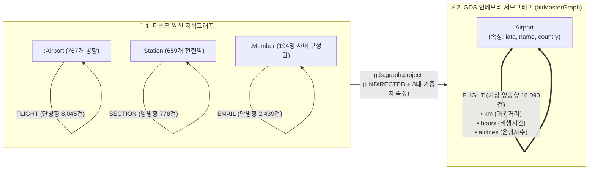

# 📋 [Day 34] GDS 알고리즘 & 투영 스키마 마스터 명세서

> 💡 **10초 본질 요약**:  
> 새 노드나 관계를 DB에 만드는 것이 아닙니다!  
> 이미 DB에 있는 그래프를 가지고 **"단순 패턴 매칭으로는 영원히 찾을 수 없는 숨겨진 파벌(카르텔) 군집, 쌍둥이 유사 노드, 최적 환승 경로"를 GDS 인메모리 위에서 0.05초 만에 수학적으로 도출하는 기술**입니다.

---

## 🗺️ 1. 원천 DB vs GDS 인메모리 서브그래프 데이터 구조



---

## 📊 2. 서브그래프(airMasterGraph) 노드·관계 데이터 규격

### ① 투영 노드 (Nodes: 767개 공항)
| 노드 레이블 | 주요 속성 (Property) | 역할 및 설명 |
|---|---|---|
| **`Airport`** | `iata` (3자리 코드), `name` (공항 영문명), `city` (도시), `country` (국가/지역) | 경로 탐색의 출발/도착점 및 커뮤니티 배정 대상 |

### ② 투영 엣지 (Relationships: 16,090건 - 2배 검산 적용)
| 관계 타입 | 시작 노드 $\leftrightarrow$ 끝 노드 | 방향성 (Orientation) | 가중치 속성 (Properties) | 서브그래프 엣지 수 |
|---|---|:---:|---|:---:|
| **`FLIGHT`** | `Airport` $\leftrightarrow$ `Airport` | `UNDIRECTED` (양방향) | `km` (거리), `hours` (시간), `airlines` (운항사수) | 16,090건 (원본 8,045건 $\times$ 2) |

---

## 🧮 3. 3대 알고리즘 패밀리 수학적 원리 및 파라미터 튜닝 표준

### [패밀리 A] 커뮤니티 탐지 (Community Detection)

#### 1. Leiden vs Louvain vs LPA 비교표
| 알고리즘 | 수식적 목표 | 장점 | 단점 / 주의점 |
|---|---|---|---|
| **Leiden** | Modularity 최적화 + 서브커뮤니티 정제 | **단절된 커뮤니티 발생 0% 보장**, 최고 품질 군집 | `UNDIRECTED` 관계만 허용 (GDS 2.5+) |
| **Louvain** | Modularity 계층적 극대화 | 빠르고 직관적 | 단절 커뮤니티 발생 위험 |
| **LPA (Label Propagation)** | 이웃 노드들의 다수결 라벨 수렴 | 극도로 빠름 ($O(E)$) | 대형 커뮤니티로의 쏠림(Giant Component) 발생 |

#### 2. 모듈러리티 평가 지표
* **Modularity ($Q$)**: $-0.5 \le Q \le 1.0$. 무작위 연결망 대비 커뮤니티 내부 엣지 밀도의 편차. (보통 $Q > 0.4$면 명확한 군집 구조)
* **NMI (Normalized Mutual Information)**: $0 \le NMI \le 1$. 실제 정답(예: 국가 라벨)과 알고리즘이 찾은 커뮤니티 간의 일치도.

---

### [패밀리 B] 노드 유사도 (Node Similarity)

#### 1. Jaccard Similarity vs Overlap Coefficient
* **Jaccard Similarity**:
  $$J(A, B) = \frac{|N(A) \cap N(B)|}{|N(A) \cup N(B)|}$$
  공통 이웃이 많고 전체 이웃 수가 비슷할 때 높음.
* **Overlap Coefficient (비대칭 포함 관계)**:
  $$Overlap(A, B) = \frac{|N(A) \cap N(B)|}{\min(|N(A)|, |N(B)|)}$$
  작은 노드가 큰 노드의 부분집합인지 판정할 때 킬러 가치 발휘.

---

### [패밀리 C] 경로 탐색 (Path Finding)

#### 1. Dijkstra vs A* vs Yen's K-Shortest
* **Dijkstra**: 시작점에서 모든 노드까지의 누적 가중치 최소 경로 탐색.
* **A* (A-Star)**: 실제 비용 $g(n)$ + 목표까지의 위경도 직선거리 휴리스틱 $h(n)$을 결합하여 탐색 노드 수를 1/5로 축소.
* **Yen's K-Shortest Paths**: 1등 최단 경로뿐만 아니라, 사고/지연 발생 시 우회할 수 있는 **2등, 3등 대안 경로 Top-K** 탐색.

---

## 💻 4. 복붙 즉시 실행 표준 Cypher 템플릿

### ① 그래프 프로젝션 (GDS 투영)
```cypher
CALL gds.graph.project(
  'airMasterGraph',
  'Airport',
  {
    FLIGHT: {
      type: 'FLIGHT',
      orientation: 'UNDIRECTED',
      properties: ['km', 'hours', 'airlines']
    }
  }
);
```

### ② Leiden 커뮤니티 탐지 (stream 모드)
```cypher
CALL gds.leiden.stream('airMasterGraph', {
  includeIntermediateCommunities: false,
  randomSeed: 42,
  concurrency: 1
})
YIELD nodeId, communityId
RETURN gds.util.asNode(nodeId).name AS airport,
       gds.util.asNode(nodeId).country AS country,
       communityId
ORDER BY communityId, airport;
```

### ③ 노드 유사도 (Jaccard Top 10 유사 공항쌍 추출)
```cypher
CALL gds.nodeSimilarity.stream('airMasterGraph', {
  similarityCutoff: 0.3,
  topK: 5
})
YIELD node1, node2, similarity
RETURN gds.util.asNode(node1).name AS airport1,
       gds.util.asNode(node2).name AS airport2,
       similarity
ORDER BY similarity DESC
LIMIT 10;
```

### ④ Dijkstra 최단 비행시간(hours) 경로 탐색
```cypher
MATCH (src:Airport {iata: 'ICN'}), (tgt:Airport {iata: 'DXB'})
CALL gds.shortestPath.dijkstra.stream('airMasterGraph', {
  sourceNode: src,
  targetNode: tgt,
  relationshipWeightProperty: 'hours'
})
YIELD totalCost, nodeIds
RETURN [nid IN nodeIds | gds.util.asNode(nid).name] AS path,
       totalCost AS total_hours;
```

### ⑤ 메모리 즉시 반환 (Clean up)
```cypher
CALL gds.graph.drop('airMasterGraph');
```
