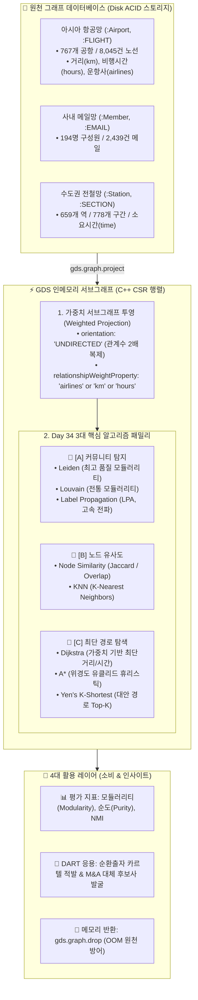

# 🏛️ [Day 34] GDS 커뮤니티 탐지, 유사도 및 최단 경로 마스터 아키텍처 보고서

> **핵심 슬로건**: "복잡하게 얽힌 연결망 속에서 숨겨진 파벌(카르텔)을 밝혀내고, 가장 가까운 관계와 최적의 경로를 추적한다."  
> **적용 대상**: 아시아 항공망 (767 공항 / 8,045 노선), 사내 메일망 (194명 / 2,439건), 수도권 전철망 (659역 / 778구간) & DART 기업집단 지배구조 카르텔

---

## 🗺️ 1. Big Picture (5분 지도: 전체 시스템 아키텍처 조감도)

Day 34는 단순한 중심성 순위 매기기(Day 33)를 넘어, **네트워크의 구조적 군집(Community), 개체 간 유사도(Similarity), 최적 이동 경로(Path Finding)**를 RAM 상에서 초고속으로 분석하는 3대 핵심 알고리즘 패밀리를 마스터합니다.



---

## 💡 2. WHY (본 목적과 정의: 왜 이 기술이 필요한가?)

### 10초 초등생 비유: "학교 운동장 3종 세트"
1. **커뮤니티 탐지 (Leiden/Louvain)**: 선생님이 반을 안 나눠줘도, 쉬는 시간에 **자연스럽게 모여서 노는 끼리끼리 무리(패거리)**를 찾아내는 것!
2. **노드 유사도 (Node Similarity)**: 나와 **취향이 가장 비슷한 짝꿍**(좋아하는 게임이나 친구 목록이 겹치는 친구)을 찾아내는 것!
3. **최단 경로 (Dijkstra/A*)**: 교문에서 급식실까지 **가장 빠르고 덜 막히는 지름길**을 내비게이션으로 안내해 주는 것!

---

### 🔥 코드에 숨겨진 치명적 의도 (Hidden WHY & Deep Insights)

#### ① 왜 Louvain 대신 최신 `Leiden` 알고리즘이 표준으로 채택되었을까?
* **이유**: Louvain은 빠르지만, 알고리즘 반복 과정에서 **"연결이 완전히 끊어져 단절된 하위 서브그래프들을 하나의 커뮤니티로 묶어버리는 치명적 결함(Disconnected Communities)"**이 종종 발생합니다.
* **해결**: `Leiden`은 노드를 이동시킨 후 서브커뮤니티를 재정제(Refine)하여 **모든 커뮤니티 내부가 100% 연결되도록 보장**하며, 모듈러리티 품질도 훨씬 높습니다. (GDS 2.5+ 표준)

#### ② 왜 커뮤니티 탐지에서는 `UNDIRECTED`(무방향) 투영이 필수일까?
* **이유**: 인천 $\rightarrow$ 방콕 노선만 있고 방콕 $\rightarrow$ 인천 노선이 데이터에 빠져 있다면, 단방향으로는 두 공항이 하나의 "동일 생활권"으로 묶이지 못하고 갈라집니다.
* **해결**: 무방향(`UNDIRECTED`)으로 길을 터주어야 상호 유대감이 완성됩니다. (Leiden은 무방향이 아니면 실행 자체를 에러로 거부합니다!)

#### ③ 왜 관계 가중치(`airlines`)를 주면 모듈러리티가 오히려 떨어질까?
* **이유**: 모듈러리티(Modularity)는 "무작위 네트워크 대비 커뮤니티 내부 연결 밀도"를 측정합니다. 대형 허브 공항 사이에 운항 항공사 수가 수십 개씩 몰려 있으면, **가중치가 허브 사이의 연결선으로만 쏠려 주변 소형 공항들이 상대적으로 소외**되어 전역 모듈러리티 수치는 내려갈 수 있습니다.
* **교훈**: 가중치가 높다고 무조건 좋은 것이 아니며, **가중치 유무에 따른 커뮤니티 구성의 변화를 직접 비교 분석**해야 합니다.

#### ④ 왜 Jaccard 유사도 대신 `Overlap` 계수가 필요할 때가 있을까?
* **Jaccard 함정**: 큰 공항(친구 100개)과 작은 공항(친구 2개)이 있고 작은 공항의 친구 2개가 모두 큰 공항과 겹친다면, 작은 공항 입장에선 100% 동일하지만 Jaccard 분모($100 + 2 - 2 = 100$) 때문에 점수가 **0.02**로 바닥을 칩니다.
* **Overlap 구원**: 분모를 $\min(|A|, |B|)$로 두어, **"부분집합 관계(A가 B에 완전히 포함되는가?)"**를 완벽히 포착해 냅니다.

---

## 🚀 3. WHEN (실무 활용: 우리 서비스에서 언제 어떻게 써먹는가?)

### 📊 Day 34 3대 알고리즘 패밀리 실무 비즈니스 판정 매트릭스

| 알고리즘 | 수학적 본질 | ✈️ 교통/항공/물류 응용 | 🏢 DART 기업 지배구조/사모펀드 응용 |
|---|---|---|---|
| **Leiden / Louvain** | 모듈러리티(Modularity) 극대화 군집화 | **초국경 항공 권역(Hub Zone)** 도출 | **순환출자 카르텔 무리 및 가공 자본 군집** 자동 적발 |
| **WCC (약한 연결 성분)** | 엣지로 닿을 수 있는 연결 컴포넌트 분리 | **고립된 낙도/변경 공항망** 식별 | **외딴 독립 계열사 및 단절된 페이퍼컴퍼니** 추출 |
| **Node Similarity (Jaccard)** | 공통 이웃의 비율 $\frac{\|A \cap B\|}{\|A \cup B\|}$ | **대체 가능한 쌍둥이 환승 허브** 추천 | **투자 포트폴리오(공통 출자처)가 90% 이상 일치하는 전주/LP** 식별 |
| **Dijkstra** | 누적 가중치(거리/시간/비용) 최소 경로 탐색 | **최단 비행 시간(hours) 환승 항로** 안내 | **은닉 자금의 최단 세탁 경로 및 3-Hop 우회 M&A 추적** |
| **A* (A-Star)** | 실제 비용 $g(n)$ + 휴리스틱 예측 $h(n)$ | **목적지 방향 위경도 유클리드 최적 항로** | **목표 타겟 기업에 도달하는 최단 의결권 장악선** |

---

## 🔬 4. [인터랙티브 4대 핵심 실험 가이드] (Thinking & Experiments)

1. 🧐 **[투영 전 생각하기]**: 왜 노선망에서 `hours`를 `km / 800 + 1`로 계산해 넣었을까?  
   ➔ 대권 거리는 물리적 거리일 뿐, 실제 여행객에게 중요한 것은 **"이착륙 및 환승 페널티(1시간)"가 포함된 체감 비행 시간**이기 때문!
2. 🎯 **[알고리즘 전 생각하기]**: Jaccard 유사도 Top 10을 뽑으면 왜 대형 허브 공항들만 나올까?  
   ➔ 연결선이 1~2개인 소형 공항은 공통 이웃 수가 적어 랭킹에서 밀림. 이때 `similarityCutoff`와 `topK` 조절이 필수!
3. 📉 **[대조군 실험 1]**: 모듈러리티 계산 시 `randomSeed`만 주고 `concurrency`를 안 주면?  
   ➔ 멀티스레딩 경쟁 상태(Race Condition)로 인해 매번 커뮤니티 배정 결과가 달라짐! **재현성을 위해 `randomSeed`와 `concurrency: 1`은 세트**임!
4. 💥 **[대조군 실험 2]**: 최단 경로 탐색 시 가중치 속성을 주지 않으면?  
   ➔ 거리가 10,000km든 100km든 무조건 **"환승 횟수(Hop 수)"가 가장 적은 경로**만 찾아 비효율적인 우회 항로가 나옴!

---

## 💻 5. 표준 Cypher 실행 템플릿 요약

### ① 무방향 가중치 서브그래프 투영
```cypher
CALL gds.graph.project(
  'day34_air_graph',
  'Airport',
  {
    FLIGHT: {
      type: 'FLIGHT',
      orientation: 'UNDIRECTED',
      properties: ['km', 'hours', 'airlines']
    }
  }
);
```

### ② Leiden 커뮤니티 탐지 (모듈러리티 기반)
```cypher
CALL gds.leiden.stream('day34_air_graph', {
  includeIntermediateCommunities: false,
  randomSeed: 42,
  concurrency: 1
})
YIELD nodeId, communityId
RETURN gds.util.asNode(nodeId).name AS airport,
       gds.util.asNode(nodeId).country AS country,
       communityId
ORDER BY communityId, airport;
```

### ③ Dijkstra 최단 시간(hours) 경로 탐색
```cypher
MATCH (src:Airport {iata: 'ICN'}), (tgt:Airport {iata: 'DXB'})
CALL gds.shortestPath.dijkstra.stream('day34_air_graph', {
  sourceNode: src,
  targetNode: tgt,
  relationshipWeightProperty: 'hours'
})
YIELD totalCost, nodeIds
RETURN [nid IN nodeIds | gds.util.asNode(nid).name] AS path_airports,
       totalCost AS total_hours;
```
