# 🏛️ [Day 35] 벡터 검색과 GraphRAG 마스터 아키텍처 보고서

> **핵심 슬로건**: "텍스트의 의미(Vector)와 개체 간의 맥락(Graph)을 결합하여, 단절된 청크의 한계를 뛰어넘는 초정밀 지식 근거 질의응답을 구현한다."  
> **적용 대상**: Hetionet 의학 지식그래프 (15,540 노드 / 91,966 관계), PMC 오픈액세스 논문 69편, 768차원 임베딩 & DART 기업 공시 원문 증거 탐색

---

## 🗺️ 1. Big Picture (5분 지도: 전체 시스템 아키텍처 조감도)

Day 35는 텍스트를 고차원 벡터로 변환하여 의미적 유사도를 찾는 **벡터 검색(Vector Search)**과, 네트워크 구조를 분석하여 중심성과 커뮤니티를 포착하는 **지식그래프(Knowledge Graph)**를 유기적으로 결합한 **GraphRAG(Graph Retrieval-Augmented Generation)**의 정수를 다룹니다.

```mermaid
flowchart TD
    subgraph DiskLayer ["💾 1. 원천 데이터 계층 (Disk ACID 스토리지)"]
        D1["의학 지식그래프 (Hetionet)\n• 15,540 노드 / 91,966 관계\n• Compound, Disease, Gene, Symptom"]
        D2["PMC 의학 논문 69편 (:Document)\n• 제목(title), 초록/본문(text), pmcid"]
        D3["임베딩 캐시 (emb_cache.pkl)\n• text-embedding-3-large (768차원)"]
    end

    subgraph IndexLayer ["⚡ 2. 복합 인덱스 및 관계 브릿지 계층"]
        I1["벡터 인덱스 (HNSW)\n• CREATE VECTOR INDEX doc_vec\n• 차원: 768, 유사도 메트릭: cosine"]
        I2["전문 인덱스 (Fulltext Lucene)\n• CREATE FULLTEXT INDEX doc_fulltext\n• 토큰화, 기호/코드(CYP3A4) 정밀 매칭"]
        I3["개체 연결 브릿지 (:MENTIONS)\n• 이름 사전(name2id) 매칭 ➔ :Document-[:MENTIONS]->:Compound/:Disease"]
    end

    subgraph GDSLayer ["🧠 3. GDS 인메모리 구조 분석 계층"]
        G1["drugGraph 투영 (Undirected)\n• Compound, Disease, PharmacologicClass\n• TREATS, PALLIATES, INCLUDES, RESEMBLES"]
        G2["PageRank 중심성\n• 약물/질환 중요도 계산 ➔ d.graph_score"]
        G3["Leiden 커뮤니티 분할\n• 하위 연구 갈래 분할 ➔ e.community"]
    end

    subgraph RerankLayer ["🎯 4. 하이브리드 리트리버 & 리랭킹 계층"]
        R1["[A] 순수 벡터 검색\nSEARCH n IN (VECTOR INDEX ...)"]
        R2["[B] PageRank 하이브리드 리랭킹\nScore = (1-w)*Sim_norm + w*PageRank_norm"]
        R3["[C] Leiden 커뮤니티 사전 필터링\n기준 약물 묶음의 개체를 언급한 논문으로 범위 한정"]
    end

    subgraph QALayer ["🤖 5. 생성 및 근거 검증 계층 (LLM QA)"]
        Q1["Context Builder\n• 논문 본문 + 언급 개체 명단 조합"]
        Q2["LangChain + GPT-4o-mini\n• 엄격한 시스템 프롬프트 (발췌 기반 답변)"]
        Q3["이중 관문 검증\n• 인용([pmcid]) 엄밀 대조\n• '보고했다' vs '입증됐다' 사실 엄격 분리"]
    end

    DiskLayer --> IndexLayer
    IndexLayer --> GDSLayer
    IndexLayer --> RerankLayer
    GDSLayer --> RerankLayer
    RerankLayer --> QALayer
```



---

## 💡 2. WHY (본 목적과 정의: 왜 이 기술이 필요한가?)

### 10초 초등생 비유: "도서관 사서와 명탐정의 합작 수사"
1. **단순 벡터 검색(Vector RAG)**: 도서관 책 중에서 제목과 줄거리가 질문과 **분위기가 비슷한 책**을 골라오는 친절한 사서. 하지만 책들이 서로 어떻게 얽혀 있는지는 모릅니다.
2. **지식그래프(Knowledge Graph)**: 인물, 사건, 약품들이 **누가 누구와 이어져 있는지 족보를 훤히 꿰뚫고 있는 명탐정**.
3. **GraphRAG**: 사서가 골라온 책 중에서, 명탐정의 족보를 대조해 **"진짜 핵심 인물이 들어있는 책(PageRank)"**과 **"같은 사건 갈래에 속한 책(Leiden 커뮤니티)"**만 쏙쏙 뽑아 완벽한 정답을 만들어내는 최고의 수사팀!

---

### 🔥 코드에 숨겨진 치명적 의도 (Hidden WHY & Deep Insights)

#### ① 왜 단순 Chunk 벡터 검색(Naive RAG)은 관계형 질문에 무너지는가?
* **한계**: Naive RAG는 문서를 일정 길이(예: 500자)로 쪼갠 Chunk 단위로 임베딩합니다. 만약 "약물 A가 단백질 B를 억제하고, 단백질 B가 질환 C를 유발한다"는 다단계 관계가 서로 다른 Chunk나 서로 다른 문서에 흩어져 있으면, **두 Chunk 사이의 연결 고리(Bridge)를 찾지 못해 답변을 지어내거나(환각) 모른다고 포기**합니다.
* **해결**: 지식그래프가 개체 간의 명시적 관계(`TREATS`, `ASSOCIATES`, `INCLUDES`)를 뼈대로 잡고, 논문 문서(`:Document`)가 이 개체들을 잇는 앵커(`:MENTIONS`) 역할을 하므로 **다단계 추론(Multi-hop Reasoning)이 완벽하게 작동**합니다.

#### ② 왜 Neo4j `SEARCH` 절의 점수는 코사인 유사도($-1 \sim 1$)가 아니라 $(1 + \cos)/2$인가?
* **수학적 이유**: 전통적인 코사인 유사도는 두 벡터의 사잇각 코사인 값으로 $-1.0$(완전 반대)에서 $+1.0$(완전 일치)의 범위를 가집니다.
* **Neo4j 설계**: 음수 점수는 검색 랭킹, 임계값 필터링, 타 점수와의 결합 연산 시 혼란을 줍니다. 따라서 Neo4j는 이를 선형 변환하여 **반드시 $0.0 \sim 1.0$ 사이의 양의 점수(0=완전반대, 0.5=직교, 1.0=완전일치)**로 매핑하여 반환합니다.
$$\text{Neo4j Score} = \frac{1 + \cos(\theta)}{2}$$

#### ③ 왜 PageRank 점수와 Vector 점수를 섞기 전에 Min-Max 정규화가 필수인가?
* **눈금의 불일치**:
  - 벡터 유사도 점수는 보통 $0.6 \sim 0.85$ 구간에 촘촘히 몰려 있습니다.
  - 반면 PageRank 점수는 멱법칙(Power Law)을 따라 최상위 핵심 개체는 $10.0$이 넘고 말단 개체는 $0.15$ 수준으로 편차가 수십 배에 달합니다.
* **정규화 부재 시 대참사**: 두 점수를 그대로 더하면 PageRank의 거대한 숫자에 벡터 유사도가 완전히 묻혀버려, 질문과 전혀 상관없는 '유명한 논문'만 1등으로 뽑히게 됩니다.
* **해결**: 검색된 후보군 내부에서 각각 $\frac{v - \min}{\max - \min}$으로 $0.0 \sim 1.0$으로 스케일을 맞춘 뒤 가중합($w$)을 계산해야 의도한 리랭킹이 일어납니다.

#### ④ 왜 Leiden 커뮤니티 필터는 '넓히기'가 아니라 '맥락 좁히기'인가?
* **이유**: 벡터 검색은 질문 속 단어의 포괄적인 연관성 때문에 엉뚱한 분야의 논문(예: 심혈관 약물을 물었는데 항암제 논문)을 유사하다고 긁어올 수 있습니다.
* **해결**: 기준이 되는 기준 개체(Anchor Entity, 예: `Clopidogrel`)가 속한 지식그래프의 구조적 클러스터(Leiden Community)에 속한 개체들을 언급한 논문만 남김으로써, **질문의 정확한 맥락(Context Scope) 안으로 검색 범위를 철저히 한정**합니다.

#### ⑤ "논문이 보고했다(Reported)"와 "효능이 입증됐다(Proven)"의 법적·의학적 분리
* **치명적 위험**: 검색된 논문 초록에 "A 약물이 B 질환에 효과가 있을 가능성을 제시했다"라는 문장이 있을 때, LLM이 "A 약물은 B 질환의 치료제이다"라고 확정형으로 답하면 의료 사고 및 법적 분쟁으로 직결됩니다.
* **해결**: 시스템 프롬프트와 후처리 검증을 통해, **"지식그래프의 공인된 관계(TREATS)"**와 **"단일 논문의 관찰 보고(Reported in PMCID)"**의 위계를 엄격하게 구분하여 답변하도록 강제합니다.

---

## 📊 3. WHAT (검색 방식 3종 및 파이프라인 비교표)

| 비교 항목 | 1. 순수 벡터 검색 (Vector) | 2. 전문 검색 (Fulltext Lucene) | 3. GraphRAG 하이브리드 (Vector + KG) |
|---|---|---|---|
| **검색 메커니즘** | 고차원 임베딩 코사인 유사도 | BM25 형태소/토큰 키워드 빈도 | 의미 유사도 + 네트워크 중심성 + 커뮤니티 구조 |
| **강점** | 동의어, 유사 표현, 뉘앙스 탐색 우수 | 약물 코드, 유전자 기호(`CYP3A4`) 정확 일치 | **구조적 맥락 파악, 다단계 관계 추론, 권위도 반영** |
| **약점** | 특수 기호/코드 오인, 도메인 환각 | 띄어쓰기/오탈자 취약, 의미적 연관 파악 불가 | 그래프 구축 및 GDS 인메모리 연산 비용 필요 |
| **적용 시점** | 포괄적 주제 탐색 | 정밀한 고유명사/품번/식별자 매칭 | **전문 도메인(의학·금융·법률) 정밀 근거 기반 QA** |

---

## 🛠️ 4. HOW (핵심 구현 5단계 엔드투엔드 파이프라인)

```cypher
// [Step 1] HNSW 벡터 인덱스 생성 (Neo4j 2026.01+ SEARCH 문법)
CREATE VECTOR INDEX doc_vec IF NOT EXISTS
FOR (d:Document) ON (d.emb)
OPTIONS {indexConfig: {
  `vector.dimensions`: 768,
  `vector.similarity_function`: 'cosine'
}};

// [Step 2] Fulltext 전문 인덱스 생성
CREATE FULLTEXT INDEX doc_fulltext IF NOT EXISTS
FOR (d:Document) ON EACH [d.title, d.text];

// [Step 3] SEARCH 절을 활용한 초고속 벡터 검색
MATCH (n:Document)
SEARCH n IN (VECTOR INDEX doc_vec FOR $query_vector LIMIT 5) SCORE AS score
RETURN n.pmcid AS pmcid, n.title AS title, score
ORDER BY score DESC;

// [Step 4] GDS PageRank 기반 하이브리드 스코어 기록
CALL gds.pageRank.write('drugGraph', {writeProperty: 'pagerank'});
MATCH (d:Document)-[:MENTIONS]->(e)
WHERE e.pagerank IS NOT NULL
WITH d, avg(e.pagerank) AS mean
SET d.graph_score = mean;

// [Step 5] Leiden 커뮤니티 스코핑 필터링 질의
MATCH (a {name: $anchor_name})
WITH a.community AS target_comm
MATCH (n:Document)
SEARCH n IN (VECTOR INDEX doc_vec FOR $query_vector LIMIT 20) SCORE AS score
MATCH (n)-[:MENTIONS]->(e)
WHERE e.community = target_comm
RETURN DISTINCT n.pmcid AS pmcid, score
ORDER BY score DESC;
```

---

## 🏢 5. DART 프로젝트와의 실전 연계점

우리가 수집한 **15,000건 DART 공시 원문 증거 지식그래프**에 Day 35의 GraphRAG 패턴은 다음과 같이 1:1로 직결됩니다:

1. **공시 본문 벡터 인덱싱**:
   - 15,000건 공시 본문에서 추출한 핵심 요약/취득목적 문단을 `doc_vec`으로 인덱싱하여 "경영권 분쟁 및 적대적 M&A 가능성"과 같은 자연어 질의를 의미 기반으로 검색.
2. **지분 네트워크 PageRank 리랭킹**:
   - 검색된 수십 건의 5% 공시 중, 지분율과 자본금이 크고 출자 고리가 많은 **핵심 지배회사(예: 지주사, 최대주주)**가 관련된 공시를 상위로 끌어올리는 `PageRank Min-Max Reranking` 적용.
3. **기업집단 커뮤니티 스코핑**:
   - `Leiden` 커뮤니티 탐지로 묶인 계열사 군집 내 공시만 타겟팅하여, 타 기업집단의 노이즈를 원천 차단하는 정밀 리서치 화면 완성.
