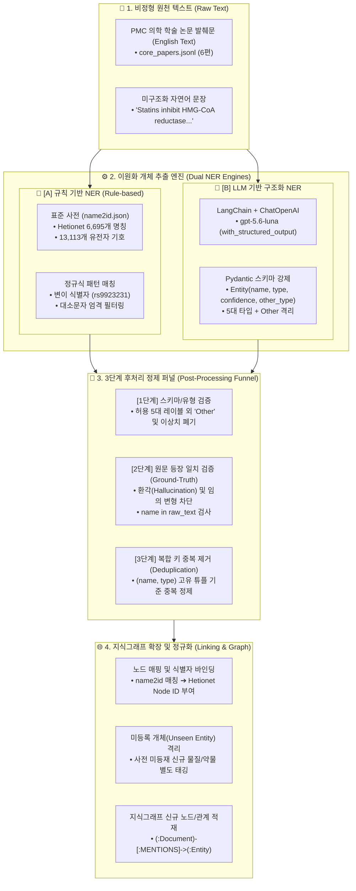

# 🏛️ [Day 36] 정보 추출(IE)과 개체명 인식(NER) 마스터 아키텍처 보고서

> **핵심 슬로건**: "비정형 텍스트에서 정형 지식을 추출(IE)하고, 규칙 기반의 엄밀성과 LLM의 유연성을 결합하여 살아 숨 쉬는 지식그래프를 지속 확장한다."  
> **적용 대상**: PMC 의학 논문 발췌 데이터, Hetionet 지식그래프 5대 노드 레이블(`Compound`, `Gene`, `Disease`, `Symptom`, `PharmacologicClass`), OpenAI 구조화 출력 및 표준 사전(`name2id.json`)

---

## 🗺️ 1. Big Picture (5분 지도: 정보 추출 전체 파이프라인 조감도)

Day 36은 비정형 문서(논문, 공시 보고서 등)로부터 지식그래프의 핵심 구성요소인 **노드(개체, Entity)**를 컴퓨터가 다룰 수 있는 정형 구조로 정확하게 추출하는 **정보 추출(Information Extraction, IE)**의 기초 및 핵심 파이프라인을 다룹니다.

---

## 💡 2. WHY (본 목적과 정의: 왜 이 기술이 필요한가?)

### 10초 초등생 비유: "흙탕물 속에서 보석을 캐고 이름표 붙이기"
1. **비정형 텍스트 (흙탕물)**: 매일 수천 편씩 쏟아지는 의학 논문이나 증권가 공시에는 온갖 글자들이 뒤섞여 있습니다.
2. **개체명 인식 (보석 탐지기)**: 글자들 속에서 "아스피린(약물)", "알츠하이머(질병)", "CYP3A4(유전자)"처럼 우리가 찾고 싶은 **진짜 보석(개체)**을 골라내고, 시작과 끝 위치(구간)를 정확히 네모 칸으로 묶어냅니다.
3. **규칙 기반 vs LLM (돋보기와 마법사)**:
   - **규칙 기반(돋보기)**: 이미 등록된 도감(사전)과 자(패턴)로만 봅니다. 도감에 없는 최신 약물은 전혀 보지 못하지만, 도감에 있는 것은 100% 실수 없이 찾아냅니다.
   - **LLM(마법사)**: 문맥을 읽어 도감에 없는 신약이나 복합어도 척척 찾아냅니다. 다만 가끔 엉뚱한 거짓말(환각)을 하므로 3단계 정제 퍼널(감정사)을 통해 검수해야 합니다.

---

## 🛠️ 3. HOW (3대 핵심 기술 구성 및 메커니즘)

### 1) 개체 표현의 두 가지 표준: 구간(Span)과 BIO 태깅
* **구간(Span)**: 텍스트 내에서 개체가 시작하는 문자 인덱스(`start`)와 끝 인덱스(`end`)로 정의됩니다. 원문 슬라이싱 `text[start:end]` 시 정확한 개체명이 복원되어야 합니다.
* **BIO 태깅 (Begin-Inside-Outside)**:
  * `B-<TYPE>`: 해당 개체가 시작하는 첫 번째 토큰. (예: `B-Compound`)
  * `I-<TYPE>`: 개체가 2개 이상의 토큰으로 이어질 때 후속 토큰. (예: `I-Compound`)
  * `O`: 어떤 개체에도 속하지 않는 일반 단어/문장 부호.
  * **핵심 역할**: 같은 유형의 개체 두 개가 연속으로 붙어 나올 때(예: `Aspirin Heparin`), `B-` 태그가 없으면 하나의 긴 개체로 잘못 합쳐지는 치명적 경계 오류를 원천 차단합니다.

### 2) 규칙 기반 NER의 장점과 4대 한계
* **장점**: 연산 비용 0, 완벽한 재현성, 정규식(`rs[0-9]+`)을 통한 규칙적 코드 탐색 탁월.
* **4대 한계점 (Failure Modes)**:
  1. **미등록어 (Out-of-Vocabulary)**: 사전에 없는 복수형(`statins`), 최신 신약, 복합 약물명 포착 불가.
  2. **경계 인식 오류 (Boundary Failure)**: 하이픈이나 결합어(`Warfarin-related`)에서 접사 분리 실패.
  3. **대소문자 함정 (Case Sensitivity)**: 소문자 매칭 시 일반 단어(`large` = 유전자 LARGE1, `today` = 항생제 상품명)를 개체로 오탐.
  4. **약어 충돌 (Acronym Ambiguity)**: 동음이의어 및 일반 약어(`OTC` = 일반의약품 vs 오르니틴 트랜스카바밀라제 유전자) 구별 불가.

### 3) LLM 구조화 출력과 3단계 후처리 퍼널
* **Pydantic 스키마 강제 (`with_structured_output`)**:
  * 단순 프롬프트 문자열 유도가 아닌, JSON Schema 기반의 타입 바인딩으로 정형 객체(`EntityList`) 수신.
  * 5대 허용 타입 외에 `Other`를 스키마에 명시적으로 허용하여, 모델이 엉뚱한 타입으로 왜곡 분류(Forced Fitting)하지 않고 안전하게 격리하도록 유도.
* **3단계 후처리 정제 퍼널**:
  1. **Schema Check**: `type in ALLOWED_TYPES` 검증 (`Other` 및 비표준 타입 폐기).
  2. **Ground-Truth Check**: `ent.name in raw_text` 검증 (LLM이 대소문자를 멋대로 교정하거나 존재하지 않는 단어를 생성한 환각 차단).
  3. **Deduplication**: `(ent.name, ent.type)` 기준 중복 제거.

---

## ⚖️ 4. Deep Dive: 규칙 기반 vs LLM의 실전 역할 분담

| 비교 축 | 규칙 기반 (Rule-based) | LLM 구조화 추출 (LLM-based) | 우리 시스템의 최종 전략 |
|---|---|---|---|
| **동작 원리** | 사전(`name2id`) + 정규식 패턴 | LLM 어텐션 문맥 해석 + JSON Schema | **하이브리드 융합 파이프라인** |
| **장점** | 초고속, 비용 0, 환각 0%, 코드 정밀 매칭 | 미등록어 인식, 문맥 기반 다의어 해소 | **규칙으로 1차 고속 필터링 + LLM으로 보강** |
| **단점** | 사전에 없는 표현 100% 누락 | API 비용 발생, 속도 지연, 환각 가능성 | **LLM 추출 후 3단 정제 퍼널 필수 적용** |
| **KG 연계성** | 즉시 Node ID 매핑 가능 | 사전에 없는 이름은 Entity Linking 필요 | **사전 매칭분은 즉시 결속, 신규어는 보류 큐 격리** |

---

## 🎯 5. 결론 및 실천 체크리스트

1. [x] 비정형 텍스트에서 지식그래프 노드 후보를 추출하는 IE 파이프라인 정립.
2. [x] 규칙 기반 NER의 4대 한계를 실측 코드로 재현 및 확인.
3. [x] LangChain Pydantic 기반 구조화 출력으로 5대 의학 개체 정밀 추출.
4. [x] 3단계 정제 퍼널을 통해 환각률 0% 수준의 무결점 개체 후보군 확립.

---

## 🛡️ 6. 프로덕션 중심 전환 및 자동화 헌장 (Production-First & Automation)

> **"우리는 모든 강의와 교재를 오직 실제 프로덕션 서비스(DART-Trace 등)의 고도화와 실무 발전을 위한 단순 참고 창구로만 활용한다."**

1. **불필요한 레거시 과정 1줄 스킵**:
   - 도태된 과거의 지엽적 삽질(토큰 태깅 노가다, 폐기된 뉴스용 BERT 분류기 낚시쇼 등)은 **"한 줄 요약 정의"로 즉시 스킵**하며 실무 생산성을 극대화한다.
2. **최신 기술 일일 배치 업데이트**:
   - 교재의 박제된 2023년식 내용에 안주하지 않고, **2026년 기준 상시 최신 SOTA 기술(구조화 출력, 최신 에이전트 오케스트레이션, 고속 임베딩)을 일일 단위 배치 스타일로 즉시 검토·프로덕트에 반영**한다.
3. **n8n 기반 자동화 파이프라인 전면 도입**:
   - 데이터 수집, 일일 증분 배치 적재, 무결성 검수, Slack/Discord 알림 등 반복 작업은 **n8n 워크플로우 및 웹훅 자동화를 선제 도입**하여 휴먼 에러를 0%로 차단한다.

