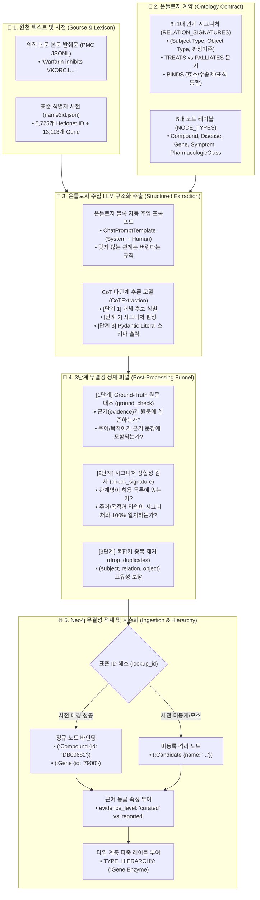

# 🏛️ [Day 37] 트리플(Triple)과 온톨로지(Ontology) 설계/구축 마스터 아키텍처 보고서

> **핵심 슬로건**: "온톨로지는 지식그래프의 계약서다. 무엇을 허용하고 무엇을 버릴지 선언하고, ID 기반의 엄밀한 결속과 다단계 정제 퍼널로 무결점 지식그래프를 완성한다."  
> **적용 대상**: PMC 의학 논문 발췌 데이터(`pgx_core`, `pgx_lv1`, `pgx_lv2`), Hetionet 5대 노드 타입(`Compound`, `Disease`, `Gene`, `Symptom`, `PharmacologicClass`), 8+1대 핵심 관계 시그니처, Pydantic/CoT 구조화 추출, Neo4j 멱등 적재

---

## 🗺️ 1. Big Picture (5분 지도: 텍스트에서 온톨로지 지식그래프까지)

Day 37은 비정형 자연어 텍스트에서 **주어(Subject) - 관계/술어(Relation/Predicate) - 목적어(Object)** 로 구성된 사실 단위인 **트리플(Triple)** 을 추출하고, 이를 사전에 엄격히 정의된 **온톨로지(Ontology) 규격** 에 맞춰 검증한 뒤, **식별자(ID) 기반의 신뢰 가능한 지식그래프** 로 적재하는 엔드투엔드 파이프라인을 완성합니다.

---

## 💡 2. WHY (본 목적과 정의: 왜 트리플과 온톨로지 계약인가?)

### 10초 초등생 비유: "레고 블록 규격과 계약서"
1. **자유 텍스트 (규격 없는 찰흙)**: 글을 쓰는 사람은 "A가 B를 낫게 한다", "A는 B 치료제다", "A는 B 증상을 완화한다"처럼 제멋대로 표현합니다. 규격 없이 모으면 컴퓨터는 이것이 같은 말인지 알 수 없고 그래프가 엉망진창이 됩니다.
2. **트리플 (표준 레고 블록)**: 모든 지식을 `[누가] - [어떤 관계] -> [누구에게]`라는 3조각 표준 블록(트리플)으로 딱딱 자릅니다.
3. **온톨로지 (레고 조립 계약서)**:
   - "약(`Compound`)은 질병(`Disease`)을 치료(`TREATS`)하거나 완화(`PALLIATES`)할 수 있지만, 질병이 약을 먹을 수는 없다."
   - 조립 가능한 규격을 엄격히 제한하여, 엉뚱한 부품끼리 결합되는 것을 원천 차단합니다.
   - **온톨로지는 무엇을 허용하고 무엇을 버릴지 결정하는 엔지니어링 계약**입니다.

---

## 🛠️ 3. HOW (3대 핵심 기술 구성 및 메커니즘)

### 1) 관계 시그니처와 온톨로지 설계 (Engineering Trade-offs)
온톨로지의 관계는 단순한 이름표가 아니라 **(주어 타입, 목적어 타입, 판정 기준)** 의 세 칸 튜플로 정의됩니다.

* **핵심 판정 1: `TREATS` vs `PALLIATES` (의미적 엄밀성)**
  - 둘 다 주어는 `Compound`, 목적어는 `Disease`로 타입이 완전히 동일합니다.
  - 타입만으로는 둘을 가를 수 없으며, **오직 셋째 칸(판정 기준)의 문맥 해석**으로만 분기합니다:
    - `TREATS`: 질병의 원인이나 진행 자체를 치료함 (예: 항생제가 세균 감염을 박멸).
    - `PALLIATES`: 질병 자체는 두고 증상만 덜어줌 (예: 진통제가 관절염 통증을 완화).
* **핵심 판정 2: `BINDS`의 단순화 트레이드오프 (결단의 미학)**
  - 약물이 단백질에 작용할 때 '표적(Target)', '대사 효소(Enzyme)', '수송체(Transporter)'는 생물학적으로 완전히 다른 역할을 합니다.
  - 하지만 온톨로지에서 이를 각각의 관계로 나누지 않고 `BINDS` 하나로 통합했습니다.
  - **엔지니어링 트레이드오프**: 관계 수를 줄여 LLM 추출 안정성과 스키마 단순성을 얻는 대신, "효소인가 표적인가"라는 세부 정보는 잃게 됩니다.
  - 잃어버린 정보는 **노드 다중 레이블(타입 계층: `:Gene:Enzyme`)** 로 복원하여 보완합니다.

### 2) Pydantic 구조화 출력과 CoT 추론
* **`Literal` 기반 Enum 강제**:
  - `RelationName = Literal[tuple(RELATION_SIGNATURES)]`
  - `NodeType = Literal[tuple(sorted(NODE_TYPES))]`
  - 파이썬의 온톨로지 정의 딕셔너리가 그대로 LLM의 JSON Schema `enum`으로 직결됩니다. 모델은 사전에 없는 임의의 관계명(예: `associated_with`, `causes`)을 출력할 수 없습니다.
* **CoT (Chain-of-Thought) 다단계 추론**:
  - `CoTExtraction`: `reasoning` 필드를 `triples` 앞에 배치합니다.
  - 모델이 먼저 문장을 분석하고 개체 후보와 시그니처 일치 여부를 단계적으로 서술한 뒤 최종 트리플을 뽑아내도록 유도하여 환각률을 획기적으로 낮춥니다.

### 3) 3단계 무결성 정제 퍼널 (Triple Refinement Funnel)
추출된 원시 트리플을 무조건 DB에 넣으면 데이터 오염이 발생합니다. 다음 3단계를 거칩니다:
1. **`ground_check(evidence, raw_text, subject, object)`**:
   - 근거 문장(`evidence`)이 원본 텍스트에 실제 존재하는가?
   - 주어와 목적어 명칭이 근거 문장 안에 문자 그대로 포함되어 있는가? (환각 및 왜곡 차단)
2. **`check_signature(row, signatures)`**:
   - 추출된 관계가 허용 목록에 있는가?
   - `row['subject_type'] == sig[0]` 및 `row['object_type'] == sig[1]` 일치 검증 (관계 역방향 및 타입 왜곡 차단).
3. **`drop_duplicates(rows)`**:
   - `(subject, relation, object)` 복합 고유 키 기준 중복 제거.

### 4) Neo4j 무결성 적재 패턴 (Identity over Name)
* **이름이 아닌 ID로 MERGE**:
  - 동음이의어(예: 유전자 기호 vs 일반 약어) 문제 해결을 위해 표준 사전(`name2id.json`)을 조회합니다.
  - 사전에 명확히 매핑되는 경우: `(:Compound {id: 'DB00682', name: 'Warfarin'})`
  - 사전에 없거나 모호한 경우: `(:Candidate {name: '...'})` 로 격리하여 프로덕션 그래프 오염 방지.
* **근거 등급 (`evidence_level`) 분리**:
  - Hetionet 검증 시드: `evidence_level: 'curated'`
  - 논문 LLM 추출 데이터: `evidence_level: 'reported'`
  - `coalesce` 전략을 사용하여 검증된 등급이 미검증 등급으로 강등되지 않도록 보호.

---

## ⚖️ 4. Deep Dive: 자유 텍스트 vs 엄격 온톨로지 스키마

| 비교 항목 | 오픈 정보 추출 (Open IE) | 엄격 온톨로지 계약 (Strict Ontology) | 우리 DART/KG 프로덕션 표준 |
|---|---|---|---|
| **관계 정의** | 텍스트 서술어 그대로 추출 (`inhibited by`, `target of`) | 사전에 엄격히 정의된 N종 시그니처 | **8+1대 표준 관계 시그니처 고정** |
| **장점** | 사전 설계 불필요, 모든 표현 수용 | 그래프 쿼리 단순화, 일관된 지식 집계 | **표준화된 Cypher 그래프 탐색 가능** |
| **단점** | 관계 파편화, 동의어 폭발로 그래프 단절 | 설계에 없는 새로운 관계 표현 누락 | **미분류 관계는 `:Candidate` 격리 큐 보관** |
| **노드 식별** | 문자열 이름 그대로 노드 생성 | 표준 식별자(ID) 바인딩 필수 | **표준 ID(Hetionet/DART 고유코드) 강제** |
| **품질 보증** | 환각 및 오탐 필터링 불가 | 3단계 정제 퍼널로 무결성 검증 | **Ground-Check 통과분만 적재** |

---

## 🎯 5. 결론 및 실천 체크리스트

1. [x] **온톨로지 계약 정의**: 8대 기본 관계 + `RESEMBLES_DD` 1종 확장 시그니처 확립.
2. [x] **Pydantic Enum 바인딩**: 온톨로지 딕셔너리에서 LLM 구조화 스키마 자동 파생.
3. [x] **3단계 정제 퍼널 구축**: 근거 검증(`ground_check`) + 방향/타입 검증(`check_signature`) + 중복 제거.
4. [x] **식별자 기반 적재 파이프라인**: `name2id` 매핑, `:Candidate` 격리, `evidence_level` 다중 등급 체계 확립.

---

## 🛡️ 6. 프로덕션 중심 전환 및 자동화 헌장 (Production-First & Automation)

> **"우리는 모든 강의와 교재를 오직 실제 프로덕션 서비스(DART-Trace 등)의 고도화와 실무 발전을 위한 단순 참고 창구로만 활용한다."**

1. **불필요한 레거시 과정 1줄 스킵**:
   - 과거의 지엽적인 온톨로지 XML/RDF/OWL 편집기 노가다나 구식 정규식 파싱 삽질은 **"과거의 지엽적 레거시"로 1줄 스킵**하고, 현대적인 **Pydantic + LLM 구조화 계약 파이프라인**에 집중한다.
2. **최신 기술 일일 배치 업데이트**:
   - 최신 LLM 구조화 출력(`with_structured_output`), CoT 다단계 추론, GraphRAG용 트리플 정제 아키텍처를 프로덕트에 즉각 반영한다.
3. **n8n 기반 자동화 파이프라인 전면 연계**:
   - 논문/공시 문서 인입 ➔ LLM 트리플 추출 ➔ 3단계 정제 퍼널 ➔ Neo4j 멱등 적재에 이르는 전 과정을 n8n 웹훅 및 스케줄러와 연동하여 무중단 자동화한다.
