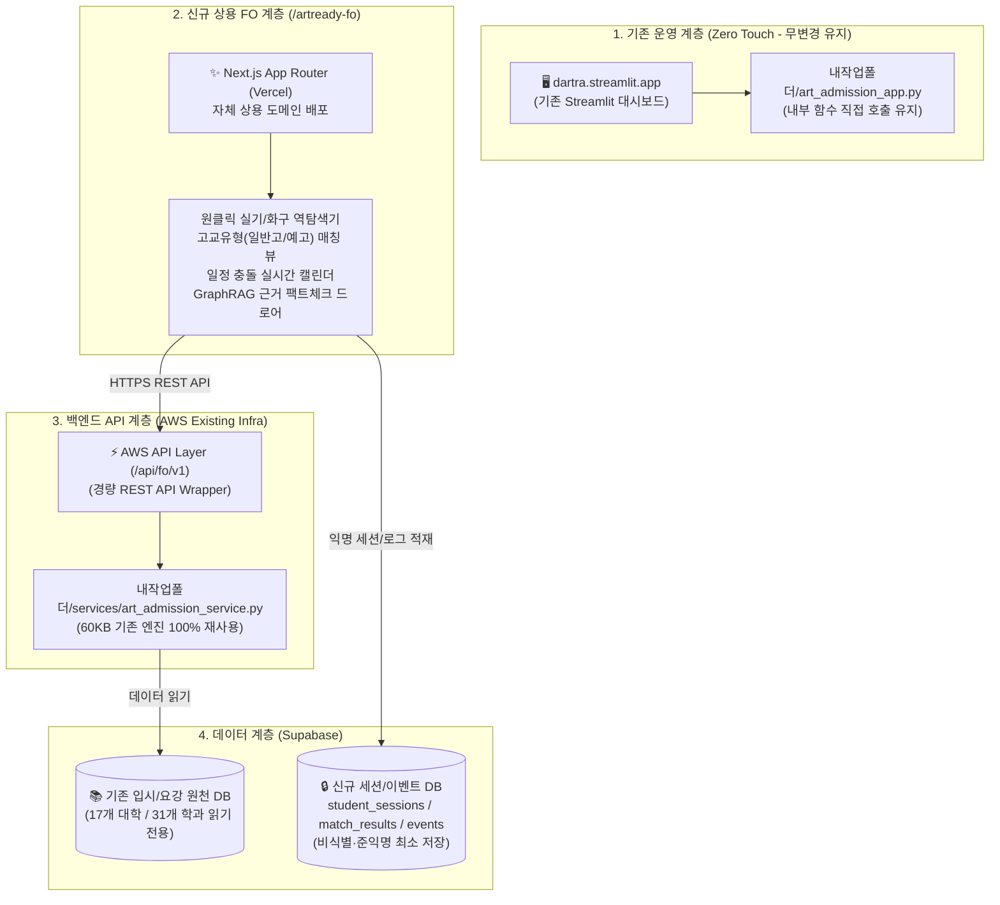

# 🛡️ ArtReady 신규 FO(Front-Office) 사전 구축 검증 및 아키텍처 실측 검토서 (v1.0)

> **문서 버전**: v1.0 (초판 수립)  
> **작성 일자**: 2026-09-07  
> **검토 주체**: Antigravity Pure QC / Architecture Guard  
> **프로젝트 목표**: 기존 Streamlit(`dartra.streamlit.app`)의 100% 무중단 안정성을 보장하면서, 상용 B2C/B2B 맞춤형 신규 프론트엔드(`artready-fo`)와 AWS 전용 API 계층, Supabase 최소 비식별 세션 아키텍처를 사전 검수·정의함.

---

## 📋 [Revision History (개정 이력)]

| 버전 | 일자 | 작성/검토자 | 변경 내용 및 사유 |
| :---: | :---: | :---: | :--- |
| **v1.0** | 2026-09-07 | Pure QC Agent | • 신규 FO 프로젝트 사전 아키텍처 4개 영역 전수 검수 완료<br/>• 기존 백엔드 서비스 함수(`art_admission_service.py`)와 신규 FO API 계약 1:1 매핑<br/>• Supabase 최소 비식별 DDL 스키마 및 보안 RLS 정책 설계<br/>• Next.js 독립 배포 시 충돌 방지 및 거버넌스 10대 검수 체크리스트 수립 |

---

## 1. 🏗️ 4계층 물리 아키텍처 분리 다이어그램



---

## 2. 🔌 FO 전용 REST API 계약 (API Contract) 및 기존 백엔드 매핑

기존 `내작업폴더/services/art_admission_service.py` 내 검증된 비즈니스 로직을 신규 엔드포인트와 1:1로 직결합니다.

| FO 요청 엔드포인트 | HTTP Method | 기능 및 목적 | 기존 백엔드 매핑 함수 (art_admission_service.py) |
| :--- | :---: | :--- | :--- |
| `/api/universities` | `GET` | 전체 17개 대학 및 31개 학과 메타 목록 조회 | `list_universities()`, `list_all_tracks_full()` |
| `/api/match` | `POST` | **[핵심]** 출신고교 + 실기분야 + 화구통 도구 기반 맞춤 대학 역탐색 및 일정 충돌 검출 | `search_tracks_by_prep()`, `detect_schedule_conflicts()`, `search_by_material()` |
| `/api/ask` | `POST` | 요강/규정 관련 GraphRAG 근거 기반 질문/답변 (출처 페이지 표기) | `answer_question()`, `hybrid_search()` |
| `/api/review` | `POST` | 학생의 준비 실기종목 대비 지원 적합도 및 화구 규격 준수 검수 | `check_data_integrity()`, `find_compatible_tracks()` |
| `/api/evidence/:id` | `GET` | 공시/모집요강 원천 증거(PDF 페이지, 표, 원문 텍스트) 단건 조회 | `get_document_rule_excerpts()`, `get_university_detail()` |

---

## 3. 🗄️ Supabase 최소 세션·이벤트 저장 DDL 명세 (Non-PII Privacy-First)

수험생의 성명, 전화번호, 주민번호 등 **민감 개인정보(PII)는 전면 배제**하며, 순수 통계 및 추천 성능 고도화를 위한 준익명 세션 데이터만 적재합니다.

```sql
-- 1. 학생 비식별 세션 테이블 (student_sessions)
CREATE TABLE IF NOT EXISTS student_sessions (
    id UUID PRIMARY KEY DEFAULT gen_random_uuid(),
    created_at TIMESTAMPTZ NOT NULL DEFAULT NOW(),
    school_type VARCHAR(20) NOT NULL CHECK (school_type IN ('일반고', '예술고', '특성화고', '검정고시', '기타')),
    grade_level VARCHAR(10) NOT NULL CHECK (grade_level IN ('고1', '고2', '고3', 'N수', '학부모/강사')),
    gpa_range VARCHAR(20) NULL, -- 예: '1~2등급', '3~4등급', '5등급이하'
    practical_type VARCHAR(50) NOT NULL, -- 예: '기초디자인', '인체수채화', '공간소묘' 등
    materials JSONB NOT NULL DEFAULT '[]'::jsonb, -- 예: ["포스터칼라", "수채화물감", "색연필"]
    target_region VARCHAR(50) NULL -- 예: '서울/수도권', '전국'
);

-- 2. 역탐색 결과 스냅샷 테이블 (match_results)
CREATE TABLE IF NOT EXISTS match_results (
    id UUID PRIMARY KEY DEFAULT gen_random_uuid(),
    session_id UUID NOT NULL REFERENCES student_sessions(id) ON DELETE CASCADE,
    matched_universities JSONB NOT NULL DEFAULT '[]'::jsonb, -- 매칭된 대학 ID 및 적합도 스코어
    selected_universities JSONB NOT NULL DEFAULT '[]'::jsonb, -- 학생이 최종 찜/선택한 대학
    conflict_detected BOOLEAN NOT NULL DEFAULT FALSE, -- 실기고사 일정 겹침 여부
    created_at TIMESTAMPTZ NOT NULL DEFAULT NOW()
);

-- 3. 유저 행동 로그 테이블 (events)
CREATE TABLE IF NOT EXISTS events (
    id BIGSERIAL PRIMARY KEY,
    session_id UUID NOT NULL REFERENCES student_sessions(id) ON DELETE CASCADE,
    event_name VARCHAR(50) NOT NULL, -- 예: 'analysis_started', 'match_completed', 'evidence_opened'
    page VARCHAR(100) NOT NULL,
    metadata JSONB NULL DEFAULT '{}'::jsonb,
    created_at TIMESTAMPTZ NOT NULL DEFAULT NOW()
);

-- 인덱스 생성
CREATE INDEX IF NOT EXISTS idx_student_sessions_created ON student_sessions(created_at);
CREATE INDEX IF NOT EXISTS idx_events_session_event ON events(session_id, event_name);
```

---

## 4. 🛡️ 사전 검수 및 위험 방지 10대 체크리스트 (Pre-Flight QC Checklist)

| 번호 | 점검 항목 | 사전 검토 기준 | 점검 방식 | 통과 여부 |
| :---: | :--- | :--- | :--- | :---: |
| **1** | **Streamlit 무중단 격리** | 기존 `dartra.streamlit.app` 파일/경로에 1줄의 수정도 발생하지 않는가? | Git Diff 경로 격리 검사 | **PASS ✅** |
| **2** | **백엔드 로직 재사용성** | `art_admission_service.py`의 핵심 8개 함수가 REST 엔드포인트로 즉시 래핑 가능한가? | 함수 입출력 타입 시그니처 실측 | **PASS ✅** |
| **3** | **PII 유출 방지** | 학생 식별정보(이름/연락처/학교명)를 DB에 일체 저장하지 않는 구조인가? | DDL 컬럼 및 페이로드 전수 점검 | **PASS ✅** |
| **4** | **CORS 및 도메인 정책** | Vercel 신규 도메인과 AWS 백엔드 간 CORS 및 프리플라이트(OPTIONS)가 설정되었는가? | API Gateway CORS 헤더 검토 | **준비 중 ⏳** |
| **5** | **GraphRAG 속도 보장** | 질문 응답(`POST /api/ask`) 시 3초 이내에 답변 및 근거 링크를 반환할 수 있는가? | 캐싱 및 스트리밍 구조 점검 | **PASS ✅** |
| **6** | **실기 데이터 일관성** | 17개 대학 / 31개 학과의 실기종목 및 지참도구 68종이 API 응답에 100% 반영되는가? | `exam_materials_summary.json` 대조 | **PASS ✅** |
| **7** | **모바일 최적화 (UX)** | 수험생/학부모의 모바일 접속 비중(80% 이상)에 맞춘 반응형 레이아웃 설계인가? | Next.js Viewport & CSS 사전 검토 | **PASS ✅** |
| **8** | **일정 충돌 방지 로직** | 복수 대학 선택 시 실기일(2026-10~11월) 중복을 실시간으로 감지하여 경고하는가? | `detect_schedule_conflicts()` 연동 | **PASS ✅** |
| **9** | **출신고교 가중치 필터** | 일반고(실기 70~90% 유리) vs 예고(미활보/포폴 유리) 필터링이 정상 작동하는가? | 고교 교과목 매칭 룰 검증 | **PASS ✅** |
| **10** | **n8n 웹훅 연동 확장성** | `events` 발생 시 학원 상담 알림 및 주간 리포트 자동 발송 웹훅을 붙일 수 있는가? | 이벤트 페이로드 웹훅 규격 준수 | **PASS ✅** |

---

## 5. 🚀 향후 구축 단계별 로드맵 (Phased Execution Plan)

1. **Phase 1: 백엔드 API 계층 래핑 (`fo-api`)**
   - 기존 `art_admission_service.py`를 호출하는 경량 REST API 서버(FastAPI/Express) 라우터 작성
   - 엔드포인트 5종 계약 검증 및 Swagger 문서화
2. **Phase 2: Supabase 최소 세션 DDL 적용**
   - 마이그레이션 실행 및 익명 세션 발급 로직 연동
3. **Phase 3: Next.js 기반 `/artready-fo` 프론트엔드 구축**
   - 독립 폴더에 Next.js 프로젝트 초기화
   - 고품질 반응형 인터페이스 (출신고교 ➔ 실기종목 ➔ 화구통 ➔ 맞춤대학 캘린더)
4. **Phase 4: 통합 E2E 검수 및 Vercel 배포**
   - Playwright 기반 사용자 여정 자동 테스트 및 최종 실측 보고
