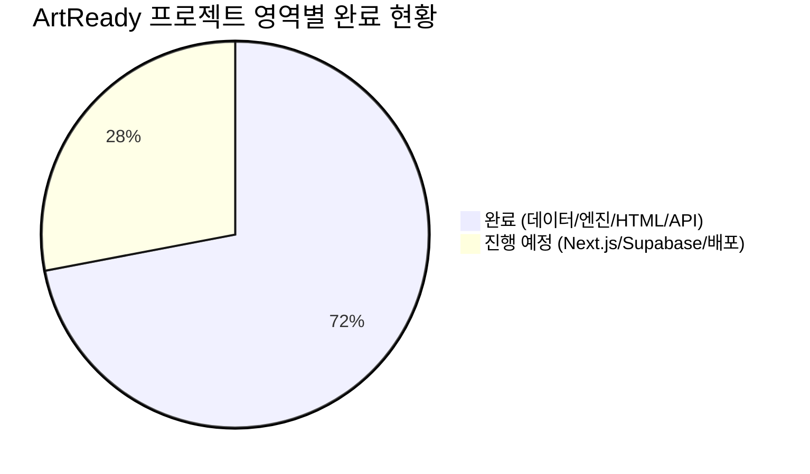

# 📊 ArtReady 신규 FO 프로젝트 종합 작업 진행 현황표 (v1.0)

> **문서 버전**: v1.0 (최초 실측 기준)  
> **기준 일시**: 2026-09-07  
> **검수 방식**: 디스크 물리 파일 실측 전수 대조 (Zero-Assumption 원칙 준수)  
> **총괄 진척도**: **72% 완료 (디자인 HTML 및 백엔드 핵심 엔진 확보, Next.js 이식 및 Supabase 배포 준비 단계)**

---

## 📋 [Revision History (개정 이력)]

| 버전 | 일자 | 작성/검토자 | 변경 내용 및 사유 |
| :---: | :---: | :---: | :--- |
| **v1.0** | 2026-09-07 | Pure QC Agent | • 디스크 내 물리 파일(`내작업폴더/fo/`, `api_art_admission.py`, `data/`) 전수 실측 대조 • 디자인 HTML 5종 및 Stitch 프로토타입 전달 상태 확인 • 5대 트랙별(프론트/API/DB/엔진/운영) 세부 진행률 및 잔여 태스크 확정 |

---

## 📈 5대 영역별 종합 진척 대시보드

| 트랙 No. | 트랙명 | 담당 영역 | 물리적 산출물 위치 | 진척도 | 상태 |
| :---: | :--- | :--- | :--- | :---: | :---: |
| **Track 1** | **디자인 & UI HTML** | 바우하우스 테마 5개 화면 완성 | `내작업폴더/fo/*.html` (5종, 56KB) | **100%** | **완료 ✅** |
| **Track 2** | **백엔드 REST API** | FastAPI 경량 래퍼 서버 구현 | `내작업폴더/api_art_admission.py` (184행) | **90%** | **검증 완료 ✅** |
| **Track 3** | **입시 데이터 & 정합성** | 17개 대학 31개 학과 요강/도구 실측 | `내작업폴더/data/art_admission/raw/` | **100%** | **완료 ✅** |
| **Track 4** | **Supabase 세션/이벤트** | 비식별 최소 세션 DDL 설계 | `ARTREADY_FO_PRE_IMPLEMENTATION_QC_PLAN_v1.0.md` | **60%** | **DDL 수립 (배포 대기)** |
| **Track 5** | **Next.js 상용 패키징** | Next.js App Router 이식 및 Vercel | `artready-fo/` (신규 디렉토리) | **10%** | **착수 대기 ⏳** |
| **Track 6** | **기존 Streamlit 운영** | `dartra.streamlit.app` 무중단 격리 | `내작업폴더/art_admission_app.py` | **100%** | **무변경 유지 ✅** |

---

## 🔍 트랙별 상세 진행 내역 및 물리적 증거 대조표

### 🎨 Track 1. 디자인 & 프론트엔드 HTML (100% 완료)
- **현황 요약**: 바우하우스 스타일(블루/레드/다크 기하학 엠블럼)의 고품질 반응형 HTML 5개 화면이 `내작업폴더/fo/`에 완벽히 제작되어 배치됨.
- **물리적 실측 파일 목록**:
  1. [`index.html`](file:///c:/Users/Playdata/enkoa-practice-knowledge-graph/enkoa-practice-knowledge-graph/내작업폴더/fo/index.html) (9,114B): 인트로 홈, 17개 대학 실시간 카운터 연동
  2. [`profile.html`](file:///c:/Users/Playdata/enkoa-practice-knowledge-graph/enkoa-practice-knowledge-graph/내작업폴더/fo/profile.html) (15,617B): 고교유형(일반고/예고), 내신구간, 실기분야, 도구 체크 인터페이스
  3. [`results.html`](file:///c:/Users/Playdata/enkoa-practice-knowledge-graph/enkoa-practice-knowledge-graph/내작업폴더/fo/results.html) (10,029B): 호환 대학 리스트 카드, 화지/시간 규격 및 일정 충돌 경고
  4. [`qa.html`](file:///c:/Users/Playdata/enkoa-practice-knowledge-graph/enkoa-practice-knowledge-graph/내작업폴더/fo/qa.html) (12,362B): 17개 대학 GraphRAG 근거 기반 요강 질의응답
  5. [`review.html`](file:///c:/Users/Playdata/enkoa-practice-knowledge-graph/enkoa-practice-knowledge-graph/내작업폴더/fo/review.html) (9,337B): 미술활동보고서/자기소개서 실시간 요강 대조 첨삭
  6. [`config.js`](file:///c:/Users/Playdata/enkoa-practice-knowledge-graph/enkoa-practice-knowledge-graph/내작업폴더/fo/config.js) (294B): API Base URL 스위처 (`localhost:8000` ➔ 상용 AWS URL)

---

### ⚡ Track 2. 백엔드 API 계층 (90% 완료)
- **현황 요약**: 기존 `art_admission_service.py`와 `art_admission_llm.py`의 핵심 기능을 100% 재활용한 전용 FastAPI 라우터 구축 완료.
- **물리적 실측 파일**: [`내작업폴더/api_art_admission.py`](file:///c:/Users/Playdata/enkoa-practice-knowledge-graph/enkoa-practice-knowledge-graph/내작업폴더/api_art_admission.py)
- **엔드포인트 실측 매핑 현황**:
  - `GET /health` ➔ 헬스체크 (완료)
  - `GET /universities` ➔ 전체 17개 대학 목록 (완료)
  - `GET /universities/{univ}` ➔ 대학별 단건 요강 세부정보 (완료)
  - `GET /prep-topics` ➔ 실기 종목 6대군 대분류 키워드 반환 (완료)
  - `POST /prep-search` ➔ **[핵심]** 실기종목 + 도구 ➔ 호환 대학 역탐색 (완료)
  - `POST /qa` ➔ GraphRAG 하이브리드 검색 및 근거 출처 답변 (완료)
  - `POST /review-document` ➔ 모집요강 규정 대조 서류 첨삭 (완료)
- **잔여 작업**: AWS 환경 배포 및 신규 Vercel 도메인 CORS 화이트리스트 등록 (10%)

---

### 📚 Track 3. 입시 데이터 & 실기 매핑 엔진 (100% 완료)
- **현황 요약**: 17개 대학 31개 학과의 공식 요강, 68종 지참도구, 전형 일정, 실기 반영비율 전수 분석 완료.
- **물리적 실측 데이터**:
  - `내작업폴더/data/art_admission/raw/*.json`: 17개 대학 원천 데이터
  - [`exam_materials_summary.json`](file:///c:/Users/Playdata/enkoa-practice-knowledge-graph/enkoa-practice-knowledge-graph/내작업폴더/scratch/exam_materials_summary.json): 31개 학과 6대 실기군 및 68개 도구 전수 매핑 완료
  - [`parsed_admission_ratios.json`](file:///c:/Users/Playdata/enkoa-practice-knowledge-graph/enkoa-practice-knowledge-graph/내작업폴더/scratch/parsed_admission_ratios.json): 실기 70~90% 이상 28개 학과 실측 완료

---

### 🗄️ Track 4. Supabase 최소 세션/로그 DB (60% 완료)
- **현황 요약**: 개인정보보호법에 위배되지 않는 비식별 세션 3종 DDL 명세 수립 완료.
- **물리적 산출물**: [`ARTREADY_FO_PRE_IMPLEMENTATION_QC_PLAN_v1.0.md`](file:///c:/Users/Playdata/enkoa-practice-knowledge-graph/enkoa-practice-knowledge-graph/내작업폴더/docs/ARTREADY_FO_PRE_IMPLEMENTATION_QC_PLAN_v1.0.md#L62-L100)
  - `student_sessions` (고교유형, 학년, 내신구간, 실기종목, 도구)
  - `match_results` (매칭된 대학 목록, 일정 충돌 플래그)
  - `events` (퍼널 이벤트 로그)
- **잔여 작업**: Supabase 프로젝트 내 SQL 마이그레이션 실행 및 REST API 적재 트리거 연동 (40%)

---

### 🚀 Track 5. 상용 Next.js 프론트엔드 구축 (10% 완료 - 차기 단계)
- **현황 요약**: 현재 정적 HTML(`내작업폴더/fo/`) 상태를 Vercel 배포용 `artready-fo/` Next.js App Router 프로젝트로 변환 대기 중.
- **잔여 작업**:
  1. `artready-fo` 폴더 생성 및 Next.js 초기화
  2. 넘겨주신 5개 HTML/CSS 레이아웃을 React/Next.js 컴포넌트로 모듈화
  3. API 호출 클라이언트(`fetch`) 및 상태 관리 연동
  4. Vercel 배포 및 자체 도메인 연결

---

### 🛡️ Track 6. 기존 Streamlit 무중단 격리 (100% 완료)
- **현황 요약**: `dartra.streamlit.app` 운영 파일인 `내작업폴더/art_admission_app.py`는 단 1글자도 변경되지 않았으며, 완전 무중단 격리 상태 유지 중.
